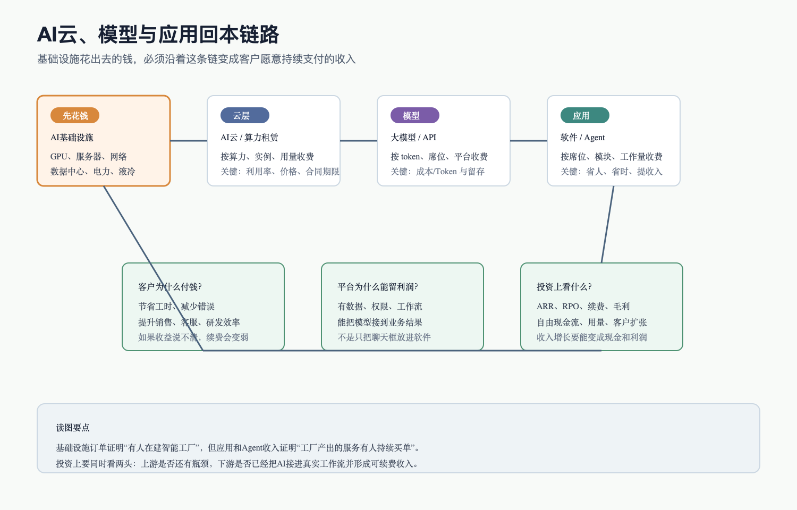
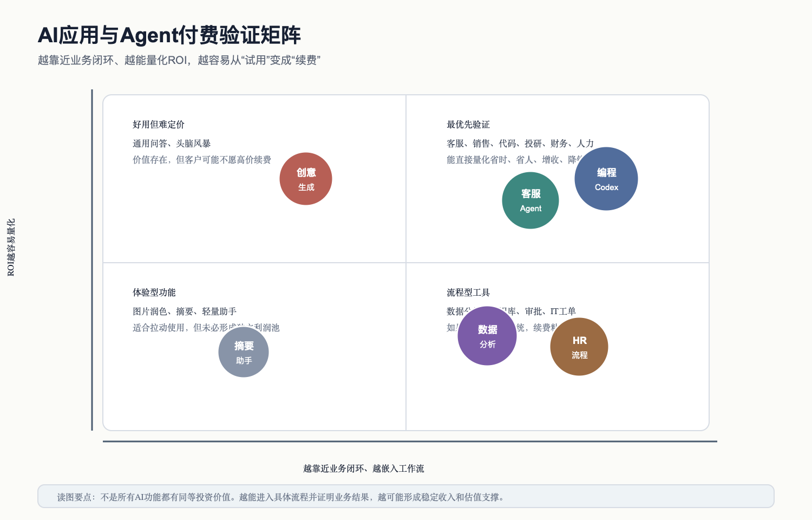

# AI云、大模型与应用Agent产业链

## 0. 这篇在讲什么

这篇讲 AI 产业链的“回本层”：AI云、大模型/API、企业软件、应用和 Agent。

前面几篇已经说明，AI 基础设施正在大量花钱：GPU、服务器、网络、数据中心、电力、液冷都要先投入。问题是，花出去的钱最终要靠谁赚回来？答案不在芯片本身，而在云资源、模型 API、软件订阅、企业 Agent 和具体业务结果里。

用小白话说：上游像是在建一座智能工厂，这篇要看工厂生产出来的“智能服务”到底有没有客户持续买单。如果客户只是试用一下、觉得新鲜，但不能带来明确省时、省人、增收或降错，那上游基础设施再热，也会在某个阶段遇到回本压力。

## 1. 总判断

截至 2026-07-03，AI云和大模型已经从概念期进入规模化收入验证期，企业应用和 Agent 则处在“快速扩散，但商业质量分化”的阶段。

这句话要拆开看。

第一，云和模型的需求确实在变成收入。Microsoft 披露 AI 业务 ARR 达到 370 亿美元；Google Cloud 2026 年一季度收入同比增长 63%，并披露 Gemini 相关 API token 用量快速增长；OpenAI 官方披露 ChatGPT 周活用户超过 9 亿、消费者订阅用户超过 5000 万、付费商业用户超过 900 万。这些数字说明 AI 已经不只是“大家在试”，而是进入了大量用户和企业付费使用的阶段。

第二，云和模型收入增长不等于利润已经稳了。AI云需要持续买芯片和建数据中心，模型 API 需要持续支付推理成本，软件公司把 AI 功能塞进产品后，也要承担模型调用、数据治理、权限、安全和交付成本。所以投资上不能只看 ARR 或收入增长，还要看毛利率、自由现金流、客户续费和单位经济。

第三，应用和 Agent 的关键不是“有没有 AI 功能”，而是“有没有接入真实工作流”。一个聊天框如果只是回答问题，很容易被更便宜的模型替代；但如果它接入 CRM、工单、代码库、财务、人力、知识库和权限系统，并且能真正完成任务、留下审计记录、减少人工步骤，它才更可能形成持续付费。

## 2. 回本链路图

这张图的重点是“钱怎样回来”。AI 基础设施先花钱，云厂商把算力变成云实例和 API，模型公司把能力包装成 token、订阅和企业平台，软件公司再把模型能力嵌入业务流程。最后，客户只有在看到省时间、省人力、减少错误、提升销售转化或提升研发效率时，才会长期续费。

容易误解的地方是：很多人看到 OpenAI、Google、Microsoft、Salesforce 这些公司都在讲 Agent，就以为 Agent 已经是成熟利润池。更稳妥的说法是：Agent 是商业化方向，但每个场景还要分别验证。客服、编程、销售线索、人力招聘、财务分析这类场景，因为结果比较容易量化，验证速度会更快；泛泛的问答助手和创意灵感工具，用户价值也可能很大，但定价和续费证据会更弱。

## 3. 三层回本结构

| 层级 | 小白话解释 | 主要收费方式 | 谁付钱 | 关键财务指标 | 最大风险 |
|---|---|---|---|---|---|
| AI云 / 算力租赁 | 把 GPU 和数据中心能力租给客户 | 云实例、GPU租赁、长期合同、预付款、算力包 | 大模型公司、企业、开发者、政府 | 云收入、RPO、backlog、利用率、capex、自由现金流 | 资本开支太重，利用率或价格撑不住 |
| 大模型 / API / 平台 | 把模型能力卖成调用、订阅和企业平台 | token 用量、API、企业席位、模型订阅、Agent开发平台 | 开发者、企业、消费者 | ARR、API token、订阅数、毛利率、推理成本 | 模型同质化，价格战，推理成本高 |
| 应用 / Agent | 把模型接进具体工作流，完成任务 | 软件席位、premium SKU、Agent工作量、模块订阅、结果分成 | 企业部门和个人用户 | ARR、净收入留存、客户扩张、续费率、可量化ROI | 只停留在试用，无法证明省钱或增收 |

这个表不是说哪一层一定最好，而是告诉我们不同层的投资问题不同。AI云问的是“重资产能不能回本”；大模型问的是“模型能力能不能留住用户和开发者”；应用 Agent 问的是“AI 是否真的进入工作流，并让客户愿意续费”。如果把这三个问题混在一起，就会把基础设施订单、模型热度和应用利润误读成同一件事。

## 4. 关键事实表

| 公司/机构 | 数据日期 | 事实 | 来源 | 证据等级 | 投资解读 |
|---|---|---|---|---|---|
| Microsoft | 2026 财年三季度，2026-04-29 | AI 业务 ARR 达到 370 亿美元，同比增长 123%；Microsoft Cloud 收入 545 亿美元，同比增长 29%；Azure and other cloud revenue 增长 40% | [Microsoft FY26 Q3 Earnings Release](https://www.microsoft.com/en-us/investor/earnings/fy-2026-q3/press-release-webcast) | A | AI 已经进入云收入和企业合同，但仍要结合资本开支看回本 |
| Alphabet / Google | 2026 年一季度，2026-04-29 | Google Cloud 收入 200 亿美元，同比增长 63%；Cloud backlog 超过 4600 亿美元；Gemini API 直接客户用量超过每分钟 160 亿 tokens，环比增长 60% | [Alphabet Q1 2026 Results](https://s206.q4cdn.com/479360582/files/doc_financials/2026/q1/2026q1-alphabet-earnings-release.pdf) | A | AI 带动云、模型 API 和企业订阅共同增长 |
| Amazon | 2026 年一季度，2026-04-29 | AWS 销售额 376 亿美元，同比增长 28%；AWS operating income 142 亿美元；TTM 自由现金流降至 12 亿美元，主要因为 AI 投资带来 PPE 购买增加 | [Amazon Q1 2026 Results](https://ir.aboutamazon.com/news-release/news-release-details/2026/Amazon-com-Announces-First-Quarter-Results/default.aspx) | A | AWS盈利强，但 AI资本开支会压自由现金流 |
| Oracle | 2026 财年，2026-06-24 | RPO 6380 亿美元，同比增长 363%；自由现金流为负 237 亿美元，原因是继续投资 Cloud Infrastructure | [Oracle FY2026 Results](https://investor.oracle.com/investor-news/news-details/2026/Oracle-Announces-Record-Q4-and-FY-2026-Results-Driven-by-Cloud-Infrastructure--Cloud-Applications/default.aspx) | A | AI云合同很强，但重资产和融资压力也很清楚 |
| OpenAI | 2026 年官方披露 | ChatGPT 周活跃用户超过 9 亿，消费者订阅用户超过 5000 万，付费商业用户超过 900 万；OpenAI 称当前月收入约 20 亿美元 | [OpenAI, Scaling AI for everyone](https://openai.com/index/scaling-ai-for-everyone/)，[OpenAI, Accelerating the next phase of AI](https://openai.com/index/accelerating-the-next-phase-ai/) | B | 模型平台已经具备消费和企业双侧规模，但私有公司口径需持续跟踪 |
| Salesforce | 2027 财年一季度，2026-05-27 | Agentforce ARR 12 亿美元，同比增长 205%；Agentforce 和 Data 360 ARR 近 34 亿美元；已交付 38 亿 Agentic Work Units | [Salesforce Q1 FY27 Results](https://investor.salesforce.com/news/news-details/2026/Salesforce-Delivers-Record-First-Quarter-Fiscal-2027-Results/default.aspx) | A | AI应用商业化开始进入可量化 ARR，但还需看续费和有机增长 |
| ServiceNow | 2026 年一季度，2026-04-22 | 订阅收入 36.71 亿美元，同比增长 22%；Now Assist 年合同价值超过 100 万美元的客户数同比增长超过 130% | [ServiceNow Q1 2026 Results](https://newsroom.servicenow.com/press-releases/details/2026/ServiceNow-Reports-First-Quarter-2026-Financial-Results/default.aspx) | A | 工作流软件公司有机会把 AI 变成高价值模块 |
| Adobe | 2026 财年二季度，季末 2026-05-29 | Q2 收入 66.2 亿美元，同比增长 13%；AI-first ARR 超过 5 亿美元，同比翻三倍 | [Adobe Q2 FY2026 Results](https://www.adobe.com/cc-shared/assets/investor-relations/pdfs/11606202/a5543arefgt.pdf) | A | 创意和营销软件的 AI 付费已经出现，但规模仍小于核心订阅盘 |
| Workday | 2027 财年一季度，2026-05-21 | 总收入 25.42 亿美元，同比增长 13.5%；超过 4000 家客户使用至少一个 Workday 自研 Agent；Recruiting Agent 支持 1400 万个招聘流程，同比增长 44% | [Workday Q1 FY27 Results](https://investor.workday.com/news-and-events/press-releases/news-details/2026/Workday-Announces-Fiscal-2027-First-Quarter-Financial-Results/) | A | HR/财务场景适合 Agent，因为流程、权限和结果都比较明确 |
| Snowflake | 2027 财年一季度，2026-05-27 | 收入 13.9 亿美元，同比增长 33%；产品收入 13.34 亿美元，同比增长 34%；超过 13600 个账号使用 Snowflake AI capabilities | [Snowflake Q1 FY27 Results](https://investors.snowflake.com/news/news-details/2026/Snowflake-Reports-Financial-Results-for-the-First-Quarter-of-Fiscal-2027/default.aspx) | A | 数据层正在从“存数据”升级为“给 Agent 提供上下文和治理” |
| Palantir | 2026 年一季度，季末 2026-03-31 | 收入 16.33 亿美元，同比增长 85%；美国商业收入 5.95 亿美元，同比增长 133%；毛利率从 80% 提升到 87% | [Palantir Q1 2026 10-Q](https://investors.palantir.com/files/2026%20Q1%20PLTR%2010-Q.pdf) | A | 垂直业务平台能把 AI 落到决策和运营，但估值和政府客户依赖要单独看 |

这张表要这样读：云厂商和模型平台证明“AI 有大量使用和资本投入”，企业软件公司证明“AI 正在进入工作流”。但投资上不能把所有数字等价看待。云收入和 RPO 是基础设施回本的开端；Agent ARR 和 Work Units 才更接近应用层付费；自由现金流和毛利率则用来检验增长质量。

## 5. 为什么 Agent 不是普通软件功能

普通软件功能通常是用户点按钮，系统执行一个固定动作。Agent 的目标是让系统能理解任务、拆解步骤、调用工具、读取上下文、执行动作并回写结果。比如销售 Agent 不只是“写一封邮件”，而是先研究线索、判断客户质量、生成个性化内容、把结果写回 CRM，并让销售人员可以审核。

这里的投资含义是：Agent 的价值不在“模型会聊天”，而在“模型能不能进入企业系统”。企业系统里有客户数据、权限、审批、审计、历史工单、合同、财务数据和业务规则。谁能把模型安全地接进这些系统，谁就更接近企业预算。反过来，如果一个产品只是把通用模型包装成聊天窗口，竞争会很激烈，客户也更容易换供应商。

## 6. AI应用与Agent付费验证矩阵

这张图的横轴是“是否靠近业务闭环”，纵轴是“ROI 是否容易量化”。靠右上角的场景更值得优先研究，因为客户更容易回答“我为什么为它付钱”。

比如客服 Agent 可以看解决率、人工转接率、平均响应时长和客户满意度；编程 Agent 可以看代码评审时间、PR 吞吐、缺陷率和研发周期；招聘 Agent 可以看候选人筛选效率和招聘流程时长。这些指标如果改善，企业更容易把 AI 预算从试验预算变成正式预算。

但创意生成、摘要、通用助手也不是没有价值。它们的问题是付费证据更难。用户可能觉得好用，但不一定愿意为每个功能单独付高价；企业也可能把它看成基础套餐的一部分。这类场景需要看能否进入更高价值的创作、营销、搜索、知识管理或团队协作流程。

## 7. 价值链和利润池

| 环节 | 收入模式 | 成本结构 | 谁可能留利润 | 为什么 | 反证条件 |
|---|---|---|---|---|---|
| AI云 | 算力租赁、云实例、长期合同 | GPU折旧、电力、数据中心、网络、融资 | 大型云和部分资源稀缺的 NeoCloud | 如果利用率高、客户合同长、资源稀缺，云资源可以维持价格 | 客户需求放缓、价格战、融资成本上升、闲置算力增加 |
| 大模型API | token 调用、模型订阅、企业平台 | 推理算力、研发、安全、分发 | 拥有强模型和开发者生态的平台 | 模型效果、工具链、生态和品牌能带来留存 | 模型差距缩小、开源替代、API价格持续下行 |
| 企业数据层 | 数据平台、治理、检索、上下文、权限 | 云资源、数据工程、销售和客户成功 | 已有企业数据入口的平台 | Agent 必须使用企业数据和权限，数据层变成控制点 | 云厂商和模型平台向下集成，数据平台被边缘化 |
| 工作流软件 | CRM、ITSM、HR、财务、协同软件中的 AI模块 | 模型调用、研发、交付、客户成功 | Salesforce、ServiceNow、Workday 等既有流程入口 | 它们掌握流程、权限和用户习惯，能把 AI 直接放进日常工作 | 客户不愿为 AI 加价，或原生 AI 产品绕过旧软件 |
| 垂直 Agent | 法律、医疗、金融、投研、工业、客服等专业任务 | 行业数据、合规、模型、人工校验 | 有专业数据和交付能力的垂直平台 | 垂直场景结果更明确，客户愿意为降本增效付费 | 监管、错误责任、专业数据缺失、交付太重 |

这张表说明，AI应用利润池不一定落在“模型最强”的公司手里。模型很重要，但企业真正付费时，往往还要看数据、流程、权限、合规和交付。一个模型公司可能技术领先，但如果没有企业入口，需要通过云、软件、咨询或生态伙伴进入客户。一个传统软件公司模型不一定最强，但如果它掌握 CRM、HR、ITSM、ERP 或内容生产流程，就可能把 AI 变成加价模块。

## 8. 单位经济：一个 Agent 怎么赚钱

用客服 Agent 举例，一个企业是否愿意付费，大致看这条账：

客户每月付费 = Agent 席位费或工作量费用。

供应商成本 = 模型推理成本 + 数据检索成本 + 系统集成和运维成本 + 客户成功成本 + 安全合规成本。

客户收益 = 少转人工的工单数量 × 单个工单人工成本 + 响应速度提升带来的客户满意度改善 + 错误率下降 + 服务覆盖时间延长。

如果客户收益明显高于付费，且服务质量可控，续费就有基础。如果供应商能通过模型优化、缓存、路由小模型、提高自动解决率来降低成本，毛利率会改善。反过来，如果 Agent 经常答错、需要大量人工审核、集成成本很高，或者客户无法量化收益，商业化就会停在试点。

所以看 AI应用公司时，不要只问“有没有 Agent”。更应该问：这个 Agent 替代哪一步人工？结果怎么衡量？错误谁负责？客户愿意按席位、按使用量还是按结果付费？模型成本能不能随着规模下降？

## 9. 行业周期判断

AI云、大模型与应用 Agent 当前处在“需求高速扩散、产品快速迭代、商业化从试点转正式预算、但利润质量分化”的阶段。

需求端已经不弱。OpenAI、Google、Microsoft、Salesforce、ServiceNow、Workday、Snowflake 等披露的使用量、ARR、RPO、客户数和工作量指标都说明，企业和个人正在把 AI 放进日常工作。

供给端也在快速增加。模型能力继续提升，开源模型降低门槛，云厂商和软件公司都在推出 Agent 平台。这会带来两个结果：一方面，更多场景可以被 AI 改造；另一方面，同质化功能会更快降价，只有接近数据和流程的产品更容易守住利润。

利润端最需要分层。云和模型平台要看推理成本、利用率和资本开支；企业软件要看 AI 是否带来净新增 ARR，而不是把原本订阅收入换个名字；垂直 Agent 要看交付能不能标准化，否则收入增长会被实施成本吃掉。

## 10. 未来 4-8 个季度跟踪指标

| 指标 | 为什么重要 | 好信号 | 坏信号 |
|---|---|---|---|
| AI ARR 和 AI SKU 订单 | 判断 AI 是否从试用变成付费 | Agentforce、Now Assist、Adobe AI-first ARR 等继续高增，且不是一次性促销 | AI ARR 高增但总收入不加速，说明可能只是内部重分类或替代原产品 |
| API token 和推理成本 | 判断模型平台单位经济 | 用量增长快，同时单位推理成本下降 | 用量增长但毛利率承压，价格战加剧 |
| 云 capex 与自由现金流 | 判断基础设施回本压力 | 云收入和合同增长能覆盖 capex，现金流可控 | 收入增长但自由现金流持续恶化 |
| 客户续费和扩张 | 判断企业是否持续买单 | NRR、RPO、cRPO、百万美元客户数增长 | 客户只试点不扩张，续费率下降 |
| Agent 工作量指标 | 判断是否进入真实流程 | AWU、工单解决率、招聘流程、代码 PR、自动化任务量增长 | 指标只讲调用量，不讲业务结果 |
| 数据和权限整合 | 判断壁垒是否形成 | AI产品能接入 CRM、ERP、工单、知识库和审批 | 只做外层聊天窗口，容易被替代 |

## 11. 存疑点

### 存疑点：AI应用收入是否存在“重分类”问题

- 已证实：Salesforce、Adobe、OpenAI、ServiceNow 等公司都披露了 AI 相关 ARR、客户数或使用量指标。
- 存疑或证据不足：不同公司对 AI ARR、AI-first ARR、Agentic Work Units、Now Assist ACV 的定义不同，不能直接横向相加。
- 为什么重要：如果 AI收入只是把原有订阅收入换个标签，投资含义弱；如果是净新增付费，投资含义强。
- 暂时如何使用：把这些指标作为“方向性证据”，同时跟踪总收入增长、cRPO、净收入留存和毛利率。
- 后续核验点：财报电话会口径、10-Q/10-K 披露、价格包变化、续费率和客户扩张。
- 当前证据等级：A/B，但横向可比性不足。

### 存疑点：模型价格下降到底利好谁

- 已证实：AI模型公司和云厂商都在降低部分模型调用成本，OpenAI DevDay 也发布了更低成本模型。
- 存疑或证据不足：价格下降会扩大使用量，但不一定提高模型公司的利润，因为竞争可能把降本让给客户。
- 为什么重要：如果降价刺激用量并提高总毛利，利好模型平台和应用；如果降价变成价格战，利润会向应用和数据入口转移。
- 暂时如何使用：观察 token 用量、单位毛利、应用 ARR 和客户扩张，而不是单独看价格下降。
- 后续核验点：模型公司毛利披露、云厂商 AI毛利趋势、应用公司 AI模块毛利。
- 当前证据等级：B/C，很多私有公司缺少财务细节。

## 12. 本篇结论

AI云、大模型和应用 Agent 是 AI 产业链能否长期成立的关键。基础设施订单说明大家在建厂，应用和 Agent 付费才说明这座厂能生产可售产品。

当前最值得优先研究的不是“所有有 AI 功能的软件”，而是三类公司：第一，能把 AI云资源卖成高利用率、高合同能见度收入的云平台；第二，能用强模型和开发者生态形成高留存的平台；第三，掌握企业数据、权限和工作流，并能把 Agent 直接接到业务结果的软件公司。

最重要的反证也很清楚：如果未来 4-8 个季度 AI ARR、RPO、客户扩张和业务结果指标不能继续改善，而资本开支和推理成本继续上升，那么市场会从“AI增长故事”切换到“AI回本压力”。

## 来源

- [Microsoft FY26 Q3 Earnings Release, 2026-04-29](https://www.microsoft.com/en-us/investor/earnings/fy-2026-q3/press-release-webcast)
- [Alphabet Q1 2026 Results, 2026-04-29](https://s206.q4cdn.com/479360582/files/doc_financials/2026/q1/2026q1-alphabet-earnings-release.pdf)
- [Amazon Q1 2026 Results, 2026-04-29](https://ir.aboutamazon.com/news-release/news-release-details/2026/Amazon-com-Announces-First-Quarter-Results/default.aspx)
- [Oracle FY2026 Results, 2026-06-24](https://investor.oracle.com/investor-news/news-details/2026/Oracle-Announces-Record-Q4-and-FY-2026-Results-Driven-by-Cloud-Infrastructure--Cloud-Applications/default.aspx)
- [OpenAI, Scaling AI for everyone](https://openai.com/index/scaling-ai-for-everyone/)
- [OpenAI, Accelerating the next phase of AI](https://openai.com/index/accelerating-the-next-phase-ai/)
- [Salesforce Q1 FY27 Results, 2026-05-27](https://investor.salesforce.com/news/news-details/2026/Salesforce-Delivers-Record-First-Quarter-Fiscal-2027-Results/default.aspx)
- [ServiceNow Q1 2026 Results, 2026-04-22](https://newsroom.servicenow.com/press-releases/details/2026/ServiceNow-Reports-First-Quarter-2026-Financial-Results/default.aspx)
- [Adobe Q2 FY2026 Results, 2026-06-11](https://www.adobe.com/cc-shared/assets/investor-relations/pdfs/11606202/a5543arefgt.pdf)
- [Workday Q1 FY27 Results, 2026-05-21](https://investor.workday.com/news-and-events/press-releases/news-details/2026/Workday-Announces-Fiscal-2027-First-Quarter-Financial-Results/)
- [Snowflake Q1 FY27 Results, 2026-05-27](https://investors.snowflake.com/news/news-details/2026/Snowflake-Reports-Financial-Results-for-the-First-Quarter-of-Fiscal-2027/default.aspx)
- [Palantir Q1 2026 10-Q](https://investors.palantir.com/files/2026%20Q1%20PLTR%2010-Q.pdf)
