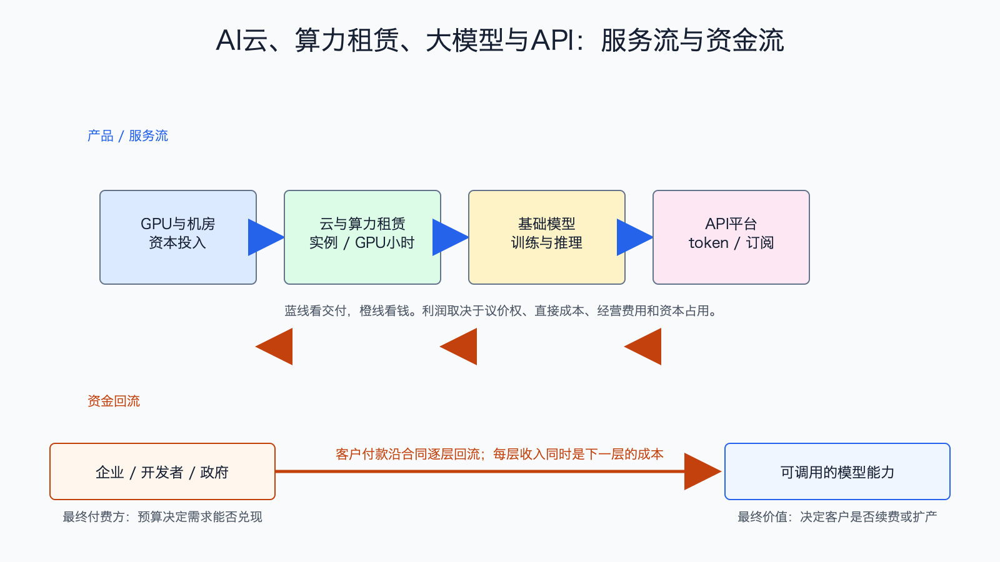

# AI云、算力租赁、大模型与API产业链

数据日期：2026 年第一季度至 2026 年 6 月最新财报
最新核验日期：2026-07-15
用途：投资研究，不构成买卖建议。

## 0. 子产业链边界

- 包含：公有云 AI 基础设施、GPU 租赁、基础模型、推理和 API/token 服务。
- 不包含：数据治理工具、企业工作流应用和终端设备。
- 主要付费方：企业、开发者、政府、软件公司和互联网平台。
- 收入确认位置：云实例按用量、算力按 GPU 小时或长期合同、API 按 token/调用量、模型产品按订阅或许可确认。
- 经济模型：混合型：云与算力为资产运营/用量型，模型 API 为用量与订阅型。

## 1. 产业链路图

这条链把硬件资本开支变成可购买的服务。云厂先买芯片、机房和电力，再把算力按小时卖给模型公司和企业；模型公司消耗算力训练和推理，再把能力按 token、订阅或许可卖给应用开发者。每一层的收入，往往同时是下一层的成本。

## 2. 谁付钱与价值流

客户愿意付钱的原因是避免一次性自建集群，并能快速获得模型能力。但这条链的收入增长很容易高估利润：云厂折旧和资本开支巨大，算力租赁商还有融资成本，模型 API 需要持续支付推理成本。只有利用率、定价和客户留存足以覆盖折旧、电费、利息、研发和销售费用，增长才真正回本。

## 3. 节点规模

| 节点 | 公开规模锚点 | 增速/周期 | 数据日期 | 来源/证据等级 | 存疑点 |
|---|---:|---|---|---|---|
| 综合云与 AI | Microsoft AI 业务年化收入运行率超过 370 亿美元；单季 Microsoft Cloud 收入 545 亿美元 | AI 年化运行率同比 123% | 2026-03-31 | [Microsoft FY2026 Q3](https://www.microsoft.com/en-us/investor/earnings/fy-2026-q3/press-release-webcast)，A | AI 运行率定义为公司口径，未单列利润 |
| Google Cloud | 单季收入 200.28 亿美元，经营利润 65.98 亿美元 | 收入同比 63% | 2026Q1 | [Alphabet 2026Q1](https://s206.q4cdn.com/479360582/files/doc_financials/2026/q1/2026q1-alphabet-earnings-release.pdf)，A | 同时含基础设施、平台和 Workspace |
| Oracle Cloud | FY2026 Q4 IaaS 收入 58 亿美元；FY2026 IaaS 181 亿美元 | Q4 同比 93% | 2026-05-31 | [Oracle FY2026](https://investor.oracle.com/investor-news/news-details/2026/Oracle-Announces-Record-Q4-and-FY-2026-Results-Driven-by-Cloud-Infrastructure--Cloud-Applications/default.aspx)，A | IaaS 不全是 AI |
| 专用算力租赁 | CoreWeave 单季收入 20.78 亿美元 | 同比约翻倍，重资产扩张 | 2026Q1 | [CoreWeave 2026Q1](https://investors.coreweave.com/news/news-details/2026/CoreWeave-Reports-Strong-First-Quarter-2026-Results/)，A | 客户集中和合同结构影响大 |
| 基础模型/API | 缺口:N5 | 需求高速扩散 | 截至 2026-06 | [OpenAI](https://openai.com/index/scaling-ai-for-everyone/)，B | 私有公司收入、毛利和现金流不可完整复核 |

这张节点规模表怎么读：先看公开锚点究竟是行业总量、公司收入还是运营代理，三者不能直接相加。它重要，是因为节点规模决定机会的上限，但大收入未必对应高利润。最容易误读的是把单家公司或总市场数字当成 AI 纯收入；投资使用时，应把规模锚点与后面的直接经济性、资本占用和证据等级一起看。

## 4. 利润分布与单位经济

| 节点/代理公司 | 收入池 | 毛利率 | 毛利池 | 经营利润/EBITDA/IRR | 资本开支/营运资金 | 自由现金流 | 估算公式/口径 | 数据日期 | 来源/证据等级 |
|---|---:|---:|---:|---:|---|---:|---|---|---|
| 综合云：Microsoft 公司代理 | 总收入 828.86 亿美元/季；Cloud 545 亿美元 | 公司毛利约 67.6% | 公司毛利 560.58 亿美元 | 公司经营利润 383.98 亿美元 | 资本开支 319 亿美元/季，公司整体 | 公司披露 FCF 158 亿美元/季 | 公司整体口径；资本开支与 FCF 不能全部归 AI，但能显示 AI 扩张对集团现金的压力 | FY2026Q3，截至 2026-03-31 | Microsoft，A |
| Google Cloud | 200.28 亿美元/季 | 缺口:P2 | 缺口:P2 | 分部经营利润 65.98 亿美元，经营利润率约 32.9% | Alphabet Q1 资本开支 278.51 亿美元，公司整体 | Alphabet Q1 FCF 245.51 亿美元，公司整体 | 分部经营利润率=65.98/200.28；FCF不可全部归云 | 2026Q1 | Alphabet，A |
| Oracle IaaS | FY2026 收入 181 亿美元 | 缺口:P3 | 缺口:P3 | 缺口:P3 | FY2026 资本开支 556.63 亿美元；净现金支出 477.26 亿美元 | FY2026 FCF -237 亿美元 | 公司整体现金流清楚显示扩张期资本压力 | FY2026 | Oracle，A |
| 专用算力：CoreWeave | 20.78 亿美元/季 | 缺口:P4 | 缺口:P4 | GAAP 经营亏损 1.44 亿美元；利息费用 5.36 亿美元 | 缺口:P4 | 缺口:P4 | 净亏损 7.40 亿美元；收入翻倍不能抵消折旧与融资 | 2026Q1 | CoreWeave，A |
| 基础模型/API | 缺口:P5 | 缺口:P5 | 缺口:P5 | 缺口:P5 | 缺口:P5 | 缺口:P5 | 单位经济=token/API收入-推理算力-流量/分成-研发销售分摊 | 2026-07-15 | B/C，存疑 |

这张表最有用的对比是 Oracle 和 CoreWeave：收入增长很快，但现金流和利息压力也很真实。Google Cloud 已经形成可观分部经营利润，说明规模、利用率和产品组合可以改善利润。不能把“云收入增长”笼统地理解为同样质量的利润。

## 4.1 受控数据缺口

下表不是把缺失数据藏起来，而是说明为什么当前不能可靠量化、还能用什么指标继续判断。`缺口:ID` 不能当作零，也不能跨节点比较。

| 缺口 ID | 指标 | 已检索范围 | 无法估算原因 | 可给上下界 | 替代指标 | 决策影响 | 核验计划 |
|---|---|---|---|---|---|---|---|
| N5 | 基础模型/API：公开规模锚点 | 已查现有公司 IR、监管/协会统计和文内来源，更新至 2026-07-15 | 公开资料未按该节点独立披露或口径不可比；原可得信息：OpenAI 官方披露用户、商业客户和融资规模，但成本与分部利润不透明 | 当前不能可靠给窄区间；如有公司代理值，仅用于方向判断 | 订单、客户数、出货/使用量、收入代理和单位经济领先指标 | 不能据此比较该节点绝对价值池，只能判断商业模式、周期和可能的价值留存方向 | 下季财报、招股书、客户验收或行业统计更新时复核；出现分部披露后替换缺口 |
| P2 | Google Cloud：毛利率、毛利池 | 已查现有公司 IR、监管/协会统计和文内来源，更新至 2026-07-15 | 公开资料未按该节点独立披露或口径不可比；原可得信息：分部毛利未单列；待核验 | 当前不能可靠给窄区间；如有公司代理值，仅用于方向判断 | 订单、客户数、出货/使用量、收入代理和单位经济领先指标 | 不能据此比较该节点绝对价值池，只能判断商业模式、周期和可能的价值留存方向 | 下季财报、招股书、客户验收或行业统计更新时复核；出现分部披露后替换缺口 |
| P3 | Oracle IaaS：毛利率、毛利池、经营利润/EBITDA/IRR | 已查现有公司 IR、监管/协会统计和文内来源，更新至 2026-07-15 | 公开资料未按该节点独立披露或口径不可比；原可得信息：未单列；待核验；云分部未完整拆分 | 当前不能可靠给窄区间；如有公司代理值，仅用于方向判断 | 订单、客户数、出货/使用量、收入代理和单位经济领先指标 | 不能据此比较该节点绝对价值池，只能判断商业模式、周期和可能的价值留存方向 | 下季财报、招股书、客户验收或行业统计更新时复核；出现分部披露后替换缺口 |
| P4 | 专用算力：CoreWeave：毛利率、毛利池、资本开支/营运资金、自由现金流 | 已查现有公司 IR、监管/协会统计和文内来源，更新至 2026-07-15 | 公开资料未按该节点独立披露或口径不可比；原可得信息：待核验；待核验；GPU、机房租约和融资占用极高；预计为负，需现金流表核验 | 当前不能可靠给窄区间；如有公司代理值，仅用于方向判断 | 订单、客户数、出货/使用量、收入代理和单位经济领先指标 | 不能据此比较该节点绝对价值池，只能判断商业模式、周期和可能的价值留存方向 | 下季财报、招股书、客户验收或行业统计更新时复核；出现分部披露后替换缺口 |
| P5 | 基础模型/API：收入池、毛利率、毛利池、经营利润/EBITDA/IRR、资本开支/营运资金、自由现金流 | 已查现有公司 IR、监管/协会统计和文内来源，更新至 2026-07-15 | 公开资料未按该节点独立披露或口径不可比；原可得信息：收入池缺少统一审计口径；推理成本随模型和负载变化；待核验；多数私有公司不披露；训练、推理、研发资本需求高；待核验 | 当前不能可靠给窄区间；如有公司代理值，仅用于方向判断 | 订单、客户数、出货/使用量、收入代理和单位经济领先指标 | 不能据此比较该节点绝对价值池，只能判断商业模式、周期和可能的价值留存方向 | 下季财报、招股书、客户验收或行业统计更新时复核；出现分部披露后替换缺口 |

## 5. 利润迁移、周期与反证

当前从“抢算力”进入“验证回报”的阶段。供给紧时，GPU 租赁和模型 API 能以较高价格卖出；供给增加后，客户会比较单位 token 成本、延迟、可靠性和迁移难度，利润可能从裸算力迁向平台工具、数据入口和工作流。

跟踪云收入与资本开支之比、GPU 利用率、单位 token 价格、模型推理成本、长期合同和客户集中、经营利润率、利息覆盖倍数和自由现金流。若资本开支持续快于收入、API 价格下降快于推理成本、客户自建或模型同质化加速，利润池会被压缩。

## 来源

- [Microsoft FY2026 Q3](https://www.microsoft.com/en-us/investor/earnings/fy-2026-q3/press-release-webcast)
- [Alphabet 2026Q1](https://s206.q4cdn.com/479360582/files/doc_financials/2026/q1/2026q1-alphabet-earnings-release.pdf)
- [Oracle FY2026](https://investor.oracle.com/investor-news/news-details/2026/Oracle-Announces-Record-Q4-and-FY-2026-Results-Driven-by-Cloud-Infrastructure--Cloud-Applications/default.aspx)
- [CoreWeave 2026Q1](https://investors.coreweave.com/news/news-details/2026/CoreWeave-Reports-Strong-First-Quarter-2026-Results/)