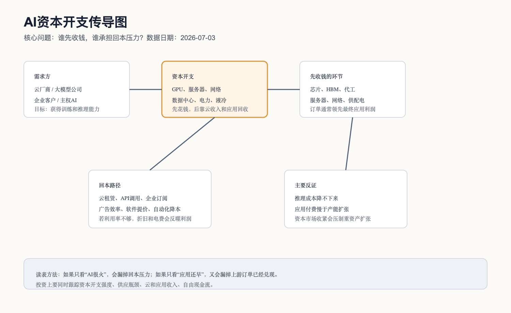

# AI产业链深度调研 - 总览

## 0. 先给小白的入口

AI 产业链可以先想成一座“智能工厂”。

GPU、ASIC、HBM 和先进封装，是这座工厂里的关键机器和关键零部件；AI 服务器、网络和光模块，是把很多机器连成一整条生产线；数据中心、电力和液冷，是厂房、水电和散热系统；云和大模型，是把这座工厂的能力包装成服务；应用和 Agent，则是最终卖给企业和个人用户的产品。

这个比喻有一个很重要的投资含义：工厂建设期，最先收钱的往往是卖机器、卖零部件、建厂房和做配套的人；但长期能不能成为好生意，要看这座工厂产出的“智能服务”能不能被客户持续付费。如果下游付费慢，而上游产能扩张太快，行业就会进入估值和现金流的压力期。

所以 AI 产业链不能只问“AI 是不是大趋势”。更有用的问题是：

1. 谁在花钱？
2. 钱先流到哪些环节？
3. 哪些环节是真瓶颈，所以有议价能力？
4. 哪些环节只是跟着订单放量，但利润率未必高？
5. 最终应用和云收入能不能覆盖前面的资本开支？

## 1. 总判断

截至 2026-07-03，AI 产业链处在“资本开支仍在加速、基础设施订单先兑现、应用变现还在验证、数据中心电力瓶颈开始显性化”的阶段。

这句话拆开说：

第一，AI 需求不是只有概念。NVIDIA、AMD、Broadcom、Dell、Arista、Vertiv、Oracle、CoreWeave 等公司的最新公开资料都显示，AI 芯片、服务器、网络、供配电、数据中心和云基础设施相关收入或订单仍在快速增长。

第二，最先兑现业绩的是“卖铲子”的环节。原因很简单：只要云厂商、大模型公司和新型云服务商决定扩建算力，芯片、服务器、网络、电力设备和数据中心配套就先拿订单。下游应用是否已经完全盈利，不影响这一批资本开支先发生。

第三，真正需要警惕的是回本问题。AI 基础设施是重资本开支业务，折旧、电费、融资成本都很重。如果未来云租赁、API、企业订阅、广告效率提升和自动化降本不能覆盖这些成本，产业链会从“缺算力”切换到“缺利润”。

第四，数据中心正在从地产逻辑变成电力系统逻辑。普通数据中心主要看机房位置、客户、上架率和 PUE；AI 数据中心还要看电力接入、机柜功率密度、液冷、变压器、UPS、开关柜、并网时间和电价。算力不是买到 GPU 就上线，必须有电、有网络、有散热、有合适的机房。

## 2. 研究边界与口径

| 项目 | 本版处理方式 |
|---|---|
| 研究日期 | 2026-07-03 |
| 市场范围 | 以全球 AI 产业链为主，已经补充中国链条、A股/港股映射、基金/ETF和入场节奏 |
| 数据口径 | 优先公司公告、财报、投资者关系材料、IEA 等机构资料；媒体报道只作辅助，不作为核心结论 |
| 投资表达 | 不写确定性买卖建议；只写行业位置、估值与入场需要观察的信号 |
| 证据等级 | A=公司公告/财报/监管文件；B=权威机构或交易所数据；C=媒体和第三方整理；D=推断或待核验 |

## 3. AI产业链总地图

这张图的重点不是把所有公司都塞进去，而是让阅读顺序清楚：先看上游算力和基础设施，再看云和模型，最后看应用和终端。

为什么要这样读？因为资金传导不是从应用开始的。现实中，大模型和云厂商要先买算力、建数据中心、接电、组网，然后才有能力向客户卖 API、云资源或软件服务。换句话说，基础设施订单通常领先于应用利润。

## 4. 七条子产业链拆解

| 子产业链 | 小白话解释 | 谁付钱 | 谁先受益 | 当前周期位置 | 核心反证 |
|---|---|---|---|---|---|
| AI芯片、HBM、先进封装 | 这是 AI 工厂的核心机器和高端内存。没有足够 GPU/ASIC 和 HBM，模型跑不快，也接不住大量用户请求。 | 云厂商、大模型公司、NeoCloud、企业和主权 AI 项目 | NVIDIA、AMD、Broadcom、HBM 厂商、台积电等 | 订单和收入仍强，但供应瓶颈从单纯 GPU 扩散到 HBM、先进封装、供电和散热 | 大客户削减资本开支；推理成本下降过快导致新增硬件需求低于预期 |
| AI服务器、网络、光模块 | 把芯片装进服务器，再用高速网络连接成集群。训练大模型时，很多机器要像一台超级计算机一样协同。 | 云厂商、数据中心运营商、企业集群 | Dell、Supermicro、Arista、Broadcom、光模块和交换机厂商 | 订单兑现快，但部分服务器环节利润率可能被上游芯片成本挤压 | AI服务器价格下降；库存积压；网络升级节奏放缓 |
| AI数据中心、电力、液冷 | 让算力真正能上电、上架、稳定运行。高功率机柜会带来电力、散热、变压器和并网压力。 | 云厂商、NeoCloud、IDC、主权 AI 项目 | Vertiv、电力设备、液冷、变压器、数据中心运营商 | 需求强，电力接入和供配电成为关键瓶颈 | 电网接入慢于订单；资本开支回报低；融资环境收紧 |
| AI云、大模型、API | 把底层算力和模型能力卖给企业和开发者。这里开始从“建设期”进入“卖服务”。 | 企业、开发者、消费者、政府 | Microsoft、Google、Amazon、Oracle、OpenAI 生态等 | 收入高增长，但成本和折旧也高，需要持续验证利润质量 | 客户不愿长期付费；模型同质化导致价格战；API 毛利率下滑 |
| 数据、工具、MLOps、安全 | 企业真正用 AI 时，需要数据清洗、检索、评测、监控、权限和安全。 | 企业 IT、软件开发团队、合规部门 | 数据平台、向量数据库、MLOps、安全厂商 | 需求开始扩散，但标准还在形成 | 大模型平台自己集成工具层；企业预算收缩 |
| AI应用、Agent | 把模型能力嵌入具体工作流，比如写代码、客服、办公、营销、研究、财务分析。 | 企业和个人用户 | SaaS、垂直软件、Agent 平台 | 最值得期待，但商业化分化很大 | 用户只试用不续费；效率提升难以量化；同质化竞争 |
| 端侧AI、机器人、具身智能 | 把 AI 放到手机、PC、眼镜、车和机器人里，让设备本身更智能。 | 消费者、车企、工业客户 | 终端品牌、芯片、传感器、机器人产业链 | 早期到中期，硬件创新和应用场景都还在迭代 | 端侧模型体验不够强；硬件成本高；真实需求低于预期 |

这个表格要配合正文读。比如“AI应用最值得期待”不等于“现在利润最好”。应用如果能做成，长期空间很大，因为它直接面对用户付费；但在当前阶段，很多应用还需要证明留存、续费和单位经济。相反，芯片和服务器环节可能长期增速会波动，但在资本开支周期中最先兑现收入。

## 5. 钱从哪里来：资本开支传导

AI 产业链最重要的一条线，是资本开支传导。

云厂商和 AI 公司先判断未来会有足够的训练和推理需求，于是扩建数据中心、购买 GPU/ASIC、服务器和网络设备。这个阶段，芯片、服务器、网络和电力设备公司先拿到订单。等算力上线后，云厂商和模型公司再把算力卖成云租赁、API、企业订阅或广告效率提升。最终能不能成为好生意，取决于这些收入能否覆盖折旧、电费、运维和融资成本。

为什么这对投资很关键？因为同一个 AI 景气周期里，不同环节的财务表现会错位。上游可能已经收入暴增，下游应用可能还在烧钱；云厂商可能收入也增长，但自由现金流被资本开支压住。看 AI 产业，不能只看收入增速，还要看资本开支强度和回本路径。

| 事实 | 数据日期 | 具体数据 | 来源 | 证据等级 | 投资含义 |
|---|---|---|---|---|---|
| NVIDIA 数据中心收入高增 | 2026 财年一季度，季末 2026-04-26 | 总收入 816 亿美元，同比增长 85%；Data Center 收入 752 亿美元，同比增长 92% | [NVIDIA IR，2026-05-20](https://nvidianews.nvidia.com/news/nvidia-announces-financial-results-for-first-quarter-fiscal-2027) | A | 算力芯片和数据中心相关需求仍然很强 |
| Microsoft AI 与云需求强，同时资本开支很高 | 2026 财年三季度，2026-04-29 | AI 业务 ARR 370 亿美元，同比增长 123%；资本开支 319 亿美元，其中约三分之二是短寿命资产，主要是 GPU/CPU | [Microsoft 财报](https://www.microsoft.com/en-us/investor/earnings/fy-2026-q3/press-release-webcast)，[Microsoft 电话会](https://www.microsoft.com/en-us/investor/events/fy-2026/earnings-fy-2026-q3) | A | AI收入在放大，但硬件折旧和建设投入也在放大 |
| Amazon AWS 和 AI 投资同步增长 | 2026 年一季度，2026-04-29 | AWS 销售额 376 亿美元，同比增长 28%；TTM 自由现金流降至 12 亿美元，主要因为 PPE 购买增加 593 亿美元，主要是 AI 投资 | [Amazon IR，2026-04-29](https://ir.aboutamazon.com/news-release/news-release-details/2026/Amazon-com-Announces-First-Quarter-Results/default.aspx) | A | 云收入强，但 AI 基础设施会明显占用现金流 |
| Oracle 云合同和融资扩张很激进 | 2026 财年，2026-06-24 | RPO 6380 亿美元，同比增长 363%；自由现金流为负 237 亿美元，原因是云基础设施投资 | [Oracle IR，2026-06-24](https://investor.oracle.com/investor-news/news-details/2026/Oracle-Announces-Record-Q4-and-FY-2026-Results-Driven-by-Cloud-Infrastructure--Cloud-Applications/default.aspx) | A | AI云需求强，但重资产和融资压力需要重点跟踪 |
| CoreWeave 是新型 AI 云的典型样本 | 2026 年一季度，2026-05-07 | 收入 20.78 亿美元，同比增长 112%；收入积压接近 1000 亿美元；Active power 超过 1GW | [CoreWeave IR，2026-05-07](https://investors.coreweave.com/news/news-details/2026/CoreWeave-Reports-Strong-First-Quarter-2026-Results/) | A | 新型算力云需求旺，但净亏损和重资本开支风险也更突出 |
| Dell AI服务器订单兑现 | 2027 财年一季度，2026-05-28 | AI 服务器收入 161 亿美元，同比增长 757%；AI 订单 244 亿美元；上调 FY27 AI 服务器收入预期至 600 亿美元 | [Dell IR，2026-05-28](https://investors.delltechnologies.com/static-files/ef369f17-2b83-4fd4-9a37-6b6ab53ac9c5) | A | 算力扩张直接转化为服务器订单 |

## 6. 产业链节点规模与利润池

完整节点规模、物理锚点、利润池排序和待核验口径，已经单独整理在 [AI产业链节点规模与利润池总表](AI产业链节点规模与利润池总表.md)。这一节只保留快速锚点，避免把不同分母混在一起。

读这张表时要先分清三类数字：市场规模、公司收入/订单锚点、预测口径。比如“AI基础设施支出”是大分母，“NVIDIA Data Center 收入”是公司锚点，“HBM市场规模”则需要继续用厂商财报和专业机构交叉核验。不同数字不能直接相加。

| 节点 | 可观察的规模锚 | 代表数据 | 利润池判断 | 需要继续核验 |
|---|---|---|---|---|
| AI芯片和加速卡 | 龙头公司数据中心收入 | NVIDIA Data Center 2026 财年一季度收入 752 亿美元 | 当前利润池最厚，壁垒来自芯片、软件生态、供应链和客户锁定 | 未来竞争、客户自研 ASIC、出口限制 |
| Custom ASIC 和 AI网络芯片 | AI 半导体收入 | Broadcom 2026 财年二季度 AI 半导体收入 108 亿美元，同比增长 143% | 大客户定制芯片和网络芯片需求强，可能承接部分 GPU 替代和补充需求 | 单一大客户集中度、ASIC 是否压低行业整体毛利 |
| AI服务器 | AI服务器收入和订单 | Dell 2027 财年一季度 AI服务器收入 161 亿美元，AI订单 244 亿美元 | 收入规模放大快，但整机环节可能更多赚集成和供应链管理的钱 | 毛利率、库存、客户集中度 |
| 数据中心网络 | 交换机和网络设备收入 | Arista 2026 年一季度收入 27.09 亿美元，同比增长 35.1% | 训练集群对高速网络依赖高，网络不是配角 | 以太网和 InfiniBand 路线变化、客户自研 |
| 供配电与热管理 | 数据中心基础设施收入 | Vertiv 2026 年一季度净销售额 26.50 亿美元，同比增长 30%；上调全年收入指引 | 电力和液冷瓶颈强化后，设备商议价能力改善 | 产能扩张后是否供过于求 |
| AI云和算力租赁 | 云收入、RPO、backlog、active power | Oracle RPO 6380 亿美元；CoreWeave backlog 接近 1000 亿美元、active power 超过 1GW | 收入弹性大，但最考验融资、折旧、利用率和客户续约 | 客户集中度、价格、资本市场融资成本 |

## 7. 行业周期位置

我把 AI 产业链当前周期分成四层看。

第一层是需求周期。企业和消费者仍在快速增加 AI 使用量，云厂商也在强调 AI 业务增长。这个需求不是单纯的概念热度，因为已经能在云收入、AI ARR、API 使用、数据中心订单和服务器收入里看到。

第二层是供给周期。供给瓶颈已经从“GPU 不够”扩大到“HBM、先进封装、网络、电力接入、液冷、变压器和机柜功率密度都可能不够”。这说明行业进入更复杂的建设阶段，不再是买一批芯片就能解决。

第三层是利润周期。芯片、网络、供配电和部分瓶颈设备的利润质量相对更容易兑现；服务器整机收入增长很快，但要看毛利率；云和 NeoCloud 收入增长很快，但资本开支和融资压力也最大；应用和 Agent 长期空间大，但短期要看留存、续费和真实降本。

第四层是估值周期。市场如果只给“AI 增长”高估值，而不看自由现金流和回本路径，就容易高估重资产环节。反过来，如果只看短期应用利润还不够成熟，就可能低估基础设施瓶颈环节的订单兑现。

## 8. 接下来 4-8 个季度最重要的跟踪指标

| 指标 | 为什么重要 | 重点看什么 |
|---|---|---|
| 云厂商资本开支 | 决定上游订单是否持续 | Microsoft、Amazon、Alphabet、Meta、Oracle 的 capex、PPE、折旧和自由现金流 |
| NVIDIA/AMD/Broadcom AI收入 | 判断算力需求是否仍在扩张 | Data Center 收入、AI 半导体收入、订单、毛利率、客户集中度 |
| Dell/服务器厂商 AI订单 | 判断芯片需求是否真正落到整机和机柜 | AI服务器收入、backlog、出货、毛利率 |
| Arista/网络设备收入 | 判断集群规模是否继续放大 | AI网络收入、交换机升级、光模块和互连需求 |
| Vertiv/电力与热管理订单 | 判断数据中心瓶颈是否传导到设备 | 订单、收入、产能扩张、交期、毛利率 |
| IEA/电力与数据中心用电预测 | 判断宏观电力约束是否变硬 | 数据中心用电、并网、区域电价、政策审批 |
| AI应用付费和续费 | 判断最终回本能力 | ARR、留存率、ARPU、毛利率、客户节省成本的可量化证据 |

## 9. 存疑但重要的问题

1. AI 资本开支到底会持续几年？当前订单强，不等于每年都能用同样速度增长。要看下游需求、融资环境和云厂商资产负债表。
2. 推理成本下降会刺激更多需求，还是压低算力租赁价格？这两种结果对上游和云厂商影响完全不同。
3. 大客户自研 ASIC 会分流多少通用 GPU 需求？这不是“替代或不替代”的二选一，更可能是 GPU 和 ASIC 分工并存。
4. 电力和并网会不会成为最硬约束？如果是，数据中心选址和电力设备的投资价值会提升。
5. AI 应用能否从“好用”变成“必须买”？这是决定整个产业链长期回报的核心问题。

## 10. 本版结论

AI 产业链第一阶段最值得优先深挖的是算力基础设施和 AI 数据中心配套。原因不是应用不重要，而是当前财务数据最先在这些环节兑现，同时这些环节也最能体现“瓶颈在哪里”。

但不能因为基础设施数据好，就直接推导出整个 AI 产业链已经进入稳定盈利期。更完整的投资框架应该是：上游看订单和瓶颈，中游看建设和资本开支，下游看变现和续费，最后用自由现金流验证这座“智能工厂”到底能不能赚到钱。

## 来源

- [NVIDIA Announces Financial Results for First Quarter Fiscal 2027, 2026-05-20](https://nvidianews.nvidia.com/news/nvidia-announces-financial-results-for-first-quarter-fiscal-2027)
- [Microsoft FY26 Q3 Earnings Release, 2026-04-29](https://www.microsoft.com/en-us/investor/earnings/fy-2026-q3/press-release-webcast)
- [Microsoft FY26 Q3 Earnings Call, 2026-04-29](https://www.microsoft.com/en-us/investor/events/fy-2026/earnings-fy-2026-q3)
- [Amazon Q1 2026 Results, 2026-04-29](https://ir.aboutamazon.com/news-release/news-release-details/2026/Amazon-com-Announces-First-Quarter-Results/default.aspx)
- [Oracle FY2026 Results, 2026-06-24](https://investor.oracle.com/investor-news/news-details/2026/Oracle-Announces-Record-Q4-and-FY-2026-Results-Driven-by-Cloud-Infrastructure--Cloud-Applications/default.aspx)
- [CoreWeave Q1 2026 Results, 2026-05-07](https://investors.coreweave.com/news/news-details/2026/CoreWeave-Reports-Strong-First-Quarter-2026-Results/)
- [Dell Technologies FY27 Q1 Results, 2026-05-28](https://investors.delltechnologies.com/static-files/ef369f17-2b83-4fd4-9a37-6b6ab53ac9c5)
- [IEA, Energy and AI: Energy demand from AI](https://www.iea.org/reports/energy-and-ai/energy-demand-from-ai)
- [IEA, Key questions on Energy and AI: Executive summary](https://www.iea.org/reports/key-questions-on-energy-and-ai/executive-summary)
