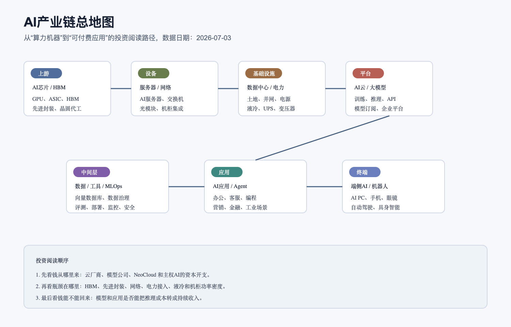

# AI产业链深度调研 - 总览

数据日期：主要为 2026 年第一季度至 2026 年 6 月最新官方披露；工业机器人安装量为 2024 年实际值
最新核验日期：2026-07-15
用途：投资研究，不构成买卖建议。

## 0. 先给小白的入口

AI 产业链不是“模型越强，所有公司都赚钱”。它先从云厂和大型客户的资本开支出发，穿过芯片、服务器、网络、机房和电力，变成可租用的算力和模型 API；企业再购买数据工具、安全和应用，把模型放进工作流；最后 AI 进入手机、汽车和机器人。每一层的收入，通常也是下一层的成本，所以必须逐链看利润和现金流。

先读 [AI产业链子产业链覆盖矩阵](AI产业链子产业链覆盖矩阵.md)，它解释为什么拆成九条、各条边界在哪里。之后可以按“基础设施 → 云与软件 → 终端与实体世界”的顺序阅读。需要比较哪些技术已经量产、哪些仍在试点时，读 [AI技术成熟度与发展趋势](AI技术成熟度与发展趋势.md)。

## 0.1 数据口径、来源冲突与受控缺口

本报告优先使用监管机构、国际组织、公司财报和投资者关系材料。行业总量、公司收入和项目代理值分开写，不能相加成同一个“AI 市场规模”；预测值会明确标注预测期，不能当作已经发生的事实。不同来源发生冲突时，正文保留口径差异并优先采用定义更清楚、日期更新、可回到原文复核的来源。

公开资料没有按节点拆分时，不会因为怕写错而跳过问题，也不会编造精确数字。各逐链文档用“受控数据缺口”记录已经查过哪里、为什么不能可靠量化、能用什么替代指标、缺口如何影响投资判断以及下次何时核验。这样做的目的，是让读者同时看见“已知事实”和“还不知道什么”。

## 0.2 研究边界与市场空间

研究覆盖从 AI 芯片、服务器和数据中心，到云、模型、数据工具、应用、个人终端、汽车和机器人九条链；区域同时看全球利润坐标与国内上市公司映射，时间上重点判断未来 4-8 个季度，并用 1-3 年技术方向校验长期空间。不覆盖单纯因为名称带 AI、但无法证明收入、订单、客户或成本关联的概念公司，也不把理论 TAM 当成可实现收入。

市场空间分三层理解：上游是云厂和大型客户的资本开支，中游是算力、模型与软件服务收入，下游是企业和消费者真正获得的增收或降本。三层存在上下游交易，不能相加成一个总市场；投资上更重要的是每层的增速、利润率、资本占用和证据强弱。

## 0.3 行业为什么存在与底层逻辑

AI 行业存在，是因为计算和模型可以把部分认知工作自动化，从而提高软件、内容、客服、研发、驾驶和实体作业效率。客户愿意付款的前提不是“模型更聪明”，而是增收、降本、提质或降低风险的价值大于芯片、云、数据、实施和治理成本。最终 ROI 成立，应用用量才会增长；用量增长提高云利用率并带动上游订单；若 ROI 不成立，这条传导会反向收缩。

## 0.4 技术与关键能力怎么影响利润

技术成熟度决定收入何时能确认、客户是否复购以及成本能否下降。芯片、云和工业自动化已有大规模收入，但高端供给仍受生态与产能约束；Agent、端侧独立付费和通用人形机器人仍要验证可靠性与单位经济。详细成熟度、瓶颈、未来方向和反证见 [AI技术成熟度与发展趋势](AI技术成熟度与发展趋势.md)。

## 0.5 ROIC、资本成本与估值隐含预期

高增长只有在投入资本回报率长期高于资本成本时才创造价值。轻资产平台可能用研发和生态换取高增量毛利，重资产算力与机房则要先扣折旧、利息和持续资本开支。估值判断要反推市场已经要求多高的收入增长、利润率和成功率，再与历史周期、当前供需和反方情景比较；不能因为行业长期空间大，就默认任何价格都合理。

## 1. 九条子产业链

| 层次 | 子产业链 | 小白话 | 当前利润观察 | 独立研究 |
|---|---|---|---|---|
| 基础设施 | AI芯片、HBM与先进封装 | 做计算核心、喂数据并完成制造封装 | 平台和稀缺产能利润最厚，但内存/产能有周期 | [进入](AI芯片、HBM与先进封装产业链.md) |
| 基础设施 | AI服务器、网络与光模块 | 把芯片装成机器，再把机器连成集群 | 整机收入大但价差薄，高端网络利润率更高 | [进入](AI服务器、网络与光模块产业链.md) |
| 基础设施 | AI数据中心、电力与液冷 | 给服务器提供电、空间和散热 | 瓶颈设备现金流改善，机房运营重资产、看上架率 | [进入](AI数据中心、电力与液冷产业链.md) |
| 云与模型 | AI云、算力租赁、大模型与API | 把硬件变成按小时、token 或订阅购买的服务 | 收入高速增长，但资本开支、折旧和利息决定回本 | [进入](AI云、算力租赁、大模型与API产业链.md) |
| 生产控制面 | AI数据工具、MLOps与安全 | 让企业数据可用、模型可监控、Agent可追责 | 毛利高但研发销售也高；数据入口和平台更能留利润 | [进入](AI数据工具、MLOps与安全产业链.md) |
| 应用 | AI应用与Agent | 把模型放进客服、销售、办公和专业流程 | 最接近最终预算，但必须证明续费和客户 ROI | [进入](AI应用与Agent产业链.md) |
| 消费终端 | AI手机、AI PC与可穿戴 | 把 AI 放到个人设备 | 短期看换机和 ASP，独立订阅仍待验证 | [进入](AI手机、AI%20PC与可穿戴产业链.md) |
| 汽车 | 车端智能与自动驾驶 | 用芯片、传感器和软件改善驾驶或运营车辆 | 软件上限高，但安全责任和运营成本不能忽略 | [进入](车端智能与自动驾驶产业链.md) |
| 机器人 | 工业机器人、人形机器人与具身智能 | 让机器在现实世界执行任务 | 工业机器人已成熟；人形和通用具身仍偏期权 | [进入](工业机器人、人形机器人与具身智能产业链.md) |

这张表先看“谁已经有现金流”，再看“谁只有远期想象”。NVIDIA、Arista、Vertiv、Datadog 等代理公司的利润和现金流已经可以核验；人形机器人和部分垂直 Agent 的统一收入池仍不透明，不能因为市场空间大就假设利润已经存在。

## 2. 总体产业链地图

总图帮助建立全局，但不能替代九张逐链交易图。基础设施通常先确认订单和收入，应用层最终决定客户是否持续付费。若应用回报不足，上游资本开支迟早会降速；若应用真正创造收入或降本，云和硬件投资才有持续性。

## 3. 当前最重要的利润差异

| 对比 | 已核验事实 | 底层原因 | 投资研究含义 |
|---|---|---|---|
| GPU平台 vs 服务器整机 | NVIDIA 公司毛利率约 74.9%，Dell AI服务器单季收入161亿美元但AI分部利润未单列 | 整机收入包含昂贵芯片，平台生态掌握议价权 | 不要按收入规模直接排序利润池 |
| 网络设备 vs 普通组装 | Arista GAAP毛利率61.9%、经营利润率42.7% | 网络性能决定GPU利用率，软件和客户切换成本增加溢价 | 关注技术升级与客户集中同时变化 |
| 设备商 vs 机房运营 | Vertiv Q1调整后FCF 6.53亿美元；机房运营需先投入再爬上架率 | 设备可按订单回款，运营资产承受折旧、电费和融资 | EBITDA必须继续走到维护性资本开支和FCF |
| 综合云 vs 专用算力 | Google Cloud 已有约32.9%分部经营利润率；CoreWeave Q1仍有经营亏损和高利息 | 多产品平台可摊薄成本，专用算力扩张依赖重资产融资 | 云收入增长的质量不能一概而论 |
| 软件毛利 vs 软件现金 | Datadog毛利率79%，GAAP经营利润率约1%，但FCF 2.89亿美元 | 研发销售吃掉会计利润，预收和低资本开支支持现金 | 同时看GAAP利润、股权激励和FCF |
| 成熟机器人 vs 人形机器人 | 全球工业机器人2024年安装54.2万台；人形机器人统一收入利润口径缺失 | 前者有成熟工位和回本模型，后者仍在可靠性与成本验证 | 不能把技术演示当成成熟利润池 |

## 4. 行业周期

AI 整体仍在资本开支扩张期，但内部已经分层。芯片、网络和电力设备处于订单兑现期；云与算力进入“收入增长能否覆盖资本开支”的回本验证期；数据工具和应用进入用量、续费与销售效率验证期；端侧处于换机和高端化验证期；人形机器人仍主要处于试点和小批量验证期。

周期传导是：应用和企业预算增长 → 云用量和模型调用增长 → 云厂提高资本开支 → 芯片、服务器、网络和机房订单增长。反过来，如果应用 ROI 不足，云利用率下降，价格和资本开支会先受压，随后传到硬件订单和供应链毛利。

## 5. 接下来 4-8 个季度看什么

| 层次 | 领先指标 | 为什么重要 | 反证信号 |
|---|---|---|---|
| 芯片/服务器 | 云厂资本开支、订单、库存、HBM和封装交期 | 决定硬件需求与紧缺溢价 | 库存快于收入、毛利连续下降 |
| 网络/数据中心 | 交换速率、在建MW、并网等待期、设备订单收入比 | 决定GPU能否上线和跑满 | 项目延期、设备交期迅速正常化 |
| 云/模型 | GPU利用率、单位token价格、推理成本、资本开支/收入 | 判断服务增长是否回本 | 价格下降快于成本、FCF恶化 |
| 数据工具/应用 | 净收入留存、AI ARR、续费、销售回收期、客户ROI | 判断AI是否进入正式预算 | 试用不转付费、实施工时过高 |
| 终端/汽车 | AI机型渗透、ASP、软件付费率、接管率和事故率 | 区分硬件营销和真实价值 | 不换机、不续费或监管收紧 |
| 机器人 | 付费订单、交付、运行小时、故障间隔、工位回收期 | 区分量产与演示 | 框架订单不交付、维护成本高 |

## 6. 当前结论

第一，最清楚的现实利润仍集中在拥有平台、稀缺产能、关键网络或可靠设备的基础设施节点。第二，云和算力收入已经很大，但不同公司的资本开支与融资结构造成完全不同的自由现金流。第三，数据工具和应用是 AI 最终能否回本的关键，不能只看发布数量，要看续费、ROI 和现金流。第四，端侧、汽车和机器人要按成熟度分别估值，成熟工业自动化与通用人形机器人不是同一种确定性。

这不是买卖结论。行业相关基金和 ETF 还要结合成分纯度、估值、拥挤度和个人风险承受能力，详见 [AI行业周期、估值与入场节奏](AI行业周期、估值与入场节奏.md)。

## 7. 小白审核记录

| 项目 | 状态 |
|---|---|
| 独立 Agent 审核 | 待本轮成稿后运行 |
| 覆盖矩阵 | 九条核心子链已完成结构与利润闸门 |
| 事实核验 | 关键公司和机构来源已更新至 2026-07-15；存疑项保留在各子链 |

## 来源

- 详细来源、数据日期和证据等级见九篇子产业链文档。
- [AI产业链子产业链覆盖矩阵](AI产业链子产业链覆盖矩阵.md)
- [AI技术成熟度与发展趋势](AI技术成熟度与发展趋势.md)
- [NVIDIA FY2027 Q1 财务结果](https://nvidianews.nvidia.com/news/nvidia-announces-financial-results-for-first-quarter-fiscal-2027)
