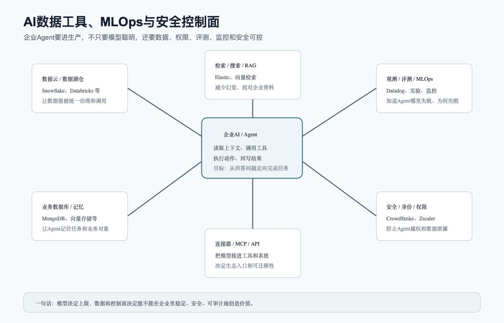

# AI产业链深度调研入口

这是 AI 产业链投研资料的入口页/索引页，不是单篇正文。第一阶段先把“钱从哪里来、先流向哪里、最大瓶颈在哪里”讲清楚，所以重点放在算力基础设施、数据中心、电力和液冷。第二阶段开始补“钱怎样回来”，也就是 AI云、大模型、应用和 Agent 的商业化链条。第三阶段补企业 AI 上生产必须依赖的数据工具、MLOps 和安全控制面。第四阶段补 AI 从云端走到终端和实体世界后的端侧 AI、车端智能、工业机器人和具身智能。第五阶段补国内视角、A股/港股映射和公司对比。第六阶段补行业周期、相关基金/ETF估值和入场节奏。第七阶段补节点规模和利润池总表，解决“每个环节到底有多大”的问题。

本文档不是投资建议，只是研究框架和投研底稿。所有动态数据均标注资料日期和来源；如果事实仍需二次核验，会在文中写明“存疑”或“待核验”。

## 阅读顺序

1. [AI产业链深度调研 - 总览](AI产业链深度调研%20-%20总览.md)
2. [AI产业链节点规模与利润池总表](AI产业链节点规模与利润池总表.md)
3. [AI算力基础设施产业链](AI算力基础设施产业链.md)
4. [AI数据中心、电力与液冷产业链](AI数据中心、电力与液冷产业链.md)
5. [AI云、大模型与应用Agent产业链](AI云、大模型与应用Agent产业链.md)
6. [AI数据工具与MLOps产业链](AI数据工具与MLOps产业链.md)
7. [AI端侧AI与具身智能产业链](AI端侧AI与具身智能产业链.md)
8. [AI国内视角、公司映射与对比](AI国内视角、公司映射与对比.md)
9. [AI行业周期、估值与入场节奏](AI行业周期、估值与入场节奏.md)
10. [AI产业链术语表](AI产业链术语表.md)
11. [AI产业链小白审核结果](AI产业链小白审核结果.md)

## 核心图表

## 研究拆法

| 子产业链 | 解决的核心问题 | 本阶段状态 |
|---|---|---|
| AI芯片、HBM、先进封装 | 让模型有足够算力和内存带宽 | 已纳入算力基础设施报告 |
| AI服务器、网络、光模块 | 把很多芯片连成可用集群 | 已纳入算力基础设施报告 |
| AI数据中心、电力、液冷 | 让算力真正上电、上架、可持续运行 | 已单独成文 |
| 节点规模、利润池 | 建立各环节的金额量级、物理锚点、利润池和周期位置 | 已单独成文 |
| AI云、大模型、API | 把重资产算力变成可销售服务 | 已纳入回本链报告 |
| 数据、工具、MLOps、安全 | 让企业能稳定使用和管理 AI | 已单独成文 |
| AI应用、Agent | 把模型能力变成用户愿意付费的工作流 | 已纳入回本链报告 |
| 端侧AI、机器人、具身智能 | 把 AI 从云端扩展到终端和实体世界 | 已单独成文 |
| 国内视角、公司映射 | 把全球 AI 产业链翻译成 A股、港股和中概可跟踪对象 | 已单独成文 |
| 行业周期、基金/ETF估值 | 判断 AI 处在什么周期、热门资产贵不贵、怎么分批入场 | 已单独成文 |

这套拆法背后的逻辑是：AI 产业不是一条单线，而是一组相互约束的链条。上游算力卖得很好，不等于应用已经赚钱；应用还没有完全跑出来，也不等于上游订单是假的。投资上要把“订单兑现”和“最终回本”分开看。

## 交付状态

| 模块 | 文件 | 状态 |
|---|---|---|
| 总览 | [AI产业链深度调研 - 总览](AI产业链深度调研%20-%20总览.md) | 第一版完成 |
| 算力基础设施 | [AI算力基础设施产业链](AI算力基础设施产业链.md) | 第一版完成 |
| 数据中心、电力、液冷 | [AI数据中心、电力与液冷产业链](AI数据中心、电力与液冷产业链.md) | 第一版完成 |
| 节点规模、利润池 | [AI产业链节点规模与利润池总表](AI产业链节点规模与利润池总表.md) | 第一版完成 |
| AI云、大模型、应用Agent | [AI云、大模型与应用Agent产业链](AI云、大模型与应用Agent产业链.md) | 第一版完成 |
| 数据工具、MLOps、安全 | [AI数据工具与MLOps产业链](AI数据工具与MLOps产业链.md) | 第一版完成 |
| 端侧AI、具身智能 | [AI端侧AI与具身智能产业链](AI端侧AI与具身智能产业链.md) | 第一版完成 |
| 国内视角、公司映射 | [AI国内视角、公司映射与对比](AI国内视角、公司映射与对比.md) | 第一版完成 |
| 行业周期、估值入场 | [AI行业周期、估值与入场节奏](AI行业周期、估值与入场节奏.md) | 第一版完成 |
| 术语表 | [AI产业链术语表](AI产业链术语表.md) | 第一版完成 |
| 小白审核 | [AI产业链小白审核结果](AI产业链小白审核结果.md) | 作者自检完成，独立 Agent 待运行 |
