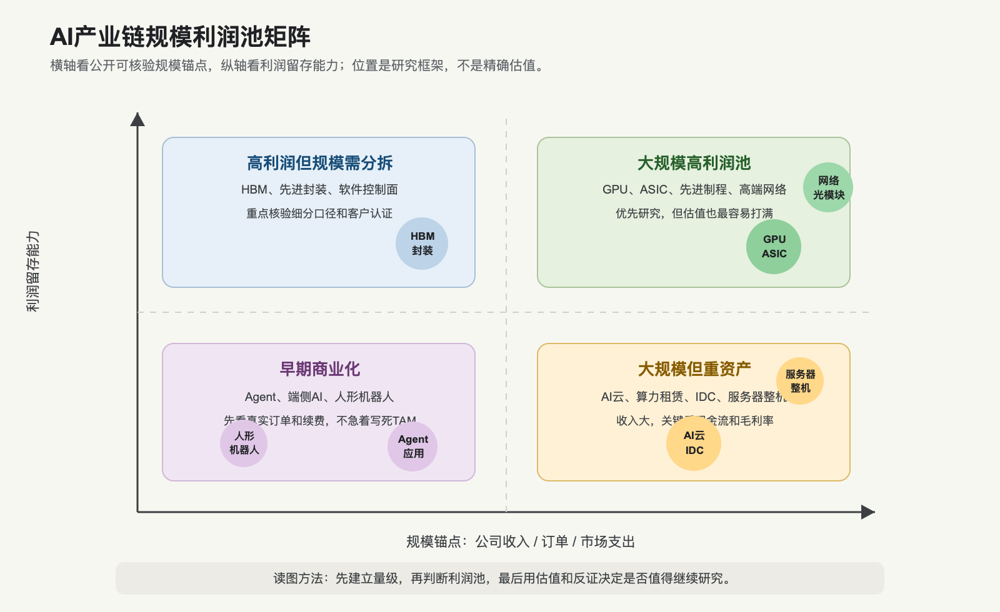

# AI产业链节点规模与利润池总表

## 0. 这篇在讲什么

这篇专门解决一个问题：AI 产业链每个节点到底“有多大”，利润池大概在哪里，哪些只是收入大但利润未必厚。

先说明口径。AI 行业很容易被不同分母绕晕：全球 AI spending、AI infrastructure spending、半导体销售额、某家公司数据中心收入、某个 ETF 持仓规模，都不是同一个东西。把这些数字直接相加会误导。

所以这张表采用三种口径：

1. 市场规模口径：来自 Gartner、IDC、SIA、IEA、IFR 这类机构，适合看行业量级。
2. 公司收入/订单锚点：来自财报和公告，适合看某个节点是否已经兑现。
3. 待核验口径：第三方预测或细分市场缺少统一口径时，只用来建立量级感，不当成确定事实。

小白话：如果说 AI 是一座工厂，这篇就是先估算“机器、厂房、电力、水冷、软件、机器人”各自是几十亿、几百亿还是几千亿美元级别，再判断谁更可能赚到厚利润。

## 1. 规模与利润池矩阵

这张图不是精确坐标图，而是帮助建立量级感。右上角通常最值得优先研究，因为那里既有大市场，也有较强利润留存能力。右下角要小心，它可能收入很大，但如果重资产、毛利低、客户集中，股东未必赚得轻松。

## 2. 核心节点规模总表

| 节点 | 公开可核验规模锚点 | 物理量/业务量锚点 | 利润池判断 | 周期位置 | 证据等级 | 为什么 |
|---|---|---|---|---|---|---|
| 全球 AI 总支出 | Gartner 预计 2026 年全球 AI spending 为 2.52 万亿美元，同比增长 44%；其中 AI infrastructure 增加 4010 亿美元支出 | 覆盖基础设施、设备、软件、服务等，不等于可投资利润池 | 这是最大分母，不代表所有环节都赚钱 | 高速扩张 | B | 它说明 AI 已经进入全 IT 支出周期，但不能直接拿来给单个公司估值 |
| AI基础设施 | IDC 预计 2026 年 AI infrastructure spending 达 4870 亿美元，同比增长约 53%；2029 年全球 AI infrastructure 超过 1 万亿美元 | IDC 口径覆盖服务器、存储、相关基础设施；加速服务器占比高 | 上游硬件利润最厚，重资产运营利润不一定厚 | 高景气 | B/C | 这是“卖铲子”主战场，能解释为什么芯片、服务器、网络先兑现 |
| 全球半导体 | SIA 披露 2026 年一季度全球半导体销售额 2985 亿美元，较 2025 年四季度增长 25%；2026 年 3 月销售额 995 亿美元，同比 79.2% | 半导体是整体口径，包含 AI 与非 AI | AI芯片、HBM、先进制程利润池厚；普通芯片周期性更强 | 上行周期 | B | AI 推动内存、逻辑、先进制程上行，但不能把全部半导体增长都归因于 AI |
| GPU / AI加速卡 | NVIDIA 2026 财年一季度 Data Center 收入 752 亿美元，同比增长 92%；Data Center compute 收入 604 亿美元，同比增长 77% | 单季收入已经是数百亿美元级别 | 当前利润池最厚 | 高景气，估值也高 | A | 壁垒来自芯片性能、CUDA/软件生态、供应链和客户锁定 |
| Custom ASIC / AI网络芯片 | Broadcom 2026 财年二季度 AI 半导体收入 108 亿美元，同比增长 143%；预计三季度 AI 半导体收入 160 亿美元，同比增长超过 200% | 需求来自少数超大客户定制芯片和网络 | 利润池厚，但客户集中度高 | 高景气 | A | 大客户会用 ASIC 降低单位推理/训练成本，和 GPU 是补充与部分替代关系 |
| 先进制程与先进封装 | TSMC 2026 年一季度收入 359.0 亿美元，毛利率 66.2%，经营利润率 58.1% | 先进封装/HBM 搭配决定高端 AI芯片交付 | 利润质量极高 | 供给偏紧 | A | 先进制程和封装是 AI芯片从设计走到交付的硬瓶颈 |
| HBM / 高端内存 | SIA 半导体总盘与 IEA 供应链报告提供方向性证据；细分 HBM 市场规模需继续用厂商财报和专业机构交叉核验 | HBM 缺口会影响 GPU/ASIC 交付，IEA 提到短缺可能延续到 2027 年底 | 供需紧时利润池厚 | 供给紧张 | B/C | HBM 是“喂数据”的高带宽内存，AI芯片性能越强越离不开它 |
| AI服务器整机 | Dell FY27 Q1 AI服务器收入 161 亿美元，同比增长 757%；AI订单 244 亿美元；FY27 AI服务器收入预期 600 亿美元 | Dell 一个公司 FY27 预期已达 600 亿美元级别 | 收入大，但利润率要细看 | 订单兑现 | A | 整机把芯片变成交付，但核心价值可能被上游 GPU/ASIC 拿走 |
| AI网络与光互连 | NVIDIA Data Center networking 2026 财年一季度收入 148 亿美元，同比增长 199%；LightCounting 称 Ethernet transceiver 市场 2024 年增长 93%、2025 年约增长 82%，预计 2026 年增长 65% | 训练集群越大，东西向流量越重 | 网络芯片和高端光模块利润池较好 | 高景气，但交易拥挤 | A/C | GPU 如果等网络传数据，利用率会下降，所以网络从配套变核心 |
| 数据中心电力与热管理 | Vertiv 2026 年一季度净销售额 26.50 亿美元，同比增长 30%；2026 全年收入指引 135-140 亿美元 | IEA 预计数据中心用电 2025 年约 485 TWh，2030 年约 950 TWh | 供配电和热管理利润池改善 | 高景气 | A/B | AI机柜功率密度提高，电力接入、UPS、变压器、液冷变成算力上线瓶颈 |
| AI云 / 算力租赁 | Microsoft AI 业务 ARR 370 亿美元；Oracle RPO 6380 亿美元；CoreWeave backlog 994 亿美元 | CoreWeave active power 超过 1GW，contracted power 超过 3.5GW | 收入弹性大，但自由现金流压力最大 | 重资产扩张 | A | AI云要先买芯片和建数据中心，再靠利用率、长约和价格回本 |
| 大模型/API平台 | OpenAI 官方披露月收入约 20 亿美元、周活超过 9 亿、消费者订阅超过 5000 万、付费商业用户超过 900 万 | API 用量、订阅用户和企业 seats 是业务量锚点 | 强平台利润池可能很厚，但私有公司成本口径不透明 | 收入验证 | B | 模型平台把算力变成 token、订阅和开发者生态，但推理成本和价格战要跟踪 |
| 企业应用/Agent | Salesforce Agentforce ARR 12 亿美元，Agentforce + Data 360 ARR 近 34 亿美元；Adobe AI-first ARR 超过 5 亿美元；Workday 超过 4000 家客户使用至少一个自研 Agent | Agentic Work Units、AI-first ARR、客户数比“有 AI 功能”更接近商业化 | 长期利润池大，短期分化 | 早期商业化 | A | 应用层最终决定 AI 能不能回本，但必须进入工作流并证明续费 |
| 数据工具/MLOps/安全 | Datadog Q1 2026 收入 10.06 亿美元；Snowflake Q1 FY27 收入 13.9 亿美元；CrowdStrike ARR 55.1 亿美元 | 企业 AI 规模化需要观测、数据治理、权限和安全 | 数据入口和安全平台利润池较好 | 需求扩散 | A | 企业不会把模型直接裸跑到生产系统，需要控制面和治理层 |
| 端侧 AI / AI PC / AI手机 | Apple FY26 Q2 收入 1112 亿美元；Qualcomm Q2 FY26 automotive 收入 13.26 亿美元，同比增长 38%；Canalys 预计 AI-capable PC 2027 年占 PC 出货 60%；Counterpoint 预计 GenAI smartphone 2026 年占全球智能手机出货 45% | 端侧是大出货量市场，但 AI 收入纯度难拆 | 硬件升级确定性较高，独立 AI收费仍需验证 | 渗透初期 | A/B/C | 端侧 AI 更像换机和高端化周期，不等于所有终端公司都有 AI软件利润 |
| 工业机器人/具身智能 | IFR：2024 年全球工业机器人新增安装 54.2 万台，在役 466.4 万台；中国占新增安装 54%，在役超过 200 万台 | 人形机器人缺少大规模可比收入和运行小时数据 | 工业机器人较成熟，人形机器人是高弹性期权 | 成熟自动化 + 技术期权 | B | 工业场景更容易算 ROI，人形机器人还要验证成本、可靠性和安全 |

## 3. 这个表怎么读

第一，不要把“市场很大”直接等同于“公司很赚钱”。AI云市场很大，但要烧很多资本开支；服务器收入很大，但毛利率可能不高；应用市场想象空间很大，但客户不续费就不能变成利润。

第二，优先看“规模 + 壁垒 + 利润留存”。GPU、ASIC、先进制程、先进封装、高端网络和部分软件入口，通常比普通组装和重资产租赁更容易留利润。原因是它们更难替代、更影响系统性能，客户愿意为确定性交付和效果付溢价。

第三，对预测口径保持怀疑。Gartner、IDC、Canalys、Counterpoint、LightCounting 的预测能建立方向和量级感，但不能替代公司财报。真正做投资时，最后仍要回到订单、收入、毛利率、现金流和估值。

第四，把“AI收入纯度”作为国内公司筛选的第一关。A股有很多公司能映射到 AI，但只有一部分能在收入、订单、客户或毛利率里看到 AI 影响。没有纯度就没有可比性。

## 4. 利润池排序

| 排序 | 环节 | 利润池质量 | 为什么 |
|---|---|---|---|
| 1 | GPU、ASIC、先进制程、先进封装、HBM | 高 | 决定系统性能和交付，供给约束强，替代难度高 |
| 2 | 高速网络、交换芯片、光模块高端环节 | 中高 | 集群规模越大，网络越重要；但技术迭代和价格竞争很快 |
| 3 | 数据平台、MLOps、安全、工作流软件 | 中高 | 如果嵌入企业数据和流程，续费和扩张能力较好 |
| 4 | 电力设备、液冷、热管理 | 中 | AI提高需求和议价，但设备环节会有扩产周期 |
| 5 | AI服务器整机、IDC、算力租赁 | 中低到中高分化 | 收入大，但芯片成本、折旧、电费、融资和客户集中会吃掉利润 |
| 6 | 端侧硬件、机器人整机 | 分化大 | 端侧出货大但 AI纯度难拆；人形机器人还在验证期 |

这不是固定排序，而是当前阶段的观察框架。如果未来应用 Agent 的续费和 ROI 证据持续增强，应用层利润池排名会提高；如果 GPU 供给过剩或价格战加剧，上游利润池也会下移。

## 5. 待继续核验的规模口径

| 口径 | 为什么暂不写死 | 后续怎么核验 |
|---|---|---|
| HBM 全球市场规模 | HBM 常被放在 DRAM/存储大口径里，不同机构预测差异很大 | SK hynix、Samsung、Micron 财报和专业机构预测交叉验证 |
| 液冷市场规模 | 液冷有冷板、CDU、管路、冷却液、系统集成，不同口径差异大 | Vertiv、nVent、Uptime、IDC/咨询机构口径交叉验证 |
| AI Agent 市场规模 | Agent 刚开始商业化，不同公司把 AI ARR、AI-first ARR、AWU 定义不同 | 先跟踪 Salesforce、Adobe、ServiceNow、Workday 的 AI指标，再看总收入是否加速 |
| 国内 AI公司收入纯度 | 很多公司未单独披露 AI收入 | 回到年报、季报、互动问答、订单公告和客户案例逐一核验 |
| 机器人零部件规模 | 工业机器人和人形机器人口径经常混用 | IFR 工业机器人数据 + 上市公司机器人业务分部 + 真实人形机器人量产订单 |

## 6. 本篇结论

AI 产业链不是“一个大市场”，而是很多不同质量的市场叠在一起。最大的问题不是找不到规模，而是不要把不同口径混在一起。

截至 2026-07-03，最清楚的结论是：AI基础设施已经是数千亿美元级别的投资周期，上游芯片、ASIC、先进封装、网络和电力热管理已经在财报里兑现；AI云和模型平台也开始形成大收入，但回本压力更重；应用和 Agent 是长期利润池，但还需要更多续费和 ROI 证据；人形机器人和通用具身智能仍是高弹性、低确定性的期权。

这张总表应该作为后续个股和 ETF 研究的底图：先看节点规模，再看利润池质量，最后看估值有没有把好消息提前打满。

## 来源

- [Gartner Says Worldwide AI Spending Will Total $2.5 Trillion in 2026, 2026-01-15](https://www.gartner.com/en/newsroom/press-releases/2026-1-15-gartner-says-worldwide-ai-spending-will-total-2-point-5-trillion-dollars-in-2026)
- [IDC, AI Infrastructure Spending Caps Historic Year, 2026](https://www.idc.com/resource-center/blog/ai-infrastructure-spending-caps-historic-year-at-90-billion-in-q4-2025-2029-spending-to-eclipse-1-trillion/)
- [SIA, Global Semiconductor Sales Increase 25% from Q4 2025 to Q1 2026, 2026-05-04](https://www.semiconductors.org/global-semiconductor-sales-increase-25-from-q4-2025-to-q1-2026/)
- [NVIDIA Announces Financial Results for First Quarter Fiscal 2027, 2026-05-20](https://nvidianews.nvidia.com/news/nvidia-announces-financial-results-for-first-quarter-fiscal-2027)
- [Broadcom Q2 FY2026 Financial Results, 2026-06-05](https://investors.broadcom.com/news-releases/news-release-details/broadcom-inc-announces-second-quarter-fiscal-year-2026-financial)
- [TSMC 2026 Q1 Quarterly Results](https://investor.tsmc.com/english/quarterly-results/2026/q1)
- [Dell Technologies FY27 Q1 Results, 2026-05-28](https://investors.delltechnologies.com/static-files/ef369f17-2b83-4fd4-9a37-6b6ab53ac9c5)
- [LightCounting, Demand for optical connectivity continues to surprise, 2026](https://www.lightcounting.com/newsletter/en/april-2026-market-forecast-379)
- [IEA, Key questions on Energy and AI: Executive summary](https://www.iea.org/reports/key-questions-on-energy-and-ai/executive-summary)
- [IEA, Energy demand from AI](https://www.iea.org/reports/energy-and-ai/energy-demand-from-ai)
- [Vertiv Q1 2026 Results, 2026-04-22](https://investors.vertiv.com/news/news-details/2026/Vertiv-Reports-Strong-First-Quarter-with-Diluted-EPS-Growth-of-136-Adjusted-Diluted-EPS-Growth-of-83-Raises-Full-Year-Guidance/default.aspx)
- [Microsoft FY26 Q3 Earnings Release, 2026-04-29](https://www.microsoft.com/en-us/investor/earnings/fy-2026-q3/press-release-webcast)
- [Oracle FY2026 Results, 2026-06-24](https://investor.oracle.com/investor-news/news-details/2026/Oracle-Announces-Record-Q4-and-FY-2026-Results-Driven-by-Cloud-Infrastructure--Cloud-Applications/default.aspx)
- [CoreWeave Q1 2026 Results, 2026-05-07](https://investors.coreweave.com/news/news-details/2026/CoreWeave-Reports-Strong-First-Quarter-2026-Results/)
- [OpenAI, Scaling AI for everyone](https://openai.com/index/scaling-ai-for-everyone/)
- [OpenAI, Accelerating the next phase of AI](https://openai.com/index/accelerating-the-next-phase-ai/)
- [Salesforce Q1 FY27 Results, 2026-05-27](https://investor.salesforce.com/news/news-details/2026/Salesforce-Delivers-Record-First-Quarter-Fiscal-2027-Results/default.aspx)
- [Adobe Q2 FY2026 Results, 2026-06-11](https://www.adobe.com/cc-shared/assets/investor-relations/pdfs/11606202/a5543arefgt.pdf)
- [Workday Q1 FY27 Results, 2026-05-21](https://investor.workday.com/news-and-events/press-releases/news-details/2026/Workday-Announces-Fiscal-2027-First-Quarter-Financial-Results/)
- [Datadog Q1 2026 Results, 2026-05-06](https://investors.datadoghq.com/news-releases/news-release-details/datadog-announces-first-quarter-2026-financial-results)
- [Snowflake Q1 FY27 Results, 2026-05-27](https://investors.snowflake.com/news/news-details/2026/Snowflake-Reports-Financial-Results-for-the-First-Quarter-of-Fiscal-2027/default.aspx)
- [CrowdStrike Q1 FY27 Results, 2026-06-03](https://ir.crowdstrike.com/news-releases/news-release-details/crowdstrike-reports-first-quarter-fiscal-year-2027-financial)
- [Apple reports second quarter results, 2026-04-30](https://www.apple.com/newsroom/2026/04/apple-reports-second-quarter-results/)
- [Qualcomm Q2 FY2026 Results, 2026-04-29](https://s204.q4cdn.com/645488518/files/doc_financials/2026/q2/FY2026-2nd-Quarter-Earnings-Release.pdf)
- [Omdia / Canalys, Now and Next for AI Capable PCs](https://omdia.tech.informa.com/insights/2025/now-and-next-for-ai-capable-pcs)
- [Counterpoint Research, GenAI Smartphone Share to Rise to 45% of Global Shipments in 2026, 2026-06-22](https://counterpointresearch.com/en/insights/genai-smartphone-share-to-rise-to-45-percent-of-global-shipments-in-2026)
- [International Federation of Robotics, World Robotics 2025 Industrial Robots, 2025-09-25](https://ifr.org/ifr-press-releases/news/global-robot-demand-in-factories-doubles-over-10-years)
