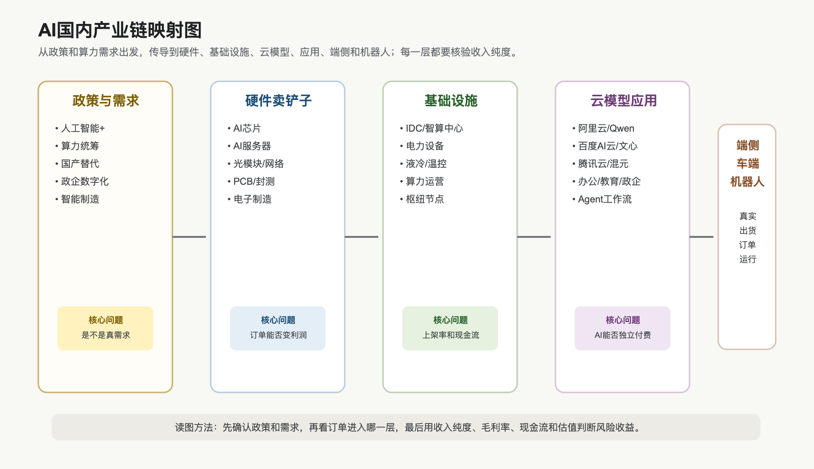

# AI国内视角、公司映射与对比

## 0. 这篇在讲什么

这篇把全球 AI 产业链翻译成国内投资能跟踪的语言：哪些环节在 A股、港股和中概里能找到对应公司，哪些环节看起来像 AI 但收入纯度不高，哪些环节更受中国自己的政策、供应链和商业化节奏影响。

先说一句最重要的小白话：国内 AI 投资不能简单照抄美股。美股 AI 主线更集中在 NVIDIA、云厂商、大模型平台和 SaaS 软件；国内二级市场更容易看到的是算力国产替代、AI服务器、光模块、PCB、IDC、电力液冷、云和大模型平台、办公/教育/政企应用、智能汽车和机器人零部件。

这背后的原因是上市公司结构不同。中国也有大模型和云平台，但很多关键主体是互联网大厂、未上市公司或集团内业务；A股里更多公司承担“卖铲子”的角色，也就是芯片、服务器、连接、PCB、电源、液冷、数据中心和机器人零部件。投资时必须分清楚：这家公司是真的有 AI 订单、AI收入和利润弹性，还是只是名字和概念沾边。

## 1. 国内 AI 和全球 AI 的差异

国内 AI 链条和全球 AI 链条共享同一个大方向：算力先行，云和模型承接，应用负责回本，端侧和机器人扩散。但具体投资约束不一样。

第一，国内上游多了一层“自主可控”的逻辑。海外投资者看 NVIDIA、Broadcom、TSMC，重点是性能、产能和客户资本开支。国内投资者还要看出口限制、国产芯片适配、国产软件栈、政企采购、行业客户能不能接受国产方案。这里的底层逻辑不是“国产一定替代”，而是“在无法自由获得全球最强算力时，本地可用、可采购、可维护的方案价值上升”。

第二，国内云和模型的商业化更分化。阿里巴巴和百度已经披露比较直接的 AI云、AI产品或 AI业务收入；腾讯更多体现为用 AI 提升广告、游戏、云和效率，同时用强现金流投入新 AI 产品。也就是说，不能只问“大模型谁强”，还要问“模型在哪个业务里变成收入”。

第三，A股 AI 应用公司的财务证据通常弱于海外 SaaS 龙头。海外 Salesforce、ServiceNow、Adobe、Workday 等公司已经披露 Agent ARR、AI-first ARR、客户和工作量指标。国内很多应用公司还在讲产品发布、客户试点、行业方案。投资上要更严格地问：AI 是否带来新增订单、提价、续费、毛利率改善，而不是只看发布会。

## 2. 国内 AI 链条映射图

这张图要表达的是：国内 AI 投资不是只有大模型。真正能在资本市场持续跟踪的，是“政策和算力需求”怎样传导到硬件、基础设施、云模型、应用和端侧机器人。

为什么这样拆？因为 A股和港股的可投资公司分布不均。硬件和基础设施上市公司多，财务报表也更容易看到订单；模型和应用的长期空间大，但需要更仔细核验收入纯度；端侧和机器人弹性大，但成熟度差异很大。

## 3. 关键事实表

| 公司/机构 | 数据日期 | 事实 | 来源 | 证据等级 | 投资解读 |
|---|---|---|---|---|---|
| 国务院 | 2025-08-27 | 《关于深入实施“人工智能+”行动的意见》提出推动人工智能与科技、产业、消费、民生、治理等深度融合 | [中国网信网转载国务院文件](https://www.cac.gov.cn/2025-08/27/c_1758018277755538.htm) | A | 国内 AI 不只是互联网应用，而是政策推动的全产业智能化 |
| 工信部口径，新华社报道 | 2026-01-28 | 我国已建成万卡智算集群 42 个，智能算力规模超过 1590 EFLOPS；东数西算 8 大枢纽节点已建成智算规模超过全国智算总量的 80% | [新华社，2026-01-28](https://www.news.cn/20260128/3b2f11906fd74ca397fef9996c805a60/c.html) | B | 国内算力建设有政策和区域集群特征，IDC、电力、网络和国产算力适配值得跟踪 |
| 阿里巴巴 | 2026 财年四季度，季末 2026-03-31 | Cloud Intelligence Group 收入 416.26 亿元，同比增长 38%；外部客户收入增长 40%；AI 相关产品收入 89.71 亿元，连续 11 个季度三位数同比增长；季度自由现金流流出 173.00 亿元，原因包括云基础设施开支增加 | [Alibaba FY2026 Results](https://data.alibabagroup.com/ecms-files/1532295521/5b1cb883-8d00-4237-a148-6631cc12a5d2/Alibaba%20Group%20Announces%20March%20Quarter%202026%20and%20Fiscal%20Year%202026%20Results.pdf) | A | 阿里是国内“AI云 + 模型 + 应用”财务披露较完整的样本，但回本压力也体现在现金流 |
| 百度 | 2026 年一季度，季末 2026-03-31 | Baidu Core AI-powered Business 收入超过 136 亿元，同比增长 49%；AI Cloud Infra 收入 88 亿元，同比增长 79%；GPU Cloud 收入同比增长 184%；Apollo Go Q1 完成 320 万次全无人驾驶运营订单 | [Baidu Q1 2026 Results](https://ir.baidu.com/news-releases/news-release-details/baidu-announces-first-quarter-2026-results) | A | 百度把 AI云、AI应用、Robotaxi 放进同一条 AI业务线，能观察商业化，但也要分清云收入和自动驾驶收入 |
| 腾讯 | 2026 年一季度，季末 2026-03-31 | 总收入 1965 亿元，同比增长 9%；资本开支 319 亿元，同比增长 16%；自由现金流 567 亿元，同比增长 20%；公司披露剔除新 AI 产品后的 non-IFRS operating profit 为 844 亿元，高于包含新 AI 产品后的 756 亿元 | [Tencent Q1 2026 Results](https://static.www.tencent.com/uploads/2026/05/13/47382ae415a209fd161bc19a1f9b3704.pdf) | A | 腾讯 AI 的特点是有强现金流业务供血，新 AI 产品仍在投入期；广告、云和生产力 Agent 是观察重点 |
| IFR | 2024 年，报告发布 2025-09-25 | 2024 年全球工业机器人新增安装 54.2 万台，中国占 54%；中国在役工业机器人超过 200 万台 | [International Federation of Robotics](https://ifr.org/ifr-press-releases/news/global-robot-demand-in-factories-doubles-over-10-years) | B | 中国机器人不是从零开始，工业自动化基础大；具身智能可能先在工业场景叠加 |
| 深圳市工信局 | 2026-03-23 | 深圳发布《加快推进人工智能服务器产业链高质量发展行动计划（2026-2028年）》 | [深圳市政府，2026-03-23](https://www.sz.gov.cn/cn/xxgk/zfxxgj/tzgg/content/post_12697198.html) | A | 地方政策已把 AI服务器产业链当成重点，利好本地服务器、电子制造和配套生态，但公司受益程度需逐一核验 |

这张表要这样读：政策和大厂财报说明国内 AI 不是空故事，但不同公司处在不同位置。阿里、百度、腾讯更接近“云模型应用回本层”；A股很多硬件和基础设施公司更接近“资本开支传导层”；机器人和端侧是“长期扩散层”。

## 4. A股与港股映射清单

以下是研究映射，不是推荐名单，也不代表公司收入全部来自 AI。后续做个股时必须回到年报、季报、订单、客户和毛利率去核验。

### 算力芯片、半导体和国产替代

| 环节 | 公司 | 市场/代码 | 为什么放在这里 | 需要核验什么 |
|---|---|---|---|---|
| AI加速芯片/训练推理 | 寒武纪 | A股 688256 | 国内 AI芯片代表之一，市场常把它作为国产算力弹性标的 | 收入规模、毛利率、客户集中、存货和研发投入 |
| DCU/GPGPU | 海光信息 | A股 688041 | 国产高性能计算和 AI算力的重要映射 | 数据中心客户、国产生态适配、订单持续性 |
| 晶圆代工 | 中芯国际 | A股 688981 / 港股 00981 | 国内先进制造基础环节 | 制程能力、产能利用率、资本开支、客户结构 |
| 封测 | 长电科技、通富微电、华天科技 | A股 600584 / 002156 / 002185 | AI芯片和先进封装需求外溢到封测环节 | 先进封装占比、盈利能力、客户认证 |
| 存储/半导体配套 | 兆易创新、澜起科技 | A股 603986 / 688008 | AI设备和服务器对内存、接口、控制芯片需求提升 | AI相关收入纯度、价格周期、客户导入 |

底层逻辑：国内芯片链的投资核心不是“马上替代 NVIDIA”，而是“在受限环境里，哪些国产方案能被真实客户采购和稳定使用”。如果只有政策方向，没有收入、客户和生态，确定性就不够。

### AI服务器、网络、光模块和PCB

| 环节 | 公司 | 市场/代码 | 为什么放在这里 | 需要核验什么 |
|---|---|---|---|---|
| AI服务器/电子制造 | 工业富联 | A股 601138 | AI服务器和云厂商资本开支的重要制造映射 | AI服务器收入占比、毛利率、客户集中度 |
| 服务器/算力基础设施 | 浪潮信息、中科曙光 | A股 000977 / 603019 | 国内服务器和算力基础设施代表 | AI订单、回款、毛利率、国产芯片适配 |
| 光模块 | 中际旭创、新易盛 | A股 300308 / 300502 | AI数据中心高速互连需求的核心受益环节 | 800G/1.6T 进展、海外客户、价格和毛利率 |
| 光器件 | 天孚通信 | A股 300394 | 光模块上游关键器件映射 | 客户份额、产品升级、毛利率 |
| 高速PCB | 沪电股份、胜宏科技 | A股 002463 / 300476 | AI服务器、交换机和高频高速板需求提升 | AI/服务器占比、产能、良率、客户认证 |

底层逻辑：AI基础设施不只买芯片，还要把芯片连起来、装起来、供电散热并交付给客户。国内 A股里收入兑现最容易被看到的，往往是服务器、光模块、PCB 这类“订单传导快”的环节。但这些环节也会遇到周期和价格压力，不能只看收入增长。

### 数据中心、电力、液冷和算力运营

| 环节 | 公司 | 市场/代码 | 为什么放在这里 | 需要核验什么 |
|---|---|---|---|---|
| IDC/算力中心 | 润泽科技、光环新网、奥飞数据 | A股 300442 / 300383 / 300738 | 数据中心供给、机柜和算力租赁映射 | 上架率、客户、PUE、电价、折旧和融资成本 |
| UPS/电源/数据中心基础设施 | 科华数据、英维克 | A股 002335 / 002837 | AI机柜功率提升带来电源和温控需求 | 数据中心订单、液冷占比、毛利率 |
| 液冷/热管理 | 高澜股份、申菱环境、同飞股份 | A股 300499 / 301018 / 300990 | 高功率 AI机柜可能推动液冷渗透 | 真实液冷项目、客户验证、价格竞争 |
| 电力设备 | 特变电工、中国西电、思源电气 | A股 600089 / 601179 / 002028 | 数据中心扩建需要变压器、开关、配电设备 | 数据中心订单占比、海外订单、原材料成本 |

底层逻辑：算力能不能落地，最后要看电。国内政策强调算力统筹和枢纽节点，意味着数据中心选址、并网、电价、PUE、液冷和上架率都很重要。IDC 公司收入看起来稳定，但如果客户上架慢、折旧重、电价高，利润会被压住。

### 云、大模型、应用和Agent

| 环节 | 公司 | 市场/代码 | 为什么放在这里 | 需要核验什么 |
|---|---|---|---|---|
| AI云/大模型/电商应用 | 阿里巴巴 | 港股 09988 / 美股 BABA | 披露 AI相关云收入，Qwen 和云一体化明显 | AI云收入、资本开支、自由现金流、模型生态 |
| AI云/搜索/Robotaxi | 百度 | 港股 09888 / 美股 BIDU | 披露 AI-powered Business、AI Cloud Infra 和 Apollo Go | AI业务利润率、广告下滑能否被 AI抵消 |
| 社交生态/广告/云/Agent | 腾讯控股 | 港股 00700 | 现金流强，AI 用于广告、云和生产力 Agent | 新 AI 产品亏损收窄、AI对广告和云的拉动 |
| 办公软件 | 金山办公 | A股 688111 | 国内办公 AI 应用代表，适合观察 AI 是否带动订阅升级 | AI会员/订阅、ARPU、续费、企业客户 |
| 语音/教育/政企AI | 科大讯飞 | A股 002230 | 大模型、教育、政企和语音入口映射 | AI应用订单、费用投入、盈利拐点 |
| 企业软件 | 用友网络、金蝶国际 | A股 600588 / 港股 00268 | ERP/企业管理软件有 Agent 改造空间 | 云订阅增长、AI模块收费、交付成本 |

底层逻辑：应用层最容易讲故事，但也最需要财务证据。一个 AI 应用如果只是“加了大模型按钮”，价值不够；如果能进入办公、财务、销售、客服、教育、政务等真实流程，并带来续费、提价或降本，价值才更扎实。

### 端侧AI、智能汽车和机器人

| 环节 | 公司 | 市场/代码 | 为什么放在这里 | 需要核验什么 |
|---|---|---|---|---|
| 端侧设备和消费电子 | 立讯精密、歌尔股份、蓝思科技 | A股 002475 / 002241 / 300433 | AI手机、AI眼镜、可穿戴可能带动零部件升级 | AI新品订单、客户集中、毛利率 |
| 智能汽车电子 | 德赛西威、中科创达 | A股 002920 / 300496 | 智能座舱、域控制器、汽车软件映射 | 主机厂订单、软件收入、海外拓展 |
| 工控/伺服 | 汇川技术 | A股 300124 | 工业自动化和机器人控制核心环节 | 制造业资本开支、机器人业务占比 |
| 机器人本体/集成 | 埃斯顿、拓斯达 | A股 002747 / 300607 | 工业机器人和自动化方案映射 | 订单、毛利率、回款、价格战 |
| 机器人核心零部件 | 绿的谐波、三花智控 | A股 688017 / 002050 | 减速器、热管理/执行器等被市场映射到机器人链 | 机器人真实收入占比、客户验证、量产节奏 |

底层逻辑：端侧和机器人是长链条，不能只看“机器人概念”。消费电子看新品周期，智能车看车企订单和软件收费，工业机器人看制造业景气，人形机器人零部件看真实量产和客户验证。

## 5. 国内公司收入纯度与证据强度初筛

下面这张表不是推荐名单，也不是最终排序，而是帮助分清“真 AI收入/订单”“产业链高相关”“主题映射”三类。投资上最怕把这三类混在一起：第一类可以用财报和订单研究，第二类要看 AI占比和客户，第三类只能作为线索，不能直接当成核心 AI资产。

| 公司 | 主要映射 | AI收入/订单纯度初判 | 当前证据强度 | 关键估值/财务核验点 | 小白话解释 |
|---|---|---|---|---|---|
| 中际旭创、新易盛、天孚通信 | 光模块/光器件 | 高 | B，ETF重仓和海外 AI数据中心需求映射强，但仍需公司披露验证 | 800G/1.6T 产品、海外客户、毛利率、订单持续性、估值是否透支 | 它们更像 AI集群里的高速“网线和接口”，需求强，但股价也容易提前反映 |
| 寒武纪、海光信息 | 国产 AI芯片/高性能计算 | 中高 | B/C，国产算力逻辑强，收入纯度和盈利质量需逐季核验 | 收入规模、客户集中、毛利率、研发费用、是否持续亏损、估值字段 | 它们是国产算力弹性标的，但不能把“国产替代”直接等于成熟利润 |
| 工业富联、浪潮信息、中科曙光 | AI服务器/算力基础设施 | 中高 | B，订单和行业需求强，但整机利润率要重点看 | AI服务器收入占比、毛利率、存货、应收账款、客户集中度 | 服务器收入会很大，但核心利润可能被上游芯片拿走 |
| 润泽科技、光环新网、奥飞数据 | IDC/算力中心 | 中 | B/C，AI算力中心逻辑清楚，但收入确认和上架率需要核验 | 上架率、客户合同、电价、折旧、融资成本、自由现金流 | 数据中心不是有楼就赚钱，关键是客户上架和电力成本 |
| 科大讯飞、金山办公、用友、金蝶 | AI应用/办公/企业软件 | 中 | B/C，产品发布和应用场景多，但 AI增量收入披露仍需细看 | AI会员/订阅、ARPU、续费率、毛利率、销售费用 | 应用层空间大，但必须证明客户愿意续费和加价 |
| 汇川技术、埃斯顿、绿的谐波、三花智控 | 工业自动化/机器人/零部件 | 低到中 | C，机器人和具身智能映射强，但人形机器人收入纯度多数仍待核验 | 机器人业务占比、客户认证、量产订单、毛利率、估值 | 它们可能受益于机器人长期趋势，但现在很多还是期权逻辑 |
| 立讯精密、歌尔股份、蓝思科技 | 端侧 AI/消费电子 | 低到中 | C，AI手机/AI眼镜/可穿戴方向存在，但订单纯度需核验 | AI新品订单、客户集中、ASP、毛利率、库存 | 端侧 AI 会带来硬件升级，但不等于所有消费电子公司都能赚 AI利润 |

这张表背后的逻辑是：AI收入纯度越高，越能用 AI行业景气解释公司业绩；AI收入纯度越低，就越要看原有主业周期。比如光模块公司和 AI服务器公司更容易看到 AI订单传导；办公软件和机器人公司长期空间可能很大，但要等续费、订单和回本周期证明。

## 6. 重点映射公司盘中估值线索

下面数据来自东方财富 quote API，拉取时间为 2026-07-03 下午盘，北京时间。字段包括最新价、总市值、动态 PE 字段和 PB 字段。由于行情接口字段、除权除息状态和估值口径可能与券商终端不同，本表只作为研究底稿线索，不能直接当作交易依据。尤其个别公司若 PE 为负或异常低/高，要回到财报和专业行情终端复核。

| 代码 | 名称 | 最新价 | 总市值(亿元) | 动态PE字段 | PB字段 | 涨跌幅 | 怎么读 |
|---|---|---:|---:|---:|---:|---:|---|
| 300308 | 中际旭创 | 1128.90 | 12589.9 | 54.89 | 36.34 | -1.23% | 光模块龙头映射很强，市值和估值都已处高关注区 |
| 300502 | 新易盛 | 529.59 | 7383.8 | 66.40 | 38.03 | 4.05% | ETF第一大权重，业绩兑现和估值消化都要跟踪 |
| 688256 | 寒武纪 | 1377.88 | 8657.1 | 213.61 | 70.73 | 0.43% | 国产 AI芯片弹性大，但估值对业绩兑现非常敏感 |
| 688041 | 海光信息 | 326.44 | 7587.6 | 276.07 | 32.78 | 1.29% | 国产算力逻辑强，收入和利润要逐季验证 |
| 601138 | 工业富联 | 65.20 | 12938.3 | 30.53 | 7.34 | 1.84% | AI服务器和电子制造映射强，但要看毛利率 |
| 000977 | 浪潮信息 | 66.61 | 978.2 | 40.43 | 4.40 | 4.42% | 服务器链条代表，订单和回款比概念更重要 |
| 603019 | 中科曙光 | 93.50 | 1368.0 | 150.10 | 6.22 | -1.12% | 算力基础设施映射强，但估值和国产生态进展都要看 |
| 300442 | 润泽科技 | 85.94 | 1410.3 | 60.56 | 10.16 | -2.12% | IDC/算力中心映射，重点看上架率和现金流 |
| 002230 | 科大讯飞 | 41.50 | 996.9 | -146.84 | 4.37 | 1.02% | AI应用方向明确，但负 PE 字段说明盈利口径需重点复核 |
| 688111 | XD金山办 | 212.32 | 985.2 | 11.22 | 6.73 | -1.43% | 办公 AI 入口清晰，但本字段可能受除权或口径影响，需复核 |
| 300124 | 汇川技术 | 72.32 | 1958.1 | 48.30 | 5.59 | 5.73% | 工控和机器人底座，AI纯度低于光模块/服务器 |
| 002747 | 埃斯顿 | 44.77 | 433.3 | 110.72 | 13.38 | 10.00% | 机器人主题热度高，必须看订单和利润 |
| 688017 | 绿的谐波 | 482.00 | 883.7 | 676.94 | 24.76 | 16.69% | 人形机器人零部件弹性高，但估值对量产节奏很敏感 |
| 002050 | 三花智控 | 48.71 | 2049.7 | 55.24 | 6.28 | 8.44% | 热管理和机器人映射都有，但 AI收入纯度要拆分 |

这个表说明，国内 AI热门资产里有不少已经处于高估值、高关注度状态。它们可能继续受益于产业趋势，但研究上不能只看“公司在 AI链上”，还要看两个问题：第一，AI相关收入占比是否真的高；第二，当前估值是否已经把未来好消息提前计入。

## 7. 全球龙头与国内映射怎么比

| 全球样本 | 国内映射 | 可比点 | 不可直接类比的地方 |
|---|---|---|---|
| NVIDIA | 寒武纪、海光信息、华为昇腾生态（非上市主体） | 都属于 AI算力核心 | NVIDIA 有全球 CUDA 生态和极高利润池，国内公司更多是国产替代和可用性逻辑 |
| TSMC / CoWoS | 中芯国际、长电科技、通富微电 | 都在制造和封装链条里 | 制程能力、客户结构和先进封装位置不同，不能简单套估值 |
| Dell / Supermicro | 工业富联、浪潮信息、中科曙光 | AI服务器订单传导 | 整机环节收入大但利润率要细看，客户集中和上游成本压力不同 |
| Arista / Broadcom 网络链 | 中际旭创、新易盛、天孚通信、PCB链 | AI集群互连需求 | 光模块/器件受技术迭代、价格和客户认证影响，不能只看行业需求 |
| Microsoft / Amazon / Google / Oracle | 阿里云、腾讯云、百度智能云、华为云（非上市主体） | AI云和模型服务商业化 | 国内云厂商价格、客户结构、监管和国产算力约束不同 |
| Salesforce / ServiceNow / Adobe | 金山办公、科大讯飞、用友、金蝶、钉钉/企微生态 | AI进入工作流 | 国内软件公司 AI收入披露少，仍需验证是否带来新增订阅 |
| Tesla / Waymo | 百度 Apollo、国内智能车供应链 | 自动驾驶和车端 AI | Robotaxi 监管、城市扩张、事故责任和商业模式差异很大 |

这张表最重要的作用，是防止“看见海外龙头涨，就随便找一个国内名字相似的公司”。真正可比的是商业模式、壁垒和财务指标，不是概念标签。

## 8. 国内 AI 投资的五个核验问题

第一，AI收入纯度。公司收入到底有多少来自 AI订单、AI产品或 AI客户？如果公司只说“布局 AI”，但报表里看不到收入、订单、客户和毛利率，就只能算概念线索。

第二，利润留存能力。硬件公司要看毛利率和议价能力，软件公司要看订阅和续费，云公司要看资本开支和自由现金流。收入增长不等于利润增长。

第三，客户集中度。很多 AI供应链公司绑定少数大客户。客户订单强时弹性大，但客户砍单、降价或转向自研时，风险也会集中爆发。

第四，国产替代的真实进度。国产替代不是一句口号，必须看客户测试、批量采购、软件生态、适配成本和售后能力。越靠近核心算力，越要核验性能和生态。

第五，估值是否已经透支。AI 主线容易给高估值，但公司利润兑现节奏不同。上游硬件如果订单确定性下降，估值会先压缩；应用如果没有付费证据，估值也可能回落。

## 9. 存疑点

### 存疑点：国内 AI 应用收入披露不足

- 已证实：阿里、百度、腾讯披露了 AI云、AI业务或 AI产品投入相关指标，国内办公、教育、政企软件也在快速发布 AI 功能。
- 存疑或证据不足：很多 A股应用公司没有清晰披露 AI带来的新增收入、续费率和毛利率。
- 为什么重要：如果 AI只是功能包装，估值弹性不该太高；如果 AI带来独立付费和高留存，才是应用层真正回本。
- 暂时如何使用：把应用公司分成“有财务披露”和“只有产品发布”两组，估值要求不同。
- 后续核验点：年报/季报中 AI收入口径、合同金额、订阅客户、ARPU、续费率、毛利率。
- 当前证据等级：B/C。

### 存疑点：A股个股估值字段需要终端复核

- 已证实：本轮已通过东方财富 quote API 拉取部分重点 A股公司盘中最新价、总市值、动态 PE 字段和 PB 字段。
- 存疑或证据不足：字段口径、除权状态、动态 PE 计算方式和异常值仍需用券商终端、交易所数据和公司财报复核。
- 为什么重要：公司映射只能说明“在哪条链上”，不能直接回答“贵不贵、能不能买”。
- 暂时如何使用：本篇把估值字段作为筛选线索，不做买卖排序；正式个股结论要进入公司/个股调研。
- 后续核验点：AkShare、东方财富、交易所、Wind/Choice/券商终端交叉核验；回到年报季报拆 AI收入纯度。
- 当前证据等级：C，待复核。

## 10. 本篇结论

国内 AI 投资要把三件事分开：第一，政策和国产替代带来的确定性；第二，全球 AI资本开支传导到国内硬件和基础设施的订单；第三，国内云、模型、应用、端侧和机器人能否形成自己的回本链。

短期更容易看到报表兑现的是服务器、光模块、PCB、IDC、电力液冷和部分云业务。中期要看国产算力生态、AI云收入和办公/政企/教育等应用能否持续付费。长期看端侧 AI、智能汽车和具身智能，但这部分必须用真实出货、真实订单、真实运行数据来验证。

最重要的一句话：国内 AI 不是没有机会，而是不能把“AI 主题”当成同一种资产。不同节点的成熟度、利润池、估值和风险完全不一样。

## 来源

- [国务院关于深入实施“人工智能+”行动的意见，2025-08-27](https://www.cac.gov.cn/2025-08/27/c_1758018277755538.htm)
- [新华社：2026年中国AI发展趋势前瞻，2026-01-28](https://www.news.cn/20260128/3b2f11906fd74ca397fef9996c805a60/c.html)
- [Alibaba Group Announces March Quarter 2026 and Fiscal Year 2026 Results, 2026-05-13](https://data.alibabagroup.com/ecms-files/1532295521/5b1cb883-8d00-4237-a148-6631cc12a5d2/Alibaba%20Group%20Announces%20March%20Quarter%202026%20and%20Fiscal%20Year%202026%20Results.pdf)
- [Baidu Announces First Quarter 2026 Results, 2026-05-18](https://ir.baidu.com/news-releases/news-release-details/baidu-announces-first-quarter-2026-results)
- [Tencent Announces 2026 First Quarter Results, 2026-05-13](https://static.www.tencent.com/uploads/2026/05/13/47382ae415a209fd161bc19a1f9b3704.pdf)
- [International Federation of Robotics, World Robotics 2025 Industrial Robots, 2025-09-25](https://ifr.org/ifr-press-releases/news/global-robot-demand-in-factories-doubles-over-10-years)
- [深圳市加快推进人工智能服务器产业链高质量发展行动计划（2026-2028年），2026-03-23](https://www.sz.gov.cn/cn/xxgk/zfxxgj/tzgg/content/post_12697198.html)
- 东方财富 quote API，重点 A股公司盘中行情与估值字段，拉取时间 2026-07-03 下午盘，北京时间；字段口径待券商终端复核
