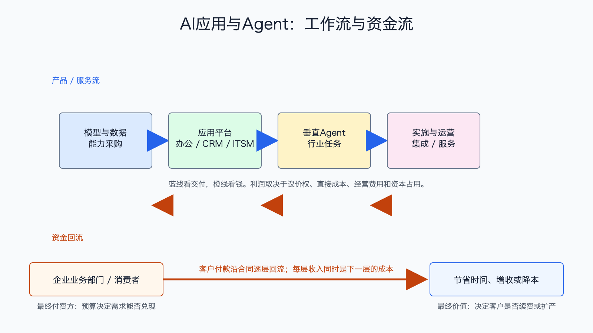

# AI应用与Agent产业链

数据日期：2026 年第一季度或各公司最新财季
最新核验日期：2026-07-15
用途：投资研究，不构成买卖建议。

## 0. 子产业链边界

- 包含：办公、CRM、客服、ITSM、HR、内容创作、编程和垂直行业 Agent。
- 不包含：基础模型训练、裸 API、数据库和安全平台本身。
- 主要付费方：企业业务部门、专业人员、中小企业和消费者。
- 收入确认位置：席位订阅、用量、Agent 工作量、业务结果分成或实施服务。
- 经济模型：订阅、用量与结果付费型。

## 1. 产业链路图

Agent 不只是聊天框。它读取业务数据、调用工具、执行任务并返回结果。客户付费的终点不是“模型回答得像人”，而是客服工单更快、销售转化更高、开发周期更短或人力成本下降。链路图把模型与数据成本、应用平台、垂直 Agent 和实施运维分开，避免把基础模型热度当作应用利润。

## 2. 谁付钱与价值流

应用层最接近最终预算，因此长期利润池可能很大。但付费必须建立在可量化 ROI 上：如果一个 Agent 每年收费 10 万元，却只节省 3 万元人工和时间，续费就难；如果它能减少 30 万元成本或带来更多收入，客户才会扩容。掌握工作流、数据和分发入口的既有软件公司通常更容易收费，但也要证明 AI 是新增收入而不是旧订阅改名。

## 3. 节点规模

| 节点 | 公开规模锚点 | 增速/周期 | 数据日期 | 来源/证据等级 | 存疑点 |
|---|---:|---|---|---|---|
| CRM/客服 Agent | Salesforce Agentforce ARR 12 亿美元；Agentforce+Data 360 ARR 近 34 亿美元 | Agentforce ARR 同比 205% | FY2027Q1 | [Salesforce FY2027Q1](https://investor.salesforce.com/news/news-details/2026/Salesforce-Delivers-Record-First-Quarter-Fiscal-2027-Results/default.aspx)，A | 组合 ARR 含 Data 360 和并购业务，不能全算 Agent |
| IT 工作流 Agent | ServiceNow 单季订阅收入 36.71 亿美元 | 从试点转企业平台采购 | 2026Q1 | [ServiceNow 2026Q1](https://newsroom.servicenow.com/press-releases/details/2026/ServiceNow-Reports-First-Quarter-2026-Financial-Results/default.aspx)，A | 公司订阅收入含非 AI 产品，AI 纯收入未完整单列 |
| HR/财务 Agent | Workday 单季订阅收入 23.54 亿美元 | 早期商业化 | FY2027Q1 | [Workday FY2027Q1](https://investor.workday.com/news-and-events/press-releases/news-details/2026/Workday-Announces-Fiscal-2027-First-Quarter-Financial-Results/)，A | 公司订阅收入含非 AI 产品，使用客户数不等于新增收入 |
| 垂直与消费 Agent | 缺口:N4 | 产品快速迭代、淘汰率高 | 2026-07-15 | 公司口径与应用商店，B/C | 留存、续费和获客成本披露弱 |

这张节点规模表怎么读：先看公开锚点究竟是行业总量、公司收入还是运营代理，三者不能直接相加。它重要，是因为节点规模决定机会的上限，但大收入未必对应高利润。最容易误读的是把单家公司或总市场数字当成 AI 纯收入；投资使用时，应把规模锚点与后面的直接经济性、资本占用和证据等级一起看。

## 4. 利润分布与单位经济

| 节点/代理公司 | 收入池 | 毛利率 | 毛利池 | 经营利润/EBITDA/IRR | 资本开支/营运资金 | 自由现金流 | 估算公式/口径 | 数据日期 | 来源/证据等级 |
|---|---:|---:|---:|---:|---|---:|---|---|---|
| CRM/Agentforce | Agentforce ARR 12 亿美元 | 缺口:P1 | 缺口:P1 | 缺口:P1 | 缺口:P1 | 缺口:P1 | ARR 不是当期收入；单位经济=订阅/用量收入-模型调用-交付-销售分摊 | FY2027Q1 | Salesforce，A |
| ITSM：ServiceNow 公司代理 | 总收入约 37.5 亿美元/季；订阅收入 36.71 亿美元 | 2026 全年订阅毛利率指引 81.5% | 按订阅收入×指引毛利率估算约 29.92 亿美元，仅作代理 | GAAP 经营利润 5.03 亿美元；非 GAAP 11.99 亿美元 | 资本开支 1.41 亿美元 | Q1 非 GAAP FCF 16.65 亿美元，率 44% | 毛利池用全年指引估算；其他为公司整体季度口径，AI 纯度未拆 | 2026Q1 | ServiceNow，A |
| HR：Workday 公司代理 | 总收入 25.42 亿美元/季；订阅收入 23.54 亿美元 | 缺口:P3 | 缺口:P3 | GAAP 经营利润 3.38 亿美元；非 GAAP 8.09 亿美元 | Q1 资本开支 0.80 亿美元 | Q1 FCF 6.16 亿美元 | FCF=经营现金流 6.96-资本开支 0.80；公司整体代理，AI 纯度未拆 | FY2027Q1 | Workday，A |
| 垂直 Agent | 缺口:P4 | 缺口:P4 | 缺口:P4 | 缺口:P4 | 缺口:P4 | 缺口:P4 | 客户 LTV=客单价×毛利×留存期；需大于获客+实施+模型成本 | 2026-07-15 | B/C，存疑 |

这里最容易犯的错是看见 80% 软件毛利，就认为 Agent 一定赚钱。若每个客户都要大量工程师实施、模型调用费用随使用增长、销售周期很长，经营利润和自由现金流仍可能很差。成熟工作流平台的优势是已有客户、数据和权限，新增 AI 模块更容易低成本分发。

## 4.1 受控数据缺口

下表不是把缺失数据藏起来，而是说明为什么当前不能可靠量化、还能用什么指标继续判断。`缺口:ID` 不能当作零，也不能跨节点比较。

| 缺口 ID | 指标 | 已检索范围 | 无法估算原因 | 可给上下界 | 替代指标 | 决策影响 | 核验计划 |
|---|---|---|---|---|---|---|---|
| N4 | 垂直与消费 Agent：公开规模锚点 | 已查现有公司 IR、监管/协会统计和文内来源，更新至 2026-07-15 | 公开资料未按该节点独立披露或口径不可比；原可得信息：市场项目多、可比收入少 | 当前不能可靠给窄区间；如有公司代理值，仅用于方向判断 | 订单、客户数、出货/使用量、收入代理和单位经济领先指标 | 不能据此比较该节点绝对价值池，只能判断商业模式、周期和可能的价值留存方向 | 下季财报、招股书、客户验收或行业统计更新时复核；出现分部披露后替换缺口 |
| P1 | CRM/Agentforce：毛利率、毛利池、经营利润/EBITDA/IRR、资本开支/营运资金、自由现金流 | 已查现有公司 IR、监管/协会统计和文内来源，更新至 2026-07-15 | 公开资料未按该节点独立披露或口径不可比；原可得信息：产品毛利未单列；待核验；增量经营利润需扣模型、销售和实施成本；固定资本轻，销售和并购占用高；公司整体核验 | 当前不能可靠给窄区间；如有公司代理值，仅用于方向判断 | 订单、客户数、出货/使用量、收入代理和单位经济领先指标 | 不能据此比较该节点绝对价值池，只能判断商业模式、周期和可能的价值留存方向 | 下季财报、招股书、客户验收或行业统计更新时复核；出现分部披露后替换缺口 |
| P3 | Workday 公司代理：毛利率与毛利池 | 已查 FY2027Q1 财务结果和文内来源，更新至 2026-07-15 | 公司披露收入、经营利润、经营现金流、资本开支和 FCF，但当前材料未提供可直接放入本表的统一毛利口径 | 当前不能可靠给窄区间 | 订阅成本、公司总成本和后续 10-Q 毛利披露 | 不影响判断经营利润和现金转换，但限制了与 ServiceNow 订阅毛利的直接比较 | 后续 10-Q 或下季财务表披露后补齐 |
| P4 | 垂直 Agent：收入池、毛利率、毛利池、经营利润/EBITDA/IRR、资本开支/营运资金、自由现金流 | 已查现有公司 IR、监管/协会统计和文内来源，更新至 2026-07-15 | 公开资料未按该节点独立披露或口径不可比；原可得信息：收入池待核验；软件毛利可能高；待核验；早期常被人工交付和获客成本吞掉；固定资产轻，研发销售重；多数未稳定 | 当前不能可靠给窄区间；如有公司代理值，仅用于方向判断 | 订单、客户数、出货/使用量、收入代理和单位经济领先指标 | 不能据此比较该节点绝对价值池，只能判断商业模式、周期和可能的价值留存方向 | 下季财报、招股书、客户验收或行业统计更新时复核；出现分部披露后替换缺口 |

## 5. 利润迁移、周期与反证

当前从“功能上线”进入“付费和续费验证”。利润可能从通用聊天产品迁向能嵌入关键流程、掌握数据和结果反馈的应用。按结果收费能提高价值上限，但也把执行风险和结果波动留给供应商。

跟踪 AI ARR 是否真新增、净收入留存、使用量到付费转化、单位模型成本、实施工时、销售回收期、客户 ROI 和自由现金流。反证是用户活跃但不续费、AI 套餐只是重分类、模型成本下降带来价格战、平台厂商免费捆绑或垂直交付长期无法标准化。

## 来源

- [Salesforce FY2027Q1](https://investor.salesforce.com/news/news-details/2026/Salesforce-Delivers-Record-First-Quarter-Fiscal-2027-Results/default.aspx)
- [ServiceNow 2026Q1](https://newsroom.servicenow.com/press-releases/details/2026/ServiceNow-Reports-First-Quarter-2026-Financial-Results/default.aspx)
- [Workday FY2027Q1](https://investor.workday.com/news-and-events/press-releases/news-details/2026/Workday-Announces-Fiscal-2027-First-Quarter-Financial-Results/)
