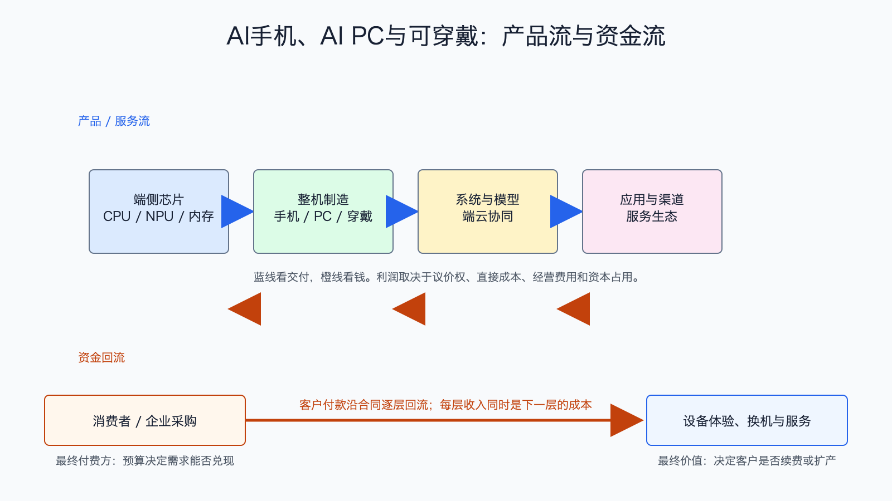

# AI手机、AI PC与可穿戴产业链

数据日期：2026 年第一季度或最近财季
最新核验日期：2026-07-15
用途：投资研究，不构成买卖建议。

## 0. 子产业链边界

- 包含：端侧芯片/NPU、内存、整机、操作系统、端侧模型、应用、渠道和服务。
- 不包含：车载计算、云端裸算力和通用机器人。
- 主要付费方：消费者、企业采购部门和品牌厂商。
- 收入确认位置：芯片和整机交付、软件订阅、应用分成或生态服务。
- 经济模型：混合型：芯片和整机为制造型，软件与生态为订阅/平台型。

## 1. 产业链路图

端侧 AI 把一部分推理放到用户设备上，优点是低延迟、隐私更好、离线可用，也能减少云端调用成本。但用户不会单独为“NPU 算力”付钱，只有体验改善能推动换机、提高 ASP、增加服务订阅或巩固生态，AI 才会转成利润。

## 2. 谁付钱与价值流

消费者最终为整机和服务付钱，品牌厂再向芯片、内存和制造商采购。短期最确定的价值是高端化和硬件升级，最不确定的是独立 AI 订阅。若 AI 功能只是免费标配，芯片和内存成本增加可能由品牌厂承担，供应链收入增长却不一定带来品牌利润增长。

## 3. 节点规模

| 节点 | 公开规模锚点 | 增速/周期 | 数据日期 | 来源/证据等级 | 存疑点 |
|---|---:|---|---|---|---|
| 中国智能手机 | 2026Q1 出货约 6900 万部 | 同比 -3.3%，利润优先于低端销量 | 2026Q1 | [IDC](https://www.idc.com/resource-center/blog/china-smartphone-market-q1-2026-huawei-apple/)，B | AI 手机占比和独立收入未拆 |
| 品牌整机与生态 | Apple 单季收入 1112 亿美元，经营现金流超 280 亿美元 | 收入同比 17%，高端需求强 | FY2026Q2 | [Apple](https://www.apple.com/newsroom/2026/04/apple-reports-second-quarter-results/)，A | 公司没有把 AI 收入单列 |
| 端侧芯片 | Qualcomm QCT handset 单季收入 60.24 亿美元 | 同比 -13%，受内存约束和手机周期影响 | FY2026Q2 | [Qualcomm](https://s204.q4cdn.com/645488518/files/doc_financials/2026/q2/FY2026-2nd-Quarter-Earnings-Release.pdf)，A | 手持业务不等于 AI 芯片收入 |
| AI PC/可穿戴 | 缺口:N4 | 换机与新品周期 | 2026Q1 | [Gartner PC](https://www.gartner.com/en/newsroom/press-releases/2026-4-10-gartner-says-worldwide-pc-shipments-increased-4-percent-in-first-quarter-of-2026)，B | AI 功能是否带动增量 ASP 待验证 |

这张节点规模表怎么读：先看公开锚点究竟是行业总量、公司收入还是运营代理，三者不能直接相加。它重要，是因为节点规模决定机会的上限，但大收入未必对应高利润。最容易误读的是把单家公司或总市场数字当成 AI 纯收入；投资使用时，应把规模锚点与后面的直接经济性、资本占用和证据等级一起看。

## 4. 利润分布与单位经济

| 节点/代理公司 | 收入池 | 毛利率 | 毛利池 | 经营利润/EBITDA/IRR | 资本开支/营运资金 | 自由现金流 | 估算公式/口径 | 数据日期 | 来源/证据等级 |
|---|---:|---:|---:|---:|---|---:|---|---|---|
| 品牌与生态：Apple 公司代理 | 1112 亿美元/季 | 缺口:P1 | 缺口:P1 | 缺口:P1 | 缺口:P1 | 经营现金流超 280 亿美元；FCF需扣资本开支 | 公司整体代理，AI 纯收入不可拆 | FY2026Q2 | Apple，A |
| 端侧芯片：Qualcomm 公司代理 | 105.99 亿美元/季；handset 60.24 亿美元 | QCT EBT率 27%，非毛利率 | 缺口:P2 | QCT EBT 24.65 亿美元 | 六个月资本开支 10.82 亿美元；库存增加 | 六个月经营现金流74.14亿美元，粗略FCF约63.32亿美元 | 公司/分部代理；粗略FCF=经营现金流-资本开支 | 截至 2026-03-29 | Qualcomm，A |
| 整机制造与零部件 | 缺口:P3 | 缺口:P3 | 缺口:P3 | 缺口:P3 | 缺口:P3 | 缺口:P3 | AI 增量价值=AI机型出货×新增单机价值，不能用全部出货 | 2026-07-15 | B/C，估算 |
| 端侧软件/订阅 | 缺口:P4 | 缺口:P4 | 缺口:P4 | 缺口:P4 | 缺口:P4 | 缺口:P4 | 收入=付费用户×ARPU；扣渠道分成、云调用和研发 | 2026-07-15 | C，存疑 |

## 4.1 受控数据缺口

下表不是把缺失数据藏起来，而是说明为什么当前不能可靠量化、还能用什么指标继续判断。`缺口:ID` 不能当作零，也不能跨节点比较。

| 缺口 ID | 指标 | 已检索范围 | 无法估算原因 | 可给上下界 | 替代指标 | 决策影响 | 核验计划 |
|---|---|---|---|---|---|---|---|
| N4 | AI PC/可穿戴：公开规模锚点 | 已查现有公司 IR、监管/协会统计和文内来源，更新至 2026-07-15 | 公开资料未按该节点独立披露或口径不可比；原可得信息：PC 总出货与 AI-capable 渗透率是主要代理 | 当前不能可靠给窄区间；如有公司代理值，仅用于方向判断 | 订单、客户数、出货/使用量、收入代理和单位经济领先指标 | 不能据此比较该节点绝对价值池，只能判断商业模式、周期和可能的价值留存方向 | 下季财报、招股书、客户验收或行业统计更新时复核；出现分部披露后替换缺口 |
| P1 | 品牌与生态：Apple 公司代理：毛利率、毛利池、经营利润/EBITDA/IRR、资本开支/营运资金 | 已查现有公司 IR、监管/协会统计和文内来源，更新至 2026-07-15 | 公开资料未按该节点独立披露或口径不可比；原可得信息：公司毛利需财表核验；待核验；公司经营利润需财表核验；供应链预付款、库存和研发占用 | 当前不能可靠给窄区间；如有公司代理值，仅用于方向判断 | 订单、客户数、出货/使用量、收入代理和单位经济领先指标 | 不能据此比较该节点绝对价值池，只能判断商业模式、周期和可能的价值留存方向 | 下季财报、招股书、客户验收或行业统计更新时复核；出现分部披露后替换缺口 |
| P2 | 端侧芯片：Qualcomm 公司代理：毛利池 | 已查现有公司 IR、监管/协会统计和文内来源，更新至 2026-07-15 | 公开资料未按该节点独立披露或口径不可比；原可得信息：待核验 | 当前不能可靠给窄区间；如有公司代理值，仅用于方向判断 | 订单、客户数、出货/使用量、收入代理和单位经济领先指标 | 不能据此比较该节点绝对价值池，只能判断商业模式、周期和可能的价值留存方向 | 下季财报、招股书、客户验收或行业统计更新时复核；出现分部披露后替换缺口 |
| P3 | 整机制造与零部件：收入池、毛利率、毛利池、经营利润/EBITDA/IRR、资本开支/营运资金、自由现金流 | 已查现有公司 IR、监管/协会统计和文内来源，更新至 2026-07-15 | 公开资料未按该节点独立披露或口径不可比；原可得信息：收入=出货×单机价值量；竞争强、毛利较薄；待核验；看产能利用率和良率；工厂、库存和应收占用高；周期性 | 当前不能可靠给窄区间；如有公司代理值，仅用于方向判断 | 订单、客户数、出货/使用量、收入代理和单位经济领先指标 | 不能据此比较该节点绝对价值池，只能判断商业模式、周期和可能的价值留存方向 | 下季财报、招股书、客户验收或行业统计更新时复核；出现分部披露后替换缺口 |
| P4 | 端侧软件/订阅：收入池、毛利率、毛利池、经营利润/EBITDA/IRR、资本开支/营运资金、自由现金流 | 已查现有公司 IR、监管/协会统计和文内来源，更新至 2026-07-15 | 公开资料未按该节点独立披露或口径不可比；原可得信息：收入池待验证；成熟后可高毛利；待核验；获客与模型成本决定；固定资本轻；取决于续费 | 当前不能可靠给窄区间；如有公司代理值，仅用于方向判断 | 订单、客户数、出货/使用量、收入代理和单位经济领先指标 | 不能据此比较该节点绝对价值池，只能判断商业模式、周期和可能的价值留存方向 | 下季财报、招股书、客户验收或行业统计更新时复核；出现分部披露后替换缺口 |

## 5. 利润迁移、周期与反证

短期利润更可能留在品牌生态和高端芯片，供应链受益来自单机价值量提升。长期若端侧助手形成持续订阅，利润可能向操作系统入口和应用迁移。反证是用户不因 AI 换机、AI 功能免费同质化、内存成本上涨压缩毛利或端云协同仍高度依赖昂贵云推理。

跟踪 AI 机型渗透率、换机周期、ASP、端侧芯片与内存价值量、品牌毛利率、服务收入、付费订阅和设备活跃度。

## 来源

- [Apple FY2026Q2](https://www.apple.com/newsroom/2026/04/apple-reports-second-quarter-results/)
- [Qualcomm FY2026Q2](https://s204.q4cdn.com/645488518/files/doc_financials/2026/q2/FY2026-2nd-Quarter-Earnings-Release.pdf)
- [IDC 中国智能手机 2026Q1](https://www.idc.com/resource-center/blog/china-smartphone-market-q1-2026-huawei-apple/)