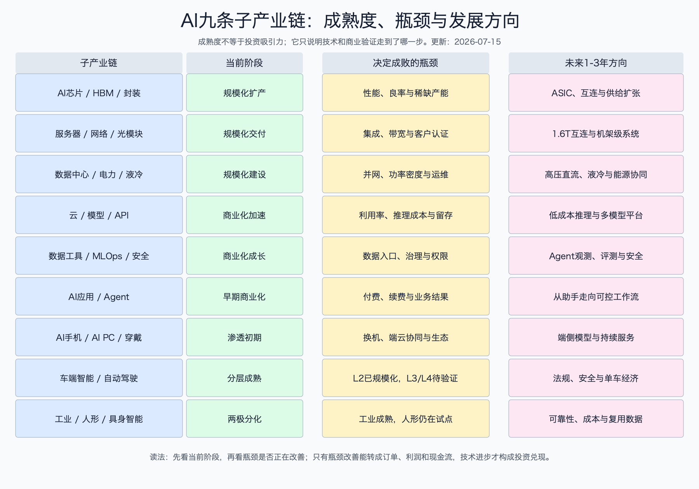

# AI技术成熟度与发展趋势

> 更新日期：2026-07-15。成熟度是基于量产、真实收入、客户复购、可靠性和单位经济做出的研究判断，不是厂商公布的统一评级，也不等于股票更值得买。

## 0. 先说人话：技术先进，不等于已经能赚钱

AI 产业最容易犯的错误，是把“演示效果很好”“模型分数提高”直接等同于“产业已经成熟”。真正的商业成熟至少要经过五步：技术能跑、产品能交付、客户愿付钱、供应商能稳定赚钱、扩张后现金流不恶化。只完成第一步的技术，仍然是一张期权；完成后四步，才可能形成可持续利润池。

因此本篇不用单一的“先进/落后”标签，而是看三个问题：现在是否规模化交付，最大瓶颈是什么，未来 1-3 年的改进能否转成订单、利润和自由现金流。判断依据主要来自截至 2026-07-15 可得的公司财报、行业组织和能源机构资料；统一行业利润数据缺失的地方标注为研究判断。

## 1. 九条子产业链成熟度地图

这张图最重要的不是颜色，而是“同一个 AI 行业里存在不同钟表”。芯片、服务器和工业机器人已有多年量产基础，主要问题是扩产、性能和成本；Agent、人形机器人和 L4 自动驾驶仍要证明可靠性、付费和单位经济。把这些环节用同一估值逻辑衡量，会把成熟业务的周期风险和早期技术的兑现风险混在一起。

## 2. 成熟度分级怎么判断

| 阶段 | 小白话 | 最低验证证据 | 最容易误判的地方 |
|---|---|---|---|
| 研究与原型 | 实验室或演示能跑 | 可复现实验、原型性能 | 把发布会演示当成客户需求 |
| 试点验证 | 少量客户愿意试 | 付费试点、运行数据、验收标准 | 把框架协议和试用人数当成收入 |
| 早期商业化 | 有收入，但规模和利润未稳定 | 重复订单、付费转化、单位成本 | 只看收入增速，不看获客和推理成本 |
| 规模化成长 | 产品可以重复交付，产能和渠道扩张 | 大规模收入、backlog、毛利和现金流 | 把供给紧缺期高利润外推到长期 |
| 成熟迭代 | 市场已验证，竞争转向成本、效率和替换周期 | 稳定客户、更新周期、售后和现金回报 | 低估价格战和周期下行 |

成熟度判断背后的 why 是：客户不是为技术名词付钱，而是为更低成本、更高收入、更安全或更可靠的结果付钱。越接近规模化，研究重点越要从“能不能做”切换到“价格、份额、毛利和现金流”；越接近试点期，越要追问“谁签了真实合同、为什么会复购”。

## 3. 各子产业链关键技术、成熟度与方向

| 子产业链 | 关键技术节点 | 当前成熟度 | 未来 1-3 年方向 | 主要瓶颈 | 能证明兑现的指标 | 证据编号 |
|---|---|---|---|---|---|---|
| AI芯片、HBM与先进封装 | GPU 与软件生态 | 规模化成长 | 更高算力/能效、推理优化、机架级协同 | 功耗、互连、供应链和生态迁移成本 | 数据中心收入、毛利率、云厂采购结构 | E1 |
| AI芯片、HBM与先进封装 | 定制 ASIC | 规模化成长但场景集中 | 针对固定负载降低单位推理成本 | 开发成本、通用性和软件适配 | ASIC 收入、量产客户数、单位 token 成本 | E2 |
| AI芯片、HBM与先进封装 | HBM 与先进封装 | 规模化扩产 | 更高带宽、更大容量、更高良率 | 产能、良率、设备和热管理 | 合同价格、交期、封装产能利用率 | E3 |
| AI服务器、网络与光模块 | AI服务器与机架集成 | 规模化交付 | 从单机转向整机架供电、散热和网络协同 | 高功率集成、交付周期和客户集中 | 订单、收入、backlog、整机毛利 | E4 |
| AI服务器、网络与光模块 | 高速交换与以太网 | 规模化成长 | 更高速率、低时延和开放互联 | 网络拥塞、软件管理和认证 | 交换机收入、端口速率结构、毛利率 | E5 |
| AI服务器、网络与光模块 | 800G/1.6T 光互连 | 800G规模化，1.6T爬坡 | 提高带宽密度并降低每比特能耗 | 良率、散热、硅光集成和价格下降 | 出货结构、ASP、良率和客户认证 | E6 |
| AI数据中心、电力与液冷 | 并网、变压器和 UPS | 成熟技术进入扩产周期 | 更高电压等级、更高效率和模块化部署 | 并网许可、交期和区域电力约束 | 新增 MW、交期、订单/收入比 | E7、E8 |
| AI数据中心、电力与液冷 | 高密度液冷 | 早期规模化 | 冷板、浸没和机架级热管理标准化 | 漏液风险、维护、接口标准和改造成本 | 液冷收入、渗透率、故障率、PUE | E8 |
| AI数据中心、电力与液冷 | 能源协同 | 商业化成长 | 长期购电、储能、需求响应和余热利用 | 电网规则、项目周期和资产回报 | 电价、并网时间、利用率和项目 IRR | E7 |
| AI云、算力租赁、大模型与API | 公有云 AI 基础设施 | 规模化成长 | 提高 GPU 利用率和平台集成度 | 资本开支、折旧和电力 | AI 收入、云收入、capex/收入、自由现金流 | E9 |
| AI云、算力租赁、大模型与API | GPU 算力租赁 | 早期规模化 | 从裸算力转向托管平台和长期合同 | 融资、客户集中、利用率和设备迭代 | 利用率、RPO、利息覆盖和自由现金流 | E10 |
| AI云、算力租赁、大模型与API | 基础模型与 API | 商业化加速 | 更低推理成本、多模态、工具调用和小模型 | 价格下降、同质化、幻觉和算力成本 | token 用量、价格、单位成本、客户留存 | E9、E11 |
| AI数据工具、MLOps与安全 | 数据平台与检索增强 | 规模化成长 | 实时数据、结构化/非结构化融合和权限继承 | 数据质量、孤岛和治理责任 | 使用量、百万美元客户、净留存 | E12 |
| AI数据工具、MLOps与安全 | 模型部署、观测和评测 | 早期商业化 | 从模型指标转向业务结果和 Agent 全链路观测 | 评测标准、工具碎片化和云厂内置 | 生产工作负载、增购、毛利和续费 | E12、E13 |
| AI数据工具、MLOps与安全 | AI 安全与权限 | 早期商业化 | 身份、数据、提示注入和 Agent 行为统一治理 | 威胁快速变化、责任边界和预算整合 | 安全产品 ARR、客户扩展和事件率 | E14 |
| AI应用与Agent | 办公、CRM、ITSM 助手 | 早期商业化 | 从生成内容转向执行有边界的工作流 | 准确率、权限、集成和用户习惯 | AI ARR、付费席位、续费和任务成功率 | E15 |
| AI应用与Agent | 垂直行业 Agent | 试点到早期商业化 | 深入医疗、金融、制造等高价值流程 | 行业数据、责任、交付非标准化 | 真实合同、交付工时、客户 ROI、复购 | E16 |
| AI应用与Agent | 自主多步骤 Agent | 试点验证 | 更长任务链、工具调用、可审计和人工接管 | 错误累积、安全和不可预测成本 | 无人工完成率、失败率、单任务成本 | E17 |
| AI手机、AI PC与可穿戴 | 端侧 NPU 和本地模型 | 渗透初期 | 更低功耗、更大内存、端云协同 | 电池、内存、开发生态和体验差异 | AI 机型渗透率、ASP、活跃功能 | E18 |
| AI手机、AI PC与可穿戴 | 操作系统级助手 | 早期商业化 | 跨应用调用和个人上下文 | 隐私、权限、准确率和分发控制 | 月活、任务完成、订阅和服务收入 | E19 |
| 车端智能与自动驾驶 | L2/L2+辅助驾驶 | 规模化迭代 | 城区领航、端到端模型和成本下探 | 安全、长尾场景和责任 | 搭载率、接管率、事故率、软件付费 | E20 |
| 车端智能与自动驾驶 | L3/L4与Robotaxi | 试点到区域商业化 | 扩大运营设计域并降低远程支持成本 | 法规、极端场景、保险和单车经济 | 许可区域、付费里程、利用率、单车现金贡献 | E21 |
| 工业机器人、人形机器人与具身智能 | 工业机器人 | 成熟迭代 | 视觉、协作、安全和柔性生产 | 制造业周期、集成成本和换线效率 | 安装量、订单、利用率和复购 | E22 |
| 工业机器人、人形机器人与具身智能 | 人形机器人本体 | 试点验证 | 降低 BOM、提高续航、可靠性和批量制造 | 故障率、灵巧操作、成本和维护 | 真实交付、运行小时、故障间隔、客户复购 | E23 |
| 工业机器人、人形机器人与具身智能 | 具身模型与数据闭环 | 研究到试点 | 仿真、遥操作数据、跨任务泛化 | 真实数据稀缺、安全和评测标准 | 新任务成功率、数据复用率、部署成本 | E24 |

这里有三个不能省略的底层逻辑。第一，硬件越成熟，利润越受供需周期影响：紧缺时高毛利会吸引扩产，供给追上后价格和利润可能回落。第二，软件越靠近业务工作流，模型本身越可能变成成本，真正的壁垒转向数据、权限、分发和客户切换成本。第三，机器人和自动驾驶的价值不由演示动作决定，而由“连续可靠运行后，节省的钱能否覆盖设备、维护、保险和人工接管”决定。

### 3.1 证据台账：成熟度是怎么推出来的

主表中的“当前成熟度”均属于研究判断，不是来源直接给出的评级。下面把判断属性、数据期、来源和证据等级拆开；A 是公司正式财报或公共机构原始资料，B 是行业机构或多项公司资料的交叉验证，C 是证据不完整的试点观察。C 级判断只用于列出待验证方向，不作为确定性投资结论。

| 编号 | 判断属性 | 数据日期/报告期 | 具体来源 | 等级 |
|---|---|---|---|---|
| E1 | 财务事实支撑的研究判断 | FY2027Q1 | [NVIDIA 财务结果](https://nvidianews.nvidia.com/news/nvidia-announces-financial-results-for-first-quarter-fiscal-2027) | A |
| E2 | 财务事实支撑的研究判断 | FY2026Q2 | [Broadcom 财务结果](https://investors.broadcom.com/news-releases/news-release-details/broadcom-inc-announces-second-quarter-fiscal-year-2026-financial) | A |
| E3 | 财报与产能披露支撑的研究判断 | 2026Q1 | [TSMC 季度结果](https://investor.tsmc.com/english/quarterly-results/2026/q1)；HBM需结合内存厂商披露 | A/B |
| E4 | 订单与收入事实支撑的研究判断 | FY2027Q1 | [Dell 财务结果](https://investors.delltechnologies.com/static-files/ef369f17-2b83-4fd4-9a37-6b6ab53ac9c5) | A |
| E5 | 财务事实支撑的研究判断 | 2026Q1 | [Arista 财务结果](https://investors.arista.com/Communications/Press-Releases-and-Events/Press-Release-Detail/2026/Arista-Networks-Inc--Reports-First-Quarter-2026-Financial-Results/default.aspx) | A |
| E6 | 产品代际研究判断 | 截至 2026-07-15 | 缺少统一官方出货口径；需按光模块厂商订单、ASP、良率逐家核验 | C |
| E7 | 公共机构资料支撑的研究判断 | IEA 2025报告 | [IEA：Energy and AI](https://www.iea.org/reports/energy-and-ai/energy-demand-from-ai) | A |
| E8 | 财务和订单事实支撑的研究判断 | 2026Q1 | [Vertiv 财务结果](https://investors.vertiv.com/news/news-details/2026/Vertiv-Reports-Strong-First-Quarter-with-Diluted-EPS-Growth-of-136-Adjusted-Diluted-EPS-Growth-of-83-Raises-Full-Year-Guidance/default.aspx) | A |
| E9 | 财务事实支撑的研究判断 | Microsoft FY2026Q3、Alphabet 2026Q1 | [Microsoft](https://www.microsoft.com/en-us/investor/earnings/fy-2026-q3/press-release-webcast)、[Alphabet](https://s206.q4cdn.com/479360582/files/doc_financials/2026/q1/2026q1-alphabet-earnings-release.pdf) | A |
| E10 | 财务事实支撑的研究判断 | 2026Q1 | [CoreWeave 财务结果](https://investors.coreweave.com/news/news-details/2026/CoreWeave-Reports-Strong-First-Quarter-2026-Results/) | A |
| E11 | 财报与产品价格支撑的研究判断 | 2026Q1-Q2 | 云厂财报为 A；token 价格与单位成本缺统一审计口径 | A/C |
| E12 | 财务与客户指标支撑的研究判断 | 2026Q1 | [Datadog 财务结果](https://investors.datadoghq.com/news-releases/news-release-details/datadog-announces-first-quarter-2026-financial-results)、[Snowflake IR](https://investors.snowflake.com/) | A/B |
| E13 | 产品与客户观察形成的研究判断 | 截至 2026-07-15 | 缺少统一的 MLOps/评测市场审计口径，按生产工作负载和续费后续核验 | C |
| E14 | 产品与客户观察形成的研究判断 | 截至 2026-07-15 | [CrowdStrike IR](https://ir.crowdstrike.com/)；AI安全独立收入仍待拆分 | B/C |
| E15 | 财务与 ARR 事实支撑的研究判断 | 2026Q1 / FY2027Q1 | [Salesforce](https://investor.salesforce.com/news/news-details/2026/Salesforce-Delivers-Record-First-Quarter-Fiscal-2027-Results/default.aspx)、[ServiceNow](https://newsroom.servicenow.com/press-releases/details/2026/ServiceNow-Reports-First-Quarter-2026-Financial-Results/default.aspx) | A |
| E16 | 分散客户案例形成的研究判断 | 截至 2026-07-15 | 缺统一行业收入和复购口径；须按垂直公司合同、交付工时和客户 ROI 核验 | C |
| E17 | 产品试点形成的研究判断 | 截至 2026-07-15 | 缺统一任务成功率和单位任务成本口径 | C |
| E18 | 财务与行业出货支撑的研究判断 | Apple/Qualcomm 2026Q2、IDC 2026Q1 | [Apple](https://www.apple.com/newsroom/2026/04/apple-reports-second-quarter-results/)、[Qualcomm](https://s204.q4cdn.com/645488518/files/doc_financials/2026/q2/FY2026-2nd-Quarter-Earnings-Release.pdf)、[IDC](https://www.idc.com/resource-center/blog/china-smartphone-market-q1-2026-huawei-apple/) | A/B |
| E19 | 产品披露形成的研究判断 | 截至 2026-07-15 | 厂商缺少统一的助手活跃、任务完成和独立订阅口径 | C |
| E20 | 财报和产品披露支撑的研究判断 | Tesla 2026Q1、Qualcomm 2026Q2 | [Tesla](https://assets-ir.tesla.com/tesla-contents/IR/TSLA-Q1-2026-Update.pdf)、[Qualcomm](https://s204.q4cdn.com/645488518/files/doc_financials/2026/q2/FY2026-2nd-Quarter-Earnings-Release.pdf) | A/B |
| E21 | 区域试点形成的研究判断 | 截至 2026-07-15 | 不同地区法规和运营口径不可直接合并；按许可、付费里程和单车现金贡献核验 | C |
| E22 | 行业统计支撑的研究判断 | 2024安装量 | [IFR World Robotics 2025](https://ifr.org/ifr-press-releases/news/global-robot-demand-in-factories-doubles-over-10-years) | B |
| E23 | 公司试点形成的研究判断 | 截至 2026-07-15 | 缺统一审计交付、运行小时和利润口径 | C |
| E24 | 学术与公司试点形成的研究判断 | 截至 2026-07-15 | 缺统一跨任务评测、数据复用和部署成本口径 | C |

## 4. 未来 1-3 年最重要的五条发展方向

### 4.1 从训练竞赛转向推理经济

模型被更多人调用后，投资重点会从“能训练多大模型”逐渐增加到“每次调用花多少钱、延迟多低、客户是否持续使用”。这会推动定制 ASIC、低精度计算、小模型、缓存和软件优化。反证是企业用量没有增长，或价格下降快到收入和毛利无法扩大。

### 4.2 从单颗芯片转向整套系统

高性能芯片只有被内存、网络、电力和散热持续喂饱，才能变成有效算力。因此价值会向机架级系统、高速互连、供配电和液冷扩散。反证是计算密度下降、客户缩减集群，或标准化让设备溢价迅速消失。

### 4.3 从模型能力转向可控工作流

企业不会只因为回答更像人就长期付费；它需要权限可控、结果可审计、失败能接管，并能证明降本或增收。这就是数据治理、MLOps、安全和 Agent 平台的重要性。反证是试用很多但不续费，或功能被原有软件免费捆绑。

### 4.4 从云端集中走向端云协同

手机、PC、汽车和机器人需要低延迟、隐私和离线能力，部分推理会留在端侧；复杂任务仍会调用云端。价值因此在 NPU、内存、操作系统入口和云服务之间重新分配。反证是端侧功能无法形成体验差异，消费者不换机也不付费。

### 4.5 从演示智能走向可靠经济

自动驾驶和具身智能最终要接受物理世界的安全与成本约束。单次成功不够，必须看故障间隔、连续运行、维护成本和回收期。只有这些指标改善，技术进步才会穿过订单、毛利和现金流成为投资兑现。

## 5. 投资跟踪与反证清单

| 要跟踪什么 | 为什么比发布会更重要 | 判断被推翻的信号 |
|---|---|---|
| 客户从试点到扩容的比例 | 证明技术进入真实预算 | 试点多、复购少、合同长期不确认收入 |
| 单位算力或单任务成本 | 决定需求扩大后能否赚钱 | 用量增长但毛利率和现金流持续恶化 |
| 可靠性和人工接管 | 决定车和机器人能否规模部署 | 故障率不降、维护和保险成本居高不下 |
| 资本开支与收入的关系 | 区分增长和“用现金买增长” | capex长期快于收入，利用率没有提升 |
| 标准、生态和客户切换成本 | 决定利润能否留在供应商 | 开源或平台内置使单点产品被快速替代 |

## 来源

- [NVIDIA FY2027 Q1 财务结果](https://nvidianews.nvidia.com/news/nvidia-announces-financial-results-for-first-quarter-fiscal-2027)
- [Broadcom FY2026 Q2 财务结果](https://investors.broadcom.com/news-releases/news-release-details/broadcom-inc-announces-second-quarter-fiscal-year-2026-financial)
- [TSMC 2026Q1 财务结果](https://investor.tsmc.com/english/quarterly-results/2026/q1)
- [Dell FY2027 Q1 财务结果](https://investors.delltechnologies.com/static-files/ef369f17-2b83-4fd4-9a37-6b6ab53ac9c5)
- [Arista 2026Q1 财务结果](https://investors.arista.com/Communications/Press-Releases-and-Events/Press-Release-Detail/2026/Arista-Networks-Inc--Reports-First-Quarter-2026-Financial-Results/default.aspx)
- [IEA：Energy and AI](https://www.iea.org/reports/energy-and-ai/energy-demand-from-ai)
- [Vertiv 2026Q1 财务结果](https://investors.vertiv.com/news/news-details/2026/Vertiv-Reports-Strong-First-Quarter-with-Diluted-EPS-Growth-of-136-Adjusted-Diluted-EPS-Growth-of-83-Raises-Full-Year-Guidance/default.aspx)
- [Microsoft FY2026 Q3](https://www.microsoft.com/en-us/investor/earnings/fy-2026-q3/press-release-webcast)
- [Alphabet 2026Q1](https://s206.q4cdn.com/479360582/files/doc_financials/2026/q1/2026q1-alphabet-earnings-release.pdf)
- [Datadog 2026Q1](https://investors.datadoghq.com/news-releases/news-release-details/datadog-announces-first-quarter-2026-financial-results)
- [Salesforce FY2027Q1](https://investor.salesforce.com/news/news-details/2026/Salesforce-Delivers-Record-First-Quarter-Fiscal-2027-Results/default.aspx)
- [Qualcomm FY2026Q2](https://s204.q4cdn.com/645488518/files/doc_financials/2026/q2/FY2026-2nd-Quarter-Earnings-Release.pdf)
- [IFR World Robotics 2025](https://ifr.org/ifr-press-releases/news/global-robot-demand-in-factories-doubles-over-10-years)
