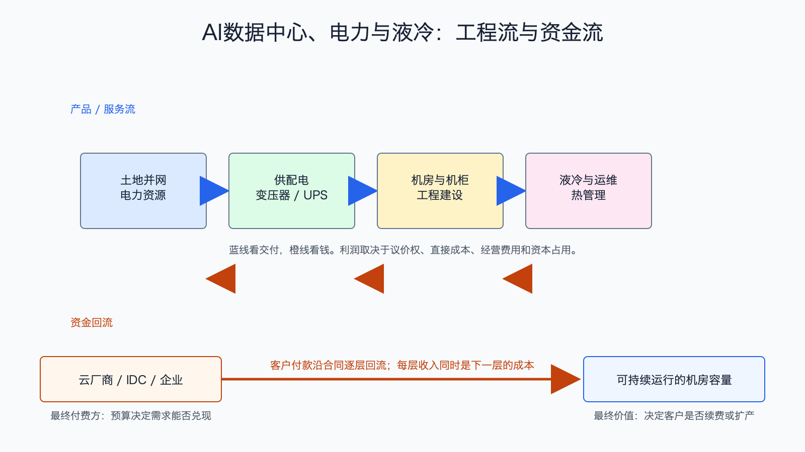

# AI数据中心、电力与液冷产业链

数据日期：IEA 2025 年基准与 2030 年预测；公司数据为 2026 年第一季度
最新核验日期：2026-07-15
用途：投资研究，不构成买卖建议。

## 0. 子产业链边界

- 包含：土地和并网、电力接入、变压器、UPS、配电、机房、机柜、液冷、热管理、建设和运维。
- 不包含：服务器整机、GPU 小时租赁、模型 API 和应用软件。
- 主要付费方：云厂商、算力运营商、IDC、政府和大型企业。
- 收入确认位置：设备商按交付确认，工程商按进度或验收确认，IDC 按机柜、电量或容量租赁确认。
- 经济模型：混合型：设备为制造型，建设为项目型，IDC 为资产运营型。

## 1. 产业链路图

原来的瓶颈仪表盘仍有用，但它回答的是“哪里卡住”，不是“谁向谁买东西”。这张链路图补上交易关系：客户先获得土地和电力，采购供配电设备并建设机房，再用液冷和运维保证服务器持续运行。资金从云厂商或 IDC 预算，流向电网接入、设备、工程和运维公司。

## 2. 谁付钱与价值流

AI 机柜功率密度上升后，同样面积要输送更多电并排出更多热。普通机房即使有空房间，没有足够并网容量、变压器、配电和冷却也不能放入高密度服务器。因此客户愿意为“更快上线、更高可靠性、更低停机风险”付钱，而不是只为机房面积付钱。

这也是为什么电力和液冷可能比普通土建更有利润：设备认证、可靠性、交付周期和全球服务网络构成壁垒。相反，单纯持有机房是重资产生意，折旧、电费、融资和上架率会吞掉利润；只有长期合同和高利用率才能把 EBITDA 变成自由现金流。

## 3. 节点规模

| 节点 | 公开规模锚点 | 增速/周期 | 数据日期 | 来源/证据等级 | 存疑点 |
|---|---:|---|---|---|---|
| 数据中心用电 | IEA 基准情景预计全球数据中心 2030 年用电约 945TWh，较 2024 年约翻倍 | 2024-2030 年均约 15% | 2025 报告/2030预测 | [IEA Energy and AI](https://www.iea.org/reports/energy-and-ai/energy-demand-from-ai)，B | 预测依赖效率、利用率和建设进度 |
| 供配电与热管理 | Vertiv 单季收入 26.50 亿美元 | 同比 30%，订单与产能扩张 | 2026Q1 | [Vertiv 2026Q1](https://investors.vertiv.com/news/news-details/2026/Vertiv-Reports-Strong-First-Quarter-with-Diluted-EPS-Growth-of-136-Adjusted-Diluted-EPS-Growth-of-83-Raises-Full-Year-Guidance/default.aspx)，A | 公司业务含非 AI 数据中心 |
| 机房建设与 IDC | Equinix 2026Q1 收入 24.44 亿美元、调整后 EBITDA 12.45 亿美元 | 建设高峰，但区域电力约束分化 | 2026Q1 | [Equinix 2026Q1](https://investor.equinix.com/news-events/press-releases/detail/1107/equinix-reports-first-quarter-results-and-raises-full-year)，A；公司代理 | MW、机柜数和收入不可直接互换，Equinix 含非 AI 客户 |
| 液冷 | 缺口:N4 | 从试点向规模交付 | 截至 2026-07-15 | 设备商和项目口径，B/C | 厂商常把风冷和液冷合并披露 |

这张节点规模表怎么读：先看公开锚点究竟是行业总量、公司收入还是运营代理，三者不能直接相加。它重要，是因为节点规模决定机会的上限，但大收入未必对应高利润。最容易误读的是把单家公司或总市场数字当成 AI 纯收入；投资使用时，应把规模锚点与后面的直接经济性、资本占用和证据等级一起看。

`945TWh` 是电量，不是装机功率，也不是电费收入。它说明电力系统压力会加大，但不能直接乘一个电价就当作设备市场。设备市场还取决于新增 MW、单 MW 设备价值量、改造比例和地区建设成本。

## 4. 利润分布与单位经济

| 节点/代理公司 | 收入池 | 毛利率 | 毛利池 | 经营利润/EBITDA/IRR | 资本开支/营运资金 | 自由现金流 | 估算公式/口径 | 数据日期 | 来源/证据等级 |
|---|---:|---:|---:|---:|---|---:|---|---|---|
| 供配电/热管理：Vertiv 公司代理 | 26.50 亿美元/季 | 缺口:P1 | 缺口:P1 | GAAP 经营利润 4.401 亿美元；调整后经营利润率 20.8% | 资本开支 1.126 亿美元，营运资金效率改善 | 调整后 FCF 6.528 亿美元 | FCF=经营现金流 7.668-资本开支 1.126-资本化软件 0.014 | 2026Q1 | Vertiv，A |
| 变压器、UPS和配电 | 缺口:P2 | 缺口:P2 | 缺口:P2 | 缺口:P2 | 缺口:P2 | 缺口:P2 | 必须按设备类别拆分，不能套用 Vertiv 公司整体利润率 | 2026-07-15 | B/C，估算 |
| 液冷设备与工程 | 缺口:P3 | 缺口:P3 | 缺口:P3 | 缺口:P3 | 缺口:P3 | 缺口:P3 | 区分冷板/CDU/管路/工程，避免重复计价 | 2026-07-15 | B/C，估算 |
| IDC/机房运营：Equinix 公司代理 | 24.44 亿美元/季 | 缺口:P4 | 缺口:P4 | 调整后 EBITDA 12.45 亿美元，利润率 51% | 2026 年资本开支指引约 41 亿美元，其中经常性 2.8-3.0 亿美元、扩张约 38 亿美元 | Q1 FCF -5.96 亿美元；调整后 FCF -4.73 亿美元 | EBITDA 还需扣利息、税和资本开支；单季负 FCF 主要受扩张投入影响，不能据此判断成熟资产不赚钱 | 2026Q1；资本开支为全年指引 | Equinix，A；公司整体代理 |

Vertiv 的数据说明设备商已经把需求转成经营利润和现金流，但不能用它代表所有液冷或所有数据中心。IDC 的收入可能更稳定，现金回收却更慢，因为先建资产再等客户上架。判断哪一环更好，必须把“上线速度和利用率”放在毛利之后看。

## 4.1 受控数据缺口

下表不是把缺失数据藏起来，而是说明为什么当前不能可靠量化、还能用什么指标继续判断。`缺口:ID` 不能当作零，也不能跨节点比较。

| 缺口 ID | 指标 | 已检索范围 | 无法估算原因 | 可给上下界 | 替代指标 | 决策影响 | 核验计划 |
|---|---|---|---|---|---|---|---|
| N4 | 液冷：公开规模锚点 | 已查现有公司 IR、监管/协会统计和文内来源，更新至 2026-07-15 | 公开资料未按该节点独立披露或口径不可比；原可得信息：用高功率机柜渗透率、冷却设备收入和项目数代理 | 当前不能可靠给窄区间；如有公司代理值，仅用于方向判断 | 订单、客户数、出货/使用量、收入代理和单位经济领先指标 | 不能据此比较该节点绝对价值池，只能判断商业模式、周期和可能的价值留存方向 | 下季财报、招股书、客户验收或行业统计更新时复核；出现分部披露后替换缺口 |
| P1 | 供配电/热管理：Vertiv 公司代理：毛利率、毛利池 | 已查现有公司 IR、监管/协会统计和文内来源，更新至 2026-07-15 | 公开资料未按该节点独立披露或口径不可比；原可得信息：公司毛利率需财表复核；待核验 | 当前不能可靠给窄区间；如有公司代理值，仅用于方向判断 | 订单、客户数、出货/使用量、收入代理和单位经济领先指标 | 不能据此比较该节点绝对价值池，只能判断商业模式、周期和可能的价值留存方向 | 下季财报、招股书、客户验收或行业统计更新时复核；出现分部披露后替换缺口 |
| P2 | 变压器、UPS和配电：收入池、毛利率、毛利池、经营利润/EBITDA/IRR、资本开支/营运资金、自由现金流 | 已查现有公司 IR、监管/协会统计和文内来源，更新至 2026-07-15 | 公开资料未按该节点独立披露或口径不可比；原可得信息：用新增 MW×单 MW 设备价值估收入；产品差异大；待核验；看认证、交期和售后；工厂扩产与库存占用中等；取决于预付款和回款 | 当前不能可靠给窄区间；如有公司代理值，仅用于方向判断 | 订单、客户数、出货/使用量、收入代理和单位经济领先指标 | 不能据此比较该节点绝对价值池，只能判断商业模式、周期和可能的价值留存方向 | 下季财报、招股书、客户验收或行业统计更新时复核；出现分部披露后替换缺口 |
| P3 | 液冷设备与工程：收入池、毛利率、毛利池、经营利润/EBITDA/IRR、资本开支/营运资金、自由现金流 | 已查现有公司 IR、监管/协会统计和文内来源，更新至 2026-07-15 | 公开资料未按该节点独立披露或口径不可比；原可得信息：用液冷机柜数×单柜价值量或 MW×冷却价值量；早期项目差异大；待核验；设备标准化后利润优于一次性工程；研发、产线、应收和质保占用；待核验 | 当前不能可靠给窄区间；如有公司代理值，仅用于方向判断 | 订单、客户数、出货/使用量、收入代理和单位经济领先指标 | 不能据此比较该节点绝对价值池，只能判断商业模式、周期和可能的价值留存方向 | 下季财报、招股书、客户验收或行业统计更新时复核；出现分部披露后替换缺口 |
| P4 | Equinix 公司代理：毛利率与毛利池 | 已查公司 2026Q1 财务结果和文内来源，更新至 2026-07-15 | 公司重点披露收入、调整后 EBITDA、AFFO、资本开支和 FCF，当前材料未提供可直接对应本表口径的毛利率与毛利池 | 当前不能可靠给窄区间 | 调整后 EBITDA 率、AFFO、同店收入和上架率 | 不影响判断扩张资本开支会压制短期 FCF，但限制了与设备制造商毛利池的直接比较 | 下季 10-Q 或补充财务表披露后复核 |

## 5. 利润迁移、周期与反证

短期利润更容易流向交期紧、认证难、能解决高功率密度的设备。中期如果设备供给扩张，利润会向拥有低成本电力、稀缺并网权和高上架率的运营资产迁移。若云厂选择自建设备或标准化液冷方案，部分设备溢价可能下降。

需要跟踪：全球和区域新增数据中心 MW、并网等待期、变压器交期、液冷渗透率、设备商订单/收入比、毛利率、IDC 上架率、电价、融资成本和维护性资本开支。反证是资本开支下调、在建项目延迟、订单取消、设备交期快速正常化或利用率长期不足。

## 来源

- [IEA，Energy demand from AI](https://www.iea.org/reports/energy-and-ai/energy-demand-from-ai)
- [Vertiv 2026Q1 财务结果](https://investors.vertiv.com/news/news-details/2026/Vertiv-Reports-Strong-First-Quarter-with-Diluted-EPS-Growth-of-136-Adjusted-Diluted-EPS-Growth-of-83-Raises-Full-Year-Guidance/default.aspx)
- [Equinix 2026Q1 财务结果](https://investor.equinix.com/news-events/press-releases/detail/1107/equinix-reports-first-quarter-results-and-raises-full-year)
