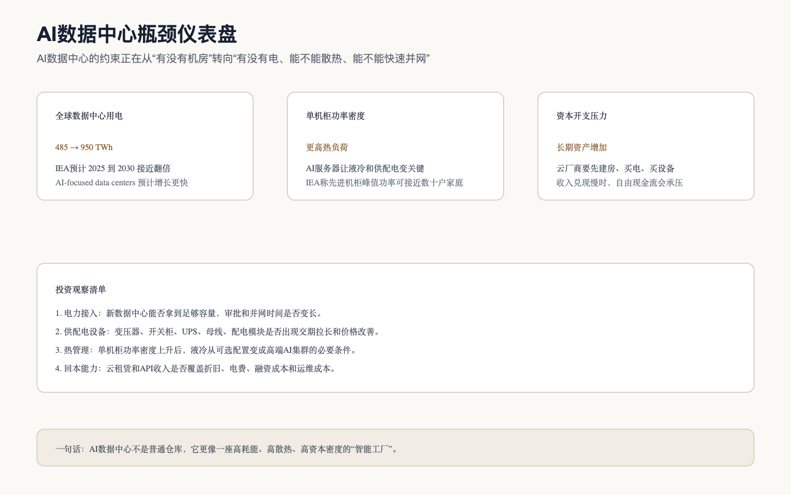

# AI数据中心、电力与液冷产业链

## 0. 这篇在讲什么

这篇讲 AI 数据中心、电力和液冷。它和传统 IDC 不完全一样，因为 AI 数据中心不是简单“放服务器的房子”，更像高功率、高散热、高资本密度的智能工厂。

普通人容易把 AI 数据中心理解成机房，但投资上要看更底层的东西：电从哪里来、能不能并网、变压器和 UPS 够不够、单机柜功率密度多高、是否必须上液冷、PUE 能不能控制、客户合同能不能覆盖折旧和电费。

## 1. 总判断

AI 数据中心已经从“算力产业的配套环节”变成“AI 扩张的硬约束”。IEA 预计全球数据中心用电会从 2025 年约 485 TWh 增至 2030 年约 950 TWh，AI-focused data centers 增速更快。这个变化说明，AI 产业链的瓶颈正在从芯片本身向电力、并网、散热和基础设施建设扩散。

为什么这件事重要？因为 AI 算力不是买到 GPU 就结束。GPU 要放进服务器，服务器要放进机柜，机柜要有足够电力和散热，数据中心要接入电网，还要保证稳定运行。任何一个环节慢下来，昂贵芯片都可能无法及时变成可售算力。

## 2. 瓶颈仪表盘

这张图的核心是：AI 数据中心的约束从“有没有机房”升级为“有没有足够电力和散热能力”。这会改变利润池。传统 IDC 主要看上架率、客户和机房位置；AI 数据中心还要看电力资源、供配电设备、液冷能力和快速交付。

## 3. 关键事实表

| 公司/机构 | 数据日期 | 事实 | 来源 | 证据等级 | 解读 |
|---|---|---|---|---|---|
| IEA | 2026 报告 | 全球数据中心用电预计从 2025 年约 485 TWh 增至 2030 年约 950 TWh；AI-focused data centers 预计增长更快 | [IEA Key questions on Energy and AI](https://www.iea.org/reports/key-questions-on-energy-and-ai/executive-summary) | B | 数据中心用电正在成为宏观电力问题，不只是科技公司问题 |
| IEA | 2026 报告 | 全球数据中心电力需求到 2030 年约 945 TWh，接近翻倍；加速服务器用电年增速约 30%，贡献接近净增量一半 | [IEA Energy demand from AI](https://www.iea.org/reports/energy-and-ai/energy-demand-from-ai) | B | AI服务器是数据中心用电增量的核心来源 |
| IEA | 2026 报告 | 到 2027 年，先进数据中心机柜的峰值功率需求可相当于约 65 户家庭；AI服务器功率密度 2020-2025 年提高约 11 倍，预计到 2027 年再提高约 4 倍 | [IEA Key questions on Energy and AI](https://www.iea.org/reports/key-questions-on-energy-and-ai/executive-summary) | B | 高功率密度会推高液冷、供配电和机柜系统价值 |
| Microsoft | 2026 财年三季度，2026-04-29 | 资本开支 319 亿美元；约三分之二是短寿命资产，主要是 GPU/CPU，其余长寿命资产支持未来 15 年以上变现 | [Microsoft FY26 Q3 Earnings Call](https://www.microsoft.com/en-us/investor/events/fy-2026/earnings-fy-2026-q3) | A | AI投资同时包含芯片和长期数据中心资产，不能只看 GPU |
| Amazon | 2026 年一季度，2026-04-29 | TTM 自由现金流降至 12 亿美元，主要因为 PPE 购买增加 593 亿美元，主要是 AI 投资 | [Amazon IR，2026-04-29](https://ir.aboutamazon.com/news-release/news-release-details/2026/Amazon-com-Announces-First-Quarter-Results/default.aspx) | A | 数据中心和 AI基础设施扩张会明显占用现金流 |
| Meta | 2026 年一季度，2026-04-29 | 资本开支含融资租赁为 198.4 亿美元；经营现金流 322.3 亿美元，自由现金流 123.9 亿美元 | [Meta IR，2026-04-29](https://investor.atmeta.com/investor-news/press-release-details/2026/Meta-Reports-First-Quarter-2026-Results/default.aspx) | A | 大型互联网公司仍有强现金流支撑 AI 投入，但资本开支强度很高 |
| Vertiv | 2026 年一季度，2026-04-22 | 净销售额 26.50 亿美元，同比增长 30%；调整后经营利润率 20.8%；上调 2026 全年指引，预计净销售额 135-140 亿美元 | [Vertiv IR，2026-04-22](https://investors.vertiv.com/news/news-details/2026/Vertiv-Reports-Strong-First-Quarter-with-Diluted-EPS-Growth-of-136-Adjusted-Diluted-EPS-Growth-of-83-Raises-Full-Year-Guidance/default.aspx) | A | 电力和热管理设备需求已经在公司财务中体现 |
| CoreWeave | 2026 年一季度，2026-05-07 | Active power 超过 1GW，contracted power 超过 3.5GW；收入 backlog 994 亿美元；净亏损 7.40 亿美元 | [CoreWeave IR，2026-05-07](https://investors.coreweave.com/news/news-details/2026/CoreWeave-Reports-Strong-First-Quarter-2026-Results/) | A | 新型 AI云扩张很快，但重资产、亏损和融资压力必须一起看 |

这张表要这样推导。IEA 的数据说明，数据中心用电已经从科技公司内部问题变成电力系统问题；Microsoft、Amazon 和 Meta 的资本开支说明，云厂商正在用真实现金建设 AI基础设施；Vertiv 的收入和利润率说明，供配电和热管理需求已经传导到设备商；CoreWeave 的 backlog 和亏损则提醒我们，算力租赁收入可以很大，但重资产回本压力也很大。

换句话说，数据中心链条的利润池不是平均分配的。能提高供电可靠性、缩短上线时间、支持高功率密度、解决液冷和热管理的环节，更容易获得溢价；单纯持有机房或靠融资快速扩张的环节，则必须用上架率、客户长约、融资成本和自由现金流来证明自己能赚钱。

## 4. 产业链节点拆解

| 节点 | 小白话解释 | 为什么 AI 会强化需求 | 主要受益方 | 风险 |
|---|---|---|---|---|
| 数据中心选址和建设 | 找地、建机房、做机电工程 | AI集群需要大规模、稳定、低延迟和高电力容量的机房 | 数据中心运营商、工程建设、机电服务 | 建设周期长、审批慢、客户集中 |
| 电网接入和并网 | 数据中心要接到足够容量的电 | 高功率机柜让单个园区用电迅速上升，电网接入可能成为上线瓶颈 | 电网、能源开发商、并网服务 | 政策、区域电价、电力短缺 |
| 变压器、开关柜、配电系统 | 把电安全稳定地送到服务器 | AI服务器功率密度高，供配电系统要升级 | 电力设备厂商 | 扩产后周期下行、原材料波动 |
| UPS 和电源模块 | 停电或波动时保护服务器 | AI服务器价值高，停机会造成巨大损失，供电可靠性更重要 | UPS、电源模块厂商 | 价格竞争、客户议价 |
| 液冷和热管理 | 把高功率芯片产生的热带走 | 风冷难以应对更高机柜功率密度，液冷从可选变成高端AI集群必需品 | 液冷系统、冷板、CDU、泵阀、冷却液 | 标准不统一、维护复杂、价格下降 |
| 机柜和母线 | 承载服务器并分配电力 | 高功率机柜需要更强结构、电力和散热设计 | 机柜、母线、连接器 | 低壁垒环节利润率受压 |
| AI云和算力租赁 | 把数据中心里的算力卖出去 | 模型公司和企业不一定自建数据中心，会租用算力 | 云厂商、NeoCloud | 利用率、融资成本、客户集中和合同续约 |

## 5. 为什么液冷会变重要

AI 芯片功耗上升后，服务器产生的热量也会上升。如果散热跟不上，芯片就不能稳定运行，甚至要降频，等于花了很多钱买高端算力却用不满。

传统风冷像用风扇吹热量，适合功率密度较低的场景；液冷更像把热量直接带走，适合高功率、高密度的 AI机柜。随着单机柜功率上升，液冷不再只是节能选项，而可能变成高端 AI数据中心上线的必要条件。

这就是为什么 Vertiv 等电力和热管理公司会被市场重新定价。它们不只是“数据中心配套”，而是在 AI算力能否真正交付中承担关键角色。

## 6. 为什么电力会变成硬约束

AI 数据中心的用电不是普通办公楼级别，而是工业级别。一个大型 AI 园区需要长期、稳定、可预测的电力供应，还需要并网、变电站、备用电源和电力调度。

如果一个地区电力容量不够，就算云厂商有钱、有 GPU、有客户，也可能无法快速上线。于是数据中心选址逻辑会改变：过去更多看网络、土地、税收和客户距离；未来还要看电力容量、电价、清洁能源、并网速度和当地政策。

这背后的投资含义是：AI 产业链的价值可能从“芯片稀缺”扩展到“电力资源稀缺”。能拿到电、能快速建设、能控制能耗和散热的公司，会比普通机房更有价值。

## 7. 行业周期与入场观察

当前 AI 数据中心、电力和液冷处在“需求强、供给加速、估值容易提前反映”的阶段。

需求强，是因为云厂商、NeoCloud 和大模型公司还在扩建算力。供给加速，是因为电力设备、液冷和数据中心企业都在扩产。估值容易提前反映，是因为市场已经知道这个方向景气，很多公司股价可能先于业绩定价。

所以入场不能只看“行业好”。更稳妥的观察清单是：

| 信号 | 偏积极 | 偏谨慎 |
|---|---|---|
| 订单和 backlog | 订单继续增长，客户分散，交付周期合理 | 订单集中在少数客户，取消或推迟迹象增加 |
| 毛利率 | 供需紧张带来毛利率改善 | 扩产后价格竞争，毛利率下滑 |
| 资本开支 | 扩产与订单匹配，资产周转可控 | 大幅扩产但客户需求不确定 |
| 自由现金流 | 经营现金流跟上收入增长 | 收入增长但现金流恶化 |
| 电网和政策 | 并网支持、能源合同明确 | 审批趋严、电价上升、公众反对 |

## 8. 本篇结论

AI 数据中心、电力和液冷是 AI 产业链里最容易被低估复杂度的部分。它表面上是“配套”，本质上是在决定算力能不能交付。

短期看，电力设备、热管理和高规格数据中心会受益于 AI 资本开支。中期看，要警惕扩产过快、客户集中、融资成本和自由现金流压力。长期看，真正有价值的不是普通机房，而是能稳定拿到电、控制能耗、支持高功率密度、快速交付并拥有优质客户合同的基础设施平台。

## 来源

- [IEA, Key questions on Energy and AI: Executive summary](https://www.iea.org/reports/key-questions-on-energy-and-ai/executive-summary)
- [IEA, Energy and AI: Energy demand from AI](https://www.iea.org/reports/energy-and-ai/energy-demand-from-ai)
- [Microsoft FY26 Q3 Earnings Call, 2026-04-29](https://www.microsoft.com/en-us/investor/events/fy-2026/earnings-fy-2026-q3)
- [Amazon Q1 2026 Results, 2026-04-29](https://ir.aboutamazon.com/news-release/news-release-details/2026/Amazon-com-Announces-First-Quarter-Results/default.aspx)
- [Meta Q1 2026 Results, 2026-04-29](https://investor.atmeta.com/investor-news/press-release-details/2026/Meta-Reports-First-Quarter-2026-Results/default.aspx)
- [Vertiv Q1 2026 Results, 2026-04-22](https://investors.vertiv.com/news/news-details/2026/Vertiv-Reports-Strong-First-Quarter-with-Diluted-EPS-Growth-of-136-Adjusted-Diluted-EPS-Growth-of-83-Raises-Full-Year-Guidance/default.aspx)
- [CoreWeave Q1 2026 Results, 2026-05-07](https://investors.coreweave.com/news/news-details/2026/CoreWeave-Reports-Strong-First-Quarter-2026-Results/)
