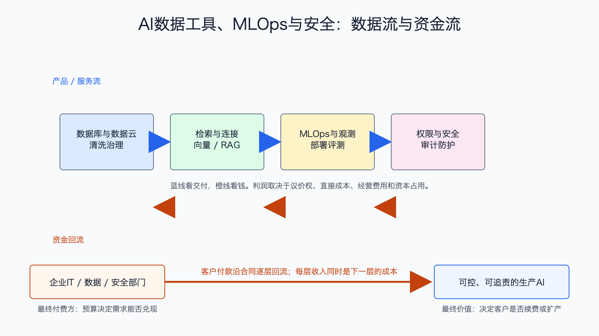

# AI数据工具、MLOps与安全产业链

数据日期：2026 年第一季度最新公司披露
最新核验日期：2026-07-15
用途：投资研究，不构成买卖建议。

## 0. 子产业链边界

- 包含：数据库、数据云、数据治理、向量检索/RAG、模型开发运维、观测评测、权限和安全。
- 不包含：基础模型 API 本身和最终业务应用席位。
- 主要付费方：企业 IT、数据、安全、研发和合规部门。
- 收入确认位置：订阅、用量或平台合同；部分实施服务另行确认。
- 经济模型：订阅与用量型。

## 1. 产业链路图

原控制面图解释了技术层次，这张图补上商业链：企业先把数据治理到可用状态，再让模型检索和连接工具，通过 MLOps 部署、评测和观测，最后用权限、安全和审计限制 Agent 的行为。企业真正购买的是“AI 能稳定上线且出事可追责”。

## 2. 谁付钱与价值流

这条链的底层 why 是企业数据不能直接扔给模型。数据分散、口径冲突、权限复杂，模型还会出错；Agent 一旦能执行操作，错误和攻击的损失更大。因此企业愿意为可靠性、可观测性和合规付费。已有数据入口和安全平台更容易交叉销售，因为迁移成本高、上下文积累深。

## 3. 节点规模

| 节点 | 公开规模锚点 | 增速/周期 | 数据日期 | 来源/证据等级 | 存疑点 |
|---|---:|---|---|---|---|
| 观测与 AI 运维 | Datadog 单季收入 10.06 亿美元，约 4550 个年化收入超 10 万美元客户 | 收入同比 32% | 2026Q1 | [Datadog 2026Q1](https://investors.datadoghq.com/news-releases/news-release-details/datadog-announces-first-quarter-2026-financial-results)，A | 公司收入含传统云观测和安全 |
| 数据云与治理 | Snowflake 最新季度收入约 13.9 亿美元（公司口径） | 企业数据与 AI 用量扩散 | FY2027Q1 | [Snowflake IR](https://investors.snowflake.com/)，A/B | AI 直接收入未单列 |
| 端点/云安全 | CrowdStrike ARR 约 55 亿美元级别（公司最新披露） | 平台整合和 AI 安全增购 | FY2027Q1 | [CrowdStrike IR](https://ir.crowdstrike.com/)，A/B | AI 安全增量与原安全预算难拆 |
| MLOps、评测与连接器 | 缺口:N4 | 需求上升但商品化风险高 | 2026-07-15 | 公司与开源生态，B/C | 行业收入池缺少统一口径 |

这张节点规模表怎么读：先看公开锚点究竟是行业总量、公司收入还是运营代理，三者不能直接相加。它重要，是因为节点规模决定机会的上限，但大收入未必对应高利润。最容易误读的是把单家公司或总市场数字当成 AI 纯收入；投资使用时，应把规模锚点与后面的直接经济性、资本占用和证据等级一起看。

## 4. 利润分布与单位经济

| 节点/代理公司 | 收入池 | 毛利率 | 毛利池 | 经营利润/EBITDA/IRR | 资本开支/营运资金 | 自由现金流 | 估算公式/口径 | 数据日期 | 来源/证据等级 |
|---|---:|---:|---:|---:|---|---:|---|---|---|
| 观测平台：Datadog | 10.064 亿美元/季 | GAAP 79% | 7.972 亿美元 | GAAP 经营利润 0.073 亿美元；非 GAAP 2.23 亿美元 | 资本支出 0.114 亿美元，资本化软件 0.342 亿美元 | 2.89 亿美元 | FCF=经营现金流 3.346-资本支出0.114-资本化软件0.342 | 2026Q1 | Datadog，A |
| 数据云：Snowflake 公司代理 | 公司收入约 13.9 亿美元/季 | 产品毛利率 71% | 产品毛利 9.475 亿美元 | FY2027 非 GAAP 经营利润率指引 13.5%，不是 Q1 实际值 | 缺口:P2 | FY2027 调整后 FCF 率指引 23%，不是 Q1 实际值 | 收入、产品毛利为季度实际；利润率和 FCF 为全年指引，不能混成同一季度利润 | FY2027Q1；指引为 FY2027 | Snowflake，A |
| 安全平台：CrowdStrike 公司代理 | 总收入 13.856 亿美元/季；订阅收入 13.209 亿美元 | 订阅毛利率 78% | 公司总毛利 10.324 亿美元 | GAAP 经营亏损 0.306 亿美元；非 GAAP 经营利润 3.257 亿美元 | 资本开支约 1.202 亿美元，含固定资产与资本化软件 | FCF 4.685 亿美元 | ARR 不能当收入；毛利率为订阅口径，毛利为公司整体，GAAP 与非 GAAP 必须并列 | FY2027Q1 | CrowdStrike，A |
| 单点 MLOps/评测工具 | 缺口:P4 | 缺口:P4 | 缺口:P4 | 缺口:P4 | 缺口:P4 | 缺口:P4 | 收入=客户数×客单价或用量；扣模型/云成本、销售和研发 | 2026-07-15 | C，存疑 |

Datadog 展示了典型软件利润结构：79% 毛利很高，但大量研发和销售费用让 GAAP 经营利润率只有约 1%；与此同时，订阅预收和较低资本开支又能带来 2.89 亿美元自由现金流。因此评价软件不能只看毛利，也要同时看股权激励、销售效率和现金回款。

## 4.1 受控数据缺口

下表不是把缺失数据藏起来，而是说明为什么当前不能可靠量化、还能用什么指标继续判断。`缺口:ID` 不能当作零，也不能跨节点比较。

| 缺口 ID | 指标 | 已检索范围 | 无法估算原因 | 可给上下界 | 替代指标 | 决策影响 | 核验计划 |
|---|---|---|---|---|---|---|---|
| N4 | MLOps、评测与连接器：公开规模锚点 | 已查现有公司 IR、监管/协会统计和文内来源，更新至 2026-07-15 | 公开资料未按该节点独立披露或口径不可比；原可得信息：公开独立公司和开源项目较多 | 当前不能可靠给窄区间；如有公司代理值，仅用于方向判断 | 订单、客户数、出货/使用量、收入代理和单位经济领先指标 | 不能据此比较该节点绝对价值池，只能判断商业模式、周期和可能的价值留存方向 | 下季财报、招股书、客户验收或行业统计更新时复核；出现分部披露后替换缺口 |
| P2 | Snowflake 公司代理：季度资本开支/营运资金 | 已查 FY2027Q1 财务结果页面和文内来源，更新至 2026-07-15 | 当前引用材料未提供与本表口径一致、可直接复核的季度资本开支；全年 FCF 指引也不能替代季度资本占用 | 当前不能可靠给窄区间 | 经营现金流、合同负债、云基础设施承诺和后续 10-Q 资本开支 | 限制了对季度现金转换的精确比较，但不影响识别订阅高毛利与销售研发投入的结构 | 后续 10-Q 或下季现金流披露后补齐 |
| P4 | 单点 MLOps/评测工具：收入池、毛利率、毛利池、经营利润/EBITDA/IRR、资本开支/营运资金、自由现金流 | 已查现有公司 IR、监管/协会统计和文内来源，更新至 2026-07-15 | 公开资料未按该节点独立披露或口径不可比；原可得信息：统一收入池缺失；早期可能高毛利；待核验；获客和研发费用高，经营利润未稳；云成本、研发和销售占用；多数待验证 | 当前不能可靠给窄区间；如有公司代理值，仅用于方向判断 | 订单、客户数、出货/使用量、收入代理和单位经济领先指标 | 不能据此比较该节点绝对价值池，只能判断商业模式、周期和可能的价值留存方向 | 下季财报、招股书、客户验收或行业统计更新时复核；出现分部披露后替换缺口 |

## 5. 利润迁移、周期与反证

利润更可能留在掌握企业数据入口、权限体系和跨产品平台的公司。单点工具若没有数据或分发壁垒，容易被云厂、模型平台或开源项目内置。安全需求会随 Agent 权限扩大而上升，但预算并非无限，客户可能优先把功能并入已有平台。

跟踪净收入留存、用量增长、百万美元大客户、AI 产品增购、GAAP 经营利润率、股权激励占收入、自由现金流率和云厂内置功能。若客户只试用不扩容、开源替代加快或销售费用长期快于收入，利润池判断需要下调。

## 来源

- [Datadog 2026Q1](https://investors.datadoghq.com/news-releases/news-release-details/datadog-announces-first-quarter-2026-financial-results)
- [Snowflake 投资者关系](https://investors.snowflake.com/)
- [CrowdStrike 投资者关系](https://ir.crowdstrike.com/)
- [Snowflake FY2027Q1 财务结果](https://investors.snowflake.com/financials/quarterly-results/default.aspx)
- [CrowdStrike FY2027Q1 财务结果](https://ir.crowdstrike.com/news-releases/news-release-details/crowdstrike-reports-first-quarter-fiscal-year-2027)
