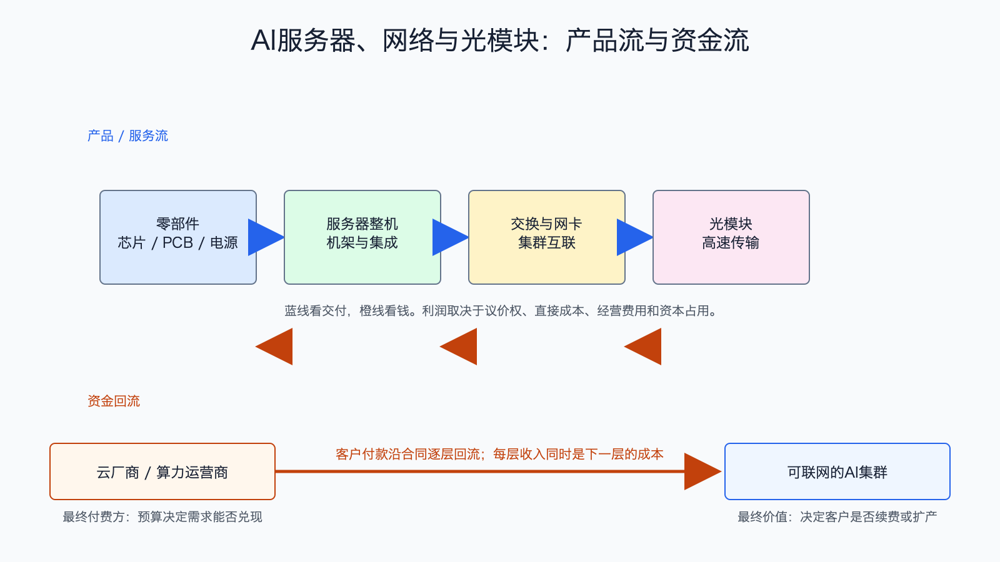

# AI服务器、网络与光模块产业链

数据日期：2026 年第一季度或各公司最近财季
最新核验日期：2026-07-15
用途：投资研究，不构成买卖建议。

## 0. 子产业链边界

- 包含：AI 服务器整机、机架集成、交换机、网卡、光模块、PCB、电源和集群交付。
- 不包含：芯片设计、晶圆制造、机房供电和算力租赁。
- 主要付费方：云厂商、NeoCloud、企业和政府算力项目。
- 收入确认位置：设备发货或系统验收；整机收入通常包含昂贵芯片成本，所以大收入不自动等于厚利润。
- 经济模型：混合型：服务器/光模块为制造型，网络软件含订阅与许可。

## 1. 产业链路图

服务器把芯片变成可交付设备，网络和光模块再把成千上万台服务器连成一个集群。模型训练时，任何一台机器等待数据，昂贵 GPU 就会闲置，因此高速网络不是装饰件，而是决定整个集群利用率的关键部件。

## 2. 谁付钱与价值流

客户买的不是铁盒子，而是“按时上线并达到吞吐目标的集群”。整机厂负责供应链、散热、电源、固件和交付，网络厂商负责低延迟互连。整机厂收入很大，因为账面收入包含 GPU；但 GPU 成本也很大，整机厂只能在集成、供应链效率和服务上赚取较薄价差。高端交换芯片、网络操作系统和光互连更能直接影响系统性能，利润率通常更高。

## 3. 节点规模

| 节点 | 公开规模锚点 | 增速/周期 | 数据日期 | 来源/证据等级 | 存疑点 |
|---|---:|---|---|---|---|
| AI服务器整机 | Dell 单季 AI 服务器收入 161 亿美元、订单 244 亿美元，FY27 收入预期 600 亿美元 | 订单兑现期 | 截至 2026-05-01 | [Dell FY2027 Q1](https://investors.delltechnologies.com/static-files/ef369f17-2b83-4fd4-9a37-6b6ab53ac9c5)，A | 单家公司代理，不能等同全球市场 |
| 数据中心网络 | NVIDIA 单季 Data Center networking 收入 148 亿美元 | 同比 199%，高速扩张 | 2026-04-26 | [NVIDIA FY2027 Q1](https://nvidianews.nvidia.com/news/nvidia-announces-financial-results-for-first-quarter-fiscal-2027)，A | 含多类网络产品 |
| 交换机与网络软件 | Arista 单季收入 27.09 亿美元 | 同比 35.1% | 2026Q1 | [Arista 2026Q1](https://investors.arista.com/Communications/Press-Releases-and-Events/Press-Release-Detail/2026/Arista-Networks-Inc--Reports-First-Quarter-2026-Financial-Results/default.aspx)，A | 公司收入含非 AI 云网络 |
| 光模块、PCB与电源 | 缺口:N4 | 800G/1.6T 与高层 PCB 升级期 | 截至 2026-07-15 | 公司公告与行业机构，B/C | 统一收入池和 AI 纯度不足 |

这张节点规模表怎么读：先看公开锚点究竟是行业总量、公司收入还是运营代理，三者不能直接相加。它重要，是因为节点规模决定机会的上限，但大收入未必对应高利润。最容易误读的是把单家公司或总市场数字当成 AI 纯收入；投资使用时，应把规模锚点与后面的直接经济性、资本占用和证据等级一起看。

## 4. 利润分布与单位经济

| 节点/代理公司 | 收入池 | 毛利率 | 毛利池 | 经营利润/EBITDA/IRR | 资本开支/营运资金 | 自由现金流 | 估算公式/口径 | 数据日期 | 来源/证据等级 |
|---|---:|---:|---:|---:|---|---:|---|---|---|
| AI服务器：Dell 公司代理 | 公司收入 438 亿美元/季；AI服务器 161 亿美元 | 缺口:P1 | 缺口:P1 | 缺口:P1 | 存货、应收和芯片预付款占用显著；资本及软件支出 9.63 亿美元 | 公司 FCF 31.18 亿美元 | 公司 FCF=经营现金流 40.81-资本及软件支出 9.63；不能归因全部 AI | 截至 2026-05-01 | Dell，A |
| 云网络：Arista 公司代理 | 27.09 亿美元/季 | GAAP 61.9% | 16.77 亿美元 | GAAP 经营利润 11.58 亿美元，经营利润率 42.7% | 缺口:P2 | 经营现金流 16.9 亿美元；FCF待扣资本开支 | 毛利池和经营利润为公司整体代理 | 2026Q1 | Arista，A |
| 高速光模块 | 缺口:P3 | 缺口:P3 | 缺口:P3 | 缺口:P3 | 缺口:P3 | 缺口:P3 | 用出货量×ASP，再扣良率损失和资本开支；不能用峰值 ASP 外推 | 2026-07-15 | B/C，存疑 |
| PCB、电源和机架 | 缺口:P4 | 缺口:P4 | 缺口:P4 | 缺口:P4 | 缺口:P4 | 缺口:P4 | 用单机价值量×服务器出货，毛利随利用率和材料价格变化 | 2026-07-15 | B/C，存疑 |

这张表解释了为什么“服务器卖得多”不等于“服务器厂最赚钱”。Dell 的 AI 服务器收入巨大，但整机账面收入包含上游芯片；Arista 收入小得多，毛利率和经营利润率却更高，因为网络软件、系统设计和客户切换成本能留下更多价值。光模块可能在技术升级早期享受溢价，但 ASP 下行和产能扩张会让利润周期更剧烈。

## 4.1 受控数据缺口

下表不是把缺失数据藏起来，而是说明为什么当前不能可靠量化、还能用什么指标继续判断。`缺口:ID` 不能当作零，也不能跨节点比较。

| 缺口 ID | 指标 | 已检索范围 | 无法估算原因 | 可给上下界 | 替代指标 | 决策影响 | 核验计划 |
|---|---|---|---|---|---|---|---|
| N4 | 光模块、PCB与电源：公开规模锚点 | 已查现有公司 IR、监管/协会统计和文内来源，更新至 2026-07-15 | 公开资料未按该节点独立披露或口径不可比；原可得信息：需求由交换速率、机柜功率和服务器出货驱动 | 当前不能可靠给窄区间；如有公司代理值，仅用于方向判断 | 订单、客户数、出货/使用量、收入代理和单位经济领先指标 | 不能据此比较该节点绝对价值池，只能判断商业模式、周期和可能的价值留存方向 | 下季财报、招股书、客户验收或行业统计更新时复核；出现分部披露后替换缺口 |
| P1 | AI服务器：Dell 公司代理：毛利率、毛利池、经营利润/EBITDA/IRR | 已查现有公司 IR、监管/协会统计和文内来源，更新至 2026-07-15 | 公开资料未按该节点独立披露或口径不可比；原可得信息：AI 分部未单列；公司/分部需另查；待核验；AI 分部经营利润未单列 | 当前不能可靠给窄区间；如有公司代理值，仅用于方向判断 | 订单、客户数、出货/使用量、收入代理和单位经济领先指标 | 不能据此比较该节点绝对价值池，只能判断商业模式、周期和可能的价值留存方向 | 下季财报、招股书、客户验收或行业统计更新时复核；出现分部披露后替换缺口 |
| P2 | 云网络：Arista 公司代理：资本开支/营运资金 | 已查现有公司 IR、监管/协会统计和文内来源，更新至 2026-07-15 | 公开资料未按该节点独立披露或口径不可比；原可得信息：轻资产但需库存与供应链承诺 | 当前不能可靠给窄区间；如有公司代理值，仅用于方向判断 | 订单、客户数、出货/使用量、收入代理和单位经济领先指标 | 不能据此比较该节点绝对价值池，只能判断商业模式、周期和可能的价值留存方向 | 下季财报、招股书、客户验收或行业统计更新时复核；出现分部披露后替换缺口 |
| P3 | 高速光模块：收入池、毛利率、毛利池、经营利润/EBITDA/IRR、资本开支/营运资金、自由现金流 | 已查现有公司 IR、监管/协会统计和文内来源，更新至 2026-07-15 | 公开资料未按该节点独立披露或口径不可比；原可得信息：收入池待核验；高端产品较高、成熟产品随价格下滑；待核验；待核验；设备、良率爬坡和存货占用中高；待核验 | 当前不能可靠给窄区间；如有公司代理值，仅用于方向判断 | 订单、客户数、出货/使用量、收入代理和单位经济领先指标 | 不能据此比较该节点绝对价值池，只能判断商业模式、周期和可能的价值留存方向 | 下季财报、招股书、客户验收或行业统计更新时复核；出现分部披露后替换缺口 |
| P4 | PCB、电源和机架：收入池、毛利率、毛利池、经营利润/EBITDA/IRR、资本开支/营运资金、自由现金流 | 已查现有公司 IR、监管/协会统计和文内来源，更新至 2026-07-15 | 公开资料未按该节点独立披露或口径不可比；原可得信息：收入随服务器放量；通常低于核心芯片与网络软件；待核验；规模制造看利用率；产线、库存和应收占用中高；周期性较强 | 当前不能可靠给窄区间；如有公司代理值，仅用于方向判断 | 订单、客户数、出货/使用量、收入代理和单位经济领先指标 | 不能据此比较该节点绝对价值池，只能判断商业模式、周期和可能的价值留存方向 | 下季财报、招股书、客户验收或行业统计更新时复核；出现分部披露后替换缺口 |

## 5. 利润迁移、周期与反证

当前处于订单快速兑现与网络升级阶段。只要集群规模继续扩大，交换机、网卡和光互连价值量可能快于单台服务器增长。利润向网络迁移的底层原因是“计算规模越大，通信复杂度上升得更快”，网络瓶颈会直接浪费 GPU 投资。

反证包括：云厂放缓资本开支、服务器库存上升、客户自研整机压价、网络架构减少光模块数量、800G/1.6T ASP 下降快于成本、整机收入增长但毛利和现金流恶化。跟踪订单、backlog、毛利率、库存天数、应收、交换速率结构和客户集中度。

## 来源

- [Dell FY2027 Q1 财务结果](https://investors.delltechnologies.com/static-files/ef369f17-2b83-4fd4-9a37-6b6ab53ac9c5)
- [Arista 2026Q1 财务结果](https://investors.arista.com/Communications/Press-Releases-and-Events/Press-Release-Detail/2026/Arista-Networks-Inc--Reports-First-Quarter-2026-Financial-Results/default.aspx)
- [NVIDIA FY2027 Q1 财务结果](https://nvidianews.nvidia.com/news/nvidia-announces-financial-results-for-first-quarter-fiscal-2027)
