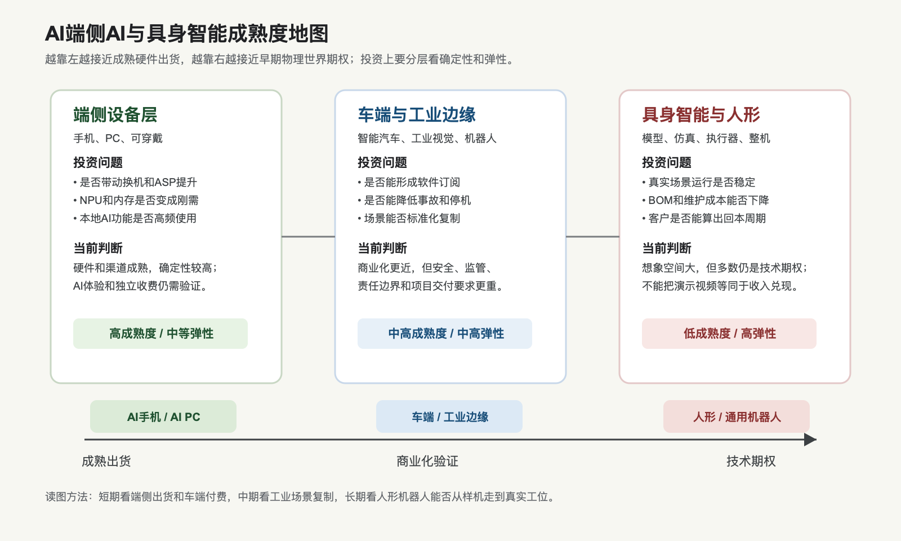

# AI端侧AI与具身智能产业链

## 0. 这篇在讲什么

这篇讲 AI 从云端走到终端和实体世界之后，会带动哪些产业链：AI手机、AI PC、车端智能、工业边缘 AI、工业机器人、人形机器人和具身智能。

用小白话说，前面几篇讲的是“云端大脑”：GPU、数据中心、模型、Agent。端侧 AI 和具身智能讲的是“把大脑装到具体东西上”：装进手机、电脑、汽车、摄像头、工厂设备和机器人。这里的投资问题不再只是“模型强不强”，而是“模型能不能在低功耗、低延迟、低成本、强安全要求的真实设备里稳定工作”。

这条链必须分层看。AI手机和 AI PC 已经有很成熟的硬件出货体系，投资上更像“换机周期 + 芯片升级 + 软件体验”的问题。车端智能已经有大量真实道路数据和商业化收费，但安全、监管和责任边界很重。工业机器人已经成熟，但 AI 化是渐进升级。人形机器人和通用具身智能想象空间最大，但仍处在早期工程化阶段，不能把演示视频直接当作收入兑现。

## 1. 总判断

截至 2026-07-03，端侧 AI 的成熟度明显高于人形机器人。AI手机、AI PC 和车端辅助驾驶已经进入真实出货和用户使用阶段；工业机器人有成熟装机基础；人形机器人处在“技术快速进步、场景试点增加、量产经济性仍待验证”的阶段。

为什么要这样判断？因为一个技术从实验室走到投资回报，中间要过几道门。

第一道门是能不能运行。手机、PC、车机里已经有 NPU、GPU、CPU、内存和操作系统，端侧模型可以先做语音、图片、摘要、翻译、搜索、相册、会议纪要和轻量 Agent。人形机器人则要同时解决视觉、语言、规划、运动控制、平衡、抓取、碰撞安全和续航，难度更高。

第二道门是能不能卖。AI手机和 AI PC 可以通过换机、ASP 提升、芯片升级和软件服务收费变现，即使 AI 功能本身短期不单独收费，也可能提高产品竞争力。机器人要卖给工厂、仓库、商超、医院或家庭，客户会问得更直接：能替代哪一步人工？每天稳定工作多久？坏了谁修？伤人谁负责？多久回本？

第三道门是能不能规模化。端侧设备一年出货量巨大，供应链和渠道成熟。机器人尤其是人形机器人，要跨过执行器、减速器、传感器、电池、安全认证、整机制造、售后和场景数据积累，规模化速度通常会慢很多。

所以这条链的投资排序不是“越科幻越好”，而是先看确定性，再看期权。确定性更高的是端侧芯片、操作系统入口、AI PC/手机换机、车端计算和工业视觉。期权更大的是人形机器人、具身智能模型、执行器、传感器和仿真训练平台。

## 2. 成熟度地图

这张图的重点是把“端侧 AI”和“具身智能”分开看。端侧 AI 更像消费电子和汽车电子的升级周期；具身智能更像一个长期工程化周期。前者看出货、价格、芯片含量和软件粘性；后者看任务成功率、可靠性、单位成本、维护体系和可复制场景。

容易误解的地方是：人形机器人视频很直观，所以市场容易把它当成马上爆发的主线。但投资上要反过来问：如果机器人只能在展示环境里完成动作，离商业价值还很远；如果它能在真实仓库、工厂、商超或医院里连续工作，并且成本低于人工或解决招工难问题，才进入真正商业化验证。

## 3. 产业链拆解

| 层级 | 小白话解释 | 关键零部件/能力 | 当前成熟度 | 投资上看什么 |
|---|---|---|---|---|
| AI手机 | 把本地语音、图片、相册、搜索、翻译、助手等能力放进手机 | SoC、NPU、DRAM、闪存、操作系统、应用生态 | 较高，硬件出货成熟，AI体验仍在迭代 | 换机周期、旗舰机占比、端侧模型体验、内存成本 |
| AI PC | 在电脑本地跑部分模型和办公/创作/会议 AI | CPU/GPU/NPU、内存、SSD、Windows/macOS、办公软件 | 较高，渠道成熟，但杀手级场景仍需验证 | 企业换机、AI软件绑定、NPU渗透、ASP |
| 可穿戴和眼镜 | 把 AI 助手、语音、视觉和轻量显示戴在身上 | 低功耗芯片、传感器、麦克风、摄像头、显示、续航 | 中早期，形态还在试 | 是否出现日常高频场景，续航和隐私能否过关 |
| 车端智能 | 让汽车具备感知、规划、辅助驾驶、座舱助手 | 车规芯片、传感器、域控制器、软件、地图/数据 | 中高，辅助驾驶商业化，完全无人化仍受监管 | 软件订阅、事故率、法规、车企采用率 |
| 工业边缘 AI | 在工厂现场做视觉检测、预测维护、机器控制 | 工业相机、边缘计算盒、PLC、传感器、工业软件 | 中高，场景明确但定制化强 | 是否能标准化复制，是否减少返工和停机 |
| 工业机器人 | 机械臂、协作机器人、AGV/AMR 等成熟自动化设备 | 本体、伺服、减速器、控制器、末端执行器 | 高，已有大规模装机基础 | 制造业资本开支、国产份额、行业周期 |
| 人形机器人 | 尝试用类似人的形态进入复杂环境 | 执行器、关节、传感器、电池、控制、模型、仿真 | 早期，试点和样机多，量产回本未定 | 任务成功率、BOM成本、量产良率、场景订单 |
| 具身智能模型/仿真 | 训练机器人理解物理世界、学习动作和任务 | 世界模型、VLA模型、合成数据、仿真平台、评测 | 早期快速发展 | 是否降低训练成本，是否提高跨场景泛化能力 |

这个表要这样读：同样叫“AI”，每个节点的商业问题完全不同。手机和 PC 的难点是用户愿不愿意因为 AI 升级设备或订阅服务；车端的难点是安全和监管；工业机器人的难点是制造业周期和项目回本；人形机器人的难点是能否从演示走向可复制的真实工位。

## 4. 关键事实表

| 公司/机构 | 数据日期 | 事实 | 来源 | 证据等级 | 投资解读 |
|---|---|---|---|---|---|
| Apple | 2026 财年二季度，季末 2026-03-28 | 季度收入 1112 亿美元，同比增长 17%；iPhone 创 March quarter 收入纪录；活跃设备安装基数创历史新高 | [Apple Newsroom，2026-04-30](https://www.apple.com/newsroom/2026/04/apple-reports-second-quarter-results/) | A | Apple 是端侧 AI 的重要入口，但财报未单独披露 AI 收入，不能把硬件增长全部归因于 AI |
| Qualcomm | 2026 财年二季度，季末 2026-03-29 | 收入 106 亿美元；QCT handset 收入 60.24 亿美元，同比下降 13%；automotive 收入 13.26 亿美元，同比增长 38%；IoT 收入 17.26 亿美元，同比增长 9% | [Qualcomm Q2 FY2026 Results](https://s204.q4cdn.com/645488518/files/doc_financials/2026/q2/FY2026-2nd-Quarter-Earnings-Release.pdf) | A | 端侧 AI 芯片不只在手机，也在车、IoT、边缘设备里扩散；但手机本身仍有周期和内存约束 |
| Gartner | 2026 年一季度 | 全球 PC 出货 6280 万台，同比增长 4%，但增长被库存前置和内存涨价预期抬高；Apple PC 出货同比增长 12.7% | [Gartner，2026-04-10](https://www.gartner.com/en/newsroom/press-releases/2026-4-10-gartner-says-worldwide-pc-shipments-increased-4-percent-in-first-quarter-of-2026) | B | AI PC 有换机逻辑，但不能只看出货增长，还要看是不是被库存和成本扰动 |
| Canalys / Omdia | 2025 报告 | Canalys 预计 2024 年 AI-capable PC 占 PC 出货 19%，到 2027 年达到 60%；到 2027 年，AI-capable PC 中 60% 发往企业 | [Omdia / Canalys，Now and Next for AI Capable PCs](https://omdia.tech.informa.com/insights/2025/now-and-next-for-ai-capable-pcs) | B/C | AI PC 的长期渗透方向明确，但预测口径要和实际企业换机、软件使用一起验证 |
| IDC | 2026 年一季度 | 全球智能手机出货 2.938 亿部，同比下降 2.9%；IDC 称主要压力来自内存供应和成本；Samsung、Apple 是前五中仅有同比增长的两家 | [IDC Smartphone Market Insights，2026-05-12](https://www.idc.com/promo/smartphone-market-share/market-share/) | B | 端侧 AI 会提高内存和芯片需求，但也会推高 BOM，低端机可能被挤压 |
| IDC 中国 | 2026 年一季度 | 中国智能手机出货约 6900 万部，同比下降 3.3%；高端需求由 Huawei 和 Apple 支撑，市场从销量增长转向利润保护 | [IDC China Smartphone Q1 2026](https://www.idc.com/resource-center/blog/china-smartphone-market-q1-2026-huawei-apple/) | B | 中国端侧 AI 机会更集中在高端机、国产生态和供应链替代，低端机受成本压力更大 |
| Counterpoint | 2026-06-22 | 预计 GenAI-capable smartphones 占 2026 年全球智能手机出货 45% | [Counterpoint Research，2026-06-22](https://counterpointresearch.com/en/insights/genai-smartphone-share-to-rise-to-45-percent-of-global-shipments-in-2026) | C | 方向性说明 AI 手机渗透快，但预测需要用实际出货和用户使用频率验证 |
| Tesla | 2026 年一季度 | FSD (Supervised) v14.3 于 2026 年 4 月推出；公司强调仍需主动驾驶监督；Robotaxi 付费里程环比接近翻倍，Austin 扩大无人监督区域并在 Dallas、Houston 推出无人监督乘车；第一代 Optimus 产线安装中 | [Tesla Q1 2026 Update](https://assets-ir.tesla.com/tesla-contents/IR/TSLA-Q1-2026-Update.pdf) | A/B | 车端智能正在商业化，但必须把“辅助驾驶/区域Robotaxi/人形机器人量产”分层看，不能混成一个确定结论 |
| IFR | 2024 年，报告发布 2025-09-25 | 2024 年全球工业机器人新增安装 54.2 万台；全球在役工业机器人 466.4 万台；中国占 2024 年新增安装 54%，在役机器人超过 200 万台 | [International Federation of Robotics，World Robotics 2025](https://ifr.org/ifr-press-releases/news/global-robot-demand-in-factories-doubles-over-10-years) | B | 机器人不是从零开始，工业机器人已有大市场；具身智能更可能先叠加到成熟工业场景 |
| NVIDIA | 2026-01-05 / 2026 财年一季度 | NVIDIA 发布 Cosmos、GR00T 等 physical AI 模型和框架；Jetson T4000 量产价 1999 美元，称性能为上一代 4 倍；2026 财年一季度 Edge Computing 收入 64 亿美元，同比增长 29% | [NVIDIA Physical AI，2026-01-05](https://investor.nvidia.com/news/press-release-details/2026/NVIDIA-Releases-New-Physical-AI-Models-as-Global-Partners-Unveil-Next-Generation-Robots/default.aspx)，[NVIDIA Q1 FY2027](https://nvidianews.nvidia.com/news/nvidia-announces-financial-results-for-first-quarter-fiscal-2027) | A | NVIDIA 把端侧、车端、机器人和 physical AI 放进 Edge Computing 逻辑，但当前收入仍主要不能拆成“人形机器人收入” |

这张表要提醒一件事：端侧 AI 有真实出货和成熟供应链，机器人也有工业机器人装机基础，但“人形机器人商业化”仍缺少足够可比的公开收入数据。因此，人形机器人更适合当作期权研究，而不是把它当成已经兑现的利润池。

## 5. 为什么端侧 AI 重要

端侧 AI 的价值来自四个字：近、快、省、稳。

“近”是因为数据就在本地设备上。手机相册、聊天记录、会议录音、办公文件、车内摄像头、工厂传感器都在终端附近。如果每次都上传到云端，不仅有隐私问题，也有带宽和延迟问题。

“快”是因为很多任务需要实时反应。车端感知、工业视觉检测、耳机降噪、摄像头识别、语音唤醒、键盘输入补全，都不能等云端慢慢返回。模型跑在本地，反应时间更短。

“省”是因为云端推理不是免费的。每一次模型调用都消耗算力、电力和网络。如果部分简单任务可以在本地完成，云端可以留给更复杂的任务。这不是说端侧会替代云，而是云端和端侧会分工。

“稳”是因为终端不能完全依赖网络。汽车、工厂、医院、安防和户外设备，都可能遇到网络不稳定。关键任务如果必须联网才可用，可靠性会打折。

这背后的投资逻辑是：端侧 AI 不一定直接创造一个新的软件收费项，但它会抬高设备性能门槛，增加 NPU、内存、存储、传感器、散热和电池需求，也可能让操作系统和应用生态变得更有粘性。

## 6. AI手机和 AI PC：不是所有换机都叫 AI 红利

AI手机和 AI PC 的好处是出货体系成熟。只要消费者或企业愿意换设备，芯片、内存、存储、屏幕、散热、结构件和操作系统生态都会受益。

但这里有一个常见误区：看到 AI手机或 AI PC 渗透率上升，就直接认为所有供应链都受益。实际要看三层。

第一层是硬件刚需。端侧模型要运行，通常需要更强 NPU、更大内存、更快存储和更好的能效。这里利好高端 SoC、内存、先进制程、封装和部分散热/电源管理环节。

第二层是软件体验。用户换 AI 设备，不是为了买一个 NPU，而是为了更好用的功能：本地总结会议、本地翻译、本地图片编辑、本地搜索、本地隐私助手、跨应用自动化。硬件能不能卖出溢价，要看这些体验是否高频、可靠、简单。

第三层是成本反噬。AI 设备更吃内存和存储，而 2026 年内存涨价已经影响 PC 和手机出货。也就是说，AI 同时创造需求和推高成本。高端品牌可能通过涨价和产品组合消化，低端品牌则可能被挤压。

所以看 AI手机/PC，不能只问“有没有 AI 功能”。更要问：它是否推动用户换机？是否提高 ASP？是否增加品牌粘性？是否带来独立订阅？成本上涨是否吃掉利润？

## 7. 车端智能：商业化更近，责任也更重

车端智能比人形机器人更接近商业化，因为汽车已经是带电、带传感器、带计算平台、带支付能力的终端。用户可以为智能座舱、高阶辅助驾驶、停车、导航、保险和车队服务付费。

但车端智能的难点也更重。原因很简单：汽车出错的代价比手机出错高得多。手机助手答错一句话，用户可能只是重新问；汽车系统判断错误，可能造成人身安全事故。所以车端 AI 的核心不是“演示能跑”，而是要证明在长尾场景里足够安全、可监管、可审计。

Tesla 的资料里有一个关键措辞：FSD (Supervised) 仍然需要主动驾驶监督，并不等于车辆已经完全自动驾驶。这一点在投资研究里必须写清楚。Robotaxi 里程增长和城市扩张是积极信号，但它仍然要接受区域、天气、道路、法规、事故责任和保险体系的验证。

车端智能的投资框架可以这样看：

1. 硬件层：车规芯片、域控制器、传感器、电源、连接器、热管理。
2. 软件层：感知、规划、地图、座舱 Agent、OTA、数据闭环。
3. 商业层：软件订阅、Robotaxi 运营、保险、车队管理。
4. 风险层：事故责任、监管审批、消费者信任、单车 BOM 成本。

## 8. 工业机器人和具身智能：先从能回本的场景开始

具身智能最容易被“人形机器人”吸引注意力，但更务实的路径可能是先在工业场景落地。原因不是人形机器人没有价值，而是工业场景更容易算账。

工厂、仓库和物流场景里，客户会关心几个具体指标：是否减少人工、是否提高良率、是否减少停机、是否提高节拍、是否能 24 小时运行、是否能降低安全事故。只要这些指标能改善，客户就能算出回本周期。

家庭人形机器人看起来市场更大，但商业化更难。家庭环境高度不标准，物品种类多，儿童和老人带来安全要求，客户付费能力和售后要求也更复杂。一个机器人如果在工厂里只负责搬箱子、拧螺丝、上下料，任务范围很窄；如果在家里要整理房间、做饭、照护老人，任务边界就大得多。

所以具身智能的合理路径可能是：

1. 先在工业视觉、质检、搬运、仓储、巡检、清洁等窄场景验证。
2. 再进入半结构化场景，比如商超、酒店、医院、实验室、农业。
3. 最后才是通用家庭助手和大规模人形机器人。

这里的底层逻辑是：场景越标准，机器人越容易替代人工；场景越开放，机器人越需要更强的泛化能力、安全能力和售后能力。

## 9. 技术成熟度与发展趋势

| 技术环节 | 当前成熟度 | 发展方向 | 为什么重要 | 反证信号 |
|---|---|---|---|---|
| 端侧 NPU / SoC | 高 | 更高 TOPS、更低功耗、更大本地模型支持 | 决定手机、PC、车、机器人能否本地运行 AI | 用户感知弱，NPU 变成营销参数 |
| 端侧内存和存储 | 高但供给紧 | 更大容量、更高带宽、更低功耗 | 端侧模型吃内存，AI设备可能提高内存配置 | 内存涨价导致低端设备出货下滑 |
| 端侧操作系统和生态 | 高 | 跨应用 Agent、本地权限、隐私计算 | 谁掌握系统入口，谁更容易把 AI 变成高频体验 | 开发者不采用，用户只偶尔使用 |
| 车端辅助驾驶 | 中高 | 从辅助驾驶到限定区域无人化 | 车端 AI 商业化路径更清楚，可按订阅和运营收费 | 事故、监管收紧、消费者信任下降 |
| 工业视觉/边缘 AI | 中高 | 从单点检测到闭环控制和预测维护 | 能直接提高良率、减少停机，ROI 更容易算 | 项目定制太重，无法标准化复制 |
| 工业机器人本体 | 高 | 协作化、柔性化、国产替代、AI控制 | 已有成熟装机，是具身智能落地底座 | 制造业资本开支下行，价格战 |
| 人形机器人本体 | 早期 | 降低 BOM、提高续航、关节可靠性、量产一致性 | 决定从样机到商品的距离 | 展示多、订单少、故障率高 |
| 具身智能模型 | 早期快速进步 | VLA、世界模型、合成数据、仿真评测 | 让机器人从“写死动作”走向“理解任务” | 跨场景泛化差，现实环境失败率高 |
| 执行器/减速器/传感器 | 中 | 高扭矩密度、低成本、长寿命、一体化关节 | 直接影响机器人成本、可靠性和运动能力 | 成本降不下来，寿命和良率不足 |

这张表的核心是：端侧 AI 的技术成熟度高，但商业增量要看用户体验；人形机器人技术成熟度低，但如果关键零部件成本下降、模型泛化能力提升，长期弹性会很大。

## 10. 价值链和利润池

端侧 AI 的利润池更可能分布在四个地方。

第一是芯片和平台。高端 SoC、车规 AI 芯片、边缘 AI 模组、机器人计算平台会受益。它们的价值来自能效、生态、工具链和客户认证，而不是单纯算力数字。

第二是操作系统和应用入口。手机、PC、汽车和企业终端的 AI 功能如果要高频使用，必须接入系统权限、文件、通知、相册、语音、日历、邮件和应用。谁掌握入口，谁更容易把 AI 变成默认体验。

第三是机器人核心零部件。执行器、减速器、伺服系统、力传感器、视觉传感器、电池和轻量化材料决定机器人能否稳定、便宜、耐用地工作。人形机器人如果爆发，零部件弹性可能很大；但如果整机量产不及预期，零部件也会跟着承压。

第四是能提供完整解决方案的系统集成商和软件平台。工业客户不只是买一台机器人，而是买“能解决某个工位问题”的方案。模型、视觉、机械、夹具、安全围栏、工艺改造、维护和培训都要一起交付。

这也解释了为什么人形机器人投资不能只看整机公司。整机公司最有故事，但也承担量产、售后和场景验证风险。某些核心零部件、仿真平台、边缘计算、工业软件和系统集成，可能更早看到订单。

## 11. 行业周期判断

端侧 AI 当前处在“渗透率提升初期”。硬件公司和操作系统公司正在把 AI 能力变成标配，PC、手机和汽车会持续推出 AI 版本。但这个阶段的核心不一定是独立 AI 收费，而是产品升级和竞争门槛抬高。

车端智能处在“区域商业化和监管验证期”。辅助驾驶和智能座舱已经商业化，Robotaxi 在部分区域试运营或扩张，但离广泛无人化仍有距离。未来 4-8 个季度重点看：付费里程、事故率、监管许可、订阅渗透率和车企采用率。

工业机器人处在“成熟周期 + AI 升级期”。全球工业机器人装机已经很大，但会受制造业资本开支周期影响。AI 会让机器人更柔性、更容易编程、更能适应复杂任务，但不会立刻改掉工业自动化的项目制特征。

人形机器人处在“技术期权期”。现在应该重点跟踪样机能力、真实订单、量产线建设、BOM 成本、核心零部件寿命、任务成功率和客户回本周期。如果只看到发布会和演示视频，而看不到真实场景运行数据，投资上要保持谨慎。

## 12. 未来 4-8 个季度跟踪指标

| 跟踪项 | 为什么重要 | 好信号 | 坏信号 |
|---|---|---|---|
| AI手机/AI PC 出货和 ASP | 判断端侧 AI 是否带动换机和高端化 | 高端机占比提升，AI功能成为购买理由，ASP 稳定或提升 | 只有概念营销，出货靠渠道压货，低端市场被内存涨价拖累 |
| NPU 使用率和本地功能频次 | 判断硬件升级是否被用户真正使用 | 会议、相册、搜索、翻译、办公等高频本地 AI 使用增长 | 用户关掉功能，开发者不接入 |
| 车端软件订阅 | 判断车端 AI 能否持续收费 | FSD/高阶智驾订阅渗透率提高，事故率可控，监管扩大 | 事故、退订、监管收紧、价格下调 |
| 工业机器人订单 | 判断制造业自动化周期 | 订单增长、国产份额提升、电子/新能源/金属机械需求强 | 制造业 capex 下行，价格战，回款差 |
| 人形机器人真实场景运行小时数 | 比演示视频更接近商业化 | 连续运行、故障率下降、客户复购、明确回本周期 | 只能短时演示，无法标准化部署 |
| 执行器和传感器成本 | 决定整机能否降价 | 单位成本下降，寿命提升，供应链稳定 | 成本高、良率差、维护频繁 |
| 仿真和数据闭环 | 决定机器人能否快速学习 | 合成数据、仿真评测、现实数据回流形成闭环 | 模型在真实环境泛化差 |

## 13. 存疑点

### 存疑点：AI手机和 AI PC 到底是换机驱动，还是营销标签

- 已证实：AI-capable PC 和 GenAI smartphone 的渗透率预测在上升，Apple、Qualcomm、PC/手机研究机构都显示端侧硬件升级趋势明显。
- 存疑或证据不足：用户是否会因为端侧 AI 功能显著加快换机，以及是否愿意为 AI 功能单独付费，公开证据仍不充分。
- 为什么重要：如果只是硬件标配升级，供应链受益可能有限；如果形成强体验和订阅，操作系统和软件入口价值会更高。
- 暂时如何使用：把 AI手机/PC 作为“硬件升级和高端化趋势”处理，不把它直接等同于独立 AI 软件收入。
- 后续核验点：换机周期、ASP、AI功能日活、企业 AI PC 部署、AI订阅绑定率。
- 当前证据等级：B/C。

### 存疑点：人形机器人量产时间表

- 已证实：NVIDIA、Tesla、多个机器人公司都在推进 physical AI、机器人模型、边缘计算和机器人硬件；工业机器人已有大规模成熟市场。
- 存疑或证据不足：人形机器人何时能在真实工位中大规模替代人工，公开可比收入、毛利率、故障率和回本周期数据仍不足。
- 为什么重要：这决定人形机器人是未来 1-2 年的收入主线，还是 3-5 年以上的长期期权。
- 暂时如何使用：把人形机器人放在“高弹性、低确定性”篮子里，优先跟踪零部件、真实订单和运行数据。
- 后续核验点：量产交付、客户名单、运行小时、维护成本、BOM成本、事故和安全认证。
- 当前证据等级：B/C。

## 14. 本篇结论

端侧 AI 和具身智能是 AI 产业链的下一层扩散，但不能简单写成“AI 走向万物，所以都利好”。更清楚的说法是：端侧 AI 的确定性来自成熟设备出货和硬件升级；车端智能的确定性来自已有付费和数据闭环；工业机器人的确定性来自成熟自动化需求；人形机器人和通用具身智能的弹性来自未来可能打开更大物理世界任务，但兑现路径仍长。

投资上，短期更适合关注能从端侧升级中直接受益、且已有收入的环节：高端 SoC、车规计算、AI PC/手机供应链、工业视觉、工业机器人和边缘计算。中长期再跟踪人形机器人整机、执行器、传感器、仿真平台和具身智能模型。最重要的反证是：如果端侧 AI 没有提高用户使用频率和设备换机，或者人形机器人缺少真实场景订单，那么估值叙事会先于基本面回落。

## 来源

- [Apple reports second quarter results, 2026-04-30](https://www.apple.com/newsroom/2026/04/apple-reports-second-quarter-results/)
- [Qualcomm Q2 FY2026 Results, 2026-04-29](https://s204.q4cdn.com/645488518/files/doc_financials/2026/q2/FY2026-2nd-Quarter-Earnings-Release.pdf)
- [Gartner Says Worldwide PC Shipments Increased 4% in First Quarter of 2026, 2026-04-10](https://www.gartner.com/en/newsroom/press-releases/2026-4-10-gartner-says-worldwide-pc-shipments-increased-4-percent-in-first-quarter-of-2026)
- [Omdia / Canalys, Now and Next for AI Capable PCs](https://omdia.tech.informa.com/insights/2025/now-and-next-for-ai-capable-pcs)
- [IDC Smartphone Market Insights, 2026-05-12](https://www.idc.com/promo/smartphone-market-share/market-share/)
- [IDC China Smartphone Market Q1 2026, 2026-04-15](https://www.idc.com/resource-center/blog/china-smartphone-market-q1-2026-huawei-apple/)
- [Counterpoint Research, GenAI Smartphone Share to Rise to 45% of Global Shipments in 2026, 2026-06-22](https://counterpointresearch.com/en/insights/genai-smartphone-share-to-rise-to-45-percent-of-global-shipments-in-2026)
- [Tesla Q1 2026 Update](https://assets-ir.tesla.com/tesla-contents/IR/TSLA-Q1-2026-Update.pdf)
- [International Federation of Robotics, World Robotics 2025 Industrial Robots, 2025-09-25](https://ifr.org/ifr-press-releases/news/global-robot-demand-in-factories-doubles-over-10-years)
- [NVIDIA Releases New Physical AI Models as Global Partners Unveil Next-Generation Robots, 2026-01-05](https://investor.nvidia.com/news/press-release-details/2026/NVIDIA-Releases-New-Physical-AI-Models-as-Global-Partners-Unveil-Next-Generation-Robots/default.aspx)
- [NVIDIA Announces Financial Results for First Quarter Fiscal 2027, 2026-05-20](https://nvidianews.nvidia.com/news/nvidia-announces-financial-results-for-first-quarter-fiscal-2027)
