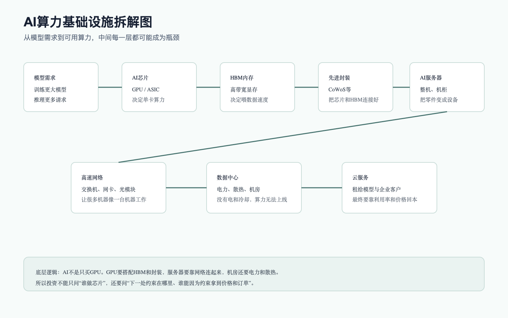

# AI算力基础设施产业链

## 0. 这篇在讲什么

这篇只讲 AI 算力基础设施：AI芯片、HBM、先进封装、AI服务器、高速网络、光模块和 AI云中的算力部分。数据中心、电力和液冷单独放在 [AI数据中心、电力与液冷产业链](AI数据中心、电力与液冷产业链.md) 里。

先用一句小白话概括：AI 算力基础设施就是“让模型跑起来的机器系统”。大模型不是写完代码就能运行，它需要大量芯片做计算，需要 HBM 这样的高带宽内存喂数据，需要先进封装把芯片和内存连起来，需要服务器承载，需要网络把很多服务器连成集群，最后还要云平台把这些算力卖给客户。

## 1. 总判断

AI 算力基础设施是当前 AI 产业链里收入兑现最明显的环节。NVIDIA、AMD、Broadcom、Dell、Arista 等公司的公开资料都说明，AI 芯片、AI服务器和网络设备仍在快速增长。

但这个环节不能简单理解成“GPU 越多越好”。底层逻辑是：AI 集群的性能取决于整个系统最短板。GPU 算力很强，但如果 HBM 不够、封装产能不够、服务器交付慢、网络带宽不够，或者数据中心上不了电，最终可用算力仍然上不去。因此，投资上要跟踪“瓶颈在移动到哪里”。

当前我更关注四个问题：

1. GPU 和 ASIC 需求是否继续超过供给？
2. HBM、先进封装和网络是否继续成为硬瓶颈？
3. 服务器整机收入高增长能否转化为利润，而不是只做低毛利集成？
4. 云厂商和 NeoCloud 的资本开支能否被算力利用率和客户收入覆盖？

## 2. 算力基础设施拆解图

这张图要表达一个核心逻辑：AI 算力不是单一零件，而是一套系统工程。买到 GPU 只是第一步，把 GPU 变成可卖给客户的稳定算力，中间还要经过 HBM、封装、服务器、网络、数据中心和云平台。

为什么这很重要？因为产业链的利润不会平均分配。越是稀缺、越难替代、越影响系统性能的环节，越容易获得利润和估值溢价。反过来，如果某个环节只是简单组装，收入可能很大，但利润率未必高。

## 3. 节点拆解

| 节点 | 小白话解释 | 主要壁垒 | 当前景气度 | 利润池判断 | 主要风险 |
|---|---|---|---|---|---|
| GPU / AI加速卡 | 做矩阵计算的核心机器，训练和推理都离不开 | 芯片架构、软件生态、供应链、客户关系 | 很强，NVIDIA 数据中心收入仍高速增长 | 当前利润池最厚 | 客户自研 ASIC、竞争、出口限制、估值过高 |
| ASIC / 定制AI芯片 | 大客户为特定模型或业务定制的芯片 | 客户绑定、芯片设计、系统协同 | 很强，Broadcom AI 半导体收入高增 | 可能成为 GPU 之外的重要利润池 | 客户集中度高，项目制波动 |
| HBM | 给 AI 芯片喂数据的高带宽显存 | 制造难度、良率、先进封装配合 | 强，IEA 提到 HBM 短缺可能延续到 2027 年底 | 供需紧时议价强 | 产能扩张后价格周期下行 |
| 先进封装 | 把芯片、HBM 等高密度连接起来 | 工艺、产能、良率、客户认证 | 强，先进封装是高端 AI芯片交付瓶颈之一 | 利润质量较好 | 扩产后供需变化、技术路线变化 |
| AI服务器 | 把芯片、内存、散热和电源装成可交付设备 | 供应链管理、客户认证、交付能力 | 很强，Dell AI服务器收入和订单高增 | 收入弹性大，但利润率要细看 | 上游芯片成本高，整机毛利被挤压 |
| 高速网络 | 把多台服务器连起来，让集群协同训练 | 交换芯片、交换机、网卡、协议、光互连 | 强，AI集群越大越依赖网络 | 网络从配套变成核心瓶颈 | 技术路线切换、云厂商自研 |
| AI云 / 算力租赁 | 把算力卖给模型公司、企业和开发者 | 资金、GPU资源、客户、运维和利用率 | 强，Oracle、CoreWeave 等订单和 RPO 高增 | 收入弹性大，但回本压力也最大 | 融资成本、客户集中、价格战、利用率不足 |

## 4. 关键事实表

| 公司/机构 | 数据日期 | 事实 | 来源 | 证据等级 | 解读 |
|---|---|---|---|---|---|
| NVIDIA | 2026 财年一季度，季末 2026-04-26 | 总收入 816 亿美元，同比增长 85%；Data Center 收入 752 亿美元，同比增长 92%；Data Center compute 收入 604 亿美元，同比增长 77%，networking 收入 148 亿美元，同比增长 199% | [NVIDIA IR，2026-05-20](https://nvidianews.nvidia.com/news/nvidia-announces-financial-results-for-first-quarter-fiscal-2027) | A | 算力芯片和网络共同增长，不是单一 GPU 故事 |
| AMD | 2026 年一季度，2026-05-06 | 收入 102.53 亿美元，同比增长 38%；Data Center 收入 58 亿美元，同比增长 57%，由 EPYC 和 Instinct GPU ramp 推动 | [AMD IR，2026-05-06](https://ir.amd.com/news-events/press-releases/detail/1284/amd-reports-first-quarter-2026-financial-results) | A | GPU 竞争者也在受益，但规模和生态仍需与 NVIDIA 区分 |
| Broadcom | 2026 财年二季度，季末 2026-05-03 | AI 半导体收入 108 亿美元，同比增长 143%；公司预计三季度 AI 半导体收入 160 亿美元，同比增长超过 200% | [Broadcom IR，2026-06-05](https://investors.broadcom.com/news-releases/news-release-details/broadcom-inc-announces-second-quarter-fiscal-year-2026-financial) | A | 定制 AI 加速器和 AI 网络是重要分支，不能只盯通用 GPU |
| TSMC | 2026 年一季度，2026-04-17 | 2026 年一季度净收入 359.0 亿美元，毛利率 66.2%，经营利润率 58.1%；二季度收入指引 390-402 亿美元 | [TSMC IR，2026-Q1](https://investor.tsmc.com/english/quarterly-results/2026/q1) | A | 先进制程和封装处于全球 AI 供应链核心位置 |
| Dell | 2027 财年一季度，2026-05-28 | AI服务器收入 161 亿美元，同比增长 757%；AI订单 244 亿美元；公司上调 FY27 AI服务器收入预期至 600 亿美元 | [Dell IR，2026-05-28](https://investors.delltechnologies.com/static-files/ef369f17-2b83-4fd4-9a37-6b6ab53ac9c5) | A | AI服务器订单兑现很快，但整机利润率仍要单独跟踪 |
| Arista | 2026 年一季度，2026-05-05 | 收入 27.09 亿美元，同比增长 35.1%；非 GAAP 经营利润率 47.8% | [Arista IR，2026-05-05](https://investors.arista.com/Communications/Press-Releases-and-Events/Press-Release-Detail/2026/Arista-Networks-Inc--Reports-First-Quarter-2026-Financial-Results/default.aspx) | A | AI集群越大，网络越重要；高毛利说明网络不是低价值配套 |
| IEA | 2026 报告 | HBM 短缺已经出现，并可能至少持续到 2027 年底；数据中心还受电力、并网、芯片、资本等约束 | [IEA Key questions on Energy and AI](https://www.iea.org/reports/key-questions-on-energy-and-ai/executive-summary) | B | 算力瓶颈已经跨出芯片本身，进入供应链和基础设施层 |

这张表不能只读成“大家都增长”。更重要的是看增长质量。NVIDIA 和 Broadcom 的 AI 半导体收入高增，说明利润池仍集中在决定系统性能的芯片和定制加速器；TSMC 的高毛利和高经营利润率说明先进制造/封装不是低价值代工；Dell 的 AI服务器收入和订单很大，但整机环节要继续看毛利率，因为上游 GPU/ASIC 成本可能吃掉大部分价值；Arista 的高经营利润率说明网络设备不是简单配件，而是大集群效率的关键环节。

所以从表里可以推出一个底层判断：AI算力链条不是“谁收入最大谁最赚钱”，而是“谁掌握瓶颈、谁更难替代、谁能让昂贵 GPU 利用率提高，谁更可能留住利润”。这也是为什么本篇把 GPU/ASIC、HBM/封装、网络放在高壁垒层，而把服务器整机单独列为“收入弹性大但利润率要细看”。

## 5. 为什么“网络”不是配角

训练大模型时，单台服务器的算力很重要，但更大的问题是很多服务器要一起工作。模型参数、梯度和数据要在服务器之间高速传输。如果网络慢，GPU 就会等待数据，昂贵芯片的利用率会下降。

所以 AI 网络的投资逻辑不是“服务器多了，顺便买交换机”。更准确的说法是：集群越大，网络越接近系统性能的决定因素。NVIDIA 把 Data Center 业务拆出 compute 和 networking，也说明市场已经开始把网络当成核心环节看。

## 6. 为什么 HBM 和先进封装重要

AI 计算不仅要算得快，还要拿得到数据。HBM 的作用就是给 AI 芯片提供高带宽内存，让芯片不会因为等数据而空转。先进封装则负责把 GPU/ASIC 和 HBM 更紧密地连接起来，让数据能以足够高的速度在芯片之间移动。

这背后的底层逻辑是“木桶效应”：如果芯片算力很强，但内存带宽跟不上，实际性能也会被卡住。如果先进封装产能不够，芯片设计得再好也无法按时交付。因此，AI 半导体投资不能只看芯片设计公司，也要看 HBM、封装、代工和设备材料。

## 7. 利润池和风险的分层

我把算力基础设施分成三类：

第一类是强壁垒环节，包括 GPU、ASIC、HBM、先进制程、先进封装和高速网络。这些环节决定系统性能，替代难度高，客户愿意为确定性交付和性能付溢价。

第二类是高收入但利润率要细看的环节，典型是 AI服务器整机。它的收入可以快速放大，因为一台 AI服务器价值很高；但如果核心价值主要被上游芯片拿走，整机厂就可能出现“收入很大、利润没有同等放大”的情况。

第三类是重资本回本环节，包括 AI云和算力租赁。它们能享受需求增长，但要先承担 GPU、服务器、数据中心和融资成本。只要利用率高、合同稳定、价格不崩，模型就好看；一旦客户放缓、价格战或融资成本上行，风险会更快暴露。

## 8. 投资跟踪清单

| 跟踪项 | 好信号 | 坏信号 |
|---|---|---|
| 龙头芯片收入和毛利 | Data Center 收入继续增长，毛利率稳定，订单能见度高 | 毛利率下降，大客户砍单，库存上升 |
| HBM 和先进封装 | 交期紧、价格强、扩产仍被需求消化 | 扩产过快、价格下滑、客户转向更便宜方案 |
| AI服务器 | 订单持续、交付顺畅、毛利率改善 | 只增长收入不增长利润，库存和应收账款异常 |
| 网络设备 | 集群规模扩大，高速交换机和光互连需求强 | 客户推迟网络升级，替代技术压价 |
| AI云 | backlog 和 RPO 兑现，利用率高，客户分散 | 客户集中、融资压力、净亏损扩大、自由现金流恶化 |

## 9. 本篇结论

AI 算力基础设施当前仍处于强景气阶段，但投资分析不能停在“AI芯片很强”。真正要看的，是整套系统的瓶颈迁移：从 GPU 到 HBM、先进封装、网络，再到电力和液冷。

短期看，基础设施链条仍是最容易看到收入兑现的地方。中期看，要防止过度资本开支带来的利用率和价格压力。长期看，算力需求能否持续，取决于云、大模型和应用能不能把这些算力转化成客户愿意持续付费的价值。

## 来源

- [NVIDIA Announces Financial Results for First Quarter Fiscal 2027, 2026-05-20](https://nvidianews.nvidia.com/news/nvidia-announces-financial-results-for-first-quarter-fiscal-2027)
- [AMD Reports First Quarter 2026 Financial Results, 2026-05-06](https://ir.amd.com/news-events/press-releases/detail/1284/amd-reports-first-quarter-2026-financial-results)
- [Broadcom Q2 FY2026 Financial Results, 2026-06-05](https://investors.broadcom.com/news-releases/news-release-details/broadcom-inc-announces-second-quarter-fiscal-year-2026-financial)
- [TSMC 2026 Q1 Quarterly Results](https://investor.tsmc.com/english/quarterly-results/2026/q1)
- [Dell Technologies FY27 Q1 Results, 2026-05-28](https://investors.delltechnologies.com/static-files/ef369f17-2b83-4fd4-9a37-6b6ab53ac9c5)
- [Arista Networks Q1 2026 Financial Results, 2026-05-05](https://investors.arista.com/Communications/Press-Releases-and-Events/Press-Release-Detail/2026/Arista-Networks-Inc--Reports-First-Quarter-2026-Financial-Results/default.aspx)
- [IEA, Key questions on Energy and AI: Executive summary](https://www.iea.org/reports/key-questions-on-energy-and-ai/executive-summary)
