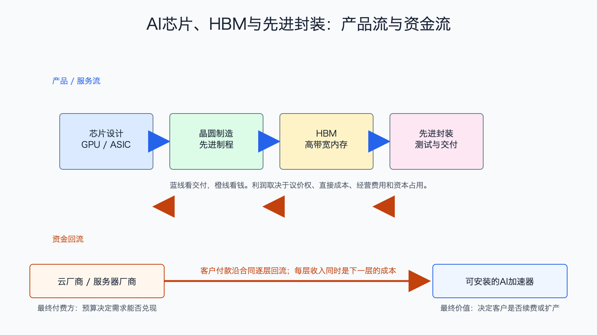

# AI芯片、HBM与先进封装产业链

数据日期：2026-04-26 至 2026-05-20 的最新季度披露；TSMC 为 2026 年一季度
最新核验日期：2026-07-15
用途：投资研究，不构成买卖建议。

## 0. 子产业链边界

- 包含：GPU 和定制 ASIC 设计、先进晶圆制造、HBM、高端封装与测试。
- 不包含：服务器整机、交换机、数据中心和算力租赁。
- 与相邻子链的接口：本链交付可安装的加速器或芯片组件，服务器厂商再把它们集成为集群。
- 主要付费方：云厂商、大型互联网公司、服务器厂商、政府和企业算力项目。
- 收入确认位置：芯片、晶圆、内存或封装交付时分别确认；这些上下游收入存在包含关系，不能直接相加当作最终市场。

小白话说，这一链解决的是“模型到底靠什么算”。GPU 或 ASIC 是计算核心，HBM 负责高速喂数据，先进制程把更多晶体管塞进芯片，先进封装把计算芯片和内存更紧密地连在一起。缺任何一项，高价芯片都可能无法交付或跑不满。

## 1. 产业链路图

蓝线是产品流：设计公司定义芯片，晶圆厂制造逻辑芯片，内存厂提供 HBM，封装测试把它们组装成交付品。橙线是资金流：服务器厂或云厂的采购款沿合同回到各供应商。最容易误读的是把所有公司的收入相加，因为晶圆、HBM 和封装本来就是加速卡成本的一部分。

## 2. 谁付钱与价值流

真正的最终预算来自云厂商和大型客户的 AI 资本开支。它们愿意付高价，不是因为“芯片先进”这句话本身，而是更快的芯片和更高带宽内存能减少训练时间、提高推理吞吐，并让昂贵机房更充分利用。只要节省的总拥有成本高于芯片溢价，供应商就有议价权。

利润不会平均分。设计平台如果掌握软硬件生态和客户迁移成本，可以获得高毛利；先进制造和封装如果产能稀缺，也能获得高利用率和较强利润；HBM 在供不应求时有溢价，但内存扩产后价格周期会反转。反证是客户自研 ASIC 加速、软件兼容性改善、先进产能转松或 HBM 供给过剩。

## 3. 节点规模

| 节点 | 公开规模锚点 | 增速/周期 | 数据日期 | 来源/证据等级 | 存疑点 |
|---|---:|---|---|---|---|
| GPU/加速计算平台 | NVIDIA 单季 Data Center 收入 752 亿美元，其中 compute 604 亿美元 | 同比 92%/77%，高景气 | 2026-04-26 | [NVIDIA FY2027 Q1](https://nvidianews.nvidia.com/news/nvidia-announces-financial-results-for-first-quarter-fiscal-2027)，A | 含网络和系统，不能等同全球 GPU TAM |
| 定制 ASIC 与 AI 网络芯片 | Broadcom 单季 AI 半导体收入 108 亿美元 | 同比 143%，客户集中但需求强 | 2026-05-03 附近财季 | [Broadcom FY2026 Q2](https://investors.broadcom.com/news-releases/news-release-details/broadcom-inc-announces-second-quarter-fiscal-year-2026-financial)，A | AI 半导体同时含定制加速器和网络，未完全拆分 |
| 先进晶圆制造 | TSMC 单季收入 359 亿美元 | 先进制程驱动，产能仍偏紧 | 2026Q1 | [TSMC 2026Q1](https://investor.tsmc.com/english/quarterly-results/2026/q1)，A | 公司收入含非 AI 业务 |
| HBM | Micron FY2026Q3 Cloud Memory 收入 137.69 亿美元；HBM4 已进入大批量出货 | 云内存收入同比约 3.1 倍，处于紧缺和扩产期 | FY2026Q3 | [Micron FY2026Q3](https://investors.micron.com/node/50671)，A | 分部还含非 HBM 云内存，不能把 137.69 亿美元全部算作 HBM |
| 先进封装与测试 | Amkor 2026Q1 收入 16.85 亿美元；TSMC 2026Q1 资本开支 111 亿美元 | Amkor 收入同比 27%，先进封装项目爬坡 | 2026Q1 | [Amkor 2026Q1](https://ir.amkor.com/news-releases/news-release-details/amkor-technology-reports-financial-results-first-quarter-2026)、[TSMC 现金流](https://investor.tsmc.com/schinese/encrypt/files/encrypt_file/qr/phase4_reports/2026-04/9f060092ba29ff3630cfdaefd67774026195e135/1Q26ManagementReport.pdf)，A | Amkor 含非 AI 封测，TSMC资本开支也含晶圆制造；公开资料未给 AI 封装独立产能 |

这张表怎么读：先看 NVIDIA、Broadcom 和 TSMC，它们证明 AI 芯片需求已进入财务报表，而不是只有概念。再看 HBM 和封装的“存疑点”，它们非常重要，但公开数据分母不统一，因此只能用产能、交期和厂商分部作代理，不能硬写一个精确全球数字。

## 4. 利润分布与单位经济

| 节点/代理公司 | 收入池 | 毛利率 | 毛利池 | 经营利润/EBITDA/IRR | 资本开支/营运资金 | 自由现金流 | 估算公式/口径 | 数据日期 | 来源/证据等级 |
|---|---:|---:|---:|---:|---|---:|---|---|---|
| GPU 平台：NVIDIA 公司代理 | 816.15 亿美元/季；Data Center 752 亿美元 | 公司 GAAP 74.9% | 公司毛利 611.57 亿美元 | 公司经营利润 535.36 亿美元 | 存货单季增加约 44.2 亿美元；购置长期资产约 17.57 亿美元 | 485.54 亿美元 | 公司整体口径，不能全部归为 GPU；FCF=经营现金流 503.44-资本及无形资产支出 17.90 | 2026-04-26 | NVIDIA，A |
| 定制 ASIC/网络：Broadcom 公司代理 | 公司 221.87 亿美元/季；AI 半导体 108 亿美元 | 公司 GAAP 69.5% | 公司 154.15 亿美元 | GAAP经营利润107.88亿美元；调整后 EBITDA 152.44 亿美元 | 资本开支 2.31 亿美元，约收入 1.0% | 102.62 亿美元 | 公司整体代理；毛利率=154.15/221.87，不能归因全部 AI 半导体 | FY2026Q2 | Broadcom，A |
| 先进制造：TSMC 公司代理 | 359 亿美元/季 | 66.2% | 约 237.7 亿美元 | 经营利润率 58.1%，约 208.6 亿美元 | 资本开支 111 亿美元；库存周转 80 天 | 3482.1 亿新台币 | 毛利池=收入×毛利率；FCF=经营现金流6989.7-资本开支3507.6亿新台币 | 2026Q1 | TSMC，A |
| HBM/云内存：Micron Cloud Memory 代理 | 137.69 亿美元/季 | 分部 83% | 约 114.28 亿美元 | 分部经营利润率 78%，约 107.40 亿美元 | 公司净资本开支 71 亿美元 | 公司调整后 FCF 183 亿美元 | 分部包含 HBM 与其他云内存；资本开支和 FCF 为公司整体代理 | FY2026Q3 | Micron，A/B |
| 先进封装：Amkor 公司代理 | 16.85 亿美元/季 | 14.2% | 2.39 亿美元 | 经营利润 1.00 亿美元，经营利润率 6.0% | 资本开支 2.25 亿美元；全年指引 25-30 亿美元 | 约 -0.80 亿美元 | 季度粗略 FCF=经营现金流1.45-资本开支2.25；公司含非 AI 封装 | 2026Q1 | Amkor，A/B |

这张表最重要的不是谁的收入最大，而是利润能不能变成现金。NVIDIA 和 Broadcom 的共同特征是设计与平台能力强、资本开支相对收入较轻，因此毛利和经营现金流能大量留下来；TSMC 同样利润率高，但必须持续投入昂贵产能。HBM 和封装即使当前紧缺，也可能在扩产后经历价格和利用率下行。

## 5. 利润迁移、周期与反证

当前利润最厚的是拥有平台生态、性能领先和稀缺产能的节点。未来 4-8 个季度，如果推理需求增长快于训练，定制 ASIC、推理优化和互连可能分走一部分新增预算；如果客户自研芯片只在内部负载成功，GPU 仍会保留通用生态优势。HBM 和封装的利润则更依赖供给扩张速度。

需要跟踪：云厂资本开支、GPU 与 ASIC 的采购比例、HBM 合同价格和库存、先进封装交期、晶圆厂利用率、龙头毛利率和自由现金流。若收入继续增长但库存、应收和资本开支增速更快，或毛利率连续回落，说明紧缺利润正在向买方迁移。

## 来源

- [NVIDIA FY2027 Q1 财务结果](https://nvidianews.nvidia.com/news/nvidia-announces-financial-results-for-first-quarter-fiscal-2027)
- [Broadcom FY2026 Q2 财务结果](https://investors.broadcom.com/news-releases/news-release-details/broadcom-inc-announces-second-quarter-fiscal-year-2026-financial)
- [TSMC 2026Q1 财务结果](https://investor.tsmc.com/english/quarterly-results/2026/q1)
- [Micron FY2026Q3 财务结果](https://investors.micron.com/node/50671)
- [Amkor 2026Q1 财务结果](https://ir.amkor.com/news-releases/news-release-details/amkor-technology-reports-financial-results-first-quarter-2026)
- [TSMC 2026Q1 现金流与资本开支](https://investor.tsmc.com/schinese/encrypt/files/encrypt_file/qr/phase4_reports/2026-04/9f060092ba29ff3630cfdaefd67774026195e135/1Q26ManagementReport.pdf)
