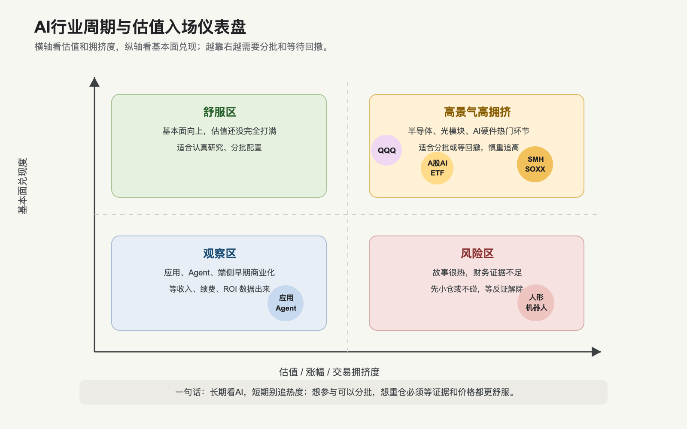

# AI行业周期、估值与入场节奏

> 文档版本：2026-07-15。A股 ETF 盘中行情已核验至 2026-07-15 09:41；海外 ETF 估值、基金持仓和费率按各表标注日期展示。盘中行情仍不是收盘确认数据，也不是实时交易信号。

## 0. 这篇在讲什么

这篇回答两个投资问题：AI 行业现在处在什么周期，相关基金/ETF 估值和交易拥挤度高不高，能不能入场。

先把结论说清楚：以本篇列出的最新经营数据、海外 ETF 估值和 2026-07-15 A股盘中快照为依据，AI 不是一个可以笼统判断“整体便宜”的行业。算力硬件和半导体 ETF 已经经历大幅上涨，估值和波动都偏高；云和模型进入收入验证期，但资本开支和自由现金流压力明显；应用和 Agent 有商业化证据，但赢家没有完全确定；端侧 AI、车端和机器人有长期空间，但成熟度差异很大。这个判断在实际交易前仍必须用当时的净值、价格、估值和盈利预期重新核验。

所以这里不能给“可以买”或“不能买”的确定性建议，也不构成个性化投资建议。更合理的研究框架是：把 AI 当成长期产业方向，但用分层、分批机制、估值纪律和反证跟踪来处理。简单说，就是看好长期不等于追高短期，产业趋势强不等于每个 ETF 和每只股票都便宜。

## 1. 行业周期仪表盘

这张图的读法很简单：越靠上，基本面兑现越强；越靠右，估值和交易拥挤越高。最舒服的投资区间通常是“基本面向上、估值还没完全打满”。现在 AI 很多硬件环节的问题是：基本面确实强，但估值和涨幅也已经很高。

这背后的底层逻辑是：市场会先给“确定性订单”高估值，再等待利润和现金流兑现。如果利润兑现跟不上估值，股价会波动；如果利润继续上修，估值可能继续被消化。投资上要跟踪的是“盈利预期上修速度”能否追上“股价上涨速度”。

## 2. 分环节周期判断

| 环节 | 当前周期位置 | 为什么这样判断 | 当前最重要的指标 | 投资含义 |
|---|---|---|---|---|
| AI芯片、HBM、先进封装、光模块 | 高景气、估值较拥挤 | NVIDIA、Broadcom、Dell、光模块链条都体现强订单，但相关 ETF 和部分个股涨幅巨大 | 云厂商 capex、芯片交期、HBM 价格、光模块毛利率 | 适合看长期，但追高风险大；更适合分批或等待回撤 |
| AI服务器、网络、PCB | 订单兑现期 | AI服务器收入、网络升级和高速 PCB 需求直接受益 | 订单、收入增速、毛利率、客户集中度 | 收入弹性强，但要防止“收入增长、利润不增长” |
| 数据中心、电力、液冷 | 建设扩张期 | 算力需求落地需要电力、机柜、温控和并网 | 上架率、电价、PUE、融资成本、自由现金流 | 长期有需求，但重资产公司要小心折旧和利用率 |
| 云和大模型 | 收入验证期 | Microsoft、Google、OpenAI、阿里、百度都披露 AI 使用和收入增长 | AI ARR、RPO、token 用量、推理成本、自由现金流 | 不是概念期了，但资本开支和价格竞争会决定利润质量 |
| 企业应用和 Agent | 早期商业化期 | Salesforce、Adobe、ServiceNow、Workday 已有 AI ARR 或使用量指标，国内披露较少 | 续费率、NRR、AI SKU、业务结果指标 | 只买“AI功能”不够，要买能进入工作流并收费的公司 |
| 端侧AI和AI PC/手机 | 渗透率提升初期 | AI-capable PC、GenAI smartphone 渗透预测上升，但用户付费仍需验证 | 换机周期、ASP、NPU使用率、内存成本 | 更像硬件升级周期，短期未必有独立 AI收入 |
| 机器人和具身智能 | 技术期权期 | 工业机器人成熟，人形机器人仍缺少大规模收入证据 | 真实运行小时、订单、BOM成本、故障率 | 长期弹性大，但应控制仓位和验证节奏 |
| 国内 AI主题 | 政策和国产替代共振期 | 人工智能+、算力统筹、国产替代推动主题热度，ETF持仓集中在硬件 | 政策落地、业绩兑现、ETF持仓集中度、交易拥挤 | 方向强，但主题 ETF 涨幅大时不宜把它当低风险资产 |

这个表要这样读：AI 行业整体仍然在成长，但不同节点的风险收益完全不同。上游硬件的好处是订单清楚，坏处是估值可能先走得太快；应用层的好处是长期利润池大，坏处是商业证据不够统一；机器人想象大，但兑现最慢。

## 3. 相关基金/ETF估值和热度

| 工具 | 覆盖范围 | 最新可核验数据 | 热度/估值判断 | 适合什么用途 | 主要风险 |
|---|---|---|---|---|---|
| SMH / VanEck Semiconductor ETF | 美股半导体，重仓 NVIDIA、台积电等 | VanEck 披露截至 2026-05-31：P/E 49.27，P/B 11.99；YTD 66.24%，1年 150.62% | 高景气、高估值、高涨幅 | 想集中押注全球半导体 AI硬件周期 | 一旦 capex 或盈利预期下修，波动会很大 |
| SOXX / iShares Semiconductor ETF | 美股半导体，30只持仓 | iShares 披露截至 2026-07-01：P/E 77.96，P/B 13.57；截至 2026-05-31，3年标准差 35.15%，Beta 2.01 | 估值更高，波动更高 | 高风险承受能力下的半导体 beta | 价格对估值压缩非常敏感 |
| QQQ / Invesco QQQ | 纳斯达克100，广义科技和 AI 龙头 | Invesco fact sheet：P/E 36.52，P/B 15.73，费用率 0.18%；官网持仓页显示 NVIDIA、Apple、Micron、Microsoft、Amazon 位列前十 | 比纯半导体更分散，但也不便宜 | 长期配置美国科技龙头，不想只押半导体 | 科技龙头集中度高，利率和估值扰动大 |
| 易方达中证人工智能主题ETF 159819 | 中证人工智能主题指数，A股 AI主题 | 易方达官网：基金规模截至 2026-07-02 为 224.41 亿元；2026Q1 前十持仓占净值 57.3%，新易盛 11.54%、中际旭创 10.54%、寒武纪 7.31%；2026-07-02 单位净值 2.0299，当日 -6.61% | 持仓集中在光模块和算力硬件，波动大 | 想用 ETF 跟踪 A股 AI主题 | 个别硬件高权重导致主题拥挤，回撤会很尖锐 |
| 华夏中证人工智能主题ETF 515070 | 中证人工智能主题指数，A股 AI主题 | 天天基金/东方财富：单位净值 2026-07-02 为 2.5672，当日 -6.60%；净资产规模 97.56 亿元，截至 2026-03-31；跟踪中证人工智能主题指数 | 与 159819 暴露类似，费用更高 | 同一指数另一只规模较大的 ETF | 与指数和热门硬件股高度相关，分散有限 |

这个表里最关键的不是“谁涨得多”，而是三个信号：

第一，半导体 ETF 的估值和涨幅已经很高。SMH 一年涨幅超过 150%，SOXX P/E 接近 78，这说明市场已经把很多好消息计入价格。不是说它一定会跌，而是说安全边际不厚。

第二，A股人工智能主题 ETF 的持仓集中度很高。159819 前十持仓占净值 57.3%，前两大新易盛和中际旭创合计超过 22%。这意味着买这个 ETF 并不是平均买一篮子 AI，而是明显买到了光模块、算力硬件和少数龙头的高权重。

第三，宽基科技 ETF 比主题 ETF 更分散，但估值也不低。QQQ 不是纯 AI，但受 NVIDIA、Microsoft、Amazon、Apple、Micron 等 AI相关公司影响很大。它更适合作为长期科技暴露，而不是短期追 AI 主题。

## 4. A股人工智能ETF同日交易口径

下面这张表专门回答“如果只通过 ETF 参与，159819 和 515070 有什么差异”。交易字段来自本项目 `akshare==1.18.64` 的 `fund_etf_spot_em()`，底层为东方财富行情接口，拉取时间为 2026-07-15 09:41（北京时间）。这是开盘后的盘中快照，不是收盘确认数据；折溢价字段和 IOPV 最终仍要以交易所、基金公司和券商终端核验。持仓和费率不是盘中字段，继续使用各自标注的 2026Q1 或基金合同口径。

| 项目 | 易方达中证人工智能主题ETF 159819 | 华夏中证人工智能主题ETF 515070 | 怎么理解 |
|---|---|---|---|
| 跟踪指数 | 中证人工智能主题指数 | 中证人工智能主题指数 | 两者底层指数相同，核心差异不在行业暴露，而在规模、费率、流动性和交易细节 |
| 最新价 | 2.032 元 | 1.286 元 | 2026-07-15 09:41 盘中价格，不等同于收盘净值；不同 ETF 的单位价格不能直接比较贵贱 |
| IOPV实时估值 | 2.0349 元 | 1.2870 元 | IOPV 是盘中估算净值，用来观察折溢价 |
| 基金折价率字段 | 0.14% | 0.08% | 两者都接近 IOPV；字段正负方向和最终折溢价以交易终端复核 |
| 成交额 | 1.25 亿元 | 0.52 亿元 | 只代表 09:41 前累计成交，不能与完整交易日成交额直接比较 |
| 换手率 | 0.53% | 0.53% | 同一时点接近，开盘阶段不足以单独判断全天拥挤度 |
| 最新份额 | 112.91 亿份 | 74.67 亿份 | 份额要结合单位净值理解，不能只按份数判断基金规模 |
| 流通市值/总市值 | 229.44 亿元 | 96.02 亿元 | 159819 规模更大，通常有利于交易流动性 |
| 管理费 + 托管费 | 0.15% + 0.05% | 0.50% + 0.10% | 159819 费率更低，长期持有成本更低 |
| 2026Q1 前十持仓占比 | 57.30% | 57.20% | 都高度集中在前十，尤其新易盛、中际旭创、寒武纪等硬件权重高 |
| 2026Q1 前两大持仓 | 新易盛 11.54%，中际旭创 10.54% | 新易盛 11.54%，中际旭创 10.54% | 买这两只 ETF，本质上都明显买到了光模块和算力硬件暴露 |

这张表给出的结论不是“选哪只”，而是说明二者暴露非常相似。若只看底层资产，它们都是中证人工智能主题指数；若看交易工具，159819 在本次盘中样本里规模、成交额和费率更有优势。但 09:41 的成交额只是早盘截面，不能代替全天流动性；具体交易仍要看当日盘口、申赎状态、个人账户费率和风险承受能力。

另外，这两只 ETF 的“AI”并不是平均分布到所有 AI 环节。它们的 2026Q1 前十大持仓里，光模块、算力硬件、AI芯片、服务器和视觉/软件公司占比较高，应用 Agent、AI云、数据工具和机器人暴露并不均衡。所以买 ETF 不是自动买到完整 AI 产业链，而是买到指数编制规则下的一篮子 A股 AI主题公司。

## 5. 现在能不能入场

如果一定要用小白话回答：可以研究分批机制，但不要把这句话理解成“现在就该买”。这里说的是研究框架，不是个性化买卖建议。

背后的原因是：AI 长期产业趋势还在，但热门环节短期涨幅和估值都不低。这个时候最危险的不是“看错 AI 长期方向”，而是“在情绪最热、估值最贵的时候一次性买进去，然后遇到正常回撤也扛不住”。

更具体地说，可以分三种情况。

第一种，长期配置型。如果投资者把 AI 当成未来多年技术主线，且能承受较大波动，研究框架上可以考虑更分散的工具和分批机制，比如宽基科技或分散型 AI主题基金。关键是不要把一次买点当成唯一正确答案。

第二种，周期交易型。如果研究目标是未来 6-12 个月景气周期，就要等待更明确的证据组合：回撤后估值下降、云厂商 capex 没有下修、龙头业绩继续超预期、盈利预测继续上调、成交情绪从极热降温。

第三种，精选个股型。如果想买 A股或港股具体公司，就不能只看“AI概念”。必须逐一核验订单、收入纯度、毛利率、客户、现金流和估值。比如光模块公司要看海外客户和 800G/1.6T 进展；服务器公司要看毛利率；软件公司要看 AI 是否真的带来订阅和续费。

## 6. 入场触发条件框架

| 触发灯 | 更舒服的信号 | 需要谨慎的信号 | 为什么 |
|---|---|---|---|
| 价格灯 | 主题 ETF 或核心持仓从高位回撤 15%-25%，但基本面没有破坏 | 一年涨幅巨大、PE/PB 高、成交火热 | 回撤不保证便宜，但能改善风险收益比 |
| 基本面灯 | 云厂商 capex 未下修，NVIDIA/Broadcom/Dell/光模块龙头业绩继续超预期 | 股价涨、盈利预期不涨、自由现金流恶化 | AI资产要靠盈利上修消化估值 |
| 流动性灯 | ETF 折溢价接近 0，成交额足够，盘口稳定 | 溢价明显、成交突然异常放大、热门资金短期拥挤 | 主题越热，买入成本和回撤风险越容易被忽略 |
| 集中度灯 | ETF 持仓集中但核心公司业绩同步兑现 | 前几大持仓估值很高，且业绩没有同步上修 | ETF 分散不等于风险分散，持仓集中会放大波动 |
| 应用灯 | 应用公司披露 AI ARR、续费率、客户扩张、ROI 数据 | 只有 AI功能发布，没有收入和续费证据 | 应用层要靠付费和留存证明价值 |
| 机器人灯 | 有真实订单、运行小时、维护成本和客户复购 | 只有演示视频和发布会 | 技术期权不能当成熟利润池 |

这个框架背后的逻辑是：投资研究不应该只由“行业好不好”决定，还要由“价格是否合理、证据是否增强、反证是否出现”决定。好行业也会有坏价格，坏买点会让好逻辑变成差体验。

## 7. 三种组合思路

### 保守型

核心用更分散的宽基科技或全球科技基金，AI主题只作为小比例卫星仓。这样做的好处是不会把风险全部压在半导体或某几个热门硬件股上。坏处是 AI上涨最猛烈时，弹性不如纯主题 ETF。

适合：承受不了大回撤，但想参与长期科技趋势的人。

### 平衡型

一部分放宽基科技，一部分放半导体或 A股人工智能主题 ETF，再留一部分现金等回撤。这样既有 AI 弹性，又不会在单一节点上过度集中。

适合：看好 AI，但知道自己不可能准确择时的人。

### 进攻型

聚焦半导体、光模块、AI服务器、国产算力或机器人等高弹性环节，同时严格设置复盘和减仓规则。这里不是看谁名字最 AI，而是看订单、盈利预测和估值弹性。

适合：能接受高波动、愿意持续跟踪财报和产业数据的人。

## 8. 反证清单

如果出现下面信号，需要重新评估 AI 资产的仓位：

1. 云厂商资本开支指引下修，或者订单/RPO 不再增长。
2. NVIDIA、Broadcom、TSMC、Dell、光模块链条等龙头业绩低于预期。
3. AI云收入增长仍快，但自由现金流持续恶化，说明回本压力变大。
4. 大模型 API 价格战明显，token 用量增长但毛利率下降。
5. 企业 Agent 只停留在试点，AI ARR、NRR、续费和业务结果指标不改善。
6. A股人工智能主题 ETF 成交极热，但持仓公司业绩没有同步上修。
7. 人形机器人产业只有发布会，没有真实订单和运行小时数据。

反证清单很重要，因为它能防止我们被叙事拖着走。产业趋势不等于永远上涨，趋势里也会有库存、估值、政策、利率和情绪周期。

## 9. 本篇结论

AI 仍然是值得长期跟踪的产业主线，但海外半导体 ETF 的最新可得估值和涨幅显示热门资产安全边际不厚；A股人工智能主题 ETF 的 2026Q1 持仓集中度也不低。2026-07-15 的盘中价格只更新了交易截面，不能单独证明估值变便宜或变贵。

更合理的研究方式不是“现在必须买”或“现在完全不能买”，而是按三件事做纪律：第一，分清楚研究对象是上游硬件、云模型、应用还是机器人；第二，看估值和涨幅是否已经透支；第三，用分批机制和反证来管理风险。

一句话：长期看 AI，短期别追热度；想参与可以分批，想重仓必须等证据和价格都更舒服。

## 来源

- [VanEck Semiconductor ETF SMH Holdings & Performance](https://www.vaneck.com/us/en/investments/semiconductor-etf-smh/)
- [iShares Semiconductor ETF SOXX Portfolio Characteristics](https://www.ishares.com/us/products/239705/ishares-phlx-semiconductor-etf)
- [Invesco QQQ ETF Fact Sheet](https://www.invesco.com/content/dam/invesco/us/en/product-documents/etf/fact-sheet/qqq-invesco-qqq-etf-fact-sheet.pdf)
- [Invesco QQQ Holdings & Sector Allocations](https://www.invesco.com/qqq-etf/en/about.html)
- [易方达中证人工智能主题ETF 159819 基金详情页](https://www.efunds.com.cn/Mobile/fund/159819.shtml)
- [天天基金：华夏中证人工智能主题ETF 515070 基金档案](https://fundf10.eastmoney.com/515070.html)
- AkShare `fund_etf_spot_em()`，底层东方财富行情数据，拉取时间 2026-07-15 09:41，北京时间；`fund_portfolio_hold_em()` 持仓口径为 2026Q1
