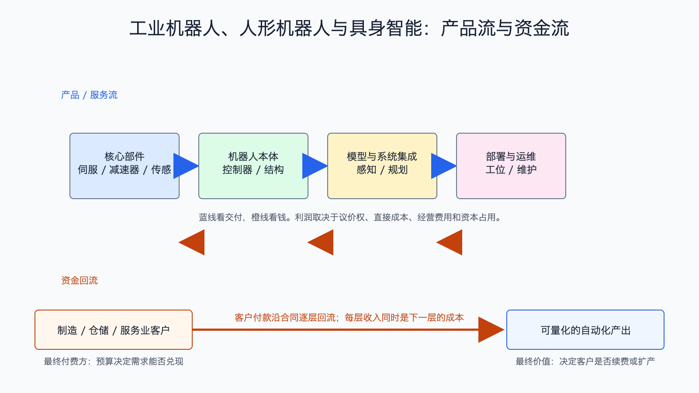

# 工业机器人、人形机器人与具身智能产业链

数据日期：工业机器人为 2024 年实际安装、2025 年发布；具身智能更新至 2026-07-15
最新核验日期：2026-07-15
用途：投资研究，不构成买卖建议。

## 0. 子产业链边界

- 包含：伺服、减速器、传感器、控制器、机器人本体、视觉/模型、系统集成、部署和运维。
- 不包含：汽车自动驾驶和纯软件 Agent。
- 主要付费方：制造、汽车、电子、仓储物流、服务业客户和科研机构。
- 收入确认位置：部件和本体交付、项目验收、软件许可或运维服务。
- 经济模型：混合型：部件和本体为制造型，集成为项目型，具身模型为研发/IP 型。

## 1. 产业链路图

工业机器人通常针对固定工位重复动作，人形和具身智能希望用更通用的身体和模型适应更多任务。后者想象空间更大，但可靠性、速度、安全、维护和成本尚未统一证明。投资研究应先问“客户在哪个工位能回本”，再问机器人是否足够通用。

## 2. 谁付钱与价值流

工厂愿意付钱，是因为机器人能减少人工、提高良率、稳定节拍或在危险环境工作。钱从客户自动化预算流向系统集成商，再流向本体和核心部件。系统集成最接近场景但人工交付重；标准部件可规模化但竞争强；本体若没有稳定订单和售后体系，演示能力很难变成现金。

## 3. 节点规模

| 节点 | 公开规模锚点 | 增速/周期 | 数据日期 | 来源/证据等级 | 存疑点 |
|---|---:|---|---|---|---|
| 工业机器人 | 2024 年全球安装 54.2 万台，连续第四年超过 50 万台；亚洲占 74% | 成熟大市场、区域分化 | 2024实际/2025发布 | [IFR World Robotics 2025](https://ifr.org/ifr-press-releases/news/global-robot-demand-in-factories-doubles-over-10-years)，B | 台数不等于收入，机型价格差异大 |
| 核心部件 | 缺口:N2 | 受制造业资本开支周期影响 | 2026-07-15 | 公司与协会口径，B/C | 人形与工业部件价值量不同 |
| 人形机器人本体 | 缺口:N3 | 导入/验证期 | 2026-07-15 | 公司公告，B/C | 预订、框架协议和量产不是同一口径 |
| 具身模型与软件 | 缺口:N4 | 技术快速迭代、商业收入弱 | 2026-07-15 | 公司与研究机构，B/C | 模型能力与客户 ROI 尚未建立统一指标 |

这张节点规模表怎么读：先看公开锚点究竟是行业总量、公司收入还是运营代理，三者不能直接相加。它重要，是因为节点规模决定机会的上限，但大收入未必对应高利润。最容易误读的是把单家公司或总市场数字当成 AI 纯收入；投资使用时，应把规模锚点与后面的直接经济性、资本占用和证据等级一起看。

## 4. 利润分布与单位经济

| 节点/代理公司 | 收入池 | 毛利率 | 毛利池 | 经营利润/EBITDA/IRR | 资本开支/营运资金 | 自由现金流 | 估算公式/口径 | 数据日期 | 来源/证据等级 |
|---|---:|---:|---:|---:|---|---:|---|---|---|
| 工业机器人本体 | 缺口:P1 | 缺口:P1 | 缺口:P1 | 缺口:P1 | 缺口:P1 | 缺口:P1 | 按地区和机型分拆，不能用全球台数乘单一价格 | 2024-2026 | B/C，估算 |
| 核心部件 | 缺口:P2 | 缺口:P2 | 缺口:P2 | 缺口:P2 | 缺口:P2 | 缺口:P2 | 减速器、伺服、传感器分别估算，避免重复 | 2026-07-15 | B/C，估算 |
| 系统集成 | 缺口:P3 | 缺口:P3 | 缺口:P3 | 缺口:P3 | 缺口:P3 | 缺口:P3 | 项目利润=合同收入-设备-人工-调试-质保；关注验收周期 | 2026-07-15 | B/C，估算 |
| 人形/具身智能 | 缺口:P4 | 缺口:P4 | 缺口:P4 | 缺口:P4 | 缺口:P4 | 缺口:P4 | 单位经济=每台售价/租金-部件-制造-部署-维护；再与替代人工价值比较 | 2026-07-15 | C，存疑 |

这张表故意保留大量“待核验”，不是少写，而是提醒工业机器人和人形机器人处在完全不同的证据阶段。工业机器人有全球安装量和成熟项目经济，人形机器人更多是试点、规划和技术演示。把两者的 54.2 万台和未来人形销量混在一起，会制造虚假的市场确定性。

## 4.1 受控数据缺口

下表不是把缺失数据藏起来，而是说明为什么当前不能可靠量化、还能用什么指标继续判断。`缺口:ID` 不能当作零，也不能跨节点比较。

| 缺口 ID | 指标 | 已检索范围 | 无法估算原因 | 可给上下界 | 替代指标 | 决策影响 | 核验计划 |
|---|---|---|---|---|---|---|---|
| N2 | 核心部件：公开规模锚点 | 已查现有公司 IR、监管/协会统计和文内来源，更新至 2026-07-15 | 公开资料未按该节点独立披露或口径不可比；原可得信息：用本体出货×单机部件价值量代理 | 当前不能可靠给窄区间；如有公司代理值，仅用于方向判断 | 订单、客户数、出货/使用量、收入代理和单位经济领先指标 | 不能据此比较该节点绝对价值池，只能判断商业模式、周期和可能的价值留存方向 | 下季财报、招股书、客户验收或行业统计更新时复核；出现分部披露后替换缺口 |
| N3 | 人形机器人本体：公开规模锚点 | 已查现有公司 IR、监管/协会统计和文内来源，更新至 2026-07-15 | 公开资料未按该节点独立披露或口径不可比；原可得信息：公开订单、交付和实际运行小时仍少 | 当前不能可靠给窄区间；如有公司代理值，仅用于方向判断 | 订单、客户数、出货/使用量、收入代理和单位经济领先指标 | 不能据此比较该节点绝对价值池，只能判断商业模式、周期和可能的价值留存方向 | 下季财报、招股书、客户验收或行业统计更新时复核；出现分部披露后替换缺口 |
| N4 | 具身模型与软件：公开规模锚点 | 已查现有公司 IR、监管/协会统计和文内来源，更新至 2026-07-15 | 公开资料未按该节点独立披露或口径不可比；原可得信息：以开发者、合作项目和付费许可代理 | 当前不能可靠给窄区间；如有公司代理值，仅用于方向判断 | 订单、客户数、出货/使用量、收入代理和单位经济领先指标 | 不能据此比较该节点绝对价值池，只能判断商业模式、周期和可能的价值留存方向 | 下季财报、招股书、客户验收或行业统计更新时复核；出现分部披露后替换缺口 |
| P1 | 工业机器人本体：收入池、毛利率、毛利池、经营利润/EBITDA/IRR、资本开支/营运资金、自由现金流 | 已查现有公司 IR、监管/协会统计和文内来源，更新至 2026-07-15 | 公开资料未按该节点独立披露或口径不可比；原可得信息：收入池=出货量×平均售价，统一公开值待核验；成熟产品受价格竞争；待核验；看规模、售后与周期；工厂、库存、渠道占用中高；周期性 | 当前不能可靠给窄区间；如有公司代理值，仅用于方向判断 | 订单、客户数、出货/使用量、收入代理和单位经济领先指标 | 不能据此比较该节点绝对价值池，只能判断商业模式、周期和可能的价值留存方向 | 下季财报、招股书、客户验收或行业统计更新时复核；出现分部披露后替换缺口 |
| P2 | 核心部件：收入池、毛利率、毛利池、经营利润/EBITDA/IRR、资本开支/营运资金、自由现金流 | 已查现有公司 IR、监管/协会统计和文内来源，更新至 2026-07-15 | 公开资料未按该节点独立披露或口径不可比；原可得信息：收入=本体出货×单机价值量；技术壁垒与国产化决定；待核验；看良率和利用率；产线与库存占用；看回款和扩产 | 当前不能可靠给窄区间；如有公司代理值，仅用于方向判断 | 订单、客户数、出货/使用量、收入代理和单位经济领先指标 | 不能据此比较该节点绝对价值池，只能判断商业模式、周期和可能的价值留存方向 | 下季财报、招股书、客户验收或行业统计更新时复核；出现分部披露后替换缺口 |
| P3 | 系统集成：收入池、毛利率、毛利池、经营利润/EBITDA/IRR、资本开支/营运资金、自由现金流 | 已查现有公司 IR、监管/协会统计和文内来源，更新至 2026-07-15 | 公开资料未按该节点独立披露或口径不可比；原可得信息：项目合同额；硬件转售毛利低，工程服务较高；待核验；人工交付限制经营利润；应收、履约和质保占用高；回款决定 | 当前不能可靠给窄区间；如有公司代理值，仅用于方向判断 | 订单、客户数、出货/使用量、收入代理和单位经济领先指标 | 不能据此比较该节点绝对价值池，只能判断商业模式、周期和可能的价值留存方向 | 下季财报、招股书、客户验收或行业统计更新时复核；出现分部披露后替换缺口 |
| P4 | 人形/具身智能：收入池、毛利率、毛利池、经营利润/EBITDA/IRR、资本开支/营运资金、自由现金流 | 已查现有公司 IR、监管/协会统计和文内来源，更新至 2026-07-15 | 公开资料未按该节点独立披露或口径不可比；原可得信息：收入池尚未形成可靠统一口径；试产毛利可能为负；待核验；多数仍在研发和试点；研发、试制、供应链资本需求高；多数预计为负 | 当前不能可靠给窄区间；如有公司代理值，仅用于方向判断 | 订单、客户数、出货/使用量、收入代理和单位经济领先指标 | 不能据此比较该节点绝对价值池，只能判断商业模式、周期和可能的价值留存方向 | 下季财报、招股书、客户验收或行业统计更新时复核；出现分部披露后替换缺口 |

## 5. 利润迁移、周期与反证

工业机器人利润在成熟部件、本体品牌、渠道服务和高复用集成方案之间分配；通用人形若真正量产，早期可能由稀缺部件受益，后期利润更可能向数据、模型、系统和运维迁移。但前提是客户总拥有成本低于人工或现有自动化方案。

跟踪真实付费订单、交付台数、连续运行小时、故障间隔、维护成本、单工位回收期、客户复购、供应商应收和库存。反证是大量框架订单不交付、试点不能扩张、维护成本高、可靠性不足或客户用更简单的专机就能解决问题。

## 来源

- [IFR World Robotics 2025](https://ifr.org/ifr-press-releases/news/global-robot-demand-in-factories-doubles-over-10-years)
- 具身智能动态以公司正式公告和客户验收为后续核验重点；截至 2026-07-15 缺少统一审计行业利润口径。