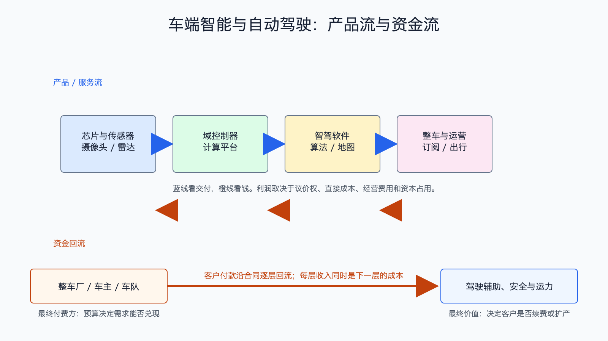

# 车端智能与自动驾驶产业链

数据日期：2026 年第一季度或最近财季
最新核验日期：2026-07-15
用途：投资研究，不构成买卖建议。

## 0. 子产业链边界

- 包含：车载芯片、摄像头/雷达、域控制器、智驾软件、整车集成、订阅和 Robotaxi 运营。
- 不包含：通用机器人、手机终端和普通汽车零部件。
- 主要付费方：整车厂、购车用户、车队和出行平台。
- 收入确认位置：芯片与传感器交付、车辆销售、软件授权/订阅或按次出行服务。
- 经济模型：混合型：芯片和整车为制造型，软件为订阅型，Robotaxi 为资产运营型。

## 1. 产业链路图

这条链比手机更复杂，因为错误会带来安全和责任成本。技术不仅要“能跑”，还要通过法规、验证和大规模真实道路检验。客户为更安全、更省力和更高运营效率付钱，但保险、冗余硬件、远程支持和事故责任也会吞掉利润。

## 2. 谁付钱与价值流

整车厂先向芯片、传感器和软件供应商付钱，再通过汽车售价、选装包和订阅向用户回收。Robotaxi 则由平台先承担车辆和运营资产，再按里程或订单收费。前者更像硬件加软件，后者更像重资产运营，不能放在同一利润率里比较。

## 3. 节点规模

| 节点 | 公开规模锚点 | 增速/周期 | 数据日期 | 来源/证据等级 | 存疑点 |
|---|---:|---|---|---|---|
| 车载芯片/平台 | Qualcomm QCT automotive 单季收入 13.26 亿美元 | 同比 38%，创季度纪录 | FY2026Q2 | [Qualcomm](https://s204.q4cdn.com/645488518/files/doc_financials/2026/q2/FY2026-2nd-Quarter-Earnings-Release.pdf)，A | 同时含座舱、连接和智驾 |
| 整车与智能软件 | Tesla 单季汽车收入 162.34 亿美元 | 同比 16%；FSD 销售和订阅增加 | 2026Q1 | [Tesla 2026Q1](https://assets-ir.tesla.com/tesla-contents/IR/TSLA-Q1-2026-Update.pdf)，A | FSD 收入未单列，整车收入不能视作智驾收入 |
| Robotaxi 运营 | 缺口:N3 | 早期商业化 | 2026Q1-Q2 | 公司和监管口径，B | 收入、事故率和远程支持成本可比性低 |
| 传感器与域控 | 缺口:N4 | 随高级功能渗透增长 | 2026-07-15 | 公司公告，B/C | 降价和集成会抵消出货增长 |

这张节点规模表怎么读：先看公开锚点究竟是行业总量、公司收入还是运营代理，三者不能直接相加。它重要，是因为节点规模决定机会的上限，但大收入未必对应高利润。最容易误读的是把单家公司或总市场数字当成 AI 纯收入；投资使用时，应把规模锚点与后面的直接经济性、资本占用和证据等级一起看。

## 4. 利润分布与单位经济

| 节点/代理公司 | 收入池 | 毛利率 | 毛利池 | 经营利润/EBITDA/IRR | 资本开支/营运资金 | 自由现金流 | 估算公式/口径 | 数据日期 | 来源/证据等级 |
|---|---:|---:|---:|---:|---|---:|---|---|---|
| 车载芯片：Qualcomm automotive | 13.26 亿美元/季 | 缺口:P1 | 缺口:P1 | QCT EBT率27%为大分部代理 | 缺口:P1 | 缺口:P1 | 不能把 QCT 整体利润率直接当汽车业务利润率 | FY2026Q2 | Qualcomm，A |
| 整车+软件：Tesla 公司代理 | 汽车收入162.34亿美元；总收入223.87亿美元 | 汽车GAAP毛利率21.1% | 汽车毛利约34.22亿美元 | 公司经营利润9.41亿美元；调整后EBITDA36.68亿美元 | 资本开支24.93亿美元 | 14.44亿美元 | 公司整体FCF=经营现金流39.37-资本开支24.93；FSD未单列 | 2026Q1 | Tesla，A |
| 智驾软件授权/订阅 | 缺口:P3 | 缺口:P3 | 缺口:P3 | 缺口:P3 | 缺口:P3 | 缺口:P3 | 订阅ARPU×付费车数-推理/运维/责任成本 | 2026-07-15 | B/C，存疑 |
| Robotaxi | 缺口:P4 | 缺口:P4 | 缺口:P4 | 缺口:P4 | 缺口:P4 | 缺口:P4 | 单车现金=营运收入-折旧/融资-能源-维护-保险-远程支持 | 2026-07-15 | C，存疑 |

## 4.1 受控数据缺口

下表不是把缺失数据藏起来，而是说明为什么当前不能可靠量化、还能用什么指标继续判断。`缺口:ID` 不能当作零，也不能跨节点比较。

| 缺口 ID | 指标 | 已检索范围 | 无法估算原因 | 可给上下界 | 替代指标 | 决策影响 | 核验计划 |
|---|---|---|---|---|---|---|---|
| N3 | Robotaxi 运营：公开规模锚点 | 已查现有公司 IR、监管/协会统计和文内来源，更新至 2026-07-15 | 公开资料未按该节点独立披露或口径不可比；原可得信息：运营区域、付费里程和单车利用率是核心规模锚点 | 当前不能可靠给窄区间；如有公司代理值，仅用于方向判断 | 订单、客户数、出货/使用量、收入代理和单位经济领先指标 | 不能据此比较该节点绝对价值池，只能判断商业模式、周期和可能的价值留存方向 | 下季财报、招股书、客户验收或行业统计更新时复核；出现分部披露后替换缺口 |
| N4 | 传感器与域控：公开规模锚点 | 已查现有公司 IR、监管/协会统计和文内来源，更新至 2026-07-15 | 公开资料未按该节点独立披露或口径不可比；原可得信息：单车价值量×搭载量代理 | 当前不能可靠给窄区间；如有公司代理值，仅用于方向判断 | 订单、客户数、出货/使用量、收入代理和单位经济领先指标 | 不能据此比较该节点绝对价值池，只能判断商业模式、周期和可能的价值留存方向 | 下季财报、招股书、客户验收或行业统计更新时复核；出现分部披露后替换缺口 |
| P1 | 车载芯片：Qualcomm automotive：毛利率、毛利池、资本开支/营运资金、自由现金流 | 已查现有公司 IR、监管/协会统计和文内来源，更新至 2026-07-15 | 公开资料未按该节点独立披露或口径不可比；原可得信息：分部未单列；待核验；研发投入高、制造外包相对轻；公司现金流代理 | 当前不能可靠给窄区间；如有公司代理值，仅用于方向判断 | 订单、客户数、出货/使用量、收入代理和单位经济领先指标 | 不能据此比较该节点绝对价值池，只能判断商业模式、周期和可能的价值留存方向 | 下季财报、招股书、客户验收或行业统计更新时复核；出现分部披露后替换缺口 |
| P3 | 智驾软件授权/订阅：收入池、毛利率、毛利池、经营利润/EBITDA/IRR、资本开支/营运资金、自由现金流 | 已查现有公司 IR、监管/协会统计和文内来源，更新至 2026-07-15 | 公开资料未按该节点独立披露或口径不可比；原可得信息：收入池待拆；理论毛利高；待核验；需扣研发、地图、验证、责任和支持；研发和数据闭环投入高；待核验 | 当前不能可靠给窄区间；如有公司代理值，仅用于方向判断 | 订单、客户数、出货/使用量、收入代理和单位经济领先指标 | 不能据此比较该节点绝对价值池，只能判断商业模式、周期和可能的价值留存方向 | 下季财报、招股书、客户验收或行业统计更新时复核；出现分部披露后替换缺口 |
| P4 | Robotaxi：收入池、毛利率、毛利池、经营利润/EBITDA/IRR、资本开支/营运资金、自由现金流 | 已查现有公司 IR、监管/协会统计和文内来源，更新至 2026-07-15 | 公开资料未按该节点独立披露或口径不可比；原可得信息：收入=付费里程×单价；毛利取决于利用率；待核验；看单车 EBITDA/IRR；车辆、充电、清洁、保险和调度重资产；早期可能为负 | 当前不能可靠给窄区间；如有公司代理值，仅用于方向判断 | 订单、客户数、出货/使用量、收入代理和单位经济领先指标 | 不能据此比较该节点绝对价值池，只能判断商业模式、周期和可能的价值留存方向 | 下季财报、招股书、客户验收或行业统计更新时复核；出现分部披露后替换缺口 |

## 5. 利润迁移、周期与反证

短期确定性较高的是车载芯片和高级功能搭载，长期利润上限更高的是软件订阅和高利用率运营。但软件要承担安全验证和责任，Robotaxi 还要证明单车收入能覆盖资产与运营成本。不能把测试里程或功能发布直接当利润。

跟踪搭载率、软件付费率、每车 ARPU、接管率和事故率、监管批准区域、单车利用率、保险与远程支持成本、整车毛利和自由现金流。反证是法规收紧、功能事故、消费者不续费或 Robotaxi 单车经济长期为负。

## 来源

- [Qualcomm FY2026Q2](https://s204.q4cdn.com/645488518/files/doc_financials/2026/q2/FY2026-2nd-Quarter-Earnings-Release.pdf)
- [Tesla 2026Q1 Update](https://assets-ir.tesla.com/tesla-contents/IR/TSLA-Q1-2026-Update.pdf)