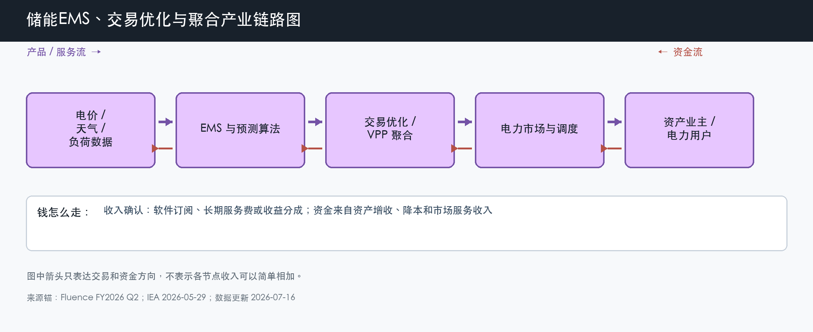

# 储能 EMS、交易优化与聚合

数据日期：2026-07-16

用途：投资研究，不构成买卖建议。

## 0. 子产业链边界

- 包含：EMS、价格与负荷预测、交易优化、数字运维、虚拟电厂聚合和收益分成。
- 不包含：PCS 的电力电子硬件、普通监控界面、EPC 和电站资产本身。
- 与相邻子链的接口：读取电池、PCS、电表和市场数据，向设备下发策略，并把交易结果写入业主账单。
- 主要付费方：储能资产业主、聚合商、售电公司和需要降电费的工商业用户。
- 收入确认位置：软件订阅、许可证、长期服务费或按增量收益分成；免费附赠界面不单独算软件收入。
- 经济模型：订阅型、平台交易型和专业服务型混合。

小白先说人话：储能不是充得越多越赚钱，而是要在正确的时间充放。EMS 像“电站的大脑”，它根据电价、天气、负荷、电池寿命和调度规则做决定。只有当这个决定能让业主多赚价差、拿到辅助服务收入、减少衰减或提高可用率，客户才愿意持续付费。

## 1. 产业链路图

这张图怎么读：数据先进入 EMS 和预测算法，再进入交易优化或聚合平台，最后与市场和调度交互。资金来自被验证的增收或降本，反向支付订阅、服务费或分成。数据流量大不等于收入高，必须看到独立收费和续费。

## 2. 谁付钱与价值流

资产所有者承担电池折旧、融资和市场风险，因此最愿意为“可验证的收益改善”付钱。软件的价值传导是：更准确预测 -> 更合适的充放电计划 -> 更高价差或辅助服务收入、较低衰减 -> 项目 IRR 改善 -> 订阅或分成有支付来源。如果市场价差太小、交易规则封闭或算法不能证明增量收益，软件就会退化成硬件附赠品。

Fluence 是公开披露较完整的观察样本。截至 2026 年 3 月，其数字软件管理资产 22.9GW，服务管理资产 6.3GW；公司预计 FY2026 年末 ARR 约 1.80 亿美元。可是公司 2026 财年前六个月仍亏损、自由现金流为负，说明“有软件和 backlog”不等于整个公司已经形成高质量可分配现金。

## 3. 节点规模

| 节点 | 节点边界 | 经营规模 | 金额规模 | 新增/存量 | 关键效率指标 | 增速/周期 | 数据日期/口径/来源 | 证据等级 | 存疑点 |
|---|---|---:|---:|---|---|---|---|---|---|
| 数字 EMS 与交易优化 | 独立软件、许可和优化，不含免费监控 | Fluence 数字 AUM 22.9GW、数字 backlog 14.4GW | FY2026 年末 ARR 指引约 1.80 亿美元，含软件、服务和延保 | 存量订阅和新增项目共同增长 | ARR/GW、续费率、收益提升、可用率 | 成长期，但独立收费仍需验证 | 截至 2026-03-31；公司运营指标和指引 | B | ARR 混合软件、服务和延保，纯软件占比不清楚 |
| 长期服务与数字运维 | 监控、维护、延保和运行优化 | Fluence 服务 AUM 6.3GW、服务 backlog 7.7GW | 计入 ARR，未单拆收入 | 主要绑定存量电站 | 合同年限、故障率、SLA、续费 | 存量装机扩大带来复利式机会 | 截至 2026-03-31；公司披露 | B | 服务毛利和质保成本未单独披露 |
| VPP 与聚合交易 | 聚合分散资产参与需求响应和市场 | 中国 144.7GW 新型储能是潜在资产上限，不等于可聚合规模 | 缺口:E1 | 以接入存量资产为主 | 可调容量、调用次数、take rate | 规则导入和区域试点阶段 | 截至 2025 年底；国家能源局 | B/C | 可交易容量、分成费率和客户留存缺统一数据 |

这张表怎么读：22.9GW 是软件管理的资产规模，不是软件收入；1.80 亿美元是公司对 FY2026 年末 ARR 的指引，也不是已经确认的收入。投资时要把 AUM、ARR、收入和自由现金流分开，否则很容易把一个漂亮的运营指标误读成利润。

## 4. 利润分布与单位经济

| 节点 | 变现基数 | 直接经济性 | 直接价值池 | 经营收益 | 资本/风险/再投资占用 | 可分配价值 | 估算公式/口径 | 数据日期 | 来源/证据等级 |
|---|---:|---:|---:|---:|---:|---:|---|---|---|
| Fluence ARR 样本 | FY2026 年末约 1.80 亿美元 ARR 指引 | 缺口:E2 | 缺口:E3 | 公司 Q2 FY2026 调整后 EBITDA -944 万美元 | 前六个月研发与销售费用合计约 8491 万美元 | 公司前六个月自由现金流 -2.85 亿美元 | ARR 是合同年化值；经营和现金为公司整体，不能归因于软件 | 2026-03-31 / FY2026 指引 | B：Fluence 公司披露 |
| VPP/收益分成情景 | 假设可聚合 1GW、每年每 kW 增量收益 50-150 元 | 情景 take rate 10%-25% | 情景直接价值池 500-3750 万元/年 | 情景经营收益 0-2500 万元/年 | 软件研发和获客占收入 20%-60% | 情景自由现金流 -0.05 至 0.20 亿元/年 | 1GW × 1000 元/kW 换算 × 增量收益 × take rate；仅作敏感性分析 | 2026-07-16 假设 | 分析情景，证据等级 C/D |

这张表的关键不是记住情景数字，而是理解软件要靠什么赚钱。若 1GW 资产每 kW 每年只多赚 50 元，平台又只能收 10%，收入就很薄；如果价差、辅助服务和预测能力把增量收益提高，且平台能证明贡献，单位经济才会改善。真实决策必须用合同和结算单替换情景假设。

## 4.1 受控数据缺口

| 缺口 ID | 指标 | 已检索范围 | 无法估算原因 | 可给上下界 | 替代指标 | 决策影响 | 核验计划 |
|---|---|---|---|---|---|---|---|
| E1 | 中国 VPP/储能聚合收入池 | 国家政策、能源局装机、公司产品和行业资料 | 各地规则、可聚合容量、调用和分成不同 | 0 元至潜在资产容量对应的宽上限，无法形成可靠数值 | 可调容量、调用次数、结算金额 | 不能判断国内平台 TAM 和盈利速度 | 跟踪省级 VPP 结算规则与上市公司合同 |
| E2 | Fluence ARR 毛利率 | FY2026 Q2 业绩、运营指标和 ARR 定义 | ARR 混合软件、长期服务和延保，成本未拆 | 公司整体季度毛利率 10.0% 不能当 ARR 毛利率 | ARR 增速、服务 AUM、数字 AUM | 不能按典型 SaaS 高毛利直接估值 | 等待分部毛利或投资者日披露 |
| E3 | Fluence ARR 直接价值池 | 同上 | 缺 ARR 毛利率 | 0 至 1.80 亿美元之间的理论上限 | 公司总毛利和 ARR 占比 | 无法判断持续收入能否抵消项目业务波动 | 用后续年度 ARR 与服务成本更新 |

## 5. 利润迁移、周期与反证

EMS 的技术成熟度高于商业模式成熟度：监控和控制早已可用，但独立订阅、收益分成和规模化续费还在验证。利润能否从硬件迁向软件，取决于电力市场是否开放、资产是否频繁被调用、算法是否能证明增量收益，以及供应商是否拥有足够数据和客户切换成本。

未来 4-8 个季度看 ARR 增速、数字 AUM、续费和公司自由现金流；国内则看 VPP 实际结算和独立储能调用。若软件 AUM 增长但 ARR/GW 下降，或公司持续以大量营运资金换项目增长，就不能把它当成成熟 SaaS 业务。

## 来源

- [Fluence FY2026 第二季度业绩，2026-05-06](https://ir.fluenceenergy.com/news-releases/news-release-details/fluence-energy-inc-reports-second-quarter-2026-results-reaffirms)
- [IEA：Battery storage is scaling up and taking on a larger system role，2026-05-29](https://www.iea.org/commentaries/battery-storage-is-scaling-up-and-taking-on-a-larger-system-role)
- [国家能源局：新型储能产业从“跟跑”变“领跑”，2026-04-17](https://www.nea.gov.cn/20260417/a6ef89bc89eb4814872959c4b10fd731/c.html)
