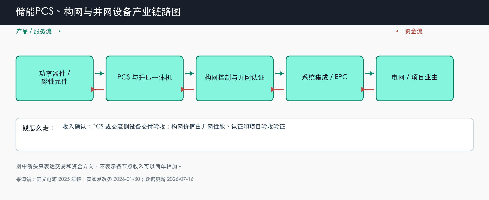

# 储能 PCS、构网与并网设备

数据日期：2026-07-16

用途：投资研究，不构成买卖建议。

## 0. 子产业链边界

- 包含：储能 PCS、升压一体机、中压设备、构网控制、并网测试和认证。
- 不包含：电芯、电池舱、EMS 的电价交易优化、完整 EPC 和电站运营。
- 与相邻子链的接口：直流侧连接电池舱，交流侧连接变压器、电网和调度系统。
- 主要付费方：系统集成商、项目业主，以及直接采购交流侧设备的 EPC 方。
- 收入确认位置：PCS、升压设备或交流侧平台交付验收；算法价值通常包含在硬件或系统合同中。
- 经济模型：制造型为主，构网算法、并网模型和认证具有研发/IP属性。

小白先说人话：电池里是直流电，电网用交流电，PCS 就是两边的“翻译器和交通警察”。跟网型 PCS 主要按电网节奏工作；构网型设备还要在弱电网或故障时主动建立电压和频率参考。新能源越多，电网越缺少传统同步机提供的稳定支撑，构网能力才越有价值。

## 1. 产业链路图

这张图怎么读：产品从功率器件走向 PCS、构网控制、系统集成和电网；资金反向回流。构网算法只有经过并网测试和运行验证才形成壁垒，产品发布会上的参数不能直接当利润证据。

## 2. 谁付钱与价值流

项目业主为“能把电安全送进电网并按调度指令工作”付钱。普通 PCS 的功能趋于标准化，采购方容易比价；构网 PCS 多了故障穿越、电压频率支撑和弱网稳定责任，供应商需要模型、控制算法、测试设备、项目经验和事故记录，因此复制速度更慢。

传导链是：风光渗透率提高 -> 系统惯量和短路支撑下降 -> 电网提出更高并网要求 -> 项目预算从单纯追求最低硬件价转向性能与责任 -> 有认证和运行记录的供应商更可能获得订单和毛利。反证是构网要求只停留在示范、没有形成规模招标，或采购仍只按最低价决标。

## 3. 节点规模

| 节点 | 节点边界 | 经营规模 | 金额规模 | 新增/存量 | 关键效率指标 | 增速/周期 | 数据日期/口径/来源 | 证据等级 | 存疑点 |
|---|---|---:|---:|---|---|---|---|---|---|
| 普通储能 PCS | 双向变流器及控制，不含电池 | 中国 2025 年新增 66.4GW；全球新增电池储能 108GW | 国内情景约 85-159 亿元，按完整系统采购 1061 亿元的 8%-15% | 新增项目为主，存量替换和扩容较小 | 转换效率、功率密度、故障率 | 规模成长但价格竞争强 | 2025 年；新增功率和系统价格推导 | B/C | PCS 占比是假设，不是行业统计 |
| 构网控制与并网认证 | 构网算法、模型、测试和项目验收 | 绑定弱网、高新能源和构网项目，尚无统一 GW 统计 | 缺口:P1 | 新项目验证为主，已投运站升级为辅 | 短路比适应、惯量响应、故障穿越 | 从示范验证向局部规模应用过渡 | 截至 2026-07-16；政策、项目和公司资料 | B/C | 构网溢价和纯软件收入未形成统一披露 |
| PCS+系统公司样本 | PCS、系统集成和解决方案混合 | 阳光电源 2025 年储能发货 43GWh | 储能收入 372 亿元、毛利率 36.5% | 设备交付 + 服务 | 海外占比、毛利率、回款 | 2026Q1 公司总收入同比下降 18.26%，说明项目节奏影响报表 | 2025 年及 2026Q1；公司年报/季报 | A | 不能把混合分部收入当成纯 PCS 规模 |

这张表把纯 PCS 和“PCS+系统公司”分开。阳光电源的高毛利能说明强系统公司有利润样本，却不能证明所有 PCS 厂商都有 36.5% 毛利。投资时要继续问：毛利来自 PCS、海外系统、项目时点还是其他服务，能否在下一批项目复现。

## 4. 利润分布与单位经济

| 节点 | 变现基数 | 直接经济性 | 直接价值池 | 经营收益 | 资本/风险/再投资占用 | 可分配价值 | 估算公式/口径 | 数据日期 | 来源/证据等级 |
|---|---:|---:|---:|---:|---:|---:|---|---|---|
| 普通 PCS 情景 | 约 85-159 亿元收入池 | 情景毛利率 18%-28% | 约 15-45 亿元毛利池 | 情景经营收益约 7-25 亿元 | 情景资本与营运资金约 4-16 亿元 | 情景自由现金流约 4-20 亿元 | 完整系统 1061 亿元 × 8%-15%；利润率按制造压力测试 | 2025 年 | B/C：官方装机、招股材料；分析假设 |
| 构网控制与认证 | 缺口:P1 | 缺口:P2 | 缺口:P3 | 缺口:P4 | 研发与测试投入情景占收入 8%-15% | 缺口:P5 | 单独收费和溢价缺证，保留受控缺口；研发占比仅作压力测试 | 截至 2026-07-16 | B/C：政策和公司资料 |
| 阳光电源储能分部样本 | 372 亿元收入 | 36.5% 毛利率 | 约 135.8 亿元毛利 | 缺口:P6 | 缺口:P7 | 缺口:P8 | 372 亿元 × 36.5%；分部费用和现金需进一步拆分 | 2025 年 | A/B：公司年报和 IR |

这张表告诉我们，构网可能提高壁垒，但公开资料还不能把“技术重要”直接换算成“多赚多少毛利”。现阶段更可靠的证据不是概念名称，而是构网项目验收数量、纯交流侧合同价格、分部毛利持续性和现金回款。

## 4.1 受控数据缺口

| 缺口 ID | 指标 | 已检索范围 | 无法估算原因 | 可给上下界 | 替代指标 | 决策影响 | 核验计划 |
|---|---|---|---|---|---|---|---|
| P1 | 构网控制收入与变现基数 | 公司年报、产品页、招标和政策文件 | 构网算法常与 PCS 或系统打包，缺独立合同价 | 只能确认大于 0 元且小于对应 PCS 合同额 | 构网项目 GW、验收数量、交流侧 ASP | 不能判断构网是否已形成独立利润池 | 跟踪构网专项招标和公司分部披露 |
| P2 | 构网直接经济性 | 同上 | 硬件与算法成本未拆分 | 普通 PCS 毛利率是下限参照，具体区间不可靠 | 构网产品溢价、质保和故障成本 | 不能证明技术壁垒已转成毛利率 | 跟踪同规格跟网/构网报价 |
| P3 | 构网直接价值池 | 同上 | 缺收入和毛利率两个基础量 | 小于完整 PCS 毛利池 45 亿元的情景上限 | 纯构网订单和毛利 | 无法量化机会绝对尺寸 | 取得专项合同后按收入 × 毛利率更新 |
| P4 | 构网经营收益 | 公司财务披露 | 研发和销售费用按公司整体披露 | 直接价值池为经营收益上限 | 研发费用率、项目交付损失 | 无法判断 ROIC 是否高于普通 PCS | 等待业务分部或纯构网公司样本 |
| P5 | 构网可分配价值 | 现金流量表和项目资料 | 回款、质保和研发现金未按产品拆分 | 0 元至经营收益之间的宽上限 | 应收周转、经营现金流、质保费用 | 不能按软件估值直接资本化 | 按季度跟踪现金转化率 |
| P6 | 阳光储能分部经营利润 | 2025 年报、2026Q1 报告 | 分部只披露收入和毛利 | 毛利 135.8 亿元是上限 | 公司整体费用率和利润 | 无法精确比较分部 ROIC | 跟踪半年报与 IR |
| P7 | 阳光储能分部资本占用 | 年报资产负债表 | 产能、库存和应收服务多业务 | 分部收入 372 亿元可作周转基数 | 应收、存货、保函和预付款 | 高毛利可能被营运资金吞掉 | 跟踪储能应收和存货说明 |
| P8 | 阳光储能分部自由现金流 | 年报现金流量表 | 现金流未按分部披露 | 0 元至经营利润之间 | 公司经营现金流与分部毛利 | 不能把高毛利直接当可分配现金 | 跟踪回款和合同负债 |

## 5. 利润迁移、周期与反证

普通 PCS 更接近成熟制造周期：需求高增，但规模化和供应商增加会压价格。构网控制处于能力验证周期：价值来自电网真的提出性能要求，并让合格供应商承担稳定责任。未来利润可能从普通硬件向“设备 + 控制模型 + 认证 + 长期运行记录”迁移，但只有订单和验收能证明。

未来 4-8 个季度看三个指标：构网型招标 GW 和占比、交流侧设备 ASP 与毛利、已投运项目故障和验收记录。若构网项目没有放量、普通 PCS ASP 快速下跌，或技术要求不能带来供应商集中度提升，本链的利润上移判断就要下调。

## 来源

- [国家发展改革委：完善发电侧容量电价机制答记者问，2026-01-30](https://www.ndrc.gov.cn/xxgk/jd/jd/202601/t20260130_1403520.html)
- [阳光电源 2025 年年度报告，2026-04-01](https://static.cninfo.com.cn/finalpage/2026-04-01/1225066678.PDF)
- [阳光电源 2026 年第一季度报告，2026-04-28](https://disc.static.szse.cn/disc/disk03/finalpage/2026-04-28/7e944b4f-ecd5-4c6b-b192-18b5a8e7f32e.PDF)
- [国家能源局：新型储能产业从“跟跑”变“领跑”，2026-04-17](https://www.nea.gov.cn/20260417/a6ef89bc89eb4814872959c4b10fd731/c.html)
- [高特电子招股材料：国内 2h 储能系统中标均价](https://dataclouds.cninfo.com.cn/sjother2/documents/2025/20251217/c312324b2324472a9299ae3a87e2ffd0.pdf)

