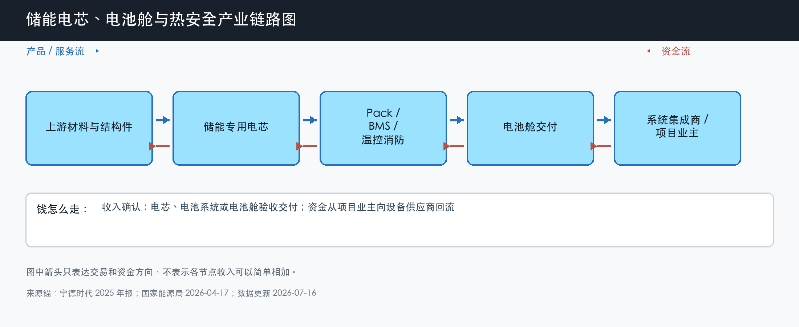

# 储能电芯、电池舱与热安全

数据日期：2026-07-16

用途：投资研究，不构成买卖建议。

## 0. 子产业链边界

- 包含：储能专用电芯、Pack、BMS、液冷、消防、结构件和电池舱交付。
- 不包含：动力电池全部市场、锂矿和正负极材料全行业、PCS、EPC 与电站运营收入。
- 与相邻子链的接口：电池舱交给系统集成商，与 PCS、EMS 和交流侧设备组成完整 BESS。
- 主要付费方：系统集成商、EPC 总包方和直接采购整舱的项目业主。
- 收入确认位置：电芯、电池系统或电池舱按合同交付并验收时确认；下游集成商再次确认项目收入，两层不能简单相加。
- 经济模型：以制造型为主，BMS 算法和长期质保带少量研发/IP与服务属性。

小白先说人话：这一条链解决的是“电到底存在哪里、能不能安全地存很多年”。电芯决定主要成本和循环寿命，BMS 监控每颗电芯，液冷和消防负责不让局部异常演变成整舱事故。客户买的不是一堆电池，而是一套能通过验收、保险和融资审查的可用资产。

## 1. 产业链路图

这张图怎么读：上方箭头表示材料经过电芯、Pack 和热安全系统成为电池舱；下方箭头表示项目业主的钱反向回到集成商和设备商。最容易误读的是把电芯厂收入和系统集成收入相加成净市场规模，实际上集成收入里已经包含电芯采购成本。

## 2. 谁付钱与价值流

终端预算先来自储能项目。项目业主根据功率、容量、循环寿命、安全标准和交付期采购 BESS，系统集成商再把预算拆给电芯、PCS、温控消防等供应商。由于电芯通常是系统中价值量最大的部件，项目价格下降会首先传导成电芯压价；但安全事故、循环衰减和质保责任又会把一部分订单推向有长期运行记录的头部供应商。

所以“电芯出货增长”只能证明量在增长，不能单独证明利润增长。利润要经过四个过滤器：电芯 ASP 是否跌得快于材料成本，产线利用率是否足够高，安全和良率是否减少质保损失，客户回款是否变成经营现金流。宁德时代 2025 年储能电池销量 121GWh、储能电池系统收入 624.40 亿元、毛利率 26.71%，说明头部样本已经把规模变成较高毛利；它不代表所有储能电芯厂都能达到同样水平。

## 3. 节点规模

| 节点 | 节点边界 | 经营规模 | 金额规模 | 新增/存量 | 关键效率指标 | 增速/周期 | 数据日期/口径/来源 | 证据等级 | 存疑点 |
|---|---|---:|---:|---|---|---|---|---|---|
| 储能专用电芯 | 电芯销售，不含下游电站收入 | 宁德时代 2025 年储能销量 121GWh；全球 2025 年新增电池储能 108GW | 宁德时代储能电池系统收入 624.40 亿元 | 以新增项目为主，存量替换尚小 | ASP、良率、循环寿命、产能利用率 | 需求成长、制造竞争和大电芯升级同时发生 | 2025 年；公司销量/分部收入；宁德时代年报、IEA | A/B | 公司样本不能直接外推全行业收入 |
| 电池舱与 Pack | Pack、结构、母排和整舱，不含 PCS | 中国 2025 年新增 189.5GWh，可作为整舱需求上限锚 | 按国内 2h 系统中标均价约 0.56 元/Wh，完整系统采购约 1061 亿元；电池舱只是其中一部分 | 新增交付为主，随后形成改造和替换 | 单舱 MWh、占地能量密度、可用率 | 大容量电芯和 5-9MWh 舱推动集成度上升 | 2025 年；新增容量乘系统中标均价；国家能源局、招股材料 | B/C | 电池舱独立价值占比缺少统一公开口径 |
| BMS、液冷与消防 | 电池侧控制和热安全，不含电网侧 PCS | 绑定 189.5GWh 新增容量及 144.7GW 累计资产 | 独立全行业金额缺少可靠拆分 | 新增设备 + 存量改造、备件和质保 | 故障率、温差、热失控传播、质保费用 | 标准升级提高重要性，但集成内供压低独立议价 | 2025 年；中国新增/累计装机锚 | B/C | 独立收入、毛利和单 Wh 价值量证据不足 |

这张表最重要的读法是分清“完整系统金额”和“这个节点真正拿到的收入”。1061 亿元是用新增容量乘系统中标均价得到的粗略完整系统采购锚，不是电池舱收入，更不是利润。它的用途是给量级设上限，再用公司分部数据和成本占比逐层拆分。

## 4. 利润分布与单位经济

| 节点 | 变现基数 | 直接经济性 | 直接价值池 | 经营收益 | 资本/风险/再投资占用 | 可分配价值 | 估算公式/口径 | 数据日期 | 来源/证据等级 |
|---|---:|---:|---:|---:|---:|---:|---|---|---|
| 头部储能电池系统样本 | 624.40 亿元收入 | 26.71% 毛利率 | 约 166.8 亿元毛利 | 缺口:G1 | 缺口:G2 | 缺口:G3 | 624.40 亿元 × 26.71%；经营和现金层需储能分部数据 | 2025 年 | A：宁德时代年报 |
| 国内电池舱与热安全情景 | 完整系统采购锚约 1061 亿元，电池侧假设占 50%-70% | 情景毛利率 15%-27% | 情景毛利池约 80-201 亿元 | 情景经营收益约 42-127 亿元 | 情景营运资金与资本占用约 53-149 亿元 | 情景自由现金流约 27-80 亿元 | 189.5GWh × 0.56 元/Wh × 电池侧占比；后四项为压力测试，不是行业事实 | 2025 年 | B/C：国家能源局、招股材料、头部公司样本；分析假设 |

这张表怎么读：第一行是可核验的头部公司样本，第二行是用公开系统价格做的宽区间情景。宽区间不是为了装得精确，而是告诉读者敏感变量在哪里。若系统价格从 0.56 元/Wh 再跌 10%，而材料成本只降 5%，电池侧毛利会被双重压缩；反过来，如果大电芯减少结构件和占地、良率又提高，头部公司可能守住毛利。

## 4.1 受控数据缺口

| 缺口 ID | 指标 | 已检索范围 | 无法估算原因 | 可给上下界 | 替代指标 | 决策影响 | 核验计划 |
|---|---|---|---|---|---|---|---|
| G1 | 宁德时代储能分部经营利润 | 2025 年报、2026Q1 报告、公司产品资料 | 年报只披露分部收入和毛利，期间费用未按储能分部拆分 | 毛利 166.8 亿元是经营利润上限 | 公司整体费用率、储能毛利率和分部收入 | 不能精确比较储能分部 ROIC | 跟踪半年报分部披露和管理层交流 |
| G2 | 储能分部资本与营运资金占用 | 2025 年报、2026Q1 资产负债表 | 电池产线同时服务动力和储能，资产与库存不能可靠分摊 | 公司总资产 1.05 万亿元是极宽上限，不能用于分部结论 | 总资本开支、库存、应收周转 | 无法判断新增储能收入需要多少增量资本 | 跟踪储能专用产线、在建工程和产能利用率 |
| G3 | 储能分部自由现金流 | 2025 年报现金流量表、2026Q1 报告 | 现金流只按公司整体披露 | 经营现金流为公司层上限，分部下界不可可靠给出 | 公司经营现金流、应收和库存变化 | 不能把 26.71% 毛利直接当成股东可分配现金 | 等待分部现金流线索或用同业纯储能样本交叉验证 |

## 5. 利润迁移、周期与反证

利润正在从“只卖更多 Wh”迁向“安全、寿命和系统集成度”。原因是电芯容量变大、系统价格下降后，普通产品更容易比较价格；客户真正害怕的是事故、衰减、停机和巨额质保。能用真实运行数据证明安全与寿命，并把 BMS、热管理和舱体设计一起优化的供应商，才可能把一部分价格竞争转成质量溢价。

未来 4-8 个季度要看三类反证。第一，储能系统和电芯 ASP 是否持续快于材料成本下跌；第二，头部公司储能毛利率是否跌破自身历史区间；第三，大容量电芯快速放量后是否出现热安全、良率或循环寿命问题。任一项恶化，都说明“规模优势能守住利润”的判断需要下调。

## 来源

- [宁德时代 2025 年年度报告，2026-03-10](https://static.cninfo.com.cn/finalpage/2026-03-10/1225002214.PDF)
- [宁德时代 2026 年第一季度报告，2026-04-16](https://static.cninfo.com.cn/finalpage/2026-04-16/1225107946.PDF)
- [国家能源局：新型储能产业从“跟跑”变“领跑”，2026-04-17](https://www.nea.gov.cn/20260417/a6ef89bc89eb4814872959c4b10fd731/c.html)
- [IEA：Global Energy Review 2026 - Battery storage](https://www.iea.org/reports/global-energy-review-2026/technology-battery-storage)
- [高特电子招股材料：国内 2h 储能系统中标均价](https://dataclouds.cninfo.com.cn/sjother2/documents/2025/20251217/c312324b2324472a9299ae3a87e2ffd0.pdf)

