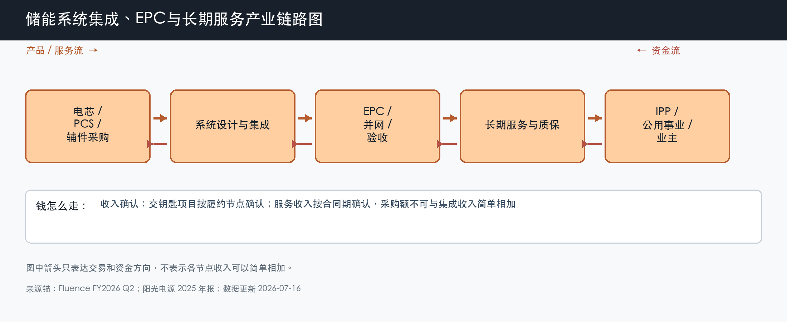

# 储能系统集成、EPC 与长期服务

数据日期：2026-07-16

用途：投资研究，不构成买卖建议。

## 0. 子产业链边界

- 包含：系统设计、设备采购、集成、EPC、并网验收、长期服务、延保和 O&M。
- 不包含：设备供应商在上游确认的净收入、电站投运后的价差和容量收入。
- 与相邻子链的接口：向电芯、PCS 和辅件厂采购，向项目业主交付完整可运行资产。
- 主要付费方：IPP、公用事业、电力集团、数据中心和工商业业主。
- 收入确认位置：交钥匙项目按履约节点或验收确认；长期服务按合同期确认。
- 经济模型：项目型与专业服务型混合，最重要的不是合同额，而是项目毛利、营运资金和履约现金流。

小白先说人话：集成商像总装厂和项目经理。它要把不同厂家的电芯、PCS、消防、软件和电气设备拼成一套能并网、能融资、能长期运行的系统。拿到大订单只是第一步；采购涨价、延期、罚款、质保和客户拖款都可能把合同利润吃掉。

## 1. 产业链路图

这张图怎么读：集成商先向上游付钱采购，再把完整系统交给业主，常常会出现“现金先出去、收入后确认”。因此 backlog 是未来收入线索，不是利润，也不是现金。

## 2. 谁付钱与价值流

业主为三类结果付钱：系统按时交付、通过并网和安全验收、在合同期内保持可用率。强集成商能用标准化设计、供应链采购、项目管理、认证和长期服务降低业主的融资与运行风险，所以海外项目可能愿意给更高价格。弱集成商即使低价中标，也可能在履约阶段因采购、延期和质保亏损。

Fluence 的最新样本很能说明问题：截至 2026 年 3 月 backlog 约 56 亿美元，季度收入 4.649 亿美元、毛利率 10.0%，但季度净亏损 2924 万美元；前六个月自由现金流为 -2.854 亿美元。行业需求和订单都强，利润与现金却没有自动跟上，这正是项目型业务的核心风险。

## 3. 节点规模

| 节点 | 节点边界 | 经营规模 | 金额规模 | 新增/存量 | 关键效率指标 | 增速/周期 | 数据日期/口径/来源 | 证据等级 | 存疑点 |
|---|---|---:|---:|---|---|---|---|---|---|
| 中国系统集成/EPC | 完整系统和工程交付 | 2025 年新增 66.4GW/189.5GWh | 按 0.56 元/Wh 系统价得约 1061 亿元采购锚；单个 350MW/700MWh EPC 合同 6.16 亿元 | 新增项目为主 | 单 Wh 价格、交付周期、应收周转 | 需求成长但低价竞争强 | 2025 年；行业新增和公开合同 | B/C | 系统采购价与完整 EPC 边界不同 |
| Fluence 系统与服务 | 全球集成、服务和数字业务 | 已部署 7.4GW/19.2GWh，backlog 10.1GW | backlog 56 亿美元；FY2026 Q2 收入 4.649 亿美元 | 交付 backlog + 存量服务 | backlog 转化、毛利、库存、现金 | 订单加速，盈利和现金仍承压 | 截至 2026-03-31；公司披露 | B | backlog 可延期或取消，不能等同收入 |
| 阳光储能系统样本 | PCS+系统+解决方案 | 2025 年发货 43GWh | 储能收入 372 亿元 | 新增交付 + 海外服务 | 毛利率、海外占比、回款 | 高增长后 2026Q1 公司收入波动 | 2025 年及 2026Q1；公司披露 | A/B | 纯集成、PCS和服务无法完全拆分 |

这张表怎么读：1061 亿元是按中国新增容量和系统中标价推导的设备采购锚，6.16 亿元是单项目完整 EPC 合同。二者边界不同，不能拿来算同一个“平均价格”。公司研究要优先看交付和现金，而不是只比较订单数字。

## 4. 利润分布与单位经济

| 节点 | 变现基数 | 直接经济性 | 直接价值池 | 经营收益 | 资本/风险/再投资占用 | 可分配价值 | 估算公式/口径 | 数据日期 | 来源/证据等级 |
|---|---:|---:|---:|---:|---:|---:|---|---|---|
| Fluence 最新季度样本 | 4.649 亿美元收入 | 10.0% 毛利率 | 4663 万美元毛利 | 净亏损 2924 万美元、调整后 EBITDA -944 万美元 | 前六个月库存增加约 2.996 亿美元 | 前六个月自由现金流 -2.854 亿美元 | 公司 GAAP 与非 GAAP 披露；季度利润与半年现金周期不同 | 2026-03-31 | B：公司业绩公告 |
| 中国系统集成情景 | 约 1061 亿元系统采购锚 | 情景毛利率 8%-18% | 约 85-191 亿元毛利池 | 情景经营收益约 32-127 亿元 | 情景营运资金占收入 10%-25%，约 106-265 亿元 | 情景自由现金流 -50 至 80 亿元 | 新增容量 × 系统价；利润和现金按项目型业务压力测试 | 2025 年 | B/C：官方装机、招股材料；分析假设 |

这张表为什么重要：项目型业务即使有正毛利，也可能因为库存、预付款、保函和应收把现金压住。投资者若只看收入和 backlog，会高估可分配价值。真正的改善需要毛利率、营运资金和自由现金流一起变好。

## 4.1 受控数据缺口

| 缺口 ID | 指标 | 已检索范围 | 无法估算原因 | 可给上下界 | 替代指标 | 决策影响 | 核验计划 |
|---|---|---|---|---|---|---|---|
| I1 | 中国系统集成净收入池 | 装机、招标、上市公司和公开 EPC 合同 | 设备价、集成价和 EPC 价边界不同，且存在转包 | 设备采购锚约 1061 亿元；完整 EPC 会更高 | 单 Wh 中标价、合同额、上市公司分部收入 | 不能把所有节点收入相加成 TAM | 按设备/工程/服务三类招标建立连续序列 |

## 5. 利润迁移、周期与反证

集成利润可能向三类公司集中：供应链采购强、海外融资认可强、长期服务能持续收费。原因是系统越复杂，业主越担心交付和质保，愿意把风险交给资产负债表和运行记录更强的供应商。但是集中度提高也不保证利润，若公司为了抢订单承诺过低价格或过强质保，风险会延后爆发。

未来 4-8 个季度看 backlog 转收入比例、项目毛利、存货和预付款、经营现金流、质保与违约损失。若订单继续增长而自由现金流持续为负，说明行业景气被营运资金和履约风险截断。

## 来源

- [Fluence FY2026 第二季度业绩，2026-05-06](https://ir.fluenceenergy.com/news-releases/news-release-details/fluence-energy-inc-reports-second-quarter-2026-results-reaffirms)
- [阳光电源 2025 年年度报告，2026-04-01](https://static.cninfo.com.cn/finalpage/2026-04-01/1225066678.PDF)
- [民乐 350MW/700MWh 储能 EPC 合同公告](https://static.cninfo.com.cn/finalpage/2025-11-01/1224780353.PDF)
- [高特电子招股材料：国内 2h 储能系统中标均价](https://dataclouds.cninfo.com.cn/sjother2/documents/2025/20251217/c312324b2324472a9299ae3a87e2ffd0.pdf)

