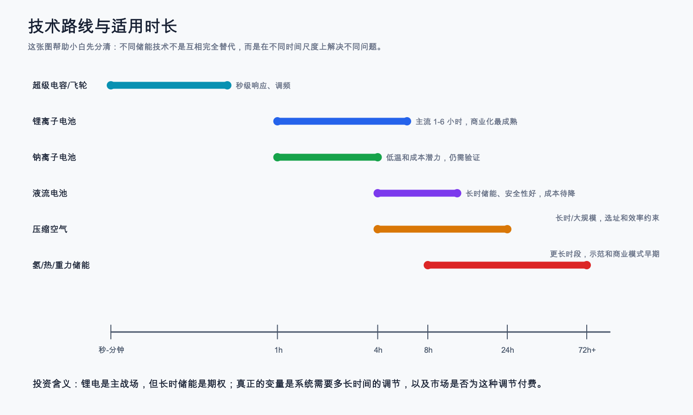

# 储能行业术语表

## 小白先记住的单位

| 词 | 全称/中文 | 小白解释 | 投资意义 |
|---|---|---|---|
| GW | Gigawatt，吉瓦 | 功率单位，表示“瞬间能放/充多快” | 常用于装机功率，不能当成电量 |
| GWh | Gigawatt-hour，吉瓦时 | 容量单位，表示“能存多少电” | 储能出货和容量常用，和 GW 不同 |
| 亿千瓦 | 100GW | 国内政策文件常用的功率单位，1 亿千瓦 = 100GW | 看到 1.8 亿千瓦，可直接换成 180GW，再和 144.7GW、213.3GW 对比 |
| 储能时长 | GWh / GW | 例如 4GWh / 1GW = 4 小时 | 决定适用场景和容量补偿折算 |
| 装机 | Installed capacity | 已投运或已并网的规模 | 看真实需求和利用，强于出货 |
| 出货 | Shipment | 厂商发出的设备量 | 看公司交付，但不等于项目投运 |
| backlog | 未履约订单 | 已签约但还没确认收入的订单 | 看未来收入可见度，也要看毛利和现金流 |
| 利用小时 | Utilization hours | 储能建成后实际被调用的程度 | 装机多但利用小时低，说明项目价值可能不足 |

## 技术和系统

| 术语 | 全称/中文 | 小白解释 | 投资意义 |
|---|---|---|---|
| ESS | Energy Storage System，储能系统 | 所有储能系统的统称 | 范围广，需问清是电池、系统还是项目 |
| BESS | Battery Energy Storage System，电池储能系统 | 以电池为核心的储能 | 当前电化学储能主流 |
| LFP | Lithium Iron Phosphate，磷酸铁锂 | 安全、寿命和成本较优的锂电路线 | 中国供应链优势明显 |
| PCS | Power Conversion System，储能变流器 | 把电池直流电和电网交流电互相转换 | 接近电网接口，技术和认证壁垒高 |
| BMS | Battery Management System，电池管理系统 | 管电池安全、温度、电压、状态 | 安全和寿命核心 |
| EMS | Energy Management System，能量管理系统 | 决定什么时候充、什么时候放、怎么交易 | 软件化和交易优化的入口 |
| SOC | State of Charge，荷电状态 | 电池还剩多少电 | 影响调度、寿命和收益 |
| SOH | State of Health，健康状态 | 电池还能保持多少能力 | 影响质保、残值和保险 |
| 构网型储能 | Grid-forming storage | 能像“电网支撑者”一样建立电压/频率参考 | 弱电网、高新能源地区价值高 |
| 跟网型储能 | Grid-following storage | 跟随已有电网运行 | 成熟但对弱电网支撑不足 |
| 长时储能 | LDES，Long Duration Energy Storage | 能连续放电更久的储能，一般用于 4 小时以上甚至跨日调节 | 重要但成熟度差异大，不能把期权当近期利润 |
| 热失控 | Thermal runaway | 电池异常升温并可能引发连锁反应 | 安全事故会影响融资、保险、审批和估值 |
| 可用率 | Availability | 储能系统处于可运行状态的比例 | 海外大储合同和质保常看这个指标 |

这张表怎么读：
- 技术词不是为了显得专业，而是为了判断钱能不能留下。
- BMS、PCS、EMS、温控消防这些词分别对应安全、并网、收益优化和事故控制。任何一个环节弱，项目都可能从“能赚钱的资产”变成“只完成交付的设备”。

## 收益和电力市场

| 术语 | 全称/中文 | 小白解释 | 投资意义 |
|---|---|---|---|
| 新能源消纳 | Renewable integration | 把风电、光伏发出来的电尽量接入并有效使用 | 中国储能需求的底层原因之一，因为风光波动会造成弃电和电网调节压力 |
| 弃风弃光 | Curtailment | 风光本来能发电，但因为负荷、通道或调峰不足而被限制上网 | 储能能减少部分弃电，但前提是项目被调用且有收益机制 |
| 强配储 | Mandatory storage pairing | 新能源项目为了并网被要求配置储能 | 可能形成低质量需求，136 号文后要看真实市场化用储 |
| 峰谷套利 | Charge low, discharge high | 便宜时充电，贵时放电 | 工商业和现货市场常见收益 |
| 辅助服务 | Ancillary services | 调频、备用、爬坡、无功等服务 | 体现储能快速响应价值 |
| FCAS | Frequency Control Ancillary Services，频率控制辅助服务 | 澳洲等市场常见的调频服务，储能用快速响应帮助电网稳住频率 | 澳洲储能收益的重要来源之一 |
| 容量电价 | Capacity payment | 为“关键时刻能顶上”付钱 | 独立储能收益稳定性关键 |
| 容量租赁 | Capacity leasing | 储能项目把可用容量租给需要容量指标或调节能力的主体 | 要看合同真实收益、期限和履约责任，不能只看签约规模 |
| 可靠容量 | Reliable capacity | 顶峰时段可持续稳定供电的能力 | 决定容量补偿资格和折算 |
| 顶峰贡献折算 | Peak contribution adjustment | 不是所有装机都按 100% 算容量价值，要看高峰时能持续、可靠贡献多少 | 决定容量电价能拿多少钱，影响独立储能 IRR |
| 清单制 | Project list mechanism | 政策可能只让符合条件、进入清单的项目拿补偿 | 容量电价不是所有项目自动获得 |
| 现货市场 | Spot market | 电价随实时供需变化 | 价差越有效，储能套利越有空间 |
| PPA | Power Purchase Agreement，购电协议 | 发电方和买电方签长期电价/电量合同 | 海外项目融资常看 PPA 稳定性 |
| IRA | Inflation Reduction Act，美国通胀削减法案 | 美国清洁能源税收抵免政策之一，储能可受益但规则会变 | 影响美国储能项目收益和本土化要求 |
| C&I | Commercial and Industrial，工商业 | 工厂、园区、商场、充电站等非居民大型用电客户 | 工商业储能看峰谷价差、用电曲线和回款 |
| 虚拟电厂 | VPP，Virtual Power Plant | 把分散储能、负荷、光伏聚合起来统一调度 | 软件和聚合商的长期机会 |
| LCOS | Levelized Cost of Storage，平准化储能成本 | 把储能全生命周期成本摊到每度电 | 判断项目经济性 |
| IRR | Internal Rate of Return，内部收益率 | 项目投资的年化回报指标 | 判断电站是否值得投 |
| bankability | 可融资性/融资认可 | 银行、保险、客户愿意接受某供应商进入项目融资文件 | 海外大储核心壁垒之一 |
| ARR | Annual Recurring Revenue，年度经常性收入 | 软件或服务每年可重复收的钱，不是一次性项目收入 | 判断 EMS/优化软件能否独立收费 |
| ASP | Average Selling Price，平均销售价格 | 每单位产品平均卖价 | ASP 跌快于成本下降会压毛利 |
| IPP | Independent Power Producer，独立发电商 | 持有或开发电站、向市场或客户卖电的主体 | 海外大储重要客户 |
| EPC | Engineering, Procurement and Construction，工程总包 | 负责设计、采购和施工交付的承包商 | 决定项目交付和履约风险 |
| Chapter 11 | 美国破产法第 11 章重组程序 | 公司申请保护并提出重组方案，不等于立刻清算 | 观察海外系统集成商财务压力 |

## 财务、披露和情景词

| 术语 | 全称/中文 | 小白解释 | 投资意义 |
|---|---|---|---|
| 行业周期 | Industry cycle | 行业从需求启动、快速扩张、供给过剩、出清修复到成熟稳定的阶段变化 | 判断现在该看增长、毛利修复，还是风险出清 |
| 节点规模 | Value chain node size | 一个产业链环节到底有多大，可以从物理量、金额和利润三个角度看 | 防止只说“行业很大”，却不知道钱具体流到哪个环节 |
| 物理规模 | Physical scale | 装了多少 GW/GWh、出了多少货、建了多少项目 | 判断需求是否真实放量，但不能直接代表收入和利润 |
| 金额规模 | Revenue scale | 某个节点对应多少收入、订单、项目投资或公司分部收入 | 判断钱是否已经流入这个节点，但要区分全行业和公司样本 |
| 价值量 | Value per unit | 每 GWh、每 GW、每套系统里某个部件大概值多少钱 | 判断节点收入空间和价格变化，例如 PCS、温控消防、EMS 的单项价值 |
| 利润池 | Profit pool | 某个环节最终能留下的毛利、净利、现金流或持续服务收入 | 投资上最关心的不是收入大不大，而是能不能留成利润 |
| 需求质量 | Demand quality | 不是只看订单或装机多少，还要看项目是否真实被调用、是否有收益、是否能回款 | 高质量需求更容易变成利润，低质量需求可能只是低价项目 |
| 单位经济 | Unit economics | 一个项目或一单生意拆开看，每投入一单位钱能赚多少钱、现金什么时候回来 | 储能项目要看 IRR，系统集成要看毛利、回款和质保 |
| 项目 IRR | Project internal rate of return | 单个储能电站按投资、收入、成本和融资算出来的年化回报 | 判断独立储能是否真的值得投建 |
| ASP 下行 | Average selling price decline | 平均售价下降 | 如果 ASP 跌快于成本下降，企业收入增长也可能利润变差 |
| 产能利用率 | Capacity utilization | 工厂实际产量占设计产能的比例 | 利用率低通常意味着供给过剩和价格压力 |
| 收益机制 | Revenue mechanism | 储能通过峰谷价差、辅助服务、容量电价、容量租赁等方式获得收入的规则 | 没有清晰收益机制，装机不一定转成项目现金流 |
| 情景推演 | Scenario analysis | 不把未来写成一个确定答案，而是拆成乐观、基准、悲观路径并设置验证信号 | 帮助防止只看利好，及时用新事实修正判断 |
| 预期差 | Expectation gap | 市场已经相信的故事和后续事实之间的差距 | 投资机会和风险常来自预期与事实不一致 |
| ETF | Exchange Traded Fund，交易型开放式指数基金 | 可以在场内交易的一篮子股票基金，通常跟踪某个指数 | 用 ETF 参与行业主题更分散，但也会买到非纯储能业务 |
| 跟踪指数 | Tracking index | ETF 试图复制的指数，例如 159566/159305 跟踪国证新能源电池指数 | 先看指数是什么，才知道自己买到什么敞口 |
| IOPV | Indicative Optimized Portfolio Value，基金份额参考净值 | 交易时间里给出的 ETF 参考净值估算 | 用来观察二级市场价格有没有明显偏离基金净值 |
| 折溢价 | Discount/Premium | ETF 二级市场价格低于净值叫折价，高于净值叫溢价 | 折溢价小不代表估值便宜，只说明价格和净值偏离小 |
| 历史分位 | Historical percentile | 当前价格或估值在过去一段时间里处于什么位置 | 价格分位高说明不在低位，估值分位高说明市场给的预期较高 |
| 估值分位 | Valuation percentile | PE、PB、PS 等估值指标在历史区间中的位置 | 判断指数是否便宜要看估值分位，不能只看 ETF 涨跌幅 |
| 价格分位 | Price percentile | 当前 ETF 前复权价格在历史价格中的位置，本报告按 AkShare 可得前复权日线区间计算 | 只能说明交易价格位置，不能等同于 PE/PB 估值；上市时间短的 ETF 分位参考价值更弱 |
| 持仓纯度 | Holding purity | ETF 前十大或全部持仓里，有多少利润真正来自目标主题 | 储能 ETF 要看持仓公司储能收入和毛利占比，不能只看基金名字 |
| 跟踪误差 | Tracking error | ETF 收益和跟踪指数收益之间的偏离，常见口径包括年化跟踪误差、日收益偏离和区间收益偏离 | 跟踪误差越大，越说明 ETF 复制指数的效果需要警惕；应以基金定期报告或基金公司披露为准 |
| 场内总市值 | On-exchange market value | ETF 在交易所价格乘以份额得到的场内规模口径 | 可以辅助看工具规模，但不等于基金公司最新披露的管理规模 |
| 成交额 | Turnover | 一段时间里 ETF 被交易了多少钱 | 关系到流动性和进出成本，但成交热也可能代表主题拥挤 |
| 资金拥挤度 | Crowding | 一个主题被很多资金追逐、价格提前反映乐观预期的程度，需要用价格/估值分位、成交额分位、份额变化、资金流和折溢价共同判断 | 行业好但交易拥挤时，短期风险收益可能变差；没有份额和资金流数据时，只能写“交易热度偏高、拥挤待核验” |
| IR 口径 | Investor Relations，公司投资者关系口径 | 公司在业绩会、交流纪要或投资者材料中披露的数据，不一定和审计报表分部完全一致 | 可用于补充，但要标注 A/B 证据等级和口径 |
| GAAP | Generally Accepted Accounting Principles，通用会计准则 | 美国公司常用的会计准则口径 | Fluence 等美股公司毛利、净利要说明是否 GAAP |
| MoU | Memorandum of Understanding，谅解备忘录 | 合作意向书，通常弱于正式订单或收入合同 | 技术或项目验证不能只看 MoU，要看合同、交付和回款 |
| NZE | Net Zero Emissions by 2050 Scenario，2050 净零排放情景 | IEA 用来描述达成净零目标所需路径的情景，不是已发生事实 | 可用于看长期空间，但不能当成确定装机 |

这张表怎么读：
- “谁付钱”比“技术听起来先进”更重要。峰谷套利是用户为价差付钱，辅助服务是电力系统为快速响应付钱，容量电价是系统为关键时刻可靠能力付钱。
- 研究储能时，一看到“需求增长”，就要追问这个需求来自哪种付费机制。如果没有付费机制，装机和订单不一定能转成利润。

