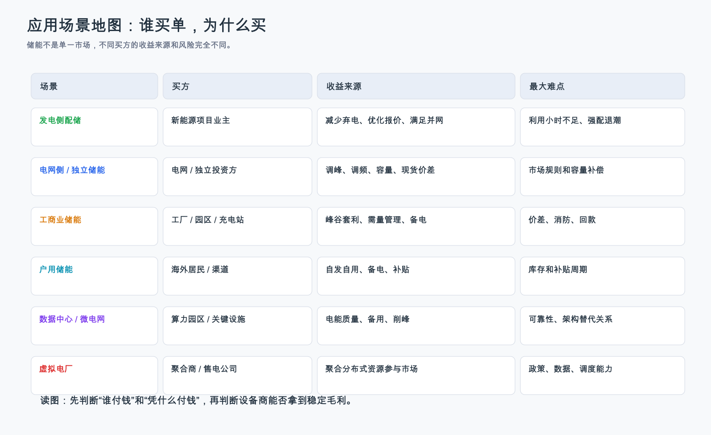

# 储能行业深度调研 - 国内视角

更新日期：2026-07-16

> **口径说明**
> 国内数据以国家能源局、国家发改委政策文件、CNESA DataLink 经公开转载的数据为主。CNESA 属行业数据库口径，证据等级低于正式官方统计；用于看趋势和规模，不单独支撑盈利结论。

## 0. 数据口径和事实性声明

| 项目 | 说明 |
|---|---|
| 主要数据日期 | 2025 年底累计装机、2025 全年新增投运、2025-2027 政策目标、2026 容量电价政策 |
| 最新核验日期 | 2026-07-16 |
| 核心来源 | 国家能源局、国家发改委、CNESA DataLink 公开转载、公司年报/IR |
| 主要口径 | 新型储能以电化学等非抽水蓄能为主；GW 是功率，GWh 是容量 |
| 仍需复核 | 各省容量电价细则、独立储能项目实际 IRR、利用小时、2026 年招标价格 |

## 1. 国内结论

中国储能的主要变化不是“装机还在增长”这么简单，而是需求性质在变化。过去很多储能项目来自新能源项目并网前的强制配置要求，储能对新能源业主来说更像一项不得不承担的成本。2025 年 136 号文明确不得把配置储能作为新建新能源项目核准、并网、上网等前置条件，这会减少一部分低质量“为了并网而配”的需求。看起来这是利空，但它也逼着行业回答更重要的问题：储能到底能不能通过真实调度创造收益。

2026 年 114 号文的意义就在这里。它首次在国家层面明确电网侧独立新型储能容量电价机制。小白可以把容量电价理解成“为关键时刻能顶上而付的底薪”。电量电价是按你放了多少电来付钱，容量电价是按你关键时刻能不能可靠提供能力来付钱。对独立储能来说，这个机制如果落地，就能让收入从单一价差和辅助服务，变成“价差 + 辅助服务 + 容量补偿”的组合。

所以我的国内判断是：2026 年以后，中国储能不能只看新增 GWh，更要看项目收益机制、调用小时和设备商毛利。真正受益的会是能让储能“被电网需要、被市场定价、被业主持续使用”的环节，比如 PCS/构网控制、EMS、头部系统集成、低成本高安全电芯和长期运维。

## 2. 政策背后的 why

| 政策/机制 | 表面内容 | 背后的系统问题 | 怎么传导到储能需求 | 谁付钱 | 投资含义 | 反证 |
|---|---|---|---|---|---|---|
| 136 号文 | 新能源上网电量原则上入市；不得将配储作为新建新能源项目核准、并网、上网前置条件 | 强配储容易形成“建了但不用”的低质量资产，成本摊到新能源项目上 | 低质量配储减少，真实有收益的独立储能和市场化用储更重要 | 新能源业主、电力市场主体 | 低端集成承压，优质独立储能和运营能力重要性上升 | 新能源项目仍通过地方隐性要求被迫配储 |
| 2025-2027 专项行动方案 | 2027 年新型储能装机 1.8 亿千瓦（=180GW）以上，带动直接投资约 2500 亿元 | 新能源比例提高后，电力系统需要调节能力、保供能力和标准体系 | 政策目标推动项目建设，但要求市场化、标准、安全和调控能力 | 电力系统、项目业主、社会资本 | 行业仍有规模底座，但利润取决于质量和机制 | 装机增长但利用小时低、事故和回款问题增加 |
| 114 号文 | 电网侧独立新型储能可获容量电价，按顶峰能力折算 | 电力系统不仅要买电量，还要买可靠容量，防止高峰时缺电 | 储能若能在高峰连续放电，就能获得类似“底薪”的容量收入 | 通过电价机制和市场主体分摊 | 独立储能 IRR 可见度提高，构网和长时能力更重要 | 各省清单严格、补偿低、考核复杂导致收益有限 |

这张表怎么读：
- 政策不是因为“政府喜欢储能”才出台，而是电力系统的波动性和可靠性问题越来越明显。
- 136 号文去掉的是行政强配的低质量需求；114 号文试图建立的是可靠容量的付费机制。二者合起来，行业从“有没有项目”转向“项目有没有经济性”。
- “顶峰能力折算”可以理解成：不是你装了多少 GW 就一定按多少 GW 拿容量补偿，而是要看高峰时段能不能持续、可靠、按要求放电。这个折算比例越严格，项目能拿到的“底薪”越少，所以它直接影响独立储能 IRR。

## 3. 国内市场空间和口径

| 指标 | 数值 | 数据日期 | 口径 | 来源 | 证据等级 | 怎么理解 |
|---|---:|---|---|---|---|---|
| 中国新型储能累计装机 | 144.7GW | 2025 年底 | CNESA DataLink 不完全统计，国家能源局转载 | [国家能源局，2026-01-23](https://www.nea.gov.cn/20260123/c261402548074372b15b799eb36434cb/c.html) | B/C | 规模足够大，说明储能已从示范走向主流电力资产 |
| 中国电力储能累计装机 | 213.3GW | 2025 年底 | 电力储能全口径，含抽水蓄能等 | [国家能源局，2026-01-23](https://www.nea.gov.cn/20260123/c261402548074372b15b799eb36434cb/c.html) | B/C | 新型储能已占电力储能三分之二以上 |
| 2025 年新增投运 | 66.4GW / 189.5GWh | 2025 全年 | 新型储能新增投运 | [国家能源局，2026-04-17](https://www.nea.gov.cn/20260417/a6ef89bc89eb4814872959c4b10fd731/c.html) | B/C | 平均约 2.9 小时，说明主力仍是日内调节 |
| 2027 年目标 | 1.8 亿千瓦（=180GW）以上 | 2027 年 | 全国新型储能装机功率目标；政策文件用“千瓦”，本报告括号换算为 GW | [国家发改委/国家能源局，2025-09-12](https://www.ndrc.gov.cn/xxgk/zcfb/tz/202509/t20250912_1400425.html) | A | 政策目标提供规模锚，但不能直接推利润 |
| 直接投资 | 约 2500 亿元 | 2025-2027 | 项目直接投资测算 | [国家发改委/国家能源局，2025-09-12](https://www.ndrc.gov.cn/xxgk/zcfb/tz/202509/t20250912_1400425.html) | A | 这是项目投资额，不等于设备商收入或利润 |

这张表怎么读：
- 单位先统一脑子：1GW = 100 万千瓦 = 0.01 亿千瓦，所以 1.8 亿千瓦 = 180GW。换句话说，213.3GW 也可以写成 2.133 亿千瓦，66.4GW 也可以写成 0.664 亿千瓦。
- GW 和 GWh 不是一类东西。GW 是“功率”，看一瞬间最多能充放多快；GWh 是“能量容量”，看总共能存多少电。66.4GW / 189.5GWh 的意思是：这批项目的功率是 66.4GW，容量是 189.5GWh，189.5 ÷ 66.4 ≈ 2.85 小时。
- 国内规模数据很漂亮，但要小心“规模幻觉”。储能项目要赚钱，必须被调用、得到补偿、减少弃电或赚到价差。
- 新增 66.4GW/189.5GWh 的平均时长不到 3 小时，说明当前中国新型储能主要解决日内峰谷、调频和局部消纳问题，还不是完全意义上的多日备用。

## 4. 国内商业模式拆解

这张图怎么读：
- 先看“买方”。发电侧、电网侧、工商业、户用、数据中心、虚拟电厂，愿意付钱的理由完全不同。
- 再看“收益来源”。如果收益来自价差，要看电价波动；如果来自容量，要看政策补偿；如果来自备电，要看停电损失和可靠性要求。
- 对投资判断的用处是防止把所有储能需求混成一个市场。一个公司擅长海外户储，不代表它一定擅长国内独立储能；一个公司能做电芯，不代表它能做好 EMS 和项目运营。

| 模式 | 谁付钱 | 收益来源 | 为什么成立 | 最关键变量 | 投资判断 |
|---|---|---|---|---|---|
| 新能源配储 | 风光项目业主 | 减少弃电、满足历史并网要求、部分市场收益 | 新能源波动导致并网和消纳压力，储能可缓解局部错配 | 是否真正调用、是否能参与市场 | 强配退潮后，低质量配储需求会被压缩 |
| 独立储能/电网侧储能 | 独立储能投资方、电网侧主体、电力市场 | 现货价差、辅助服务、容量电价、容量租赁 | 电网需要可调容量和快速响应，容量电价让“随时可用”有收入 | 省级细则、顶峰贡献、调用小时、融资成本 | 最值得跟踪，项目经济性要逐省算 |
| 工商业储能 | 工厂、园区、充电站、商业用户 | 峰谷套利、需量管理、备电、绿电消纳 | 用户电价有峰谷差，负荷曲线可预测，储能能降低用电成本 | 峰谷价差、消防要求、利用率、融资成本 | 场景化强，不适合简单外推全国 |
| 虚拟电厂/聚合 | 聚合商、售电公司、电力用户 | 需求响应、辅助服务、交易优化 | 分散储能和负荷可被聚合成可调资源 | 市场规则、接入资源规模、软件能力 | 长期有软件价值，但当前收入验证不足 |
| 数据中心/微电网 | 算力园区、关键设施 | 供电可靠性、备用、削峰、绿电协同 | 算力负荷对稳定供电要求高，停电损失高 | 可靠性、电能质量、备用架构、用电政策 | 是增量主题，但需区分 UPS、柴油备用和电网侧储能 |

这张表怎么读：
- 这不是“谁都赚钱”的清单。每种模式的付费方不同，收益来源不同，失败原因也不同。
- 新能源配储的核心问题是“是否真的被调用”。独立储能的核心问题是“容量和调节价值是否被定价”。工商业储能的核心问题是“价差和负荷曲线是否稳定”。把这些混在一起，会误判需求质量。

## 5. 国内竞争、公司映射与业务敞口/收入纯度

| 环节 | 国内利润判断 | 底层原因 | 支撑证据 | 反证 |
|---|---|---|---|---|
| 电芯 | 头部能留部分利润，但受价格周期压制 | 电芯规模化、良率、安全和客户验证有壁垒；但标准化程度高，价格战会传导 | 宁德时代 2025 储能电池系统毛利率 26.71% | 储能电芯毛利率持续下行 |
| PCS/构网 | 利润质量可能好于简单电池舱 | 它解决的是电池如何接入电网、支撑频率和电压的问题，不是简单搬运硬件 | 阳光电源披露构网技术和全球项目应用，储能毛利率 36.5% 为 IR 口径 | 构网型储能招标不放量，PCS 低价化 |
| 系统集成 | 分化最大 | 强者用安全、交付、供应链和融资认可拿项目；弱者低价中标但承担履约和质保风险 | Tesla、阳光、比亚迪为强样本；Fluence backlog 高但 FY2025 仍亏损 | backlog 转收入失败，应收/存货恶化 |
| EMS/运维 | 长期重要，短期收入需验证 | 储能越市场化，越需要预测电价、优化充放电、降低故障和质保成本 | Tesla Autobidder、Fluence ARR、阳光 PowerBidder 是样本 | 软件无法单独收费，仍只是硬件附属 |
| 项目运营 | 取决于规则，不适合一刀切 | 资产回报由容量补偿、价差、调用小时和融资成本决定 | 114 号文提供制度入口 | 省级补偿低、调用少、IRR 不达标 |

这张表怎么读：
- 国内储能最容易出现“装机热、利润冷”。所以要优先看财务上已经能证明毛利和现金流的环节。
- 电芯和系统会受价格战影响，PCS/构网和 EMS 更接近电网价值，但它们的收入也要通过订单和分部利润验证。
- 表里的 Tesla 和 Fluence 是海外大储商业模式参照，不是国内项目的直接证据。国内判断仍要回到省级容量电价、调用小时、招标价格和 A 股公司财务。

## 6. 国内估值与隐含预期

国内不能用一个 PE 给整条储能产业链下结论。电芯公司还受动力电池和原材料周期影响，PCS/系统公司要看储能收入占比、海外收入和项目毛利，项目运营商则更接近“项目 IRR 与资本成本”的资产定价。当前更可靠的做法，是把 [储能行业相关基金与ETF估值入场](储能行业相关基金与ETF估值入场.md) 的指数估值、交易位置，与 [储能行业公司财务与业务对比表](储能行业公司财务与业务对比表.md) 的储能收入纯度放在一起看。行业需求增长但估值已经预支很多利润时，入场容错率仍然会低；价格回撤也只有在盈利和现金流没有同步恶化时，才可能形成预期差。

## 7. 国内风险和反证

| 风险 | 底层逻辑 | 观察指标 |
|---|---|---|
| 利用小时低 | 储能建成但不被调度，就无法证明它是系统刚需 | 各省调用次数、充放电量、等效利用小时 |
| 容量电价落地慢 | 国家政策给方向，省级细则决定钱能不能到账 | 清单制、补偿水平、考核规则、支付主体 |
| 价格战 | 产能充足和强竞争会把行业增长转化为客户降本 | 招标价、电芯 ASP、系统报价、公司毛利率 |
| 安全事故 | 安全是储能融资、保险和审批的底层门槛 | 热失控事故、消防标准、保险费率 |
| 应收和库存上升 | 项目制收入容易出现交付和回款错配 | 上市公司应收账款、存货、经营现金流 |

这张表怎么读：
- 反证不是“坏消息清单”，而是用来检查投资逻辑会不会被推翻。
- 如果装机继续高增，但利用小时低、容量补偿迟迟不清晰、设备价格持续下行，那么行业的量还在，企业利润质量可能已经变差。
- 如果安全标准提高但事故率下降、头部公司毛利和现金流稳定，那反而说明行业从低价竞争转向质量竞争。

## 8. 国内跟踪指标

| 指标 | 频率 | 看什么 | 判断如何变化 |
|---|---|---|---|
| 各省独立储能容量电价/可靠容量补偿细则 | 月度 | 补偿标准、清单、考核、折算比例 | 越明确，独立储能 IRR 可见度越高 |
| 新型储能利用小时和调用次数 | 季度/年度 | 是否真正被调度 | 利用不足会削弱项目投资逻辑 |
| 系统招标价格和电芯价格 | 月度 | ASP 是否继续快速下降 | 价格跌快于成本降，设备商盈利承压 |
| 头部公司储能收入、毛利、现金流 | 季度/年度 | 增长是否转成利润和现金 | 订单增长但现金流差，要下修质量 |
| 安全事故和消防标准 | 即时 | 是否发生大事故、监管是否趋严 | 标准提高利好头部，事故压行业估值 |

这张表怎么读：
- 月度/季度指标用来看行业逻辑有没有变化，年度财务指标用来看企业是否真的赚到钱。
- 对小白读者来说，最重要的是把“项目有没有建起来”升级成“项目有没有被调用、有没有拿到钱、设备商有没有收到现金”。

## 9. 国内事实核验表

| 事实/数据 | 日期/报告期 | 口径 | 来源 | 证据等级 | 备注 |
|---|---|---|---|---|---|
| 中国新型储能累计装机 144.7GW | 截至 2025 年底 | CNESA DataLink 不完全统计 | [国家能源局，2026-01-23](https://www.nea.gov.cn/20260123/c261402548074372b15b799eb36434cb/c.html) | B/C | 用于趋势，非盈利证据 |
| 2025 年新增投运 66.4GW/189.5GWh | 2025 年全年 | 新型储能新增投运 | [国家能源局，2026-04-17](https://www.nea.gov.cn/20260417/a6ef89bc89eb4814872959c4b10fd731/c.html) | B/C | 平均时长约 2.85 小时 |
| 136 号文不得将配储作为新建新能源项目核准、并网、上网前置条件 | 2025-02-09 | 政策文件 | [国家发改委](https://www.ndrc.gov.cn/xxgk/zcfb/tz/202502/t20250209_1396066.html) | A | 改变需求质量 |
| 114 号文建立电网侧独立新型储能容量电价机制 | 2026-01-30 | 政策文件 | [国家发改委](https://www.ndrc.gov.cn/xxgk/zcfb/tz/202601/t20260130_1403524.html) | A | 收益机制入口 |
| 2027 年目标 1.8 亿千瓦（=180GW）以上、项目直接投资约 2500 亿元 | 2025-2027 | 政策目标 | [国家发改委/国家能源局](https://www.ndrc.gov.cn/xxgk/zcfb/tz/202509/t20250912_1400425.html) | A | 不是利润承诺 |

## 10. 国内结论

国内储能行业不是从高增长变成低增长，而是从“项目数量逻辑”转成“项目质量逻辑”。136 号文削弱了强配带来的低质量需求，114 号文给独立储能提供容量收入入口，专项行动方案继续给规模建设提供政策锚。三者合起来，说明行业不会简单降温，但会分化。

投资上要避免两个误读。第一个误读是“取消强配就是需求没了”。实际情况是，低质量强配会少，但真实有调节价值的储能更重要。第二个误读是“容量电价一出，所有储能都赚钱”。实际还要看各省细则、项目是否入清单、顶峰贡献如何折算、调用小时和融资成本。当前更稳妥的研究方向，是优先看能证明利润和现金流的头部电芯、PCS/构网、海外储能系统、EMS/运维，再用利用小时和补偿落地去验证独立储能运营逻辑。

## 来源

- [国家能源局：我国新型储能累计装机规模 144.7GW](https://www.nea.gov.cn/20260123/c261402548074372b15b799eb36434cb/c.html)
- [国家能源局：2025 年新增投运 66.4GW/189.5GWh](https://www.nea.gov.cn/20260417/a6ef89bc89eb4814872959c4b10fd731/c.html)
- [发改价格〔2025〕136号](https://www.ndrc.gov.cn/xxgk/zcfb/tz/202502/t20250209_1396066.html)
- [发改价格〔2026〕114号](https://www.ndrc.gov.cn/xxgk/zcfb/tz/202601/t20260130_1403524.html)
- [新型储能规模化建设专项行动方案（2025-2027年）](https://www.ndrc.gov.cn/xxgk/zcfb/tz/202509/t20250912_1400425.html)
