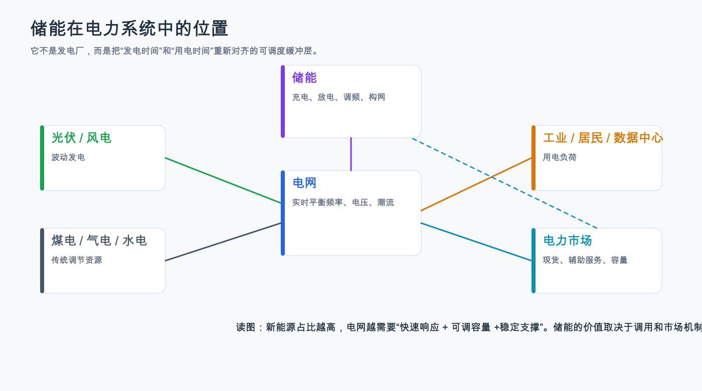
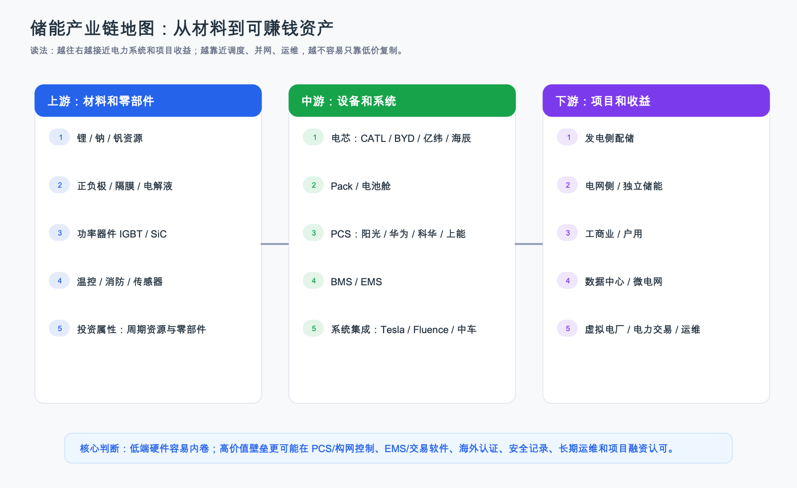
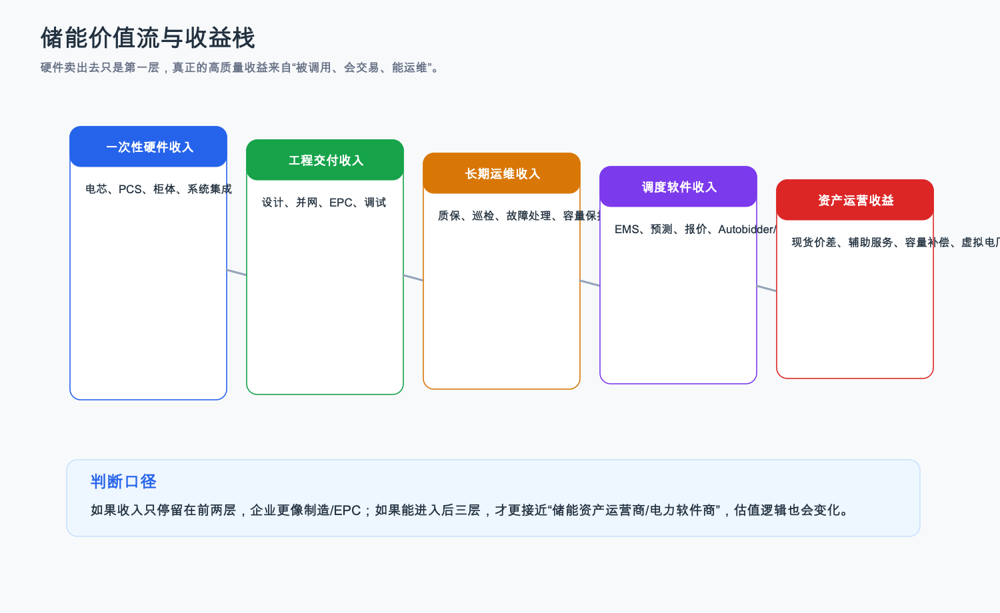

# 储能行业深度调研 - 总览

> **事实性声明**
> 写作日期：2026-06-21；按最新版行业调研 skill 全面重构日期：2026-07-16。本报告用于投资研究框架和候选标的筛选，不构成确定性投资建议或买卖建议。动态事实以文内标注的数据日期、报告期和来源为准。预测、机构估算和公司口径会明确标注；证据不足但重要的问题不会省略，会写成“存疑但重要的问题”。

更新日期：2026-07-16

## 0. 研究边界

| 项目 | 本报告覆盖 | 不覆盖/后续补充 |
|---|---|---|
| 行业范围 | 电化学新型储能为主，重点看电网侧、发电侧、工商业和海外大储 | 抽水蓄能只作为长时储能对照，不做单个电站估值 |
| 区域 | 中国、全球，重点看中国、美国、欧洲、澳洲、中东 | 不逐省/逐州测算 IRR |
| 技术 | LFP 电池储能、BMS、PCS、EMS、温控消防、系统集成、长时储能期权 | 不做电芯材料学细节推导 |
| 公司 | 宁德时代、阳光电源、比亚迪、Tesla、Fluence；华为、中车、海博思创作产业坐标 | 不给确定性买卖建议，不纳入实时估值和目标价 |
| 基金/ETF | 覆盖 A 股场内储能电池 ETF、相邻电池/新能源 ETF 的估值位置、持仓纯度、成交额、折溢价、费率和入场框架 | 不做个性化买卖建议；盘中价格不用于即时交易；跟踪误差待基金定期报告继续核验 |
| 时间 | 行业事实以 2025 年底及 2026 年已发布政策为主；公司以 2025/FY2025 为主 | 2026 年全年业绩和全年装机需后续更新 |
| 读者 | 面向需要理解底层逻辑的投资研究读者 | 不假设读者已懂电力市场 |

## 1. 数据口径和事实性声明

| 项目 | 说明 |
|---|---|
| 主要数据日期 | 中国装机截至 2025 年底；美国新增计划为 2026 年 EIA 计划口径；公司财务更新到 2026Q1/FY2026Q2 可得披露；ETF 行情为 2026-07-16 13:41 盘中研究数据；持仓为 2026Q1；中证储能产业指数估值为 2026-06-30 |
| 最新核验日期 | 2026-07-16 |
| 核心来源 | 国家能源局/国家发改委、IEA、EIA、ACP/Wood Mackenzie、公司年报/SEC/交易所公告、基金公司产品页、AkShare/东方财富/天天基金、理杏仁、中证指数 |
| 主要口径 | GW 是功率，GWh 是容量；装机是投运/并网，出货是厂商发货，二者不能混用 |
| 仍需复核 | 2026 年各省容量电价细则、项目利用小时、2026 年招标价格、部分未上市公司的财务数据、ETF 收盘后最新数据、资金流和跟踪误差 |

## 1.1 存疑但重要的问题

| 问题 | 已证实 | 存疑点 | 为什么重要 | 后续核验点 | 当前证据等级 |
|---|---|---|---|---|---|
| 中国 2026 年容量电价能否显著改善独立储能 IRR | 114 号文已在国家层面明确电网侧独立新型储能容量电价机制 | 各省清单、折算比例、考核、支付来源和执行节奏不同 | 如果容量收入稳定，独立储能从“靠价差赌波动”变成“有底薪的容量资产”；如果落地弱，设备需求可能仍强但项目收益差 | 各省实施细则、入选项目清单、实际补偿金额、调用小时 | A 级政策 + 待项目验证 |
| 国内装机高增是否能转化为设备商利润 | 2025 年中国新增 66.4GW/189.5GWh，累计 144.7GW | 低价竞争、利用不足、回款压力会吞掉增长 | 投资看的是利润和现金流，不是只看 GWh | 系统招标价格、电芯价格、上市公司储能毛利率、应收/存货 | B/C 行业数据 + A/B 公司数据 |
| 各产业链节点到底有多大，谁能留利润 | 终端项目、电芯和系统集成已有 GW/GWh 或公司收入样本；宁德时代、阳光电源、Tesla、Fluence、比亚迪均有公开披露可作为样本 | Pack、纯 PCS、BMS、EMS、温控消防、O&M 的全行业独立收入口径不足 | 投资不是只看“储能很大”，而是看钱先流到哪个节点、哪个节点能把收入留成毛利和现金流 | 纯 PCS 收入、EMS ARR、O&M 合同费率、项目 IRR、系统 ASP、温控消防价值量 | A/B 样本 + C 级待补证 |
| 储能相关 ETF 是否已经反映乐观预期 | 中证储能产业指数 2026-06-30 PE 26.4 倍、PB 3.23 倍；159566/159305 在 2026-07-16 13:41 的上市以来价格分位约 65%/53%，较 60 个交易日前约回撤 20% | 当日数据是盘中值；国证新能源电池最新官方估值分位、当日折溢价和 Q2 份额资金流仍需核验 | 回撤降低了此前的追高风险，但没有自动证明便宜；入场仍要看盈利、纯度和资金拥挤 | 指数 PE/PB、ETF 折溢价、成交额/份额、头部持仓储能利润和现金流 | B/C 混合，动态数据需持续更新 |
| 海外大储是否持续给中国公司高毛利 | 阳光电源 2025 年海外储能发货 36GWh，Tesla 能源分部毛利率较高 | 美国关税、本土内容、认证和供应链重构会改变利润分配 | 海外是很多中国储能公司的利润池，如果本土化成本上升，毛利可能回落 | 美国关税/税收抵免、公司海外毛利率、订单履约损失 | A/B/C 混合 |
| 长时储能是否会替代锂电 | IEA 指出 LFP 已占全球 BESS 部署 90% 以上，长时路线仍在发展 | 液流、压缩空气、钠电、铁空气等商业化节奏差异大 | 关系到电芯、PCS、系统集成和项目运营的长期利润池 | 4 小时以上项目招标、示范项目运行数据、LCOS、融资认可 | B/C，需跟踪 |

这张表怎么读：
- “存疑”不是空白，而是把最容易误导投资判断的地方摆在台面上。
- 本报告会给出当前判断，但这些判断必须和后续核验点绑定，不能写成确定性结论。

## 2. 小白先看：储能到底解决什么问题

储能不是发电机，它本质上是电力系统里的“时间搬运工”和“稳定器”。电力系统有一个很硬的底层约束：发电和用电要几乎实时平衡。煤电、气电可以根据调度调整出力，风电和光伏却受天气和时段影响。光伏中午发得多，晚上负荷可能更高；风电夜间可能更强，但负荷和外送能力不一定匹配。这个错配一旦变大，就会出现弃风弃光、局部电网拥塞、频率波动和备用容量不足。

储能的价值来自这里：它在电多、便宜、甚至不好消纳的时候充电，在电少、贵、系统需要支撑的时候放电。小白可以把它理解成“把中午便宜但用不完的电，搬到傍晚更需要电的时候”。这句话背后的投资含义是：储能需求不是凭空出现的，它取决于电力系统是否真的需要灵活性，以及市场机制是否愿意为这种灵活性付钱。

所以研究储能，不能只看“新能源装机继续增长”。更重要的问题是：谁因为电力波动受损，谁愿意付钱，钱通过什么机制给到储能，储能设备公司能不能把订单变成毛利和现金流。

这张图怎么读：
- 左边是发电侧，右边是用电侧，中间的电网必须实时平衡。储能不是新增电源，而是把电力系统里的时间错配和波动性变得可调度。
- 图里的“电力市场”很重要。储能只有被调用、能参与现货/辅助服务/容量补偿，才可能从设备变成有现金流的资产。
- 对投资判断的用处是提醒我们：不能只问电池卖了多少，还要问电网为什么需要它、谁为它付钱、付费是否稳定。

## 2.1 判断和中间推断的底层逻辑

| 判断/中间推断 | 出现位置 | 为什么会发生 | 传导机制 | 谁付钱 | 谁受益 | 投资含义 | 反证条件 |
|---|---|---|---|---|---|---|---|
| 中国储能仍高增，但需求质量从强配转向市场化用储 | 国内视角、投资结论 | 136 号文取消强配前置条件，114 号文给独立储能容量价值入口 | 行政要求弱化后，项目要靠现货价差、辅助服务、容量电价等收益成立 | 电网侧、独立储能投资方、电力用户、市场化交易主体 | 有真实调度价值的独立储能、PCS/构网、EMS、头部系统集成 | 国内研究重心要从装机数量转向利用小时、容量补偿和项目 IRR | 容量电价落地慢、利用小时低、项目 IRR 不达标 |
| 海外大储利润池通常比国内低价项目更好，但门槛更高 | 全球视角、公司对比 | 海外客户更看重可融资性、安全认证、本土交付和长期服务 | 项目融资方把供应商安全记录、质保、认证写进融资条件 | IPP、公用事业、开发商、数据中心 | 可融资品牌、认证、软件、服务网络强的公司 | 海外高毛利要扣除关税、本土化、认证和履约成本后再判断 | 关税/本土内容挤压毛利，项目延期造成履约损失 |
| 电芯端不是“越大越好”，要看价格周期中毛利能否守住 | 价值链、公司对比 | 电芯是标准化程度较高的大宗制造环节，价格会受产能和原材料周期影响 | ASP 下行时，只有成本、良率、安全和客户验证足够强的公司能留利润 | 系统集成商、项目开发商、电网侧客户 | 宁德时代、比亚迪、亿纬锂能等头部 | 优先看头部成本、安全、储能毛利和现金流，不平均看多电芯 | 储能电芯 ASP 下跌快于成本下降，头部储能毛利率持续下行 |
| PCS/构网和 EMS 的重要性上升 | 技术成熟度、国内视角 | 高新能源电网不只需要电量，还需要频率、电压、惯量和交易优化 | 储能从“电池柜”变成“电网接口 + 调度资产” | 电网、项目业主、售电/聚合商 | 阳光电源、华为、科华数据、上能电气、软件平台 | 看构网项目、并网认证、EMS收费和收益优化，不只看硬件出货 | 构网需求落地慢，PCS 低价化，软件无法独立收费 |
| 节点规模最大，不等于利润池最好 | 产业链节点规模 | 储能每新增 GW/GWh，电芯、电池舱和系统集成会先放量；但这些环节更容易被标准化和价格战影响 | 项目预算先买硬件，利润却要经过 ASP、毛利、回款、质保、软件收费和项目收益机制过滤 | 项目业主、电力市场、系统集成商、服务客户 | 头部电芯、PCS/构网、可融资系统品牌、EMS/运维、项目运营方 | 要把“规模大”和“利润好”拆开，分别看收入、毛利、现金流和证据等级 | 纯硬件低价化、软件不能收费、项目利用小时不足 |
| 系统集成商分化会很大 | 全球视角、公司对比 | 集成商要承担采购、交付、质保、项目延迟和供应链风险 | backlog 只有按期交付且有毛利才会变成价值 | IPP、公用事业、海外客户 | Tesla、阳光电源等强交付公司；Fluence 是观察样本 | 看 backlog 转收入的质量、毛利率、现金流和质保损失 | backlog 增长但亏损、现金流差、履约损失上升 |
| 当前储能是需求成长、制造出清、收益机制验证叠加期 | 周期专题、投资结论 | 风光和海外大储带来需求，但电芯和系统供给成熟后会价格竞争；国内收益机制从强配转向市场化 | 真实需求先变成项目收益，项目收益再决定设备定价，最后才变成公司毛利和现金流 | 电网、项目运营商、电力用户、海外 IPP | 头部电芯、PCS/构网、EMS/运维、可融资系统品牌 | 用三周期框架决定研究节奏，不能只看长期空间 | 装机增长但利用低，ASP 继续下行，毛利和现金流掉队 |
| 行业好不等于 ETF 立刻适合入场 | 基金/ETF估值专题、投资结论 | ETF 买的是股票篮子，价格会提前反映市场预期；7 月中旬价格已从 6 月高位回撤，但主题指数并非纯储能资产 | 行业逻辑先影响持仓公司订单和利润，再影响 ETF；价格回撤只改变交易位置，不等于盈利预期已经见底 | ETF 投资者、场内交易者、基金持有人 | 估值和基本面同时改善的主题工具；真正兑现储能利润的持仓公司 | 当前从“观察偏等待”调整为“观察，满足条件后再评估分批研究”；不是买卖建议 | 盈利继续下修、折溢价扩大、资金重新拥挤，或项目收益机制验证失败 |

这张表怎么读：
- 它不是结论表，而是“判断为什么成立”的索引。正文中看到任何“更好、更受益、风险更大”的说法，都要能回到类似解释链。
- 如果某个判断没有“谁付钱”和“反证条件”，这个判断就还不够投资级。

## 3. 小白概念表

| 术语 | 英文全称 | 中文解释 | 投资意义 |
|---|---|---|---|
| BESS | Battery Energy Storage System | 电池储能系统，包含电池、PCS、BMS、EMS、温控消防和集成 | 当前新型储能主流载体 |
| PCS | Power Conversion System | 储能变流器，把电池直流电和电网交流电互相转换 | 越接近电网接口，越考验电力电子、认证和构网能力 |
| BMS | Battery Management System | 电池管理系统，监测电池状态，防止过充、过放、热失控 | 影响安全、寿命、质保和事故风险 |
| EMS | Energy Management System | 能量管理系统，决定什么时候充、放、交易和参与调度 | 是储能从硬件走向收益优化的入口 |
| 新能源消纳 | Renewable integration | 把风光发出来的电尽量接入系统并有效使用 | 中国储能需求的底层逻辑之一 |
| 容量电价 | Capacity payment | 为“关键时刻能顶上”的能力付钱 | 独立储能收益稳定性的关键变量 |
| bankability | 融资认可 | 银行、保险、开发商相信某供应商可支撑项目融资 | 海外大储的重要壁垒，不只是价格问题 |
| LCOS | Levelized Cost of Storage | 平准化储能成本，把全生命周期成本摊到每度电 | 判断项目经济性，不能只看设备价格 |

这张表怎么读：
- 储能行业最容易误读的是把“设备”当成全部。真正投资判断要把设备、调度、收益机制和融资认可连起来。
- 例如 PCS 不是普通电源盒子。它连接电池和电网，决定能不能安全、稳定、按电网要求充放电，所以在构网型储能里会变得更重要。

## 4. 行业为什么存在：先讲中国为什么重视消纳

中国储能为什么重视“新能源消纳”？底层原因是风电、光伏发电越来越多，但它们不是按人的用电节奏发电。光伏白天强、晚上弱；风电随天气波动。电网又必须保持实时平衡，不能简单把多余电存在电线里。新能源出力高但本地负荷不够、外送通道不够或调峰资源不够时，电网只能限制一部分新能源上网，这就是弃风弃光。

储能在这里的作用不是神奇地创造电，而是改变电的时间位置：在新能源出力高、价格低、甚至本来要被限发的时段充电；在负荷高、电网需要支撑、价格更高的时段放电。这样做对系统有三个好处：第一，减少弃电，提高新能源项目可用电量；第二，提供调频、备用、爬坡等辅助服务，让电网更稳；第三，在电力市场里利用价差或容量补偿形成收入。

这就解释了为什么“消纳”不是一句政策口号，而是需求形成机制：如果新能源占比提高，波动和错配变大，电网就需要更多灵活性；如果政策和电力市场愿意为灵活性付钱，储能项目就有投资回报；如果项目有回报，设备商才有订单；如果订单有合理毛利和回款，上市公司才有投资价值。

## 5. 市场空间和增长驱动

| 指标 | 数值 | 数据日期/报告期 | 口径 | 来源 | 证据等级 | 读法 |
|---|---:|---|---|---|---|---|
| 中国新型储能累计装机 | 144.7GW | 截至 2025 年底 | CNESA DataLink 不完全统计，国家能源局转载 | [国家能源局，2026-01-23](https://www.nea.gov.cn/20260123/c261402548074372b15b799eb36434cb/c.html) | B/C | 中国已是全球最大新型储能市场，但需看利用质量 |
| 中国 2025 年新增投运 | 66.4GW / 189.5GWh | 2025 全年 | 功率/容量，新增投运规模 | [国家能源局，2026-04-17](https://www.nea.gov.cn/20260417/a6ef89bc89eb4814872959c4b10fd731/c.html) | B/C | GW 看功率，GWh 看能量，189.5GWh 对应平均约 2.9 小时 |
| 全球 2025 年电池储能新增 | 108GW | 2025 年 | IEA Global Energy Review 2026，电池储能新增功率 | [IEA](https://www.iea.org/reports/global-energy-review-2026/technology-battery-storage) | B | 全球仍高增，约 80% 为公用事业级 |
| 美国 2025 年储能新增 | 18.9GW | 2025 年 | ACP/Wood Mackenzie，含 utility、C&I、residential | [ACP](https://cleanpower.org/resources/u-s-energy-storage-monitor/) | B | 美国是海外大储利润池和政策风险的关键样本 |
| 美国 2026 年计划新增公用事业级电池储能 | 24GW | 2026 计划 | EIA Preliminary Monthly Electric Generator Inventory | [EIA](https://www.eia.gov/todayinenergy/detail.php?id=67205) | A/B | Texas、California、Arizona 占大头，项目集中度高 |
| LFP 在全球 BESS 部署占比 | 90% 以上 | 2025 年相关评论 | IEA 电池市场评论 | [IEA](https://www.iea.org/commentaries/global-battery-markets-are-growing-strongly-and-so-are-the-supply-risks) | B | 中国 LFP 供应链优势强，但也带来贸易和供应链集中风险 |
| IEA NZE 情景下 2030 年全球储能 | 约 1500GW，其中电池储能约 1200GW | 2030 情景 | IEA Batteries and Secure Energy Transitions，NZE 情景，不是实际装机 | [IEA](https://www.iea.org/reports/batteries-and-secure-energy-transitions/executive-summary) | B | 用来说明长期空间，不作为确定预测 |
| 中国 2025 年新增投运规模相当于全球 2025 年新增电池储能过半 | 66.4GW vs 108GW | 2025 年 | 66.4GW 中国新增投运与 108GW 全球新增电池储能的粗略对比，口径不完全一致 | 国家能源局转载 CNESA + IEA | 推导 | 只能说明中国体量大，不能精确计算全球份额 |

这张表怎么读：
- 先把单位拨正：政策文件常写“亿千瓦”，行业研究常写 GW。1GW = 100 万千瓦 = 0.01 亿千瓦，所以 1.8 亿千瓦 = 180GW。它和 144.7GW、213.3GW 是同一种“功率/装机”口径，可以换算后对比。
- GW 和 GWh 不要混在一起比。GW 看“最多能多快充放电”，GWh 看“总共能存多少电”。66.4GW/189.5GWh 不是两个装机数字，而是一组“功率 + 容量”数字，用 189.5 ÷ 66.4 才能得到约 2.85 小时的平均储能时长。
- 表面上看，中国和全球都是高增长，但投资含义不同。中国的关键是“市场化机制能不能把装机变成项目收益”，海外的关键是“高需求能不能抵消本土化、关税和交付风险”。
- 2025 年中国新增 66.4GW/189.5GWh，平均时长约 2.85 小时，说明电化学储能仍主要服务日内调节。这里从“量”推到“利润池”要多走一步：2-4 小时储能最需要的是成熟 LFP 电芯、能并网和调度的 PCS/EMS、能按期交付的系统集成、能降低故障和质保成本的运维。客户预算会先流向这些能解决日内调节和安全并网的环节。但利润能不能留下，还要看毛利率、回款、利用小时和容量/辅助服务付费。

## 6. 产业链节点规模与利润池尺寸

详见：[储能行业产业链节点规模与利润池](储能行业产业链节点规模与利润池.md)

这一节补的是“每个产业链节点到底有多大”。以前只说“产业链和价值链”，容易让人知道谁可能赚钱，却不知道每个节点的规模锚在哪里。这对投资判断不够，因为一个小而高毛利的节点、一个大而低毛利的节点、一个现在小但未来可能变大的节点，研究方法完全不同。

| 节点 | 规模怎么看 | 钱现在有没有被公开报表验证 | 利润池读法 | 需要继续补证 |
|---|---|---|---|---|
| 终端 BESS/项目建设 | 中国 2025 年新增 66.4GW/189.5GWh，全球 2025 年新增电池储能 108GW，美国 2026 年计划新增公用事业级电池储能 24GW | 政策提到 2027 年目标和约 2500 亿元直接投资，但这是项目投资额 | 需求大，但项目利润取决于利用小时、价差、容量补偿和融资成本 | 项目 IRR、实际调用小时、容量电价执行 |
| 电芯/储能电池系统 | 跟随新增 GWh，是物理规模最大的节点之一 | 宁德时代 2025 年储能电池系统收入 624.40 亿元，毛利率 26.71%；比亚迪出货超 60GWh但未披露储能分部利润 | 规模大，头部有优势，但标准化高，怕 ASP 下行 | 储能电芯 ASP、成本曲线、非上市公司毛利 |
| Pack/电池舱 | 跟随 GWh 和电池舱数量增长 | 多数并入电池系统或系统集成披露，独立口径少 | 单纯拼装壁垒低，安全、热管理、质保决定分化 | 单柜价值量、独立收入、事故和质保成本 |
| PCS/构网 | 跟随 GW，因为 PCS 对应充放电功率 | 阳光电源储能收入 372 亿元、发货 43GWh、毛利率 36.5%，但不是纯 PCS 口径 | 普通 PCS 会价格竞争，构网和并网认证有更高壁垒 | 纯 PCS 收入、构网溢价、认证和项目验收 |
| EMS/交易优化 | 跟随项目数和存量资产增长，市场化程度越高越重要 | Fluence FY2025 ARR 为 1.48 亿美元，其他公司软件收入多未单列 | 如果能提高价差、辅助服务收入和可用率，就有持续收入潜力 | ARR、续费率、收益分成合同 |
| 温控消防/BMS | 每套系统都需要，随 GWh 增长 | 多数作为系统成本项披露 | 安全价值高，但独立议价和独立财务披露弱 | 单 Wh 价值量、标准升级影响、毛利 |
| 系统集成/EPC | 直接跟随项目 GW/GWh 和项目数 | 阳光电源、Tesla、Fluence、比亚迪都有公开样本 | 强品牌和强交付可留利润，弱集成商容易被履约、质保、回款拖累 | backlog 转收入、现金流、质保损失 |
| 项目运营和运维 | 跟随累计装机，存量越大越需要运营和服务 | 项目 IRR 和 O&M 收入口径分散，Fluence ARR 可作为服务样本 | 资产端空间大，但不是装机越多越赚钱；要看收益机制和利用小时 | 利用小时、容量补偿、O&M 费率、可用率 SLA |
| 回收和长时储能 | 中长期跟随退役量和 4 小时以上需求 | 当前公开收入和利润证据不足 | 更像中长期期权，不能写成近期确定利润池 | 退役节奏、LCOS、示范项目运行数据 |

这张表怎么读：

- “规模大”先看物理锚，比如 GW/GWh、累计装机、出货量；“钱有没有流进去”看公司收入、毛利、backlog、ARR；“利润好不好”看毛利率、现金流、可融资性、软件收费、项目 IRR。
- 电芯和系统集成是大节点，但它们不是天然高利润节点。只要产品趋同、供应充足、客户压价，增长就可能被 ASP 下行吃掉。
- PCS/构网、EMS、运维这些节点未必有最大的收入规模，但它们更接近电网稳定、收益优化和长期可用率。它们的投资价值要靠“能不能独立收费、能不能提高项目收益、能不能通过认证和融资认可”来验证。
- 对当前储能研究来说，正确顺序不是“储能高增长 -> 所有节点都好”，而是“储能高增长 -> 哪个节点拿到收入 -> 哪个节点能留毛利和现金流 -> 哪些证据还没有补齐”。

## 7. 行业周期、供需与投资节奏

详见：[储能行业周期、供需与投资节奏](储能行业周期、供需与投资节奏.md)

当前最重要的补充判断是：储能不是一个单一周期，而是三个周期叠在一起。需求端仍是成长周期，制造端已经进入竞争和出清周期，项目端正在从强配逻辑进入市场化收益验证周期。

这句话背后的 why 是：风电、光伏和负荷增长会持续制造灵活性需求，所以行业装机和订单仍有增长基础；但电芯、Pack 和普通系统集成是成熟制造环节，供给扩张快、产品趋同后容易被买方压价；同时国内储能过去一部分需求来自强配，建成后不一定高频调用，现在要看现货价差、辅助服务、容量电价和利用小时能不能一起把项目 IRR 撑起来。

| 周期维度 | 当前判断 | 为什么 | 投资上怎么用 |
|---|---|---|---|
| 需求周期 | 仍在上行 | 中国 2025 年新增 66.4GW/189.5GWh，全球 2025 年新增电池储能 108GW，美国 2026 年计划新增公用事业级电池储能 24GW | 行业不是纯概念，仍值得跟踪 |
| 制造周期 | 普通硬件和集成进入分化 | LFP 主流、供应链成熟，电芯和系统产能扩张后容易价格竞争 | 不能平均看多设备商，要看毛利率、ASP 和现金流 |
| 收益机制周期 | 从政策配套转向项目收益验证 | 136 号文弱化强配，114 号文建立容量电价入口，但各省执行和项目调用仍要验证 | 国内研究重点是利用小时、容量补偿、项目 IRR |
| 海外周期 | 需求强，但门槛提高 | 海外客户看 bankability、认证、本土化、长期服务和交付记录 | 海外高毛利要扣除关税、本土内容和履约风险 |
| 预期周期 | 市场容易把“高增长”直接外推成“高利润” | 投资者常先看到装机和订单，后看到毛利、回款和质保 | 每次跟踪都要问：增长有没有变成利润和现金流 |

这张表怎么读：
- 如果只看需求周期，储能很容易显得什么都好；但制造周期和收益机制周期会告诉我们，增长的钱不一定留在所有公司手里。
- 对投资判断更有用的顺序是：先看项目为什么建、建完是否被调用，再看谁为储能付钱，最后看设备商能否把订单变成毛利和现金流。
- 未来 4-8 个季度，最关键的跟踪项不是再找更多长期空间数据，而是容量电价细则、利用小时、系统招标价格、公司储能毛利率、应收存货、海外项目履约。

## 8. 子产业链与价值流

最新版交付不再用一张总产业链图代替所有细分业务。七条核心子链、边界、收入确认和防重复计算规则见：[储能行业子产业链覆盖矩阵](储能行业子产业链覆盖矩阵.md)。每条子链都有独立交易图和逐层经济表：

1. [储能电芯、电池舱与热安全](储能电芯、电池舱与热安全.md)
2. [储能 PCS、构网与并网设备](储能PCS、构网与并网设备.md)
3. [储能 EMS、交易优化与聚合](储能EMS、交易优化与聚合.md)
4. [储能系统集成、EPC 与长期服务](储能系统集成、EPC与长期服务.md)
5. [电源侧与电网侧储能资产](电源侧与电网侧储能资产.md)
6. [工商业与户用分布式储能](工商业与户用分布式储能.md)
7. [长时储能装备与项目](长时储能装备与项目.md)

这么拆的 why 是：卖电芯、做 EPC、卖软件和持有电站的付费方、收入确认、资本占用和风险完全不同。行业装机增长会同时带来订单，但利润可能被价格战、营运资金、低利用率或研发投入截断，不能把七条链平均看多。

这张图怎么读：
- 从上游材料/电芯，到中游 Pack、PCS、BMS、EMS、温控消防和系统集成，再到下游项目运营，每一层赚的钱都不一样。
- 上游更像制造业，怕价格周期；中游靠安全、并网、交付和认证分化；下游项目运营靠电价、容量补偿、利用小时和融资成本赚钱。

这张图怎么读：
- 一次性硬件收入和工程交付收入更接近制造/EPC，订单来得快，但价格战和项目履约压力也大。
- 长期运维、调度软件和资产运营收益更接近持续收入，但前提是客户愿意单独付费，或者项目规则允许储能通过价差、辅助服务、容量补偿赚钱。
- 对投资判断的用处是把“高增长”拆开：收入可能先在硬件层出现，利润质量可能在后面的软件、运维、融资认可和资产收益里体现。

| 环节 | 怎么收费 | 谁付钱 | 利润为什么能/不能留下 | 代表公司 | 反证条件 |
|---|---|---|---|---|---|
| 电芯 | 按 Wh/GWh 卖电芯或电池系统 | 系统集成商、项目业主 | 规模、良率、安全和供应链强的头部能留利润；但电芯标准化程度高，产能过剩会压 ASP | 宁德时代、比亚迪、亿纬锂能、海辰储能 | 储能电芯毛利率持续下滑，ASP 跌快于成本 |
| Pack/电池舱 | 按柜/舱销售 | 系统集成商、项目业主 | 单纯拼装壁垒低，安全、热管理、质保和集成能力决定分化 | 宁德时代、比亚迪、海博思创等 | 同质化低价中标，事故率上升 |
| PCS/构网 | 卖变流器、交流侧平台、并网方案 | 系统集成商、电站业主、电网侧客户 | 连接电池和电网，涉及电力电子、算法、并网认证和故障记录，壁垒高于普通结构件 | 阳光电源、华为、科华数据、上能电气 | 构网需求落地慢，PCS 价格快速下行 |
| EMS/交易软件 | 软件、订阅、交易优化、运维 | 电站业主、聚合商、售电公司 | 如果能提高价差收益、辅助服务收入和安全运维，就有高毛利潜力；但目前很多软件仍附属于硬件 | Tesla Autobidder、Fluence Mosaic、阳光 PowerBidder | ARR 增长慢，软件无法独立收费 |
| 系统集成/EPC | 交钥匙项目、集成设备和工程服务 | IPP、公用事业、电力集团、工商业客户 | 强品牌、交付、安全和融资认可者能拿到毛利；低端集成商承担履约风险但定价权弱 | Tesla、阳光电源、Fluence、比亚迪、中车 | backlog 增加但亏损、应收和存货恶化 |
| 项目运营 | 持有电站，赚价差、容量、辅助服务 | 电力市场、电网、电力用户 | 本质是资产收益率，取决于利用小时、价差、容量补偿和融资成本 | 电力集团、IPP、独立储能投资方 | 利用小时低、补偿不足、IRR 不达标 |

这张表怎么读：
- 不要把“储能增长”平均分给所有环节。越标准化、越容易替换的环节越容易价格战；越靠近电网接口、调度收益、安全责任和融资认可的环节，越可能留住利润。
- 这也是为什么同样叫系统集成，Tesla、阳光电源和普通集成商不是同一类资产。强者能把品牌、安全记录、软件和服务写进项目融资逻辑，弱者只是低价交付设备。

## 9. 国内和全球不是一套赚钱逻辑

| 维度 | 中国市场 | 全球/海外大储 |
|---|---|---|
| 底层问题 | 新能源消纳、电网调节、局部保供、强配退潮后的独立储能收益机制 | 光伏高渗透、极端天气、负荷增长、数据中心、电网容量紧张 |
| 付费机制 | 现货价差、辅助服务、容量电价、容量租赁、工商业峰谷套利 | 电力市场套利、容量/资源充足性、PPA、税收抵免、本土化项目收益 |
| 竞争焦点 | 价格竞争强，项目多但毛利分化大 | 认证、安全、交付、bankability、本土内容和长期服务更重要 |
| 受益环节 | 低成本电芯、PCS/构网、头部系统集成、EMS/运维 | 可融资品牌、软件调度、海外交付、服务网络、本土供应链 |
| 最大误读 | 装机高增等于企业都赚钱 | 海外价格高等于中国公司利润一定高 |

这张表怎么读：
- 国内和海外的共同点是都需要灵活性；不同点是“谁为灵活性付钱”的方式不同。
- 中国正在从行政配置转向市场化付费，所以要看政策细则和调用小时。海外客户更在意项目融资能否闭环，所以要看认证、质保、保险、关税和本土化。

## 10. 技术成熟度和发展趋势

详见：[储能行业技术成熟度与发展趋势](储能行业技术成熟度与发展趋势.md)

| 技术/环节 | 当前成熟度 | 未来 1-3 年发展方向 | 投资含义 | 反证条件 |
|---|---|---|---|---|
| LFP 电池储能 | 大规模商业化 | 更大电芯、更高系统集成度、更长寿命、更低成本 | 短期主利润池仍在 LFP 体系，但要看价格周期 | LFP 安全事故上升，毛利持续下滑 |
| PCS/构网控制 | 从跟网成熟走向构网快速验证 | 弱电网、高新能源地区要求构网能力 | 价值从硬件转向电网稳定解决方案 | 构网项目不放量，认证标准分散 |
| EMS/交易优化 | 成长期 | 从监控走向市场交易、预测和运维优化 | 软件化潜力高，但收入需验证 | ARR 低，客户不愿单独付费 |
| 液流/压缩空气/钠电/铁空气 | 示范到早期商业化不等 | 长时储能、低成本材料、安全性 | 远期期权，不应写成近期业绩确定贡献 | 示范项目 LCOS 不达标，融资认可不足 |

这张表怎么读：
- 成熟技术看成本、份额、毛利和现金流；成长期技术看验证项目、订单质量和融资认可；早期技术只能作为长期期权。
- 储能的技术进步不只是“电池更大”，还包括系统更安全、PCS 更能支撑电网、EMS 更会赚钱、运维更能降低故障和质保成本。

## 11. 公司地图

| 公司 | 投资研究定位 | 为什么这样判断 | 主要跟踪点 |
|---|---|---|---|
| 宁德时代 | 电芯端最强财务样本 | 2025 年储能电池系统收入和毛利率单独披露，规模、安全和客户验证强 | 储能毛利率、海外占比、电芯价格、现金流 |
| 阳光电源 | A 股储能系统和 PCS/构网优先样本 | 储能收入、毛利率、发货和海外结构较清楚，PCS/构网提高壁垒 | 储能毛利率、海外交付、构网项目、现金流 |
| 比亚迪 | 垂直整合和大项目样本 | 从电芯到系统能力强，出货规模大，但储能财务分部不够透明 | 储能收入/毛利披露、海外项目、汽车业务波动 |
| Tesla | 海外大储高毛利样本 | Megapack、软件调度、品牌和能源分部毛利提供参照 | 部署 GWh、能源毛利率、Megafactory 产能、关税 |
| Fluence | 纯系统集成商盈利压力样本 | backlog 高但 FY2025 仍净亏损，说明高增长赛道也会有履约和毛利压力 | backlog 转收入、ARR、毛利率、现金 |

这张表怎么读：
- 不能因为公司都叫“储能”就直接比较估值。宁德时代是电芯制造，阳光电源是 PCS+系统，Tesla 是全球大储品牌和软件调度，Fluence 是纯集成和软件化样本，它们赚钱的机制不同。

## 12. 行业相关基金/ETF估值与入场节奏

详见：[储能行业相关基金与ETF估值入场](储能行业相关基金与ETF估值入场.md)

这一节补的是“如果不直接买公司，而是通过行业基金/ETF参与，当前贵不贵、纯不纯、能不能入场”。它和公司研究不是一回事：公司研究看订单、收入、毛利、现金流和壁垒；ETF 研究还要看跟踪指数、持仓纯度、估值分位、折溢价、成交额、费率、跟踪误差、份额变化和资金流。

| 工具 | 当前定位 | 核心数据 | 当前研究状态 | 为什么 |
|---|---|---|---|---|
| 159566 储能电池ETF易方达 | 储能电池主题主工具 | 2026-07-16 13:41 盘中价 1.877 元，上市以来价格分位约 65%，近 20 日均成交额约 4.13 亿元 | 观察 | 6 月高位风险已部分释放，流动性较好；但价格分位不是估值，Q2 持仓和资金流仍缺 |
| 159305 储能电池ETF广发 | 同主题小规模备选 | 2026-07-16 13:41 盘中价 0.834 元，上市以来价格分位约 53%，近 20 日均成交额约 0.88 亿元 | 观察 | 价格位置更中性，但规模和成交弱于 159566，工具层风险更高 |
| 广义电池 ETF | 电池链条工具 | 159755、159796、561910 等，持仓更宽，动力电池和材料影响更大 | 可观察，但不当作纯储能工具 | 储能敞口被动力电池、材料和汽车链条稀释 |
| 新能源/光伏 ETF | 相邻情绪和需求观察工具 | 516160、515790 等，价格分位低一些但储能纯度也低 | 只作辅助观察 | 它们能反映新能源链条情绪，却不能直接代表储能投资工具 |

这张表怎么读：
- 先看“当前定位”。159566/159305 更像储能电池主题工具，广义电池 ETF 更像电池链条工具，新能源/光伏 ETF 只是相邻观察工具。
- 再看“当前研究状态”。7 月中旬回撤后不再沿用 6 月末“观察偏等待”的旧结论，改为“观察”。这只说明追高风险下降，不说明已经达到确定的低估区间。
- 最容易误读的是：看到“储能行业需求强”，就推导出“储能 ETF 现在就便宜”。真正的传导链是：行业需求 -> 持仓公司订单和利润 -> 市场预期 -> ETF 价格。任何一环不成立，ETF 的风险收益都会变化。
- 后续如果要从“观察”转向“分批研究”，需要同时看到：指数估值没有靠盈利下修被动抬高、头部公司储能毛利和现金流企稳、容量电价与利用小时验证、ETF 折溢价稳定、Q2 份额和资金流不过度拥挤。

## 13. 行业 ROIC、资本成本与估值隐含预期

储能没有一个可直接引用的统一行业 ROIC，因为七条子链的资本结构不同。电芯和 PCS 是制造业，要看产线、库存和应收占用后的 ROIC；系统集成是项目制，要看履约毛利和营运资金；电站是重资产，要看项目 IRR 是否高于融资成本；软件要看 ARR、研发获客和自由现金流。把所有公司放进同一个 PE 表，会掩盖真正风险。

| 经济模型 | 当前可用回报锚 | 研究资本成本假设 | 当前判断 | 隐含预期怎么反推 |
|---|---|---|---|---|
| 头部电芯/系统制造 | 宁德时代储能分部 2025 年毛利率 26.71%，但分部 ROIC 和现金流缺口仍在 | 股权和债务加权资本成本情景 8%-10% | 头部可能高于资本成本，普通产能未必 | 估值需要储能销量增长、毛利守住和现金转化同时成立 |
| PCS/强系统品牌 | 阳光储能分部 2025 年毛利率 36.5%，2026Q1 公司收入和利润同比下滑 | 资本成本情景 8%-10% | 高毛利存在，但项目时点、汇率和回款会让季度波动很大 | 市场若按高增长定价，就要求海外订单和毛利可重复，而不是一次大单 |
| 系统集成 | Fluence FY2026Q2 毛利率 10.0%，季度净亏损且半年自由现金流 -2.85 亿美元 | 资本成本情景 9%-12% | 当前回报低于资本成本，backlog 还没有转成可分配价值 | 高估值只能由毛利改善、营运资金释放和持续收入占比上升支持 |
| 储能电站 | 100MW/200MWh 情景项目 IRR 约 4%-12% | 项目资本成本情景 6%-9% | 只有收入栈清楚的项目可能创造价值 | 若容量收入和利用小时低于假设，IRR 会掉到资本成本以下 |

这张表中的资本成本是研究假设，不是市场事实。它的作用是强迫判断回到现金：行业增长只有在新增资本能够赚到高于资本成本的回报时，才真正创造公司价值。最强反方情景是装机继续增长，但设备价格、项目利用率和自由现金流同时走弱。

截至 2026-06-30，中证储能产业指数滚动 PE 26.4 倍、PB 3.23 倍、股息率 1.10%，过去一个月回报 -9.50%。这组估值不是极端便宜或极端昂贵的充分证据，只能说明市场仍在为成长和利润修复付费。若用 26.4 倍 PE 粗略反推，投资者需要相信未来盈利能持续增长并且周期下行不会吞掉现金；若头部公司盈利下修，PE 可能在股价不变时被动变贵。

## 14. 初步投资结论

我的当前研究判断是：储能值得继续研究，但研究重点应从“行业高增”转到“周期位置、收益机制、利润留存和反证”。行业层面的增长证据很强：中国 2025 年新增投运 66.4GW/189.5GWh，全球 2025 年新增电池储能 108GW，美国 2026 年计划新增 24GW 公用事业级电池储能。可是投资层面的关键不是这些数字本身，而是增长的钱最后被谁赚走。

更值得优先深挖的方向有四类。第一是头部电芯，前提是价格周期里还能守住储能毛利；第二是 PCS/构网和电网接口，因为新能源占比提高后，电网需要的不只是能量，还有稳定性；第三是海外可融资系统品牌，因为海外项目愿意为安全、认证、交付和长期服务付费；第四是 EMS/交易优化和运维，但这个方向需要 ARR 或分成收入证明，不能只听软件故事。

如果通过 ETF 参与，当前还要多加一层估值判断。7 月中旬价格较 60 个交易日前回撤约 20%，此前的高位风险已经部分释放，但价格回撤不等于盈利预期见底。当前更适合“观察并设触发条件”：只有估值、盈利、容量机制、折溢价和资金拥挤同时改善，才重新评估是否进入分批研究状态。

风险也很清楚。国内如果容量电价和辅助服务落地慢，储能会继续面临“建得多、用得少、收益低”的问题；设备端如果招标价格继续快速下行，收入增长可能被毛利下滑抵消；海外如果关税和本土内容要求强化，中国供应链的成本优势会被重新分配；技术端如果安全事故频发，保险、认证和项目融资都会收紧；ETF 层面如果估值高位继续抬升但盈利没有验证，主题交易会放大波动。

## 15. 跟踪指标和反证

| 指标 | 看什么 | 为什么重要 | 信号解释 |
|---|---|---|---|
| 各省容量电价和可靠容量补偿细则 | 补偿水平、清单制、考核、支付来源 | 决定独立储能现金流稳定性 | 越清晰越利好项目 IRR，越模糊越偏主题炒作 |
| 新型储能利用小时和调用次数 | 建成后是否真的被调度 | 装机不等于价值，调用才说明系统需要它 | 利用小时低是行业核心反证 |
| 储能项目单位经济 | 项目 IRR、容量补偿、辅助服务、峰谷价差、融资成本 | 需求只有变成项目收益，才会继续支撑高质量订单 | IRR 不达标会压设备价格和新增投资 |
| 储能系统和电芯招标价格 | ASP 是否继续下行 | ASP 跌快于成本会压设备商毛利 | 价格战会淘汰低端，也会压短期盈利 |
| 产业链节点规模和价值量 | 电芯、Pack、PCS、BMS、EMS、温控消防、系统集成、O&M 的收入、毛利、价值量和价格 | 判断钱先流到哪个节点，以及哪个节点能把收入留成利润 | 只有物理规模、没有金额和利润证据时，结论要标成待核验 |
| 头部公司储能毛利率和现金流 | 增长能否变成利润和现金 | 投资最终看利润质量 | 收入增、毛利降、应收升是黄灯 |
| 储能相关 ETF 估值分位、折溢价和成交额 | 国证新能源电池 PE/PB 分位，159566/159305 价格分位、折溢价、成交额、份额变化、资金流、跟踪误差 | 判断行业逻辑是否已经被市场提前定价，以及 ETF 交易热度是否过高 | 估值回落但基本面未坏是好信号；高位放量、份额快速涌入、折溢价扩大或盈利未验证是黄灯 |
| 海外订单履约 | 交付、关税、本土内容、质保损失 | 海外毛利高但履约复杂 | 项目延迟和损失增加会打折海外逻辑 |
| 安全事故与标准变化 | 热失控、消防、召回、保险 | 安全是 BESS bankability 底层 | 标准提高利好头部，事故上升压行业估值 |

## 16. 事实核验表

| 事实/数据 | 日期/报告期 | 口径 | 来源 | 证据等级 | 备注 |
|---|---|---|---|---|---|
| 中国新型储能累计装机 144.7GW，同比增加 85% | 截至 2025 年 12 月底 | CNESA DataLink 不完全统计，国家能源局转载 | [国家能源局，2026-01-23](https://www.nea.gov.cn/20260123/c261402548074372b15b799eb36434cb/c.html) | B/C | 行业口径，适合看趋势 |
| 中国 2025 年新增投运 66.4GW/189.5GWh | 2025 年全年 | 新型储能新增投运功率/容量 | [国家能源局，2026-04-17](https://www.nea.gov.cn/20260417/a6ef89bc89eb4814872959c4b10fd731/c.html) | B/C | GW/GWh 不可混用 |
| 2027 年全国新型储能装机目标 1.8 亿千瓦（=180GW）以上，带动项目直接投资约 2500 亿元 | 2025-2027 | 政策目标 | [国家发改委/国家能源局，2025-09-12](https://www.ndrc.gov.cn/xxgk/zcfb/tz/202509/t20250912_1400425.html) | A | 政策目标不是利润承诺 |
| 136 号文不得将配储作为新建新能源项目核准、并网、上网前置条件 | 2025-02-09 | 政策文件 | [国家发改委](https://www.ndrc.gov.cn/xxgk/zcfb/tz/202502/t20250209_1396066.html) | A | 强配逻辑弱化 |
| 114 号文建立电网侧独立新型储能容量电价机制 | 2026-01-30 | 政策文件 | [国家发改委](https://www.ndrc.gov.cn/xxgk/zcfb/tz/202601/t20260130_1403524.html) | A | 独立储能收益入口 |
| 2025 年全球新增电池储能 108GW，约 80% 为公用事业级 | 2025 年 | IEA Global Energy Review 2026 | [IEA](https://www.iea.org/reports/global-energy-review-2026/technology-battery-storage) | B | 全球高增 |
| IEA NZE 情景下 2030 年全球储能约 1500GW，其中电池储能约 1200GW | 2030 情景 | IEA Batteries and Secure Energy Transitions，NZE 情景 | [IEA](https://www.iea.org/reports/batteries-and-secure-energy-transitions/executive-summary) | B | 情景目标，不是实际装机 |
| 中国 2025 年新增投运规模相当于全球 2025 年新增电池储能过半 | 2025 年 | 66.4GW 与 108GW 粗略对比，口径不完全一致 | [国家能源局](https://www.nea.gov.cn/20260417/a6ef89bc89eb4814872959c4b10fd731/c.html)、[IEA](https://www.iea.org/reports/global-energy-review-2026/technology-battery-storage) | 推导 | 只能说明中国体量大，不作为精确市占率 |
| 2025 年美国储能新增 18.9GW，同比增长 52% | 2025 年 | ACP/Wood Mackenzie | [ACP](https://cleanpower.org/resources/u-s-energy-storage-monitor/) | B | 美国市场强 |
| 美国 2026 年计划新增公用事业级电池储能 24GW | 2026 年计划 | EIA 计划口径 | [EIA](https://www.eia.gov/todayinenergy/detail.php?id=67205) | A/B | 计划不等于最终投运 |
| LFP 占全球 BESS 部署 90% 以上 | 2025 年相关评论 | IEA 电池市场评论 | [IEA](https://www.iea.org/commentaries/global-battery-markets-are-growing-strongly-and-so-are-the-supply-risks) | B | 中国供应链优势 |
| CATL 2025 年收入 4237 亿元，储能电池系统毛利率 26.71% | 2025 年 | 公司年报 | [宁德时代 2025 年报](https://www1.hkexnews.hk/listedco/listconews/sehk/2026/0310/2026031000040_c.pdf) | A | 电芯端财务样本 |
| 阳光电源 2025 年储能发货 43GWh，储能收入 372 亿元、毛利率 36.5% | 2025 年 | 年报摘要/IR 口径 | [阳光电源年报摘要](https://cn.sungrowpower.com/uploads/files/202604/2c4b6d5c6e1c13d8630e6f3c4148d01d.pdf)、[IR 记录](https://pdf.dfcfw.com/pdf/H2_AN202604011820939367_1.pdf) | A/B | PCS+系统样本 |
| 比亚迪 2025 年全球储能系统出货超 60GWh | 2025 年 | 公司年报 | [比亚迪 2025 年报](https://www1.hkexnews.hk/listedco/listconews/sehk/2026/0327/2026032703008.pdf) | A | 储能规模样本，但储能收入和毛利未单独披露 |
| Tesla 2025 年储能部署 46.7GWh | 2025 年 | SEC 披露 | [Tesla Q4 deployment release](https://www.sec.gov/Archives/edgar/data/1318605/000162828026000016/exhibit9914.htm) | A | 海外大储样本 |
| Fluence FY2025 收入 23 亿美元、backlog 约 53 亿美元、ARR 1.48 亿美元、净亏损 6800 万美元 | FY2025 | 公司业绩公告 | [Fluence FY2025 results](https://ir.fluenceenergy.com/news-releases/news-release-details/fluence-energy-inc-reports-2025-financial-results-and-initiates/) | A/B | 纯集成商和软件化样本，说明高增长也要看盈利 |
| 159566 储能电池ETF易方达跟踪国证新能源电池指数 | 2026-06-30 访问 | 基金公司产品页/业绩比较基准 | [易方达基金](https://www.efunds.com.cn/Mobile/fund/159566.shtml) | B | 储能电池主题主工具，但不是纯储能电站现金流 |
| 159305 储能电池ETF广发业绩比较基准为国证新能源电池指数收益率 | 2026-06-30 访问 | 基金公司产品页/业绩比较基准 | [广发基金](https://www.gffunds.com.cn/funds/?fundcode=159305) | B | 同主题备选，规模和成交弱于 159566 |
| 中证储能产业指数 PE 26.4、PB 3.23、股息率 1.10%、近一月回报 -9.50% | 2026-06-30 | 中证指数月度事实表 | [中证指数](https://oss-ch.csindex.com.cn/static/html/csindex/public/uploads/indices/detail/files/zh_CN/931746factsheet.pdf) | B | 储能产业链指数参考，不等于 159566/159305 的跟踪指数 |
| 159566/159305 盘中价 1.877/0.834 元，上市以来价格分位约 65.02%/52.66%，20 日均成交额约 4.13/0.88 亿元 | 2026-07-16 13:41 | AkShare fund_etf_hist_em，东方财富上游，前复权历史行情 | AkShare/东方财富接口 | C | 盘中研究数据，不是最终收盘；价格分位不是估值分位；第二次请求出现 ProxyError，未重试风暴 |
| Tesla 2026Q2 储能部署 13.5GWh | 2026Q2 | 公司部署口径，财务结果将于 2026-07-22 发布 | [SEC Exhibit 99.1](https://www.sec.gov/Archives/edgar/data/1318605/000162828026046717/exhibit99111111.htm) | A | 部署量不是收入或利润 |
| Fluence FY2026Q2 收入 4.649 亿美元、毛利率 10.0%、季度净亏损 2924 万美元、半年自由现金流 -2.854 亿美元 | 截至 2026-03-31 | 公司 GAAP/非 GAAP 口径 | [Fluence FY2026Q2](https://ir.fluenceenergy.com/news-releases/news-release-details/fluence-energy-inc-reports-second-quarter-2026-results-reaffirms) | B | 说明 backlog 和收入增长仍需经过利润与现金验证 |

## 17. 小白审核记录

2026-07-16 版本新增覆盖矩阵、七条核心子链独立文档和交易图，并重做周期、估值和动态数据。旧版审核结论不沿用；本版独立小白审核和投资红队记录见 [储能行业小白审核结果](储能行业小白审核结果.md)。

## 来源

- 国家能源局/国家发改委：新型储能装机、136 号文、114 号文、2025-2027 专项行动方案。
- IEA：Global Energy Review 2026、全球电池市场评论。
- EIA、ACP/Wood Mackenzie：美国储能新增和计划。
- 公司公告：宁德时代、阳光电源、Tesla、Fluence、比亚迪。
- 基金/ETF：易方达基金、广发基金、天天基金、AkShare/东方财富、理杏仁、中证指数。
