# 储能行业深度调研

更新日期：2026-07-16

这是储能行业投研资料的入口页。新版报告按投资阅读路径拆成多个文件，避免一个长文里同时塞概念、政策、全球、公司和事实表。

## 阅读顺序

1. [储能行业深度调研 - 总览](储能行业深度调研%20-%20总览.md)
2. [储能行业深度调研 - 国内视角](储能行业深度调研%20-%20国内视角.md)
3. [储能行业深度调研 - 全球视角](储能行业深度调研%20-%20全球视角.md)
4. [储能行业子产业链覆盖矩阵](储能行业子产业链覆盖矩阵.md)
5. [储能行业产业链节点规模与利润池](储能行业产业链节点规模与利润池.md)
6. [储能行业周期、供需与投资节奏](储能行业周期、供需与投资节奏.md)
7. [储能行业相关基金与ETF估值入场](储能行业相关基金与ETF估值入场.md)
8. [储能行业技术成熟度与发展趋势](储能行业技术成熟度与发展趋势.md)
9. [储能行业公司财务与业务对比表](储能行业公司财务与业务对比表.md)
10. [储能行业术语表](储能行业术语表.md)
11. [储能行业小白审核结果](储能行业小白审核结果.md)

### 七条子产业链

- [储能电芯、电池舱与热安全](储能电芯、电池舱与热安全.md)
- [储能PCS、构网与并网设备](储能PCS、构网与并网设备.md)
- [储能EMS、交易优化与聚合](储能EMS、交易优化与聚合.md)
- [储能系统集成、EPC与长期服务](储能系统集成、EPC与长期服务.md)
- [电源侧与电网侧储能资产](电源侧与电网侧储能资产.md)
- [工商业与户用分布式储能](工商业与户用分布式储能.md)
- [长时储能装备与项目](长时储能装备与项目.md)

## 核心图表

[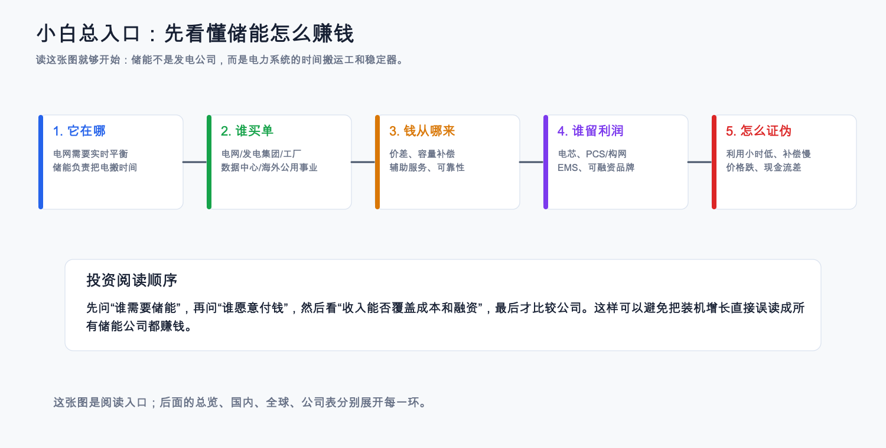](https://github.com/teazean/obsidian-vault-invest/blob/master/%E6%8A%95%E8%B5%84%E7%A0%94%E7%A9%B6/%E4%BA%A7%E4%B8%9A%E4%B8%93%E9%A2%98/%E5%82%A8%E8%83%BD%E8%A1%8C%E4%B8%9A/assets/%E5%82%A8%E8%83%BD%E5%B0%8F%E7%99%BD%E6%80%BB%E5%85%A5%E5%8F%A3%E5%9B%BE.png)

[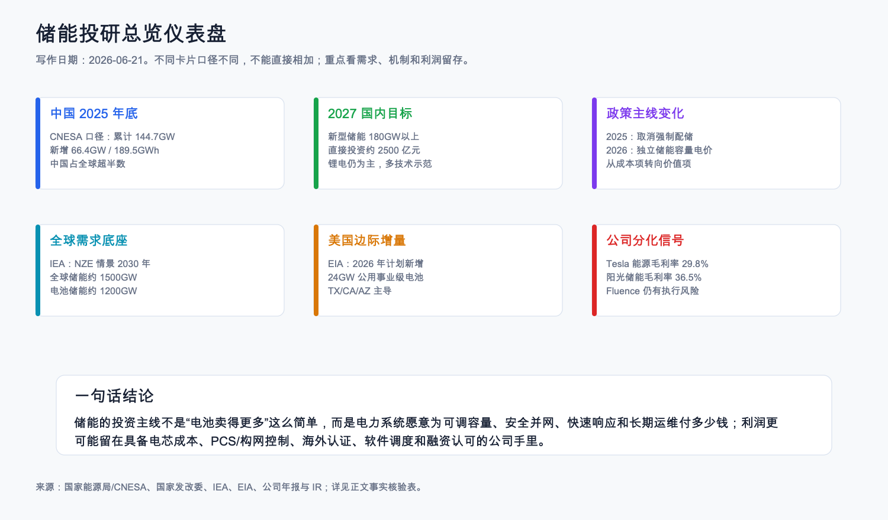](https://github.com/teazean/obsidian-vault-invest/blob/master/%E6%8A%95%E8%B5%84%E7%A0%94%E7%A9%B6/%E4%BA%A7%E4%B8%9A%E4%B8%93%E9%A2%98/%E5%82%A8%E8%83%BD%E8%A1%8C%E4%B8%9A/assets/%E5%82%A8%E8%83%BD%E6%8A%95%E7%A0%94%E6%80%BB%E8%A7%88%E4%BB%AA%E8%A1%A8%E7%9B%98.png)

[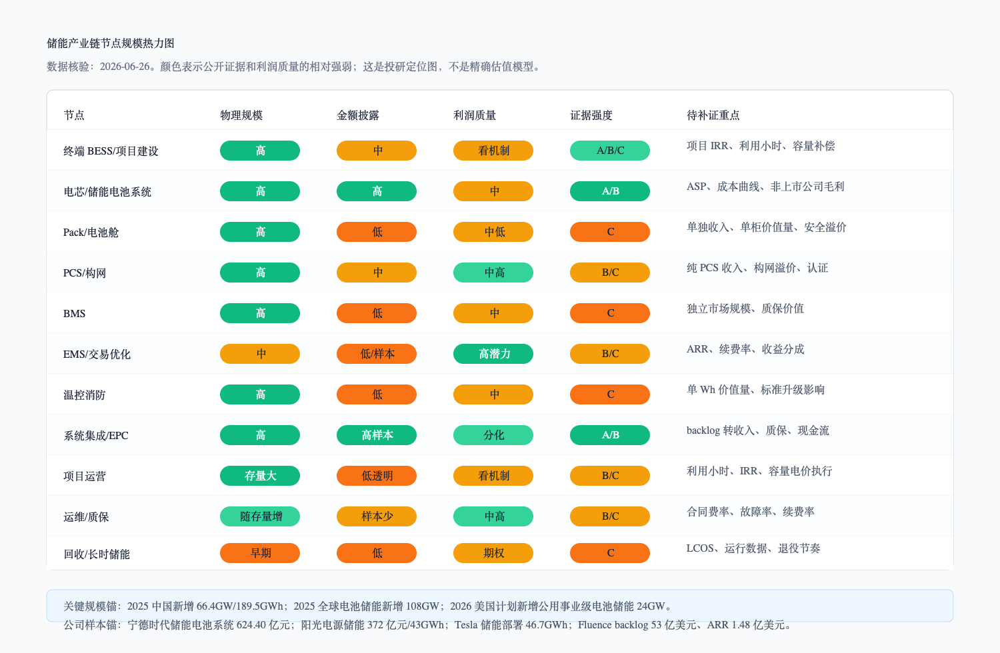](https://github.com/teazean/obsidian-vault-invest/blob/master/%E6%8A%95%E8%B5%84%E7%A0%94%E7%A9%B6/%E4%BA%A7%E4%B8%9A%E4%B8%93%E9%A2%98/%E5%82%A8%E8%83%BD%E8%A1%8C%E4%B8%9A/assets/%E5%82%A8%E8%83%BD%E4%BA%A7%E4%B8%9A%E9%93%BE%E8%8A%82%E7%82%B9%E8%A7%84%E6%A8%A1%E7%83%AD%E5%8A%9B%E5%9B%BE.png)

[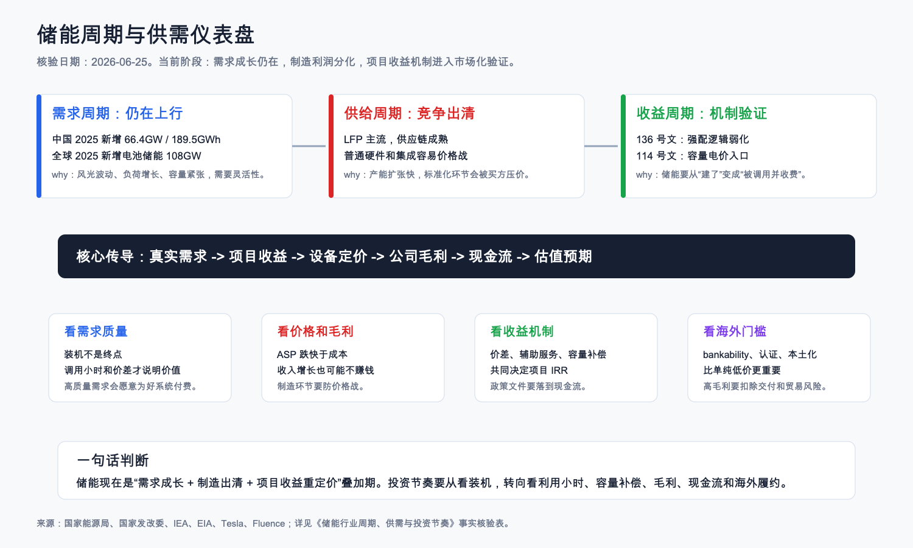](https://github.com/teazean/obsidian-vault-invest/blob/master/%E6%8A%95%E8%B5%84%E7%A0%94%E7%A9%B6/%E4%BA%A7%E4%B8%9A%E4%B8%93%E9%A2%98/%E5%82%A8%E8%83%BD%E8%A1%8C%E4%B8%9A/assets/%E5%82%A8%E8%83%BD%E5%91%A8%E6%9C%9F%E4%B8%8E%E4%BE%9B%E9%9C%80%E4%BB%AA%E8%A1%A8%E7%9B%98.png)

[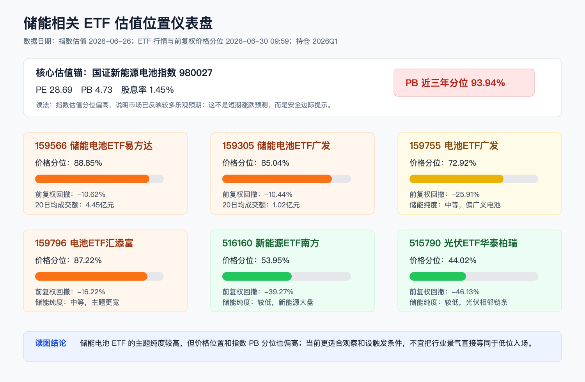](https://github.com/teazean/obsidian-vault-invest/blob/master/%E6%8A%95%E8%B5%84%E7%A0%94%E7%A9%B6/%E4%BA%A7%E4%B8%9A%E4%B8%93%E9%A2%98/%E5%82%A8%E8%83%BD%E8%A1%8C%E4%B8%9A/assets/%E5%82%A8%E8%83%BDETF%E4%BC%B0%E5%80%BC%E4%BD%8D%E7%BD%AE%E4%BB%AA%E8%A1%A8%E7%9B%98.png)

## 图表目录

| 类型 | 图表 | 用途 |
|---|---|---|
| 核心 |  | 小白阅读入口，先分清谁买单和钱从哪来 |
| 核心 |  | 关键数据、政策和公司分化 |
| 核心 |  | 判断各产业链节点的物理规模、金额披露、利润质量和证据强度 |
| 核心 | [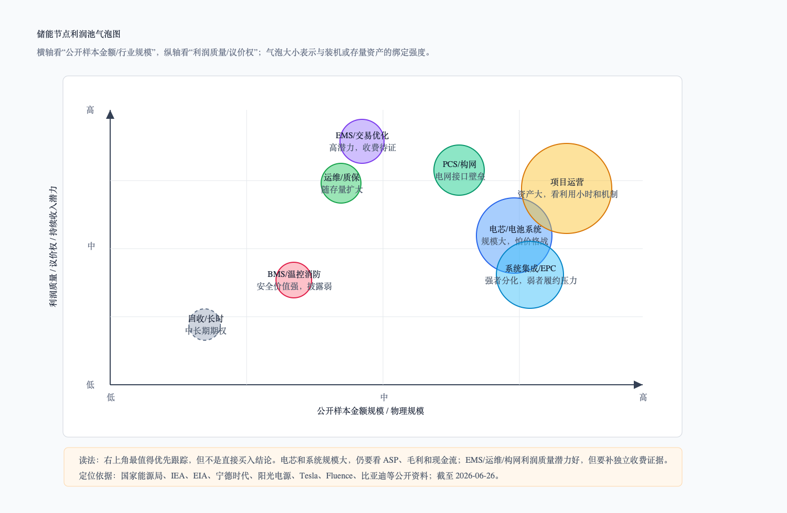](https://github.com/teazean/obsidian-vault-invest/blob/master/%E6%8A%95%E8%B5%84%E7%A0%94%E7%A9%B6/%E4%BA%A7%E4%B8%9A%E4%B8%93%E9%A2%98/%E5%82%A8%E8%83%BD%E8%A1%8C%E4%B8%9A/assets/%E5%82%A8%E8%83%BD%E8%8A%82%E7%82%B9%E5%88%A9%E6%B6%A6%E6%B1%A0%E6%B0%94%E6%B3%A1%E5%9B%BE.png) | 区分节点规模大小和利润质量，避免把高增长直接等同于高利润 |
| 核心 |  | 判断行业处在需求成长、制造出清、收益机制验证哪一段 |
| 核心 | [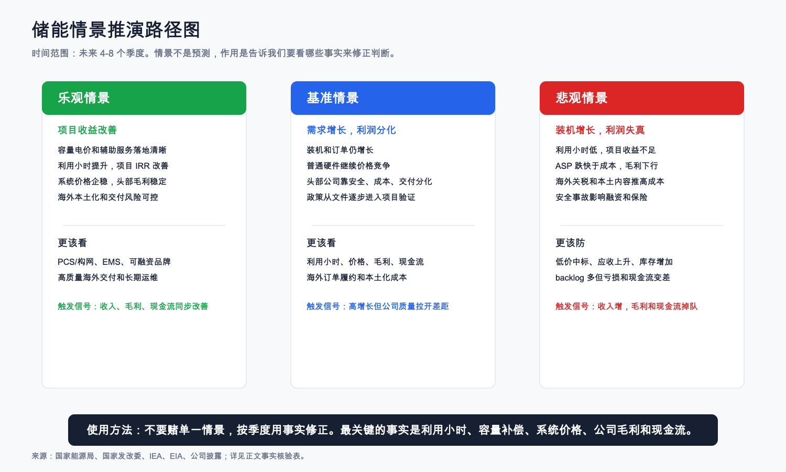](https://github.com/teazean/obsidian-vault-invest/blob/master/%E6%8A%95%E8%B5%84%E7%A0%94%E7%A9%B6/%E4%BA%A7%E4%B8%9A%E4%B8%93%E9%A2%98/%E5%82%A8%E8%83%BD%E8%A1%8C%E4%B8%9A/assets/%E5%82%A8%E8%83%BD%E6%83%85%E6%99%AF%E6%8E%A8%E6%BC%94%E8%B7%AF%E5%BE%84%E5%9B%BE.png) | 按乐观、基准、悲观三种情景跟踪未来 4-8 个季度 |
| 核心 |  | 判断储能相关 ETF 的估值分位、价格位置和主题纯度 |
| 核心 | [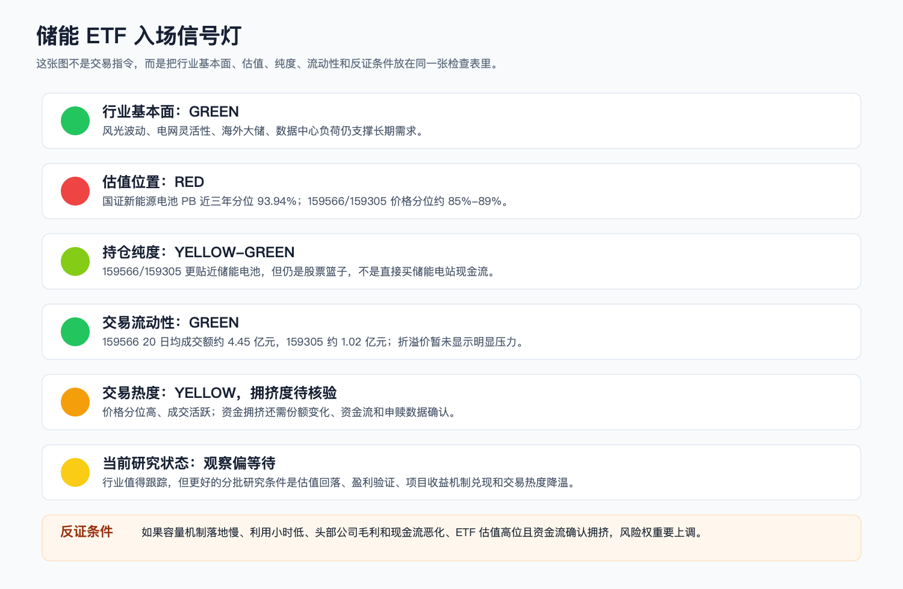](https://github.com/teazean/obsidian-vault-invest/blob/master/%E6%8A%95%E8%B5%84%E7%A0%94%E7%A9%B6/%E4%BA%A7%E4%B8%9A%E4%B8%93%E9%A2%98/%E5%82%A8%E8%83%BD%E8%A1%8C%E4%B8%9A/assets/%E5%82%A8%E8%83%BDETF%E5%85%A5%E5%9C%BA%E4%BF%A1%E5%8F%B7%E7%81%AF.png) | 把行业基本面、估值、纯度、流动性和反证条件放到同一张检查表 |
| 核心 | [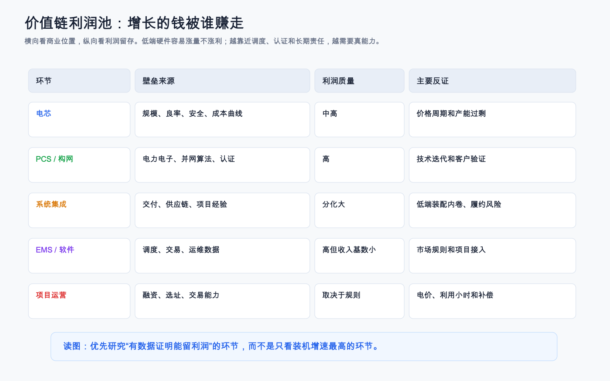](https://github.com/teazean/obsidian-vault-invest/blob/master/%E6%8A%95%E8%B5%84%E7%A0%94%E7%A9%B6/%E4%BA%A7%E4%B8%9A%E4%B8%93%E9%A2%98/%E5%82%A8%E8%83%BD%E8%A1%8C%E4%B8%9A/assets/%E5%82%A8%E8%83%BD%E4%BB%B7%E5%80%BC%E9%93%BE%E5%88%A9%E6%B6%A6%E6%B1%A0.png) | 判断增长的钱被谁赚走 |
| 核心 | [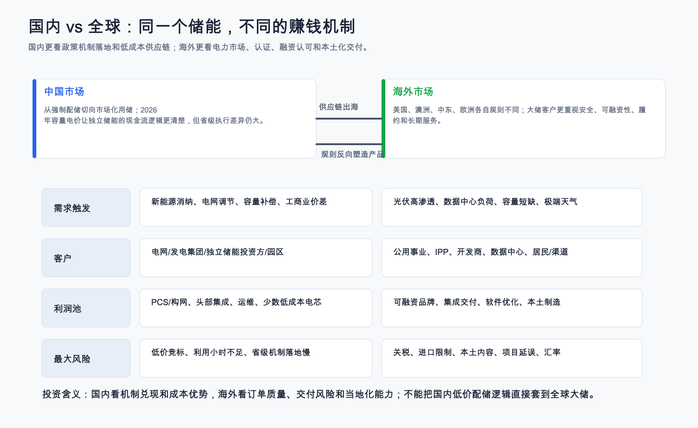](https://github.com/teazean/obsidian-vault-invest/blob/master/%E6%8A%95%E8%B5%84%E7%A0%94%E7%A9%B6/%E4%BA%A7%E4%B8%9A%E4%B8%93%E9%A2%98/%E5%82%A8%E8%83%BD%E8%A1%8C%E4%B8%9A/assets/%E5%82%A8%E8%83%BD%E5%9B%BD%E5%86%85%E5%85%A8%E7%90%83%E5%B7%AE%E5%BC%82%E5%9B%BE.png) | 区分中国和海外赚钱机制 |
| 核心 | [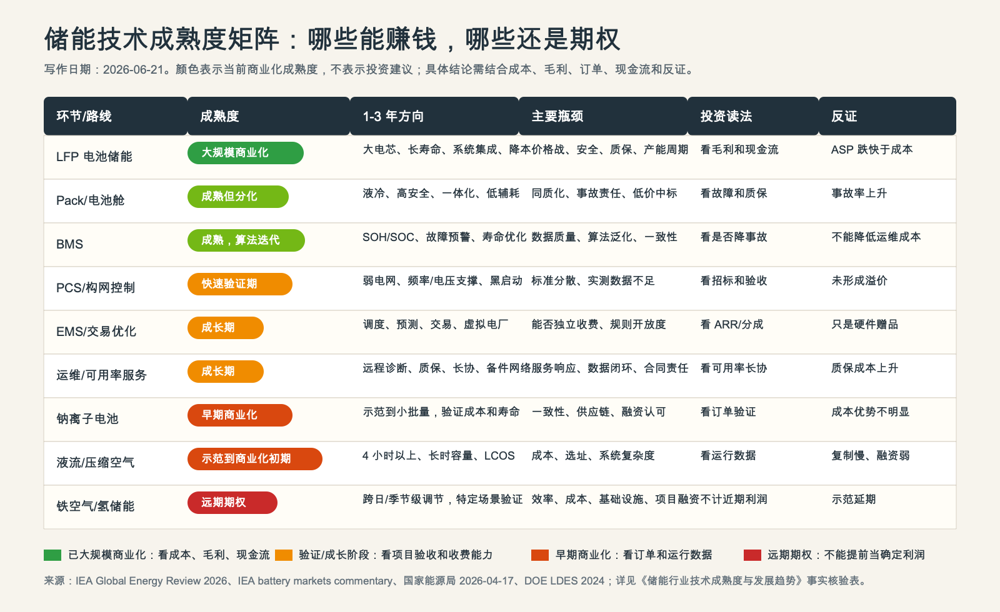](https://github.com/teazean/obsidian-vault-invest/blob/master/%E6%8A%95%E8%B5%84%E7%A0%94%E7%A9%B6/%E4%BA%A7%E4%B8%9A%E4%B8%93%E9%A2%98/%E5%82%A8%E8%83%BD%E8%A1%8C%E4%B8%9A/assets/%E5%82%A8%E8%83%BD%E6%8A%80%E6%9C%AF%E6%88%90%E7%86%9F%E5%BA%A6%E7%9F%A9%E9%98%B5.png) | 区分已商业化、验证期和期权型技术 |
| 核心 | [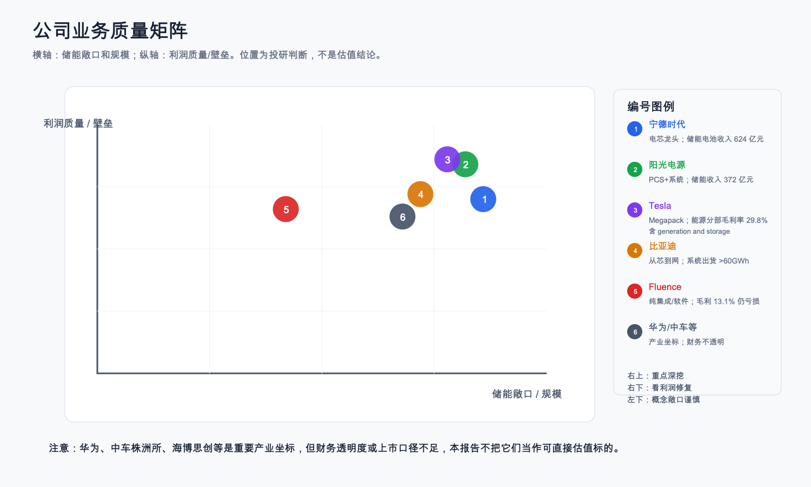](https://github.com/teazean/obsidian-vault-invest/blob/master/%E6%8A%95%E8%B5%84%E7%A0%94%E7%A9%B6/%E4%BA%A7%E4%B8%9A%E4%B8%93%E9%A2%98/%E5%82%A8%E8%83%BD%E8%A1%8C%E4%B8%9A/assets/%E5%82%A8%E8%83%BD%E5%85%AC%E5%8F%B8%E4%B8%9A%E5%8A%A1%E8%B4%A8%E9%87%8F%E7%9F%A9%E9%98%B5.png) | 公司敞口和利润质量定位 |
| 核心 | [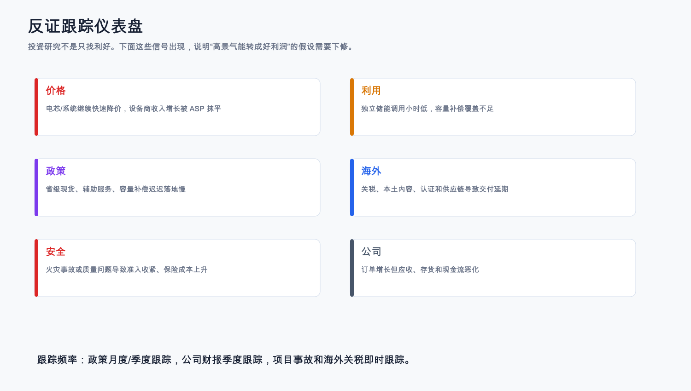](https://github.com/teazean/obsidian-vault-invest/blob/master/%E6%8A%95%E8%B5%84%E7%A0%94%E7%A9%B6/%E4%BA%A7%E4%B8%9A%E4%B8%93%E9%A2%98/%E5%82%A8%E8%83%BD%E8%A1%8C%E4%B8%9A/assets/%E5%82%A8%E8%83%BD%E5%8F%8D%E8%AF%81%E8%B7%9F%E8%B8%AA%E4%BB%AA%E8%A1%A8%E7%9B%98.png) | 反证和跟踪指标 |
| 备查 |  | 技术路线和适用时长 |

## 交付状态

| 项目 | 状态 |
|---|---|
| 事实数据标注 | 已在各文档表格中标注数据日期、口径、来源和证据等级 |
| Markdown 兼容 | 链接和图片已改用 GitHub/CommonMark/GFM 兼容语法；wide-tables 作为 Obsidian 渐进增强保留，GitHub 不识别也不影响正文阅读 |
| 可视化 | 已生成或更新 PNG 和 SVG 源图 |
| 产业链节点规模 | 已新增 [储能行业产业链节点规模与利润池](储能行业产业链节点规模与利润池.md)，覆盖终端项目、电芯、Pack、PCS/构网、BMS、EMS、温控消防、系统集成、项目运营、运维、回收和长时储能 |
| 行业周期与投资节奏 | 已新增 [储能行业周期、供需与投资节奏](储能行业周期、供需与投资节奏.md)，覆盖需求周期、供给竞争、单位经济、情景推演和市场预期差 |
| 基金/ETF估值与入场节奏 | 已新增 [储能行业相关基金与ETF估值入场](储能行业相关基金与ETF估值入场.md)，覆盖跟踪指数、持仓纯度、估值分位、折溢价、成交额、费率、拥挤度、入场状态和反证条件 |
| 技术成熟度 | 已新增 [储能行业技术成熟度与发展趋势](储能行业技术成熟度与发展趋势.md)，覆盖技术路线和产业链环节 |
| 小白独立 Agent 审核 | 2026-07-16 新版完成后重新独立审核；旧版审核不复用，结果见 [储能行业小白审核结果](储能行业小白审核结果.md) |
| 投资建议 | 不提供确定性买卖建议；仅给研究方向、反证条件和跟踪指标 |
