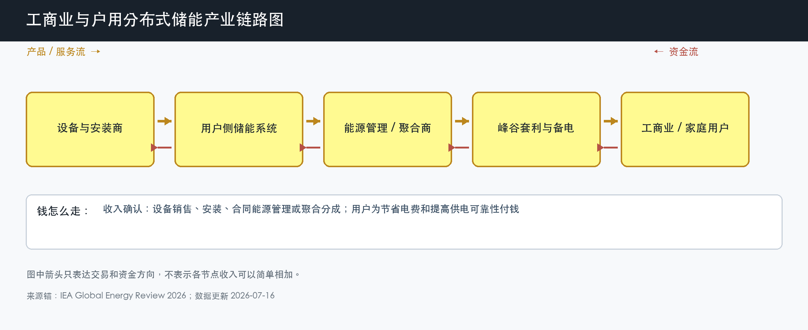

# 工商业与户用分布式储能

数据日期：2026-07-16

用途：投资研究，不构成买卖建议。

## 0. 子产业链边界

- 包含：工商业和家庭表后电池、安装、合同能源管理、峰谷套利、备电、需求响应和聚合。
- 不包含：公用事业级独立储能、数据中心大型 UPS 的全部市场和发电侧配储。
- 与相邻子链的接口：向设备商和安装商采购，接入 EMS/聚合平台，最终体现在用户电费和停电损失中。
- 主要付费方：工商业企业、园区、家庭用户和合同能源管理投资方。
- 收入确认位置：设备与安装交付、节能服务费、租赁费或收益分成。
- 经济模型：制造、项目运营和专业服务混合，最重要的是客户回收期与合同可持续性。

小白先说人话：大储主要替电网解决问题，分布式储能先替用户解决问题。企业可能因为峰谷价差、需量电费、停电损失或配电容量不足而买储能；家庭可能因为高零售电价、光伏自用和备电需求而购买。每个地区电价规则不同，所以不能用一个全球回收期概括。

## 1. 产业链路图

这张图怎么读：设备和安装进入用户侧，收益来自电费节省、备电和聚合。用户只有确认节省大于融资、衰减和运维成本，才会持续付费。

## 2. 谁付钱与价值流

工商业客户看的是现金回收期。峰谷价差越大、每天循环越稳定、停电损失越高，储能越有价值；融资利率、消防改造和电池衰减越高，回收期越长。户用市场还高度依赖零售电价、光伏补贴和停电风险。

IEA 披露全球 2025 年新增电池储能 108GW，其中约 87GW 为公用事业级，意味着约 21GW 来自表后工商业和居民市场。这个差额是粗略规模锚，不等于 21GW 都是可投资的中国工商业储能，也不包含 UPS 的同口径比较。

## 3. 节点规模

| 节点 | 节点边界 | 经营规模 | 金额规模 | 新增/存量 | 关键效率指标 | 增速/周期 | 数据日期/口径/来源 | 证据等级 | 存疑点 |
|---|---|---:|---:|---|---|---|---|---|---|
| 全球表后电池储能 | 工商业和居民表后，不含 utility-scale | 2025 年新增约 21GW，按 108GW 总新增减 87GW utility-scale 推导 | 缺口:D1 | 新增安装 + 存量聚合和服务 | 用户回收期、循环次数、零售电价 | 高电价和补贴市场增长较快 | 2025 年；IEA 粗略差额 | B/推导 | 工商业与户用、功率与容量未进一步拆分 |
| 中国工商业项目情景 | 1MW/2MWh 表后项目 | 单项目 1MW/2MWh | 初始投资情景 160-240 万元 | 新建 + 合同能源管理 | 年循环、峰谷价差、回收期 | 区域分化，电价和消防政策驱动 | 2026-07-16 情景 | C/D | 实际设备、消防、并网和融资成本按项目变化 |
| 聚合与能源服务 | 接入 EMS/VPP 的存量用户资产 | 绑定表后资产规模，暂无统一 GW | 缺口:D2 | 主要服务存量 | 可调率、调用次数、续约 | 规则导入期 | 截至 2026-07-16 | C | 结算费率和客户留存缺统一披露 |

这张表怎么读：21GW 是全球表后功率规模的粗略推导，不是金额；2MWh 项目情景只是帮助理解一单生意如何回本。地区电价差异很大，任何“全国统一回收期”都可能误导。

## 4. 利润分布与单位经济

| 节点 | 变现基数 | 直接经济性 | 直接价值池 | 经营收益 | 资本/风险/再投资占用 | 可分配价值 | 估算公式/口径 | 数据日期 | 来源/证据等级 |
|---|---:|---:|---:|---:|---:|---:|---|---|---|
| 1MW/2MWh 工商业项目情景 | 年毛收益约 13-45 万元 | 充放电直接贡献率情景 55%-80% | 年直接贡献约 7-36 万元 | 项目 IRR 情景 3%-15% | 初始资本 160-240 万元，另有消防和融资 | 年可分配现金约 0-25 万元 | 2MWh × 250-330 次 × 0.3-0.8 元/kWh × 85%效率，扣运维与融资 | 2026-07-16 假设 | 分析情景，证据等级 C/D |
| 聚合服务商情景 | 每 1MW 可调容量年服务收入 2-10 万元 | 贡献毛利率情景 30%-70% | 每 MW 年贡献 0.6-7 万元 | 经营收益率情景 -10% 至 30% | 获客与软件投入占收入 20%-60% | 每 MW 年自由现金流 -1 至 5 万元 | 服务费/分成情景，必须用实际结算替换 | 2026-07-16 假设 | 分析情景，证据等级 D |

这张表的底层逻辑是：工商业项目的主要敏感变量不是电池有多先进，而是峰谷价差、循环次数、衰减和融资。价差从 0.8 元/kWh 降到 0.3 元/kWh，毛收益会显著下降；如果消防改造或停机降低循环，回收期也会拉长。

## 4.1 受控数据缺口

| 缺口 ID | 指标 | 已检索范围 | 无法估算原因 | 可给上下界 | 替代指标 | 决策影响 | 核验计划 |
|---|---|---|---|---|---|---|---|
| D1 | 全球表后储能金额规模 | IEA、地区政策和公司资料 | 21GW 混合工商业与户用，时长和价格差异大 | 不能可靠给出窄区间 | 分地区 GW/GWh、户均 kWh、安装价 | 无法比较表后与大储绝对收入池 | 等待 IEA/地区协会容量和价格拆分 |
| D2 | 中国聚合服务收入池 | 政策、VPP 试点和公司资料 | 地区规则、调用和分成尚未统一 | 0 元至用户节省额的一部分 | 可调容量、结算次数、分成比例 | 不能按平台估值直接外推 | 跟踪省级结算和上市公司合同 |

## 5. 利润迁移、周期与反证

分布式储能的利润不一定留在硬件。硬件降价会缩小设备毛利，却可能缩短用户回收期、扩大项目池；随后安装、融资、聚合和长期能源管理可能拿到更多持续收入。能否发生取决于市场规则和客户留存，不是自动的软件化故事。

未来 4-8 个季度看各地峰谷价差、工商业项目实际循环、消防和接入要求、合同能源管理违约率、聚合结算。若价差收窄或循环不足，设备再便宜也可能无法形成可持续项目现金流。

## 来源

- [IEA：Global Energy Review 2026 - Battery storage](https://www.iea.org/reports/global-energy-review-2026/technology-battery-storage)
- [IEA：Battery storage is scaling up and taking on a larger system role，2026-05-29](https://www.iea.org/commentaries/battery-storage-is-scaling-up-and-taking-on-a-larger-system-role)

