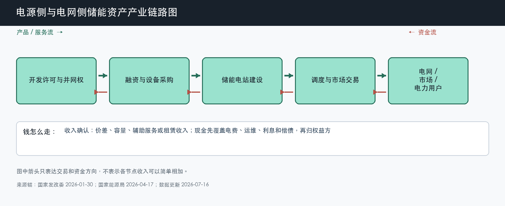

# 电源侧与电网侧储能资产

数据日期：2026-07-16

用途：投资研究，不构成买卖建议。

## 0. 子产业链边界

- 包含：独立储能、共享储能、新能源配建储能的开发、融资、持有、调度和运营。
- 不包含：设备商销售收入、工商业表后储能和抽水蓄能资产估值。
- 与相邻子链的接口：上游向 EPC 采购项目，下游进入现货、辅助服务、容量、租赁和调度市场。
- 主要付费方：电力市场交易对手、电网结算主体、电力用户和租用容量的新能源项目方。
- 收入确认位置：充放电价差、辅助服务、容量电价、容量租赁等实际结算。
- 经济模型：重资产项目运营型，核心是项目 IRR、债务覆盖和可分配现金。

小白先说人话：设备商是“卖铲子”，电站业主是“自己拿铲子挖矿”。电站建成后必须被调用并获得结算，才能回收上亿元资本。装机只是资产存在，利用小时和付费机制才决定资产值多少钱。

## 1. 产业链路图

这张图怎么读：资金先由股东和银行投入建设，再通过市场结算慢慢回收。现金回到股东前，要先支付充电电费、运维、利息和偿债；所以收入不是可分配现金。

## 2. 谁付钱与价值流

储能提供的是“关键时刻能充、能放、能稳定电网”的能力。过去强制配储容易出现项目建了却调用少，因为新能源项目只想满足并网条件。2025 年 136 号文取消把配储作为核准、并网和上网前置条件，2026 年 114 号文首次在国家层面明确电网侧独立新型储能容量电价，底层逻辑是把行政成本项改成市场化调节资产。

容量收入像“底薪”，价差和辅助服务像“绩效”。底薪提高现金流稳定性，能帮助项目融资；但各省折算比例、考核和支付来源不同，国家政策入口不等于所有项目 IRR 已经改善。真正证据是省级细则、调用小时和结算单。

## 3. 节点规模

| 节点 | 节点边界 | 经营规模 | 金额规模 | 新增/存量 | 关键效率指标 | 增速/周期 | 数据日期/口径/来源 | 证据等级 | 存疑点 |
|---|---|---:|---:|---|---|---|---|---|---|
| 中国新型储能资产 | 已投运的新型储能，不含抽蓄 | 累计 144.7GW；2025 年新增 66.4GW/189.5GWh | 2025-2027 政策称带动直接投资约 2500 亿元，但不是已实现收入 | 累计资产形成存量运营池 | 利用小时、调用次数、可用率 | 资产快速扩张，收益机制验证中 | 截至 2025 年底；CNESA/国家能源局 | B/C | 144.7GW 为行业统计口径，项目 IRR 分散 |
| 美国公用事业级电池资产 | 公用事业级 BESS | 2025 年新增 15GW；2026 年计划新增 24GW | 缺口:A1 | 新增建设 + 累计资产运营 | 市场价差、容量/RA、并网队列 | 需求成长，地区集中和政策风险高 | 2025 实际/2026 计划；EIA | A/B | 计划不等于投运，收入机制按州和市场不同 |
| 中国项目样本 | 100MW/200MWh 两小时项目情景 | 建设规模 100MW/200MWh | 按 0.78 元/Wh 综合建设成本约 1.56 亿元 | 新建项目 | 年循环、效率、融资成本 | 容量机制落地决定收益质量 | 2026 年公开项目成本锚 | B/C | 真实收入和债务条件需逐项目核验 |

这张表怎么读：180GW 的 2027 政策目标不能机械当未来增量。2025 年底实际已到 144.7GW，只比目标少 35.3GW，而 2025 年单年就新增 66.4GW，说明旧目标已不再是强约束；未来判断应该转向利用率和收益质量，而不是拿目标减现状算需求。

## 4. 利润分布与单位经济

| 节点 | 变现基数 | 直接经济性 | 直接价值池 | 经营收益 | 资本/风险/再投资占用 | 可分配价值 | 估算公式/口径 | 数据日期 | 来源/证据等级 |
|---|---:|---:|---:|---:|---:|---:|---|---|---|
| 100MW/200MWh 中国项目情景 | 年收入约 1580-4200 万元 | EBITDA margin 情景 35%-65% | 年 EBITDA 约 550-2730 万元 | 项目 IRR 情景 4%-12% | 初始资本约 1.56 亿元，另有充电电费和偿债 | 年可分配现金约 0-1500 万元 | 容量 200MWh × 0.78 元/Wh；收入含价差、容量和辅助服务情景 | 2026-07-16 假设 | B/C：公开成本锚；分析情景 |
| 美国公用事业项目资产 | 缺口:A1 | 缺口:A2 | 缺口:A3 | 缺口:A4 | 24GW 计划对应巨额项目资本，但金额缺统一口径 | 缺口:A5 | 各州市场、税收和合同不同，必须逐项目建模 | 2026 年计划 | A/B：EIA；项目数据缺口 |

这张表的小白读法是：同一套 100MW/200MWh 设备，如果容量收入和价差弱，IRR 可能低于资本成本；如果市场经常调用、容量补偿清晰，资产才有机会产生稳定现金。最容易误读的是把系统价格下降自动当成 IRR 上升，实际上收入也可能因竞争和价差收窄而下降。

## 4.1 受控数据缺口

| 缺口 ID | 指标 | 已检索范围 | 无法估算原因 | 可给上下界 | 替代指标 | 决策影响 | 核验计划 |
|---|---|---|---|---|---|---|---|
| A1 | 美国 2026 新增项目收入池 | EIA 计划、公司项目和公开市场资料 | 24GW 分布在多个市场，时长、合同和收入栈不同 | 大于 0 美元且低于全生命周期合同总额，无法形成可比区间 | MW、MWh、PPA/RA 合同、merchant 占比 | 不能把 24GW 直接换成利润 | 逐州跟踪 ERCOT、CAISO 和 Arizona 项目 |
| A2 | 美国项目直接经济性 | 同上 | 电价波动、税收抵免和合同保密 | 项目级 EBITDA margin 需逐案核验 | 日内价差、容量合同、ITC | 不能横向套用中国 IRR | 用上市 IPP 项目披露更新 |
| A3 | 美国项目直接价值池 | 同上 | 缺统一收入与 margin | 0 至收入之间理论上限 | 项目 EBITDA | 无法量化绝对利润池 | 获取项目合同后计算 |
| A4 | 美国项目 IRR | 同上 | 资本结构和税收权益差异大 | 资本成本附近是项目能否融资的分界 | NPV、DSCR、融资利率 | 决定需求质量而非只看装机 | 跟踪融资关闭和投运回报 |
| A5 | 美国项目可分配现金 | 同上 | 需扣债务、税收权益和维护资本 | 0 至 EBITDA 之间 | DSCR、现金分派 | 无法直接估值资产 | 跟踪 IPP 现金分派和项目出售估值 |

## 5. 利润迁移、周期与反证

资产端正从“政策要求我建”迁向“系统愿意为灵活性付钱”。这会提高需求质量，但也把项目筛选变严格：没有并网权、价差、容量收入或辅助服务的项目可能不再建设。设备订单增速可能更分化，却更接近真实经济性。

未来 4-8 个季度最关键的是各省容量电价细则、等效利用小时、现货价差和项目融资关闭。若装机继续高增但利用小时下降、容量收入落地慢、项目 IRR 低于融资成本，那么设备需求最终会被压价或延期。

## 来源

- [国家发展改革委：关于深化新能源上网电价市场化改革，2025-02-09](https://www.ndrc.gov.cn/xxgk/zcfb/tz/202502/t20250209_1396066.html)
- [国家发展改革委：完善发电侧容量电价机制答记者问，2026-01-30](https://www.ndrc.gov.cn/xxgk/jd/jd/202601/t20260130_1403520.html)
- [国家能源局：新型储能产业从“跟跑”变“领跑”，2026-04-17](https://www.nea.gov.cn/20260417/a6ef89bc89eb4814872959c4b10fd731/c.html)
- [EIA：2026 年美国计划新增 24GW 公用事业级电池储能](https://www.eia.gov/todayinEnergy/detail.php?id=67205)
- [南网储能：宁夏中卫电池储能综合建设成本约 0.78 元/Wh](https://dataclouds.cninfo.com.cn/shgonggao/investor/2026/20260319/c86fbb1908a24463b50f82e94632f5e4.PDF)

