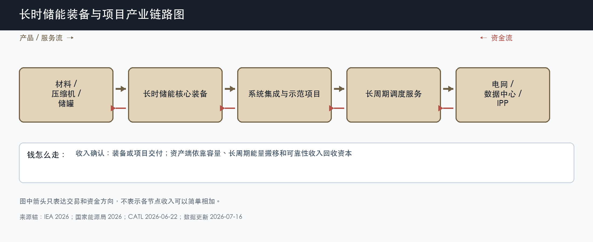

# 长时储能装备与项目

数据日期：2026-07-16

用途：投资研究，不构成买卖建议。

## 0. 子产业链边界

- 包含：液流、压缩空气、钠离子、锌基、铁空气等 4 小时以上装备与项目。
- 不包含：抽水蓄能资产估值、2-4 小时主流 LFP 的重复计算和纯实验室成果。
- 与相邻子链的接口：向材料和核心装备采购，交给系统集成和项目开发，最终服务跨日、长周期容量和可靠性需求。
- 主要付费方：电网、公用事业、IPP、数据中心和示范项目出资方。
- 收入确认位置：装备或项目交付；资产端按容量、能量搬移和可靠性服务结算。
- 经济模型：制造型、研发/IP型和项目运营型混合，必须按路线分别看商业成熟度。

小白先说人话：两小时电池适合把中午光伏搬到傍晚，连续阴天、夜间长缺口或关键负荷备电需要更长时间。长时储能的价值是真问题，但技术能不能稳定运行、成本能不能被市场接受、银行愿不愿融资，决定它是近期利润还是远期期权。

## 1. 产业链路图

这张图怎么读：不同路线的材料和装备差异很大，却都要经过项目验证、融资和长期调度。实验室效率或规划产能不能跳过这三关直接变成收入。

## 2. 谁付钱与价值流

长时储能的付费逻辑是解决短时锂电不经济的长缺口。新能源占比提高后，系统不只要日内搬移，还可能要跨夜、跨日和极端天气保供。若市场只按放电量付钱，低利用率的长时资产很难回本；容量合同、长期 PPA 或可靠性付费因此更重要。

路线之间不能只比设备价格。压缩空气受地质和大型设备约束，液流受电解液和系统复杂度约束，钠离子和锌基要证明规模制造、效率和寿命，铁空气要证明长周期交付和融资。共同的验收标准是 LCOS、真实运行小时、安全、融资关闭和重复订单。

## 3. 节点规模

| 节点 | 节点边界 | 经营规模 | 金额规模 | 新增/存量 | 关键效率指标 | 增速/周期 | 数据日期/口径/来源 | 证据等级 | 存疑点 |
|---|---|---:|---:|---|---|---|---|---|---|
| 压缩空气项目样本 | 非补燃压缩空气储能电站 | 淮安项目 600MW/2400MWh，已全面投产 | 缺口:L1 | 新建示范转商业项目 | 71% 转换效率、年发电量 | 从示范走向百 MW 级工程验证 | 2026-01-30；项目披露 | B | 项目投资、收入和可分配现金未公开 |
| 钠离子储能样本 | 钠离子电芯和系统 | 宁德时代规划新增 40GWh 年产能，预计 2026 年累计出货 1GWh | 50 亿元产线投资；收入缺口:L2 | 新增产品验证 | 循环、低温、安全、良率 | 商业导入期，出货指引尚待实现 | 2026-06-22；公司口径 | B | 产能和出货预期不能当已实现销售 |
| 锌基长时储能样本 | Eos 锌基 BESS | backlog 2.6GWh，另有 2GWh 容量预留 | 2026Q1 收入 5700 万美元；2026 指引 3-4 亿美元 | 订单交付与扩产 | 毛利、产线良率、现金消耗 | 放量早期，毛利仍为负 | 截至 2026-03-31；SEC/公司 | A/B | 收入增长尚未转正毛利和 EBITDA |
| 2030 中国长时需求锚 | 多路线新型储能 | 2030 累计装机预测超 370GW，平均时长由约 2.58h 升至 3.47h | 缺口:L3 | 新增与时长提升 | 平均时长、4h+占比 | 机构预测，不是确定事实 | 2026 白皮书口径，国家能源局转载 | B/C | 预测来源和路线份额不确定 |

这张表怎么读：600MW/2400MWh 是真实投运项目，40GWh 是产能规划，1GWh 和 3-4 亿美元是公司指引，三种证据强度不同。投资研究最容易把“产能、订单、出货、收入”混为一谈，本文把它们分开。

## 4. 利润分布与单位经济

| 节点 | 变现基数 | 直接经济性 | 直接价值池 | 经营收益 | 资本/风险/再投资占用 | 可分配价值 | 估算公式/口径 | 数据日期 | 来源/证据等级 |
|---|---:|---:|---:|---:|---:|---:|---|---|---|
| 淮安压缩空气项目 | 缺口:L1 | 71% 转换效率，不等于利润率 | 缺口:L4 | 缺口:L5 | 600MW/2400MWh 大型项目资本占用，金额缺口:L6 | 缺口:L7 | 必须用容量、能量收入减电费、运维、折旧和融资 | 2026-01-30 | B：国家能源局转载项目资料 |
| Eos 2026Q1 样本 | 5700 万美元收入 | 毛利率约 -77.9% | 毛损 4440 万美元 | 调整后 EBITDA -6800 万美元 | 现金 4.724 亿美元，持续扩产 | 季度可分配价值小于 0 美元 | 毛利率 = -4440/5700；净利润受非现金公允价值影响不用作经营判断 | 2026-03-31 | A/B：SEC/公司披露 |
| 钠离子产线与系统 | 50 亿元产线投资、1GWh 出货指引 | 缺口:L8 | 缺口:L9 | 缺口:L10 | 新增 40GWh 年产能、资本 50 亿元 | 缺口:L11 | 产能、出货和收入需分开；目前不能用规划产能估利润 | 2026-06-22 | B：CATL 公司口径 |

这张表很直白地说明“技术有前景”和“公司已经赚钱”之间的距离。Eos 收入快速增长但毛利仍为负；压缩空气已实现大型投运，却缺项目财务；钠离子有产线和交付计划，但还没有已实现分部利润。长时路线现阶段更适合按里程碑估值，而不是按成熟利润外推。

## 4.1 受控数据缺口

| 缺口 ID | 指标 | 已检索范围 | 无法估算原因 | 可给上下界 | 替代指标 | 决策影响 | 核验计划 |
|---|---|---|---|---|---|---|---|
| L1 | 淮安项目收入与变现基数 | 国家能源局、项目新闻和技术资料 | 容量、电量和辅助服务合同未公开 | 0 元至全生命周期结算上限，无法可靠给数 | 年发电量、容量合同、调用 | 不能计算项目回收期 | 跟踪项目业主财务和结算披露 |
| L2 | 钠离子储能已实现收入 | CATL 新闻、年报和季报 | 2026 年交付尚未完成，分部不单列 | 1GWh × 实际 ASP 才能计算 | 实际出货、客户验收 | 不能把产能规划当 2026 利润 | 等待 2026 年报或交付公告 |
| L3 | 中国长时储能金额规模 | 白皮书摘要、政策和项目 | 370GW 是总新型储能预测，路线和时长未拆 | 无可靠窄区间 | 4h+新增 GWh、项目投资 | 不能量化长时装备 TAM | 跟踪 CNESA 分路线预测 |
| L4 | 淮安项目直接价值池 | 同 L1 | 缺收入和直接成本 | 0 元至收入之间 | 年运行小时和电费 | 无法判断经济性 | 取得项目财务后更新 |
| L5 | 淮安项目 IRR | 同 L1 | 缺资本、融资和收入 | 项目资本成本是融资分界 | DSCR、容量合同 | 不能判断是否可复制 | 跟踪融资关闭和运营数据 |
| L6 | 淮安项目资本占用 | 项目规模和新闻 | 总投资未在所用来源中披露 | 大型 600MW/2400MWh 项目，无法窄估 | 单 kWh 投资 | 不能比较不同路线资本效率 | 查项目核准与业主年报 |
| L7 | 淮安项目可分配现金 | 同 L1-L6 | 现金瀑布缺数据 | 0 元至 EBITDA | 偿债覆盖和分红 | 不能做资产估值 | 等待运营年度数据 |
| L8 | 钠离子直接经济性 | 公司发布和年报 | 新系统成本、良率和 ASP 未披露 | 不用 LFP 毛利率机械替代 | 单 Wh 成本、良率、循环 | 无法判断替代速度 | 跟踪首批 1GWh 交付成本 |
| L9 | 钠离子直接价值池 | 同 L8 | 缺收入和毛利 | 0 元至收入 | 实际毛利 | 不能估利润池 | 等待分部数据 |
| L10 | 钠离子经营收益 | 同 L8 | 研发和产线费用未分拆 | 直接价值池为上限 | 研发费用、折旧 | 无法评估 ROIC | 跟踪产线利用率 |
| L11 | 钠离子可分配价值 | 同 L8 | 尚在扩产和导入 | 可能为负至经营收益 | 经营现金流、资本开支 | 不能把交付计划当现金 | 等待量产和回款 |

## 5. 利润迁移、周期与反证

长时储能处于“需求逻辑逐渐清楚、技术和金融仍分化”的阶段。未来利润会先留给能完成大型项目、证明效率寿命、拿到融资和重复订单的路线，而不是参数最漂亮的路线。DOE 把 10 小时以上系统 2030 年降本 90%设为目标，本身说明当前成本仍是主要障碍，目标不能当成必然实现。

未来 4-8 个季度看 4h+项目实际投运、连续运行数据、融资关闭、重复订单和毛利转正。若路线只有规划产能和示范、没有客户复购或现金改善，就应继续按远期期权处理。

## 来源

- [国家能源局：全球最大规模压缩空气储能项目全面投产，2026-01-30](https://www.nea.gov.cn/20260130/e4626ce1ea8a4125b84c561782c471b2/c.html)
- [国家能源局：2030 年我国新型储能累计装机预测，2026-04-10](https://www.nea.gov.cn/20260410/fe421f319b644ac8aaad55422907bf6a/c.html)
- [CATL：钠离子储能系统与产能交付计划，2026-06-22](https://www.catl.com/en/news/6861.html)
- [Eos 2026Q1 业绩，SEC，2026-05-13](https://www.sec.gov/Archives/edgar/data/1805077/000162828026034367/eoseq1fy26earningsreleas.htm)
- [美国能源部：Storage Innovations 2030](https://www.energy.gov/oe/storage-innovations-2030)
