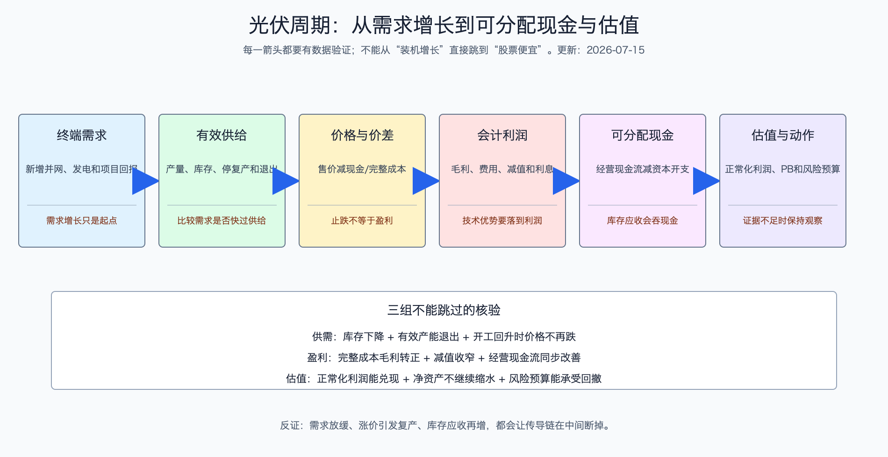

# 光伏产业周期、供需与投资节奏

日期：2026-07-15  
数据日期：行业价格截至 2026-07-08；公司财务截至 2026 年一季度；装机截至 2026 年 5 月  
状态：已完成，按季度更新  
用途：投资研究，不构成确定性投资建议。

## 0. 当前周期位置

**当前判断：光伏终端需求仍在增长，但中国制造主链处于深度出清期，尚未获得“盈利反转”的充分证据。**

这句话包含三个不同层次：

1. **需求没有消失。**中国 2025 年新增 317.3GW，全球 2025 年按 IEA PVPS 的直流侧口径至少 608GW，计入尚未纳入官方统计的分布式后，专家估计可达约 698GW。
2. **供给增长更快。**2024 年中国多晶硅、硅片、电池和组件的名义产能利用率分别约 59.1%、57.5%、53.4%和 54.3%。大量设备没有满产，说明价格由争抢订单而不是稀缺供给决定。
3. **价格回升不等于完整成本修复。**2026 年 7 月主流硅料约 31-33 元/千克、N 型电池约 0.27 元/W、TOPCon 组件均价约 0.728 元/W。2025 年多家头部企业仍是负毛利或亏损，2026 年一季度也没有形成全链条扭亏证据。

周期位置更接近“**价格从极端低位尝试稳定，企业主动减产和政策治理开始发挥作用，但闲置产能、库存和资产负债表仍需消化**”。这不是行业消失，也不是已经反转，而是两者之间最容易反复的阶段。

这张图的用途是防止逻辑跳跃。需求增长后，必须依次核验有效供给、单位价差、会计利润和可分配现金，最后才能讨论估值；任何一层断掉，都不能把前一层的好消息直接当成后一层的结论。

## 1. 需求、供给与服务能力

### 1.1 需求端为什么仍有韧性

组件降价使太阳能发电的初始投资持续下降。根据 IRENA，2025 年全球公用事业光伏平均总安装成本约 667 美元/kW，平均度电成本约 44 美元/MWh。只要当地有光照、土地/屋顶、电网接入和可接受电价，低成本会创造新项目需求。

但未来需求增长不再只由“组件便宜”决定。光伏出力集中在白天，当渗透率提高后，中午可能电力过剩，电价下降或弃光上升。接下来需求的约束会逐步从组件成本转向电网、储能、市场电价、许可和融资。

### 1.2 供给端为什么难以快速出清

制造厂的经济选择不是简单的“亏损就关门”。只要售价高于现金成本，继续生产可以贡献部分现金来支付利息和固定费用；完全停产反而无法覆盖这些支出。地方就业、银行债务、供应商账期和市场份额也会延迟退出。因此，行业可能在完整成本亏损状态下维持很久。

真正的出清要看到：高成本产能永久退出、固定资产减值后不再复产、行业库存下降、头部企业不再用低价扩量、价格反弹时供给没有迅速回来。

### 1.3 服务型环节为什么不同步

逆变器、跟踪器、运维和电站运营不完全由主材产能周期决定。逆变器靠认证和服务保留利润；跟踪器靠增发电量创造价值；运营商靠存量电站售电。但这些环节也有各自周期：设备和跟踪器受资本开支与项目开工影响，电站受电价和融资影响，不能简单视作“避险区”。

## 2. 库存、利用率与资产质量

| 观察层 | 当前证据 | 为什么重要 | 真正改善信号 | 假改善信号 |
|---|---|---|---|---|
| 名义产能利用率 | 2024 年主链约 53%-59% | 机器过多，涨价会吸引复产 | 连续多个季度利用率上升且总产能不再扩张 | 单月检修导致产量下降 |
| 存货 | TCL 中环 58.67 亿元、隆基 145.42 亿元、晶澳 100.58 亿元等 | 产品跌价会侵蚀净资产和现金 | 库存天数下降、跌价减少、现金回流 | 通过减产使期末库存下降但销量也更弱 |
| 固定资产与减值 | 旧 PERC、硅片和硅料产线面临技术及经济性减值 | 账面产能不一定可盈利，但债务和折旧仍在 | 低效资产退出，剩余产能利用率和回报提高 | 一次性大额减值后仍继续扩产 |
| 经营现金流 | 迈为和中信博 2025 年经营现金流为负，主材企业分化 | 利润是否真正收回 | 现金流连续好于净利润，应收和存货不再扩张 | 依靠延付供应商改善现金 |
| 项目资产质量 | 电站市场交易比例上升，历史补贴应收仍大 | 高毛利可能没有现金或未来电价下降 | 实现电价稳定、弃光可控、补贴回款 | 只看新增装机，不看项目收益率 |

## 3. 单位经济：判断反转不能只看涨价

制造主链的反转顺序通常是：

`现货价格止跌 → 现金毛利转正 → 库存跌价减少 → 产能利用率提高 → 完整成本毛利转正 → 经营现金流转正 → 资本回报率恢复`

当前部分价格可能已从极端低位回升，但上市公司 2025 年数据仍显示硅片、电池和组件分部负毛利。2026 年一季度，TCL 中环估算毛利率仍约 -8.64%，隆基约 -1.19%，晶科能源仍亏损；这说明行业最多处在上述链条的前部，不能直接跳到“利润全面恢复”。

对每个环节应使用不同的单位经济：

- 硅料：元/千克售价减现金成本和完整成本。
- 硅片：元/片售价减硅料、拉晶、切片和折旧，注意规格变化。
- 电池、组件：元/W售价减单位成本。
- 设备：新签订单毛利、验收收入、备货和回款。
- 逆变器、支架：元/W收入、质保/工程责任和经营现金流。
- 电站：每瓦造价、利用小时、实现电价、融资成本和项目内部收益率。

## 4. 未来 4-8 个季度三情景

本情景覆盖 2026 年三季度至 2028 年二季度，不是点位预测，而是条件化推演。

### 4.1 先看历史基准：需求高增为什么仍然没带来制造利润

| 年份 | 中国新增光伏并网 | 同比 | 同期制造端发生了什么 | 投资含义 |
|---|---:|---:|---|---|
| 2020 | 约 48.2GW | - | 需求开始加速，供应链仍经历阶段性紧张 | 需求增长初期，上游涨价更容易留在制造端 |
| 2021 | 54.88GW | 约 +14% | 硅料供给偏紧，产业链开始大规模扩产 | 高利润吸引资本，埋下后续供给增加 |
| 2022 | 约 87.4GW | 约 +59% | 扩产继续，硅料价格先高后松 | 需求强，但新增供给正在追上 |
| 2023 | 216.88GW | 约 +148% | 装机跃升，同时组件价格进入快速下降 | 量增不再等于单瓦利润增 |
| 2024 | 277.57GW | 约 +28% | 主链名义产能利用率仅约 53%-59%，制造亏损扩大 | 供给扩张速度已经超过需求消化 |
| 2025 | 317.30GW | 约 +14% | IEA PVPS称组件价格较 2023 年初到 2025 年下跌逾 60%，2024 年初以来制造商累计损失接近 50 亿美元 | 终端创新高与制造亏损可以同时成立 |

这组历史基准率说明，预测不能只问“装机是否增长”，还要问“增长是否快过可经济运行的供给”。2023-2025 年中国新增装机继续大增，但价格和利润恶化，正是因为制造扩张更快。

来源：[国家能源局 2021 年数据](https://www.nea.gov.cn/2022-01/20/c_1310432517.htm)、[商务部转引 2022 年数据](https://data.mofcom.gov.cn/article/zxtj/202302/59195.html)、[2023 年官方数据](https://gxt.shaanxi.gov.cn/cyfz/dzxx/202402/t20240228_3310896.html)、[国家能源局 2024 年数据](https://www.nea.gov.cn/20250221/e10f363cabe3458aaf78ba4558970054/c.html)、[国家能源局 2025 年数据](https://www.nea.gov.cn/20260212/742b8c6a078347b0b39de676c05c5d58/c.html)、[IEA PVPS Snapshot 2026](https://iea-pvps.org/wp-content/uploads/2026/04/Snapshot-of-Global-PV-Markets-2026.pdf)。装机为交流侧官方口径，证据等级 A；价格与损失为国际行业报告口径，等级 B。

### 4.2 三情景量化区间

下表不是概率分配。当前公开证据不足以给 50%或 25%这类看似精确的概率，因此改用可观察区间和切换条件。装机区间是研究假设；组件价格以 2026-07-08 中国 TOPCon 均价 0.728 元/W 为起点；利润和现金流率为代表性主链制造商的合并代理，不能套给单家公司。

| 情景 | 2027 年中国新增并网 | 2027 年全球直流侧新增 | 中国 TOPCon 组件价格中枢 | 主链代表企业毛利率 | 经营现金流减资本开支/收入 | 需要同时看到的证据 | 投资含义 |
|---|---:|---:|---:|---:|---:|---|---|
| 基准：缓慢出清、局部修复 | 230-290GW | 650-740GW | 0.68-0.78 元/W | -2%至 +3% | -8%至 +1% | 库存缓降、资本开支收缩，但闲置产能仍可复产；至少两个主链环节现金毛利改善 | 只能逐公司验证资产负债表和现金流，不把行业涨价直接当全面反转 |
| 乐观：退出兑现、利润回流 | 280-340GW | 720-800GW | 0.78-0.88 元/W | +3%至 +8% | 0%至 +6% | 高成本产能永久退出；组件涨价后排产回升但库存不增；三项以上主链连续两季完整成本毛利转正 | 盈利修复才从预期变成经营事实，设备改造和制造龙头均有更大弹性 |
| 悲观：需求降速、供给不退 | 180-240GW | 560-650GW | 0.58-0.68 元/W | -8%至 -3% | -13%至 -3% | 美国政策和贸易压低需求；中国利用率下降；涨价即复产，库存重新上升 | 低 PB 也可能被进一步减值侵蚀，应优先防范债务、再融资和现金消耗 |

组件价格为什么能影响利润，却不能单独决定利润？假设组件价格提高 0.05 元/W，若硅片、电池、玻璃和银浆同时涨 0.04 元/W，组件厂只留下 0.01 元/W；若库存跌价和应收继续占钱，现金流仍可能为负。所以情景切换必须同时检查售价、单位成本、库存、应收和资本开支。

为什么基准情景不是“需求增长就全面复苏”？因为 2025 年已经证明，装机和发电增长可以与制造亏损同时存在。只有需求增长快于可经济运行供给，且企业不再用扩产抢份额，利润才会回到制造端。

## 5. 市场预期与估值隐含假设

截至 2026-06-30，中证光伏产业指数市盈率约 36.77 倍、市净率约 2.41 倍。指数 2025 年上涨 26.20%，截至 2026 年 6 月末近一年回报约 54.94%，但三年和五年年化回报仍为负。价格已经反映了部分“最坏阶段过去”的预期，却还没有得到全行业盈利的充分确认。

当前指数估值至少隐含三项期待：

1. 2025 年的巨额亏损和减值不是长期常态，未来利润会明显修复。
2. 逆变器、设备等高毛利权重股可以抵消主材亏损。
3. 行业治理、退出和技术换代能改善竞争秩序。

若这些预期无法兑现，静态 PE 会因为盈利基数低而失真，PB 也可能随着后续减值下降。反过来，若主材完整成本毛利和现金流连续转正，指数盈利弹性会很大。估值判断必须与周期证据绑定。

## 6. 未来 4-8 个季度领先指标与反证

### 每周或每月

- 硅料、硅片、电池和组件价格，以及相邻环节价差。
- 各环节开工率、库存和停复产。
- 中国月度新增装机、发电利用率；主要海外市场装机与进口。
- 玻璃库存、EVA/POE、银浆、工业硅等成本。

### 每季度

- 代表公司分部毛利率、单位售价和单位成本。
- 经营现金流、存货、应收账款、合同负债和资本开支。
- 固定资产减值、在建工程转固和新项目终止。
- 设备订单、逆变器海外渠道库存、支架项目回款。
- 电站实现电价、市场交易占比、弃光率和新增项目收益率。

### 推翻当前基准判断的证据

- **上修为乐观：**主链三项以上环节连续两个季度完整成本毛利转正，库存和应收下降，经营现金流转正，且行业没有重启大规模扩产。
- **下修为悲观：**组件和电池价格再破现金成本、需求同比下降、产能退出停止、代表公司经营现金流和净资产继续恶化。
- **结构性例外：**即使主链没有反转，某企业也可能凭海外本地化、独有技术或电站资产获得利润；必须用分部数据证明，不能用行业叙事代替公司证据。

## 来源

- [国家能源局：2025 年光伏发电建设运行情况](https://www.nea.gov.cn/20260212/742b8c6a078347b0b39de676c05c5d58/c.html)
- [IEA PVPS：Snapshot of Global PV Markets 2026](https://iea-pvps.org/snapshot-reports/snapshot-2026/)
- [IEA PVPS：中国光伏市场 2024 年报告](https://www.iea-pvps.org/wp-content/uploads/2025/10/IEA-PVPS-Task-1-NSR-China-2024.pdf)
- [IRENA：Renewable Power Generation Costs in 2025](https://www.irena.org/Publications/2026/Jul/Renewable-Power-Generation-Costs-in-2025)
- [InfoLink：2026 年 7 月 8 日光伏现货价格](https://www.infolink-group.com/energy-article/cn/pv-spot-price-20260708)
- [中证指数：中证光伏产业指数事实表](https://oss-ch.csindex.com.cn/static/html/csindex/public/uploads/indices/detail/files/zh_CN/931151factsheet.pdf)
- 公司数据详见《光伏产业公司财务与业务对比表》。
