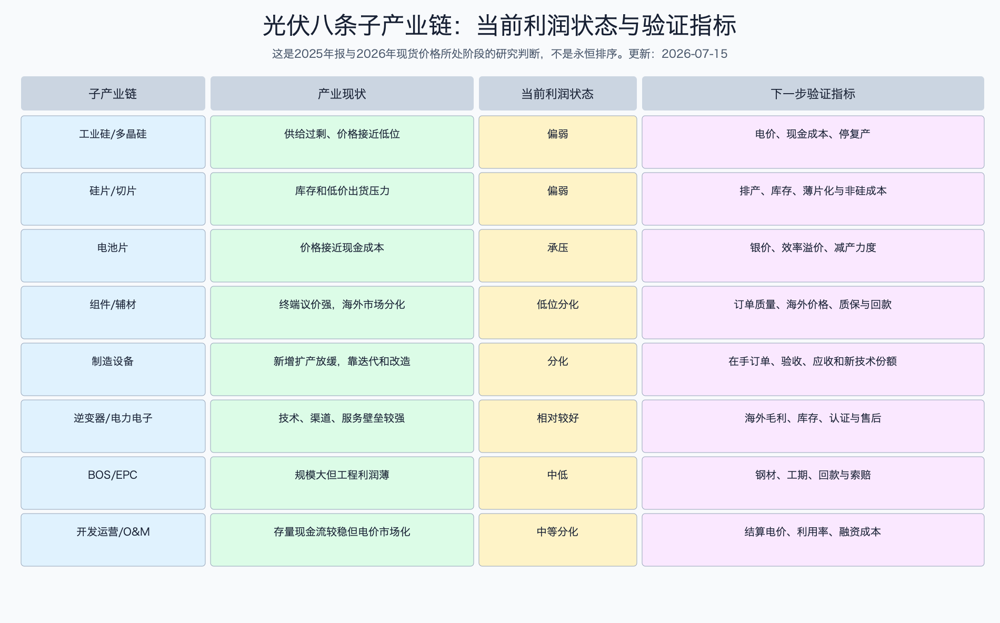
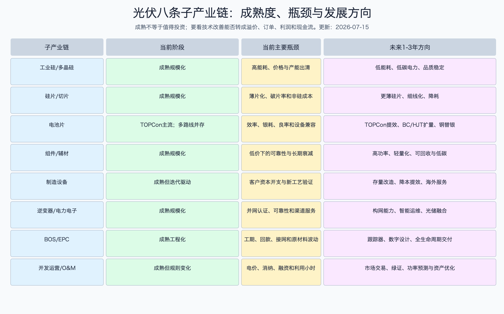

# 光伏产业深度调研 - 总览

> **事实性声明**  
> 本报告最后核验于2026-07-15，动态产业价格截至2026-07-08，ETF行情和指数日行情截至2026-07-14，官方指数事实表截至2026-06-30。文中的“判断”不是确定事实；每个重要判断都尽量给出底层原因、传导机制和反证条件。预测用情景而不是单点承诺。本报告用于投资研究，不构成买卖建议。

数据日期：详见上段及各表。  
更新日期：2026-07-15。  
核验日期：2026-07-15。

## 0. 先说结论

光伏不是“行业没增长了”，而是“终端增长很快，但制造供给扩得更快”。2025年中国官方新增光伏317.3GW，全球按IRENA已连接净容量口径新增510.3GW，按IEA PVPS直流侧加估算口径约698GW，都是历史高位；与此同时，中国2025年多晶硅、硅片、电池片、组件产量相较部分2024行业口径下降或低增长，2026年7月电池片价格已经靠近现金成本，说明制造端正在主动或被动减产出清。

这两个现象可以同时成立。组件越便宜，越有利于电站建设；但组件便宜来自制造企业互相压价时，上游和中游利润会先被打掉。终端需求增长解决的是“行业会不会消失”，产能出清解决的是“制造企业何时重新赚钱”，二者不是同一个问题。

当前更准确的周期标签是：**长期需求成长、制造深度出清、项目收益机制重估、技术路线继续迭代**。对投资者来说，这不是一个可以只看装机增速的行业。要同时看四组证据：

1. 供给是否真正退出，而不是暂时降负荷后又复产。
2. 价格是否从“跌得慢了”变成“覆盖完全成本并产生现金利润”。
3. 技术领先是否能带来真实溢价，而不是用新设备继续扩大过剩。
4. 项目端在电价市场化、消纳和融资约束下是否仍有可接受的内部收益率。

就A股光伏ETF而言，当前不能只用“距离历史高点很远”判断便宜。中证光伏产业指数截至2026-06-30滚动市盈率36.77倍、市净率2.41倍；市盈率被制造环节低利润和亏损扭曲。515790截至2026-07-14收盘0.854元，处于近五年每日收盘价约31%分位，但距近一年高点仍回撤约27.8%，年化波动约34%。这更像**行业底部验证期中的高波动观察工具**，不是已经由单一指标证明的低风险入场点。

## 1. 研究边界

| 项目 | 本报告覆盖 | 不覆盖或单独处理 |
|---|---|---|
| 产业范围 | 工业硅、多晶硅、硅片、电池、组件辅材、设备、逆变器、BOS/EPC、项目开发运营和运维 | 光热不属于本报告；储能只研究其对光伏项目价值的影响 |
| 区域 | 中国、美国、欧盟、印度和中东为重点 | 不逐国建立完整税务和项目模型 |
| 时间 | 2020-2025历史，2026-07-15现状，未来4-8季度情景，1-3年技术方向 | 不把2030目标写成确定结果 |
| 规模 | 同时看物理量、交易额、产能利用、利润和现金占用 | 不把上游到下游销售额直接相加 |
| 公司 | 中国和海外代表公司，以2025年报和2026年已披露数据为主 | 不以公司整体收入冒充某个光伏分部而不标注代理偏差 |
| 基金 | 重点研究跟踪中证光伏产业指数的A股ETF | 不提供个性化仓位和确定买卖点 |

## 1A. 数据口径

本报告同时出现交流侧并网 GW、直流侧组件 GWp、产量、出货、收入和现价重估金额。它们不能互相替代：装机回答“系统接入了多少”，出货回答“企业发出了多少”，现价重估只回答“按当前价大约是什么数量级”。所有跨口径比较都在表内标注日期、单位和代理偏差。

## 2. 小白先懂：行业为什么存在与底层逻辑

组件只是中间产品。光伏产业最终向客户交付的是：在特定地点和时段、能够被电网或用户接纳、可计量结算、二三十年持续产生的电力。

为什么这句话重要？因为组件只占电站总成本的一部分。IRENA统计，2025年全球新投运公用事业光伏平均总安装成本约667美元/kW，全球加权LCOE约44美元/MWh，平均容量因子约16%。组件价格下降会降低初始投资，但项目最后赚不赚钱还取决于日照、土地、并网、利用小时、午间电价、限电、融资成本、运维和税费。

所以产业链的真实传导不是“组件便宜 -> 所有人都赚钱”，而是：

`制造降价 -> 电站初始成本下降 -> 更多项目可能达到回报门槛 -> 装机需求上升 -> 但午间供电增加又可能压低电价 -> 项目更依赖储能、交易、低融资成本和消纳条件`。

这就是光伏长期成长和制造周期剧烈波动能长期共存的底层原因。

## 3. 市场空间：五个最重要的规模锚

| 指标 | 数值 | 数据日期/口径 | 来源 | 证据等级 | 怎么理解 |
|---|---:|---|---|---|---|
| 中国2025年新增光伏 | 317.3GW | 官方交流侧并网；集中式164GW、分布式153GW | [国家能源局，2026-02-12](https://www.nea.gov.cn/20260212/742b8c6a078347b0b39de676c05c5d58/c.html) | A | 终端需求仍强，集中式和分布式几乎各占一半 |
| 中国2025年底累计光伏 | 1,200GW | 官方并网容量；集中式670GW、分布式530GW | 同上 | A | 存量已大，运维、消纳和交易的重要性上升 |
| 中国2026年一季度新增 | 41.19GW | 官方并网；集中式19.62GW、分布式21.57GW | [国家能源局，2026-04-27](https://www.nea.gov.cn/20260427/4b751e59b0d7463a95f74096fed83e14/c.html) | A | 较2025年抢装节奏明显回落，但不能只据一季推断全年崩塌 |
| 全球2025年新增光伏 | 510.3GW | IRENA最大净发电容量，多数为已安装并连接 | [IRENA，2026-04-01](https://www.irena.org/News/pressreleases/2026/Apr/Near-700-GW-Surge-in-2025-Proves-Renewable-Energy-Resilience-ZH) | A/B | 适合判断真正形成的净发电能力 |
| 全球2025年新增光伏 | 至少608GW，含专家估算约698GW | IEA PVPS直流侧GWp，约90GW为专家估算 | [IEA PVPS Snapshot 2026](https://iea-pvps.org/snapshot-reports/snapshot-2026/) | B | 适合判断组件侧需求上限，但不能和交流侧产能利用率混算 |

### 3.1 为什么全球会同时有510.3GW和698GW

IRENA统计的是电站最大净发电容量，通常更接近交流侧已经接入系统的容量。IEA PVPS更接近组件直流峰值容量，还纳入分布式、离网和官方统计不完整部分的专家估算。大型电站常把组件直流容量配得高于逆变器交流容量，直流/交流比可能在1.1至1.5，配储项目还可能更高。

因此，两个数字不能互相替代：

- 判断电网新增了多少可输出容量，优先用IRENA或各国官方交流侧口径。
- 判断组件、玻璃、胶膜等制造需求，可以参考IEA PVPS的608-698GW区间。
- 不能用698GW除以中国组件产能，写出一个看似精确的全球产能利用率。

## 4. 中国制造端到底有多过剩

| 环节 | 2025年产量 | 对照值 | 当前含义 | 来源/等级 |
|---|---:|---:|---|---|
| 多晶硅 | 约134万吨 | 2024年CPIA口径约182.3万吨，约降26% | 已明显减产，但名义产能仍远大于产量 | [IEA PVPS中国成员页/2025 Country Update](https://iea-pvps.org/about-iea-pvps/members/china/)；B |
| 硅片 | 约680GW | 2024年CPIA口径约776GW，约降12% | 库存和排产仍是价格关键 | 同上；B |
| 电池片 | 约660GW | 2024年CPIA口径约695GW，约降5% | TOPCon扩产后仍需减产修复供需 | 同上；B |
| 组件 | 约620GW | 2024年CPIA口径约628GW，约降1% | 需求强但产量未同步高增，说明企业主动控制或渠道消化 | 同上；B |

这里存在一个重要口径冲突：工信部对2024年统计为硅片753GW、电池654GW、组件588GW，低于CPIA口径。两者可能来自企业范围、统计时间和是否折算等差异。本报告不把两套口径拼成增长率；2024官方工信部数据单独保留作交叉验证：[工信部2024年全国光伏制造行业运行情况](https://www.miit.gov.cn/gxsj/tjfx/dzxx/art/2025/art_cf341b33d6ff4249baf36cd7b4068c75.html)。

产量下降为什么仍不能证明出清完成？因为减产和退出是两回事。工厂可以低负荷运行，也可以停几个月后随着价格反弹重新复产。真正的供给出清通常要看到持续停产、资产处置、债务重组、落后产线淘汰、资本开支停止以及行业开工回升后价格仍能覆盖完全成本。

## 5. 2026年7月价格链：利润压力落在哪里

| 环节 | 2026-07-08主流/均价 | 同期供需状态 | 投资解释 | 来源/等级 |
|---|---:|---|---|---|
| 致密复投硅料 | 31-33元/kg | 少量采购、库存消化；预计低位震荡 | 接近低成本企业竞争区，电价和现金成本决定停复产 | [InfoLink，2026-07-08](https://www.infolink-group.com/energy-article/cn/pv-spot-price-20260708)；C |
| 183N硅片 | 0.87元/片，低价约0.85元/片 | 7月产出预计57-58GW，库存累积 | 降价促出货说明买方议价仍强 | 同上；C |
| 183N电池片 | 0.27元/W，区间0.265-0.27元/W | 成交冷清，价格落到厂家现金成本区间 | 再下跌空间受现金成本约束，但完全成本仍可能亏损 | 同上；C |
| TOPCon组件 | 中国均价0.728元/W | 集中式0.65-0.73，分布式0.70-0.76元/W | 低组件价利好项目成本，却压制造毛利 | 同上；C |
| 海外TOPCon组件 | 0.116美元/W | 美国封装组件约0.30-0.33美元/W | 本地化、关税和供应链要求制造巨大区域价差 | 同上；C |

这张表最容易出现的误读是：“价格已经到现金成本，所以马上反转。”现金成本只决定企业短期是否愿意继续开机，不代表价格已经覆盖折旧、费用、利息和未来资本开支。真正的盈利反转需要价格和成本差扩大，并在库存、应收和经营现金流中得到验证。

## 6. 八条子产业链：规模和利润不是一回事

| 子产业链 | 物理/金额锚点 | 当前利润状态 | 为什么 | 未来4-8季度最该看什么 |
|---|---|---|---|---|
| 工业硅与多晶硅 | 2025多晶硅约134万吨；按32元/kg静态年化交易额约429亿元 | 偏弱 | 重资产、高耗电，名义供给远超需求 | 月度产量、停产、现金成本、电价、库存 |
| 硅片与切片 | 2025硅片约680GW | 偏弱 | 产品趋同、库存高、折旧重，薄片化节省硅料但考验良率 | 排产、库存、硅片单瓦价格、非硅成本 |
| 电池片 | 2025约660GW；当前约0.27元/W | 承压 | TOPCon扩产快，银价和效率溢价决定成本差 | 减产、银耗、效率分档价差、良率 |
| 组件与辅材 | 2025约620GW；按0.728元/W静态年化交易额约4514亿元 | 低位分化 | 组件是最大单一制造交易池，但终端议价强、质保和回款重 | 海内外价差、订单质量、应收、质保、现金流 |
| 制造设备 | 取决于制造商资本开支和技术迭代 | 分化 | 普通扩产放缓，TOPCon升级、BC/HJT和改造仍有结构订单 | 在手订单、验收、预收/应收、新路线份额 |
| 逆变器与电力电子 | 跟随全球装机和更换需求 | 相对较好 | 并网认证、算法、渠道和售后形成壁垒，区域价格不完全同质 | 海外毛利、渠道库存、认证、售后费用 |
| BOS与EPC | IRENA 2025全球光伏总安装成本667美元/kW，组件外价值占大头 | 中低 | 市场大但工程毛利薄，工期和回款可吞掉利润 | 钢价、项目开工、应收、索赔、验收 |
| 项目开发运营/O&M | 中国累计1,200GW，全球IRENA累计约2,383GW | 中等分化 | 存量现金流较稳，但午间电价、消纳、融资决定回报 | 结算电价、利用率、绿证、融资成本、IRR |

静态年化交易额的算法是“2025物理产量 × 2026-07-08现货价格”，只用于帮助理解当前价格下节点大致量级，不是2025实际收入，也不能跨节点相加。比如组件交易额已经包含电池、硅片和硅料价值，再把四层相加就会重复计算。

## 7. 利润为什么正在向后端和差异化环节迁移

上游制造的核心问题是可替代性。客户只要能买到效率和品质达标的硅料、硅片、电池或普通组件，就会不断比价。当行业名义产能很大、库存充足时，买方有能力把价格压到高成本企业退出。

逆变器、海外本地化组件、跟踪器、运维和项目开发也有竞争，但更难只用每瓦最低价替代。原因分别是并网认证、故障记录、渠道服务、可融资性、土地接网、项目工期、电力交易和长期运维。越靠近“项目能否被融资、并网并稳定收钱”，价值越不只是工厂成本。

这不等于后端天然高利润。EPC仍可能因为工期和回款低利润，电站运营仍可能因为午间低价和限电回报不足。正确说法是：**制造标准化后，利润更可能向有技术溢价、区域保护、认证服务或稀缺项目资源的节点迁移；是否真的迁移仍需公司财务验证。**

## 8. 技术成熟度：不是只看电池效率冠军

| 技术 | 2026阶段 | 为什么 | 投资上要验证什么 |
|---|---|---|---|
| PERC | 成熟、份额继续下降 | 效率提升空间小，旧设备经济性弱 | 旧产线减值、改造成本和退出速度 |
| TOPCon | 主流规模化 | 可沿用部分PERC设备，效率和成本平衡最好 | 提效、银耗、良率是否形成龙头成本差 |
| HJT | 早期规模化 | 双面率和工艺潜力高，但设备、靶材和金属化成本不同 | 量产良率、银耗/铜电镀、订单和资本回报 |
| BC | 差异化扩量 | 正面无遮挡，效率和美观有优势 | 成本、良率、场景溢价能否覆盖复杂工艺 |
| 钙钛矿/晶硅叠层 | 中试到早期示范 | 实验室效率高，但稳定性、面积放大和封装未完全解决 | 认证、长期衰减、百兆瓦级良率和客户融资认可 |

2024年工信部规范要求新建P型电池/组件最低效率23.7%/21.8%，新建N型电池/组件最低26%/23.1%，并要求新建项目资本金比例最低30%。这类标准提高了新建门槛，但不会自动关掉所有存量产能。[工信部《光伏制造行业规范条件（2024年本）》](https://www.miit.gov.cn/gyhxxhb/jgsj/dzxxs/zlgh/art/2024/art_8997116730504e5b85f97f9e63c2da3a.html)

2026年6月发布的强制性国家标准GB 47835-2026《硅单晶单位产品能源消耗限额》和GB 47834-2026《晶体硅光伏组件和逆变器能效限定值及能效等级》将于2027-01-01实施。它们会提高能耗和能效约束，但真正影响多少产能，要等具体企业达标情况、执法和改造成本验证。[硅单晶标准](https://std.samr.gov.cn/gb/search/gbDetailed?id=5583D6ADACBC7231E06397BE0A0ACDD2)、[组件与逆变器标准](https://std.samr.gov.cn/gb/search/gbDetailed?id=5583D6ADACC07231E06397BE0A0ACDD2)。

## 9. 中国市场为什么从“抢装”转向“算项目回报”

2025年1-5月中国光伏新增并网接近200GW，很大程度上与2025-06-01电价机制分界有关。136号文规定，新能源上网电量原则上全部进入电力市场；2025-06-01以后投产的增量项目，其机制电价和纳入电量通过地方竞价等方式形成。开发商为了锁定旧机制或降低不确定性，会把项目提前并网，形成抢装。

政策变化背后的why是：当光伏占比低时，固定或保障电价能快速推动建设；当中午光伏越来越多，电力市场可能出现低价甚至负价，如果仍用不反映时段价值的固定价格，就会继续鼓励“只建不管系统是否需要”。市场化让项目承担更多时段、电网和消纳信号，也迫使开发商重视储能、负荷匹配、功率预测、长期PPA和交易能力。

对制造公司的传导是：2025抢装不能线性外推到2026；项目端更看回报，组件仍会增长，但对价格、交付和融资的要求更强。对电站公司的传导是：低组件成本是利好，但午间电价、机制电量、利用小时和融资成本可能抵消利好。

## 10. 全球不是一套价格和利润逻辑

| 市场 | 2025规模锚 | 核心驱动 | 利润更可能流向 | 主要风险 |
|---|---:|---|---|---|
| 中国 | 官方新增317.3GW | 大基地、分布式、低成本、电价市场化 | 低融资开发商、逆变器、交易运维、低成本龙头 | 过剩、午间低价、消纳和回款 |
| 美国 | 交流侧净增约34GW；IEA直流侧43.2GW | 数据中心负荷、税收抵免、州级需求 | 本地可追溯电池组件、薄膜、逆变器、支架、合规服务 | 抵免期限、PFE追溯、双反和住宅需求 |
| 欧盟 | 官方约56GW；IEA直流侧65.7GW | 能源安全、电气化、建筑光伏 | 符合NZIA韧性/可持续要求的产品、储能和电网设备 | 电网、负电价、许可、本地制造成本高 |
| 印度 | 官方净增约37.95GW；IEA直流侧55.9GW | PLI、ALMM、本地化、需求增长 | 名单内电池组件、一体化制造、国内EPC | 名义组件产能过剩、政策变更和对美出口风险 |
| 中东 | IRENA中东净增约12.58GW | 政府主导IPP、节省油气、低成本融资 | 开发融资、EPC、跟踪器、逆变器、储能、运维 | 最低价招标、地缘和物流 |

美国PFE、双反，欧盟NZIA，印度ALMM和进口税，都说明全球市场正在从“谁成本最低就买谁”转向“成本、来源、所有权、碳足迹、可靠性和政治安全一起定价”。这会提高合规和本地化价值，但也会增加资本投入与供应链复杂度。

## 11. 当前行业周期

| 周期层 | 当前阶段 | 领先指标 | 反转确认 |
|---|---|---|---|
| 终端需求 | 高位增长但区域分化 | 新增并网、招标、接网队列、利率 | 多地区装机和发电继续增长，不靠单一抢装 |
| 制造供给 | 深度出清 | 月度排产、库存、停复产、破产重组 | 名义产能净退出，开工回升但价格不再下跌 |
| 产品价格 | 低位震荡 | 硅料、硅片、电池、组件周价 | 价格覆盖完全成本，毛利和现金流同步改善 |
| 技术迭代 | TOPCon主流、多路线争夺 | 效率、银耗、良率、设备订单 | 新技术有客户溢价且ROIC高于资本成本 |
| 项目收益 | 从固定支持转向市场化 | 机制电价、PPA、利用小时、负电价 | 项目IRR不依赖极端电价假设也能成立 |
| 股票预期 | 已经历大回撤但会反复交易反转 | ETF估值、盈利预期、成交和份额 | 盈利预期上修来自价格和现金流，不只是政策口号 |

周期底部通常不是一个日期，而是一段证据逐步转好的过程。股价可能先于利润反弹，但如果供给未退出、价格未覆盖完全成本，反弹更依赖预期，容错率更低。

## 12. 未来4-8季度三情景

| 情景 | 2027 中国新增并网 | 2027 全球直流侧新增 | 中国 TOPCon 组件价格中枢 | 主链毛利率代理 | 经营现金流减资本开支/收入 | 切换条件 |
|---|---:|---:|---:|---:|---:|---|
| 基准：弱复苏、强分化 | 230-290GW | 650-740GW | 0.68-0.78 元/W | -2%至 +3% | -8%至 +1% | 库存缓降、资本开支收缩，但闲置产能仍可复产 |
| 乐观：出清快于预期 | 280-340GW | 720-800GW | 0.78-0.88 元/W | +3%至 +8% | 0%至 +6% | 高成本产能永久退出，三项以上主链连续两季完整成本毛利转正 |
| 悲观：需求放缓但供给复产 | 180-240GW | 560-650GW | 0.58-0.68 元/W | -8%至 -3% | -13%至 -3% | 需求下修、涨价即复产、库存和减值重新扩大 |

这些是研究区间，不是承诺，也不分配伪精确概率。历史上中国新增并网从2020年的约48.2GW升到2025年的317.3GW，但组件价格从2023年初到2025年仍下降逾60%，说明需求高增本身不足以修复制造利润。完整历史基准、区间假设和计算解释见[周期专题](光伏产业周期、供需与投资节奏.md)。

## 13. ETF估值与是否可以入场

以规模和流动性更高的515790为观察工具：2026-07-14收盘0.854元，2026-07-15盘中数据对应场内市值约58.2亿元、成交额约1.81亿元；截至2026Q1基金规模约106.5亿元，不同日期和净值口径不能直接互相替代。指数截至2026-06-30滚动PE36.77倍、PB2.41倍、股息率0.69%。

价格统计显示，0.854元处于近一年约16.9%分位、近三年约52.1%分位、近五年约31.2%分位；距近一年高点约-27.8%，近五年最大回撤约-67.1%。这些数字说明波动和回撤大，不说明盈利已经恢复。

当前更合理的研究动作是“观察，等待证据，或只在满足自身风险预算时按条件分批”，而不是因为价格低于历史高点就一次性判断可以入场。至少应看到以下三类条件中的两类：

1. 产业条件：库存下降、落后产能退出、硅料/电池/组件价格不再跌破现金成本。
2. 公司条件：指数核心持仓毛利率、经营现金流和资产减值预期改善。
3. 估值条件：PB或正常化盈利估值提供足够安全边际，且不是靠亏损导致PE失真。

反过来，如果价格反弹但产能复产、行业资本开支重新扩张、应收和库存继续恶化，这种上涨更像预期交易，不是完整基本面反转。详见[基金与ETF专题](光伏产业相关基金与ETF估值入场.md)。

## 14. 需要持续跟踪的仪表盘

| 频率 | 指标 | 为什么看 | 数据变好是什么样 |
|---|---|---|---|
| 每周 | InfoLink硅料/硅片/电池/组件价格 | 看价格链和现金成本压力 | 价格止跌且成交恢复，不靠短期拉涨 |
| 每月 | 各环节排产、库存、开工 | 看真实供需 | 库存下降、开工回升但价格稳定 |
| 每季 | 中国新增并网、发电量、利用率 | 看装机是否被系统吸收 | 发电增速与装机匹配，利用率稳定 |
| 每季 | 全球主要市场新增、招标和政策 | 看需求是否过度依赖中国 | 多地区共同增长，贸易风险可分散 |
| 每季 | 代表公司毛利、经营现金流、存货、应收、减值 | 看增长有没有变成现金 | 毛利企稳、现金流改善、减值收窄 |
| 每半年 | 名义产能、退出和资本开支 | 看出清是否永久 | 产能净减少、资本开支更克制 |
| 每半年 | 电池效率、银耗、良率、组件衰减 | 看技术是否有经济价值 | 降本提效能形成溢价和ROIC |
| 每月/季 | ETF估值、份额、成交、折溢价 | 看市场预期与拥挤 | 基本面改善快于估值扩张 |

## 15. 最强反方观点

**反方一：组件已经足够便宜，光伏需求会无限吸收产能。**  
反驳：需求会受益，但电网接入、午间电价、土地、许可和融资不是零约束；组件只占总安装成本一部分。低价可以扩大需求，却不保证制造价格回到完全成本以上。

**反方二：反内卷和强制标准会迅速抬价。**  
反驳：标准能提高门槛，但产能退出涉及地方就业、债务、资产处置和企业现金流，通常慢于政策口号。行政或行业协调抬价若没有需求和退出配合，容易刺激复产。

**反方三：技术领先公司一定能穿越周期。**  
反驳：技术领先如果依赖更高资本开支，却没有客户溢价、良率和持续现金流，可能只是更昂贵的扩产。技术优势要用ROIC和自由现金流验证。

**反方四：ETF已经从高点跌很多，所以风险很小。**  
反驳：价格回撤不等于资产负债表已经出清。光伏制造可能继续减值、亏损和融资；周期底部PE也会因为利润太低而失真。

## 16. 本报告的当前投资结论

- 长期产业方向：仍然成立。光伏已经是全球新增电力的重要来源，成本竞争力和规模化不会逆转。
- 未来4-8季度：更可能是出清和弱复苏并存，不应把2025中国抢装线性外推。
- 利润排序：普通硅料、硅片、电池和组件仍承压；逆变器、海外本地化、技术设备、优质项目开发和运维相对有结构机会，但必须逐公司核验。
- ETF：处于可研究、可等待条件的阶段，尚不能仅凭价格分位或历史回撤判定“明显便宜”。
- 主要证伪：全球需求明显下修、价格反弹触发大规模复产、电网消纳和午间电价恶化、公司现金流和减值继续超预期恶化。

## 17. 主要来源

1. [国家能源局：2025年光伏发电建设和运行情况](https://www.nea.gov.cn/20260212/742b8c6a078347b0b39de676c05c5d58/c.html)
2. [国家能源局：2026年一季度可再生能源并网运行情况](https://www.nea.gov.cn/20260427/4b751e59b0d7463a95f74096fed83e14/c.html)
3. [国家发展改革委、国家能源局：发改价格〔2025〕136号](https://www.ndrc.gov.cn/xxgk/zcfb/tz/202502/t20250209_1396066.html)
4. [IEA PVPS：Snapshot of Global PV Markets 2026](https://iea-pvps.org/snapshot-reports/snapshot-2026/)
5. [IRENA：Renewable Capacity Statistics 2026](https://www.irena.org/Publications/2026/Mar/Renewable-capacity-statistics-2026)
6. [IRENA：Renewable Power Generation Costs in 2025](https://www.irena.org/Publications/2026/Jul/Renewable-Power-Generation-Costs-in-2025)
7. [工信部：2024年全国光伏制造行业运行情况](https://www.miit.gov.cn/gxsj/tjfx/dzxx/art/2025/art_cf341b33d6ff4249baf36cd7b4068c75.html)
8. [IEA PVPS中国成员页与2025 Country Update](https://iea-pvps.org/about-iea-pvps/members/china/)
9. [InfoLink：2026-07-08光伏现货价格](https://www.infolink-group.com/energy-article/cn/pv-spot-price-20260708)
10. [中证指数：中证光伏产业指数2026-06-30事实表](https://oss-ch.csindex.com.cn/static/html/csindex/public/uploads/indices/detail/files/zh_CN/931151factsheet.pdf)
