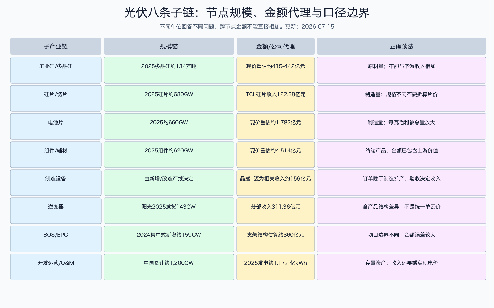

# 光伏产业深度调研

这是光伏产业投资研究的入口页。报告研究的是“光伏装机增长后，钱流到哪里、谁能留下利润、当前周期和估值是否提供足够容错”，不是把长期能源转型直接写成买入理由。

数据日期：动态价格截至 2026-07-08，A 股 ETF 行情和指数日行情截至 2026-07-14，官方指数估值截至 2026-06-30。  
更新日期：2026-07-15。  
核验日期：2026-07-15。  
每项事实仍以正文标注日期为准。本资料不构成确定性投资建议或买卖建议。

## 阅读顺序

1. [光伏产业深度调研 - 总览](光伏产业深度调研%20-%20总览.md)
2. [光伏产业子产业链覆盖矩阵](光伏产业子产业链覆盖矩阵.md)
3. [光伏产业术语表](光伏产业术语表.md)
4. [光伏产业产业链节点规模与利润池](光伏产业产业链节点规模与利润池.md)
5. [光伏产业周期、供需与投资节奏](光伏产业周期、供需与投资节奏.md)
6. [光伏产业技术成熟度与发展趋势](光伏产业技术成熟度与发展趋势.md)
7. [光伏产业深度调研 - 国内视角](光伏产业深度调研%20-%20国内视角.md)
8. [光伏产业深度调研 - 全球视角](光伏产业深度调研%20-%20全球视角.md)
9. [光伏产业公司财务与业务对比表](光伏产业公司财务与业务对比表.md)
10. [光伏产业相关基金与ETF估值入场](光伏产业相关基金与ETF估值入场.md)
11. [光伏产业小白审核结果](光伏产业小白审核结果.md)

## 八条核心子产业链

1. [工业硅与多晶硅产业链](工业硅与多晶硅产业链.md)
2. [硅片与切片耗材产业链](硅片与切片耗材产业链.md)
3. [光伏电池片产业链](光伏电池片产业链.md)
4. [光伏组件与关键辅材产业链](光伏组件与关键辅材产业链.md)
5. [光伏制造设备产业链](光伏制造设备产业链.md)
6. [逆变器与电力电子产业链](逆变器与电力电子产业链.md)
7. [支架BOS与EPC产业链](支架BOS与EPC产业链.md)
8. [光伏项目开发运营与运维产业链](光伏项目开发运营与运维产业链.md)

## 四张先看懂全局的图

这张图不是永久排名。它回答的是：在 2025 年报和 2026 年 7 月现货价格所处阶段，各环节的利润状态怎样，下一步要用什么指标验证反转。

技术成熟不等于股票便宜，也不等于公司能赚钱。技术只有变成客户愿意支付的效率、良率、可靠性或系统收益，才能进一步变成订单、利润和现金流。

这张图把需求、供给、价格、利润、现金流和估值连在一起，帮助读者检查中间是否跳步。装机增长必须先快过有效供给，价格和毛利才可能改善；毛利还要经过库存、应收和资本开支，才能变成现金。

这张图把八条子链的规模锚放在同一个画面里。不同单位不能相加：万吨、GW、亿元、累计装机分别回答原料量、制造量、交易额和存量资产的问题。

## 一句话总纲

光伏长期需求仍强，但制造端正处于“需求创新高、供给更过剩、价格贴近现金成本”的错位周期。研究重点已经从“全球还会装多少”转成四个问题：产能何时真正退出、技术溢价能否覆盖折旧、海外本地化能否留下利润、低价组件能否让电站在市场化电价下仍有合理回报。
