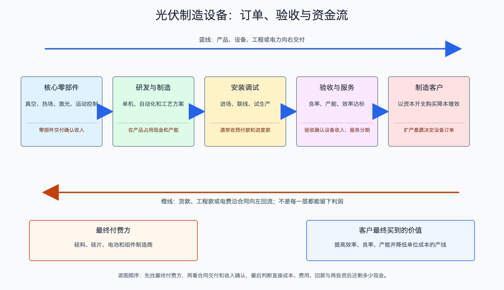

# 光伏制造设备产业链

日期：2026-07-15  
数据日期：公司经营数据为 2025 年，2026 年一季度用于趋势核验  
状态：已完成  
用途：投资研究，不构成确定性投资建议。

## 0. 子产业链边界

- 包含：硅料生产设备、单晶炉、切片机、电池制绒/沉积/扩散/金属化设备、组件串焊和层压设备，以及备件和技术服务。
- 不包含：用这些设备生产出来的硅料、硅片、电池和组件。
- 与相邻子链的接口：制造企业为新建、扩建或改造产线向设备商付款；设备商与客户共同完成工艺验证、交付和验收。
- 主要付费方：硅料、硅片、电池和组件制造商。
- 收入确认位置：设备通常在交付、安装、调试并达到验收条件后确认收入，因此订单与收入之间可能相隔数个季度。
- 经济模型：研发和工程服务驱动的定制设备制造。利润来自设备售价减材料、制造、安装和服务成本，但现金还受预收款、备货和验收进度影响。

## 1. 产业链路图

设备公司卖的不是普通机器，而是“能稳定做出某种效率和良率的生产能力”。例如一条新电池产线只有在效率、良率和产能达到合同要求后，客户才愿意最终验收。制造商扩产时先下设备订单，设备商备料、生产、发货、安装，最后才确认收入，所以设备公司的财报往往比下游扩产决策晚半年甚至更久。

## 2. 谁付钱与价值流

下游制造商用资本开支购买设备，希望通过更高效率、更低银耗、更高产量或新技术产品获得回报。如果一台设备能每年节省的材料和人工、增加的合格产品价值，明显高于折旧和资金成本，客户就有采购动力；反之，即使技术先进，在全行业亏损、没有扩产资金时也可能无人下单。

设备商能够保留较高毛利，是因为设备要与工艺配合，客户更换供应商需要重新调试和验证。但这份毛利具有强周期性：主材过剩时，制造商首先停止扩产，随后设备订单下降，再过几个季度才体现在收入和利润中。

## 3. 节点规模

| 节点 | 节点边界 | 经营规模 | 金额规模 | 新增/存量 | 关键效率指标 | 增速/周期 | 数据日期/口径/来源 | 证据等级 | 存疑点 |
|---|---|---:|---:|---|---|---|---|---|---|
| 全行业设备 | 各制造环节的新建和改造设备 | 缺口: EQ-01，尚无统一可靠全行业规模 | 缺口: EQ-01，应按新增/改造 GW × 单 GW 设备投资估算 | 新增与改造 | 订单、合同负债、验收周期、客户投资回收期 | 主材扩产下降后进入滞后下行 | 公司年报、行业数据 | C | 不同路线和环节单 GW 投资差异巨大 |
| 晶盛机电设备与服务 | 单晶炉等设备，另含半导体装备 | 2025 年设备与服务收入 84.03 亿元 | 同左 | 当年确认收入 | 分部毛利率 33.88% | 公司收入同比 -35.38%，净利润同比 -64.75% | 2025 年报 | A | 分部包含半导体和碳化硅，不能视为纯光伏 |
| 迈为股份光伏设备 | 以电池设备为主 | 光伏设备收入 74.50 亿元，其中电池线设备 60.25 亿元 | 同左 | 当年确认收入 | 光伏设备毛利率 38.30%，电池线设备 37.77% | 高毛利，现金和验收承压 | 2025 年报 | A | 收入并非订单，反映更早期签约和当年验收 |

这里不能用 2025 年光伏新增装机 317.3GW 直接推导设备市场。终端装机消耗的是过去生产的组件，设备需求取决于制造商是否还要增加或更换产线。当前主材产能利用率大多只有五至六成，即使终端装机仍增长，制造商也可能没有理由扩产。

## 4. 利润分布与单位经济

| 节点 | 变现基数 | 直接经济性 | 直接价值池 | 经营收益 | 资本/风险/再投资占用 | 可分配价值 | 估算公式/口径 | 数据日期 | 来源/证据等级 |
|---|---:|---:|---:|---|---|---|---|---|---|
| 晶盛机电设备与服务 | 当年验收收入 84.03 亿元 | 毛利率 33.88% | 毛利约 28.47 亿元，按分部收入 × 毛利率粗算 | 公司归母净利润 8.85 亿元，不能全归该分部 | 公司存货 66.27 亿元、跌价约 8.84 亿元；设备备货和验收占资金 | 公司经营现金流 7.39 亿元减资本开支 5.59 亿元，得到 **+1.80 亿元粗代理**；为合并口径 | 84.03 × 33.88%；可分配现金粗代理 = 经营现金流 - 购建长期资产现金 | 2025 | [晶盛机电年报](https://disc.static.szse.cn/disc/disk03/finalpage/2026-04-11/abdb4926-b75d-4c90-b255-4efcc37ad6f8.PDF)；A/C |
| 迈为股份光伏设备 | 收入 74.50 亿元 | 毛利率 38.30% | 毛利约 28.53 亿元，按收入 × 毛利率粗算 | 缺口: EQ-04，公司净利润不能全归光伏单一设备 | 存货 61.14 亿元，约相当于光伏设备收入的 82%；经营现金流 -6.98 亿元 | 仅经营现金流已为 **-6.98 亿元**，扣资本开支后只会更低；资本开支分部口径缺口: EQ-04 | 74.50 × 38.30%；经营现金流为合并口径 | 2025 | [迈为股份年报](https://disc.static.szse.cn/disc/disk03/finalpage/2026-04-28/52da9817-c743-4a53-b653-ab57af2f031e.PDF)；A/C |

迈为的例子解释了为什么不能只看毛利率：近四成毛利说明产品有工艺壁垒，但 61.14 亿元存货和负经营现金流说明不少资金还压在备料、在制设备或待验收项目里。只有设备完成验收、客户付款并且下一轮订单接上，毛利才真正接近股东可获得的现金。

## 4.1 受控数据缺口

| 缺口 ID | 指标 | 已检索范围 | 无法估算原因 | 可给上下界 | 替代指标 | 决策影响 | 核验计划 |
|---|---|---|---|---|---|---|---|
| EQ-01 | 中国光伏设备全行业规模 | 上市公司、协会、招标资料 | 技术路线、设备边界、国产化率和验收时点不同 | 否 | 头部设备商分部收入之和、客户资本开支 | 影响行业绝对天花板 | 按硅料/硅片/电池/组件设备分别建模 |
| EQ-02 | 各路线单 GW 设备投资 | 公司推介、项目公告 | 报价会随配置、自动化和国产化变化 | 可用项目公告形成区间，暂未统一 | 客户项目总投资和设备订单 | 决定新技术放量弹性 | 收集多个可比项目，剔除厂房和流动资金 |
| EQ-03 | 在手订单质量 | 合同负债、公司公告 | 公司通常不披露取消条款、客户付款能力和毛利 | 否 | 合同负债、存货、应收、经营现金流 | 直接决定未来收入兑现 | 每季核对订单、验收和回款 |
| EQ-04 | 迈为光伏设备分部资本开支与自由现金流 | 迈为股份年报 | 现金流量表没有按光伏设备分部拆分 | 否 | 合并经营现金流、存货、合同负债、设备验收 | 决定高毛利能否转成股东现金 | 取得分部投资披露后补充，当前不做伪精确值 |

## 5. 利润迁移、周期与反证

- **利润为何能留下：**设备与工艺共同开发，切换供应商会影响效率、良率和量产爬坡；客户愿意为已验证的生产能力付费。
- **为什么现在仍危险：**设备是资本开支周期，不是装机周期。主材厂亏损和低利用率会先压订单，之后才压设备收入。晶盛机电 2026 年一季度收入同比下降 44.88%、归母净利润下降 82.10%，进一步验证滞后下行。
- **下一轮机会来自哪里：**现有产线必须改造且投资回收期清楚的新工艺，例如能够显著提高效率、减少银耗或提高良率的设备；单纯复制过剩产能没有持续价值。
- **未来 4-8 个季度领先指标：**新签订单、合同负债、存货结构、客户预付款、应收账款、验收周期、客户资本开支、HJT/BC/叠层量产项目的真实开工。
- **反证条件：**若技术路线迟迟不能量产、客户继续亏损或订单取消，设备高毛利会继续向下；若存货和应收增长快于收入，账面订单质量需要下调。

## 来源

- [晶盛机电 2025 年年度报告](https://disc.static.szse.cn/disc/disk03/finalpage/2026-04-11/abdb4926-b75d-4c90-b255-4efcc37ad6f8.PDF)
- [迈为股份 2025 年年度报告](https://disc.static.szse.cn/disc/disk03/finalpage/2026-04-28/52da9817-c743-4a53-b653-ab57af2f031e.PDF)
- [晶盛机电 2026 年第一季度报告](https://money.finance.sina.com.cn/corp/view/vCB_AllBulletinDetail.php?id=12218217&stockid=300316)
- 制造产能利用率和技术路线详见《光伏产业产业链节点规模与利润池》和《光伏产业技术成熟度与发展趋势》。
