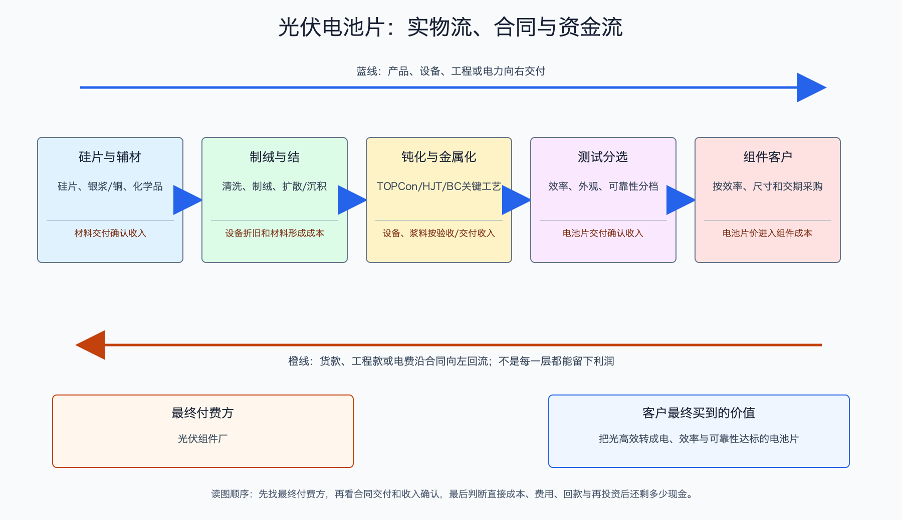

# 光伏电池片产业链

日期：2026-07-15  
数据日期：价格截至 2026-07-08；行业产能以 2024 年同口径数据为主；公司经营数据为 2025 年  
状态：已完成  
用途：投资研究，不构成确定性投资建议。

## 0. 子产业链边界

- 包含：硅片制绒、扩散或沉积、钝化、金属化和测试分选形成的光伏电池片，覆盖 PERC、TOPCon、HJT、BC 等路线。
- 不包含：硅片制造、组件封装和电池设备本体。
- 与相邻子链的接口：电池厂购买硅片、银浆和化学品，把完成光电转换功能的电池片卖给组件厂。
- 主要付费方：组件厂和一体化组件企业内部下游工序。
- 收入确认位置：电池片交付并满足质量、效率和外观验收后确认收入。
- 经济模型：技术迭代较快的重资产制造。每瓦毛利来自电池售价减硅片、银浆、化学品、能源、人工和设备折旧。

## 1. 产业链路图

电池片是把普通硅片变成“能发电的芯片”。硅片经过表面处理和多层薄膜工艺后，光照产生的电子才能被金属栅线收集。组件厂愿意为更高转换效率付一点溢价，因为同样一块土地、支架和电缆可以装下更多瓦数；但只有当多发的电足以覆盖电池片溢价时，这个技术才真正有经济价值。

## 2. 谁付钱与价值流

组件厂向电池厂付款，价格通常按元/W计算。组件厂同时比较三件事：效率、良率和价格。效率更高能摊薄玻璃、支架、土地和施工等非硅成本；良率不稳定会让组件厂增加报废和返工；价格过高又会吃掉系统成本优势。因此，新技术不是“实验室效率最高就获胜”，而是要通过量产效率、良率、衰减、可靠性和设备投资的综合考验。

电池环节利润容易被两头挤压：上游硅片若涨价会推高成本，下游组件又拥有多个电池供应商可选。只有高效产品供不应求或客户认证形成时间差时，电池厂才有明显溢价；当同一技术大规模普及后，溢价会快速收窄。

## 3. 节点规模

| 节点 | 节点边界 | 经营规模 | 金额规模 | 新增/存量 | 关键效率指标 | 增速/周期 | 数据日期/口径/来源 | 证据等级 | 存疑点 |
|---|---|---:|---:|---|---|---|---|---|---|
| 中国电池片制造 | 各类晶硅电池片 | 2024 年产能约 1,302GW、产量 695.1GW；2025 年产量约 660GW | 按 2026-07-08 主流 N 型约 0.27 元/W重估，为约 1,782 亿元 | 当年产量 | 2024 年名义产能利用率约 53.4% | 产量回落，过剩与升级同时发生 | IEA PVPS、InfoLink | B/C | 现价重估不是 2025 年真实收入；不同效率档价格不同 |
| TOPCon | 当前主流 N 型路线 | 未取得同口径独立全国产量 | 主流 183/210R 约 0.27 元/W，210N 约 0.275 元/W | 当年产量 | 看平均量产效率、银耗、良率 | 已成熟量产，竞争趋同质化 | 2026-07-08 InfoLink | B | 报价已接近现金成本区间，企业成本不同 |
| HJT/BC | 更高效率路线 | 缺口: CELL-01，产能、出货尚未形成统一口径 | 缺口: CELL-01，暂不估算 | 新增与改造 | 看量产效率、设备投资、银铜耗量、良率和客户认证 | 导入期，适用场景分化 | 公司公告与行业资料 | B/C | 不能把公告产能等同实际出货 |

2024 年电池片名义产能利用率只有约 53.4%，比硅片还低。这里同时存在两种“过剩”：旧 PERC 产线经济性下降，TOPCon 又快速扩产。即使旧产能技术落后，它的减值、债务和人员成本仍会留在报表上；而新产能若大家同时建设，也会很快失去技术溢价。

## 4. 利润分布与单位经济

| 节点 | 变现基数 | 直接经济性 | 直接价值池 | 经营收益 | 资本/风险/再投资占用 | 可分配价值 | 估算公式/口径 | 数据日期 | 来源/证据等级 |
|---|---:|---:|---:|---|---|---|---|---|---|
| 全行业现价数量级 | 2025 年产量约 660GW | 主流 N 型约 0.27 元/W | 约 1,782 亿元现价产值 | 缺口: CELL-04，不能从产值直接推行业经营利润 | 缺口: CELL-04，设备折旧、银浆、硅片和技术减值尚无统一值 | 缺口: CELL-04，现价产值不能代替行业自由现金流 | 660GW × 10 亿W/GW × 0.27 元/W | 2025 产量、2026-07 价格 | IEA PVPS、InfoLink；B/C |
| 钧达股份电池片 | 2025 年销量 29.54GW | 收入约 0.257 元/W，营业成本约 0.261 元/W | 收入 75.98 亿元 | 毛利率 -1.65% | 固定资产 74.09 亿元、存货 6.38 亿元；还要承担旧线改造和减值风险 | 缺口: CELL-04，已确认单位毛利约 -0.004 元/W，但本表不以负毛利替代现金流 | 分部收入或成本 ÷ 销量 | 2025 | [钧达股份年报](https://static.cninfo.com.cn/finalpage/2026-03-31/1225058399.PDF)；A/C |

钧达的单位数据意味着：每销售 1W 电池片，平均收入约 0.257 元，营业成本约 0.261 元，尚未扣期间费用就已亏约 0.004 元。看起来每瓦只差几厘钱，但乘以 29.54GW 后就是亿元级毛利缺口。**光伏制造的特点正是单瓦变化极小、总量放大极快。**

效率溢价为何会消失？假设更高效电池能帮组件或电站节省每瓦 0.02 元 BOS 成本，组件厂最多愿意分享其中一部分；当供应商增加、该技术成为标配，电池厂无法长期拿走全部节省。因此技术领先必须不断转换成更低成本、更高良率和更快认证，而不能只停留在效率纪录。

## 4.1 受控数据缺口

| 缺口 ID | 指标 | 已检索范围 | 无法估算原因 | 可给上下界 | 替代指标 | 决策影响 | 核验计划 |
|---|---|---|---|---|---|---|---|
| CELL-01 | TOPCon/HJT/BC 2025 年准确出货占比 | 协会、公司年报、技术报告 | 口径有按产能、产量和组件出货多种，不能混用 | 否 | 头部公司出货结构、设备订单 | 影响技术利润池排序 | 使用同一协会年度数据更新 |
| CELL-02 | 各路线每瓦完整成本 | 上市公司年报、设备商资料 | 银耗、良率、折旧年限和产线利用率属于企业敏感数据 | 可用公司分部毛利与现价判断方向 | 银浆耗量、效率、开工率、折旧 | 决定技术溢价能否转成利润 | 按季度跟踪代表企业单位售价和成本 |
| CELL-03 | 旧 PERC 有效退出规模 | 减值公告、资产处置公告 | 停产、闲置、改造和永久退出定义不同 | 否 | PERC 报价、产能减值、设备拍卖 | 影响供给出清速度 | 跟踪资产减值和设备改造订单 |
| CELL-04 | 电池片行业及代表企业可分配现金流 | 行业数据、钧达股份年报 | 公司分部没有独立现金流量表，合并现金又受海外投资、融资和其他业务影响 | 否 | 单瓦毛利、合并经营现金流减资本开支、净债务 | 决定效率优势是否真正转成现金 | 下一期年报统一提取代表企业合并现金流，并明确分部代理偏差 |

## 5. 利润迁移、周期与反证

- **价值为何存在：**效率提升可节约组件面积、支架、土地、电缆和施工成本；可靠性提升能减少 25 年全生命周期损失。这是客户愿意为高效电池付费的底层原因。
- **利润为何没有留住：**TOPCon 大规模扩产后，合格产品供应超过组件需求，技术溢价被价格竞争压缩；旧线折旧和新线资本开支又同时压在报表上。
- **未来利润可能流向哪里：**短期更可能流向拥有稳定量产效率、低银耗、海外认证和客户协同的企业；长期要观察 BC、HJT、钙钛矿叠层能否用可银行融资的可靠性证明自身，而非只看实验室纪录。
- **未来 4-8 个季度领先指标：**N/P 型价差、各效率档溢价、银浆耗量、开工率、设备订单、固定资产减值、头部企业单位售价与成本、终端是否愿意为高功率组件付费。
- **反证条件：**若新路线效率提高却伴随良率低、设备投资高或衰减不确定，单位度电成本未下降，技术不会自动转化为股东利润；若 TOPCon 产能继续增加，价格修复也可能再次被打断。

## 来源

- [IEA PVPS：中国光伏市场 2024 年报告](https://www.iea-pvps.org/wp-content/uploads/2025/10/IEA-PVPS-Task-1-NSR-China-2024.pdf)
- [IEA PVPS：中国成员页，含 2025 年制造产量](https://iea-pvps.org/about-iea-pvps/members/china/)
- [InfoLink：2026 年 7 月 8 日光伏现货价格](https://www.infolink-group.com/energy-article/cn/pv-spot-price-20260708)
- [钧达股份 2025 年年度报告](https://static.cninfo.com.cn/finalpage/2026-03-31/1225058399.PDF)
- 技术路线的成熟度、经济性与反证详见《光伏产业技术成熟度与发展趋势》。
