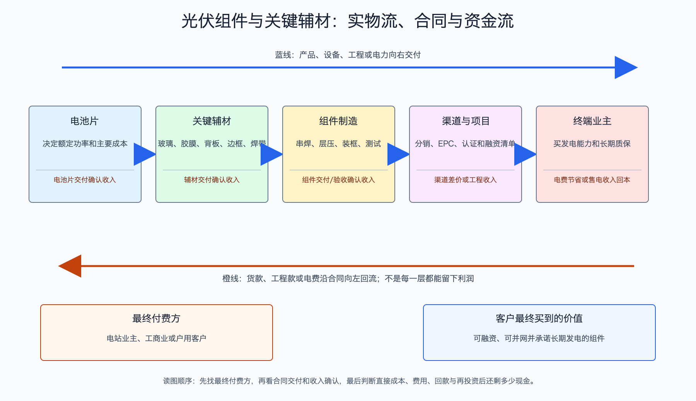

# 光伏组件与关键辅材产业链

日期：2026-07-15  
数据日期：价格截至 2026-07-08；行业产能以 2024 年同口径数据为主；公司经营数据为 2025 年  
状态：已完成  
用途：投资研究，不构成确定性投资建议。

## 0. 子产业链边界

- 包含：电池串焊、玻璃、胶膜、背板、边框、焊带、接线盒和组件层压封装。
- 不包含：电池片制造、逆变器、支架、EPC 和电站运营。
- 与相邻子链的接口：组件厂向电池和辅材供应商采购，把可安装的发电组件卖给经销商、EPC 或电站业主。
- 主要付费方：地面电站投资商、工商业/户用渠道和 EPC 总包商。
- 收入确认位置：组件或辅材交付并满足合同约定；海外项目还涉及报关、海运、仓储和当地验收。
- 经济模型：组件是低单位毛利、高周转制造；玻璃是重资产连续窑炉制造；胶膜等辅材依靠配方、认证和规模生产。

## 1. 产业链路图

组件把脆弱的电池片封装成能在户外工作二三十年的发电产品。玻璃挡风沙和冰雹，胶膜把各层粘在一起并隔绝水汽，边框和背板提供结构保护，接线盒把电流引出来。电站业主最终购买的是一块可长期发电、可融资、可质保的组件，因此品牌、可靠性和售后会创造价值；但在同一功率和质保条件下，客户仍会强烈比较每瓦价格。

## 2. 谁付钱与价值流

电站投资商或 EPC 向组件厂付款，组件厂再向电池、玻璃、胶膜和边框供应商付款。组件价格下跌通常会降低电站初始投资，促进需求，却不一定帮组件厂赚钱；如果组件售价下降比电池和辅材成本更快，组件厂反而亏损。

海外组件价格还包含渠道、仓储、关税、贸易合规和本地库存风险。2026-07-08，InfoLink 报告中国 TOPCon 组件均价约 0.728 元/W，而美国现货约 0.30-0.33 美元/W。这个巨大差异并不全是制造毛利，其中包含进口限制、税费、本地供应紧张和合规成本，不能直接得出“出口美国就有超额利润”。

## 3. 节点规模

| 节点 | 节点边界 | 经营规模 | 金额规模 | 新增/存量 | 关键效率指标 | 增速/周期 | 数据日期/口径/来源 | 证据等级 | 存疑点 |
|---|---|---:|---:|---|---|---|---|---|---|
| 中国组件制造 | 完成封装并可销售的组件 | 2024 年产能约 1,156.5GW、产量 627.5GW；2025 年产量约 620GW | 按中国 TOPCon 均价 0.728 元/W重估，约 4,514 亿元 | 当年产量 | 2024 年名义利用率约 54.3% | 产量近乎持平、价格竞争激烈 | IEA PVPS、InfoLink | B/C | 现价重估不是 2025 年收入；海外与国内价格不同 |
| 光伏玻璃 | 组件前后盖板 | 福莱特 2025 年总收入 139.86 亿元 | 同左，未拆出纯光伏玻璃量价表 | 当年销量 | 看窑炉利用率、单耗、天然气/纯碱成本和薄片化 | 供给与组件开工共振 | 2025 年报 | A | 综合收入和毛利含非光伏业务，不能视为纯玻璃行业均值 |
| 胶膜 | 电池封装材料 | 福斯特 2025 年胶膜销量约 28.1 亿平方米 | 胶膜收入 139.63 亿元，折算约 4.97 元/平方米 | 当年销量 | 克重、透光、阻水和良率 | 随组件产量增长，但价格承压 | 2025 年报 | A/C | 不同 EVA/POE/EPE 产品价格不同 |

组件产能利用率约 54.3%，意味着组装能力并不稀缺。组件品牌仍影响项目融资、质保和海外渠道，但在国内集中采购中，价格通常是决定性因素之一。辅材也不是一个整体：玻璃要连续开窑、资本强度高，胶膜更依赖配方、原料管理和客户认证，现金与周期特征完全不同。

## 4. 利润分布与单位经济

| 节点 | 变现基数 | 直接经济性 | 直接价值池 | 经营收益 | 资本/风险/再投资占用 | 可分配价值 | 估算公式/口径 | 数据日期 | 来源/证据等级 |
|---|---:|---:|---:|---|---|---|---|---|---|
| 晶澳科技组件 | 2025 年组件销量 66.53GW | 收入约 0.677 元/W，营业成本约 0.704 元/W | 组件收入 450.31 亿元 | 毛利率 -4.03% | 公司存货 100.58 亿元、应收 92.08 亿元；海外库存和质保也占用资金 | 缺口: MOD-04，已确认单位毛利约 -0.027 元/W，尚无组件分部独立现金流 | 分部收入或成本 ÷ 销量 | 2025 | [晶澳科技年报](https://static.cninfo.com.cn/finalpage/2026-04-29/1225249462.PDF)；A/C |
| 福斯特胶膜 | 约 28.1 亿平方米销量 | 收入约 4.97 元/平方米 | 139.63 亿元收入 | 毛利率 10.46% | 缺口: MOD-04，原料、存货、账期和资本投入没有分部现金桥 | 缺口: MOD-04，有正毛利但不能据此推算分部可分配现金 | 收入 ÷ 销量 | 2025 | [福斯特年报](https://static.sse.com.cn/disclosure/listedinfo/announcement/c/new/2026-04-09/603806_20260409_21EX.pdf)；A/C |
| 福莱特玻璃 | 综合收入 139.86 亿元对应的玻璃及相关业务 | 综合收入 139.86 亿元 | 综合收入 139.86 亿元，仅作公司价值池代理 | 综合毛利率 16.11% | 固定资产 175.71 亿元、在建工程 34.14 亿元；窑炉停产成本高 | 缺口: MOD-04，正毛利仍需扣维护和扩张资本开支 | 公司综合口径，不能全归光伏玻璃 | 2025 | [福莱特玻璃年报](https://www.hkexnews.hk/listedco/listconews/sehk/2026/0417/2026041700539_c.pdf)；A |

晶澳的单位数据说明，2025 年组件每卖 1W，平均收入比营业成本低约 0.027 元。组件销量越大，如果负毛利没有扭转，亏损也会被放大。玻璃和胶膜仍有正毛利，不代表它们没有周期风险：玻璃产线停窑代价大，过剩时企业更倾向继续生产；胶膜则会被组件厂持续压价。

价值真正能留下的地方是“客户不敢只选最低价”的部分，例如长期可靠性、银行融资认可、海外认证、渠道交付和售后响应。但这些护城河必须用更高实现价格、更低质保损失或更好现金流证明，不能仅凭品牌叙事。

## 4.1 受控数据缺口

| 缺口 ID | 指标 | 已检索范围 | 无法估算原因 | 可给上下界 | 替代指标 | 决策影响 | 核验计划 |
|---|---|---|---|---|---|---|---|
| MOD-01 | 中国组件 2025 年真实销售金额 | 协会、头部年报、价格数据库 | 国内/海外、集中式/分布式和产品功率档价格差异大 | 否 | 产量现价重估与头部公司分部收入 | 影响绝对规模，不改变负毛利判断 | 按地区和产品拆分出货均价 |
| MOD-02 | 各辅材全国利润池 | 玻璃、胶膜、边框、焊带公司年报 | 分类和内部交易口径不一致 | 否 | 代表公司收入、毛利与产能利用率 | 影响辅材内部排序 | 补充铝边框、焊带和接线盒代表公司 |
| MOD-03 | 海外价格中制造利润占比 | InfoLink、贸易政策、公司年报 | 海外价包含关税、物流、仓储、渠道和贸易风险 | 否 | 海外分部毛利、存货、应收和税费 | 决定海外溢价是否可持续 | 跟踪区域分部与贸易政策 |
| MOD-04 | 组件、胶膜和玻璃分部可分配现金 | 代表公司年报 | 分部通常只披露收入毛利，不披露独立经营现金流和资本开支；合并口径又混有其他业务 | 否 | 合并经营现金流减资本开支、分部存货应收和在建工程 | 决定正毛利是否足以覆盖资本和质保 | 下一期报告统一提取合并现金代理，并继续寻找高纯度同业样本 |

## 5. 利润迁移、周期与反证

- **组件主材为何亏损：**封装产能多、产品规格趋同，电站业主有多个供应商可选；企业为保开工率和市场份额接受低价，单位成本下降没有转化为利润。
- **辅材为何仍有利润：**玻璃和胶膜需要稳定量产、客户认证和配方控制，供应商数量少于组件厂；但一旦同行扩产，溢价同样会下降。
- **利润可能向哪里迁移：**拥有高可靠性、海外本地供应、合规能力和渠道服务的组件厂；能用薄片化或新配方帮助客户降低全生命周期成本的辅材企业；不一定是出货量最大的公司。
- **未来 4-8 个季度领先指标：**组件-电池价差、组件开工率、渠道库存、海外售价与实际到手利润、玻璃库存与冷修、EVA/POE 粒子价格、应收和经营现金流。
- **反证条件：**若行业自律未带来供给退出，组件涨价后产能迅速恢复，利润仍难持续；若贸易壁垒提高但企业无法合规交付，海外高价格也不会变成可得利润。

## 来源

- [IEA PVPS：中国光伏市场 2024 年报告](https://www.iea-pvps.org/wp-content/uploads/2025/10/IEA-PVPS-Task-1-NSR-China-2024.pdf)
- [IEA PVPS：中国成员页，含 2025 年制造产量](https://iea-pvps.org/about-iea-pvps/members/china/)
- [InfoLink：2026 年 7 月 8 日光伏现货价格](https://www.infolink-group.com/energy-article/cn/pv-spot-price-20260708)
- [晶澳科技 2025 年年度报告](https://static.cninfo.com.cn/finalpage/2026-04-29/1225249462.PDF)
- [福斯特 2025 年年度报告](https://static.sse.com.cn/disclosure/listedinfo/announcement/c/new/2026-04-09/603806_20260409_21EX.pdf)
- [福莱特玻璃 2025 年年度报告](https://www.hkexnews.hk/listedco/listconews/sehk/2026/0417/2026041700539_c.pdf)
