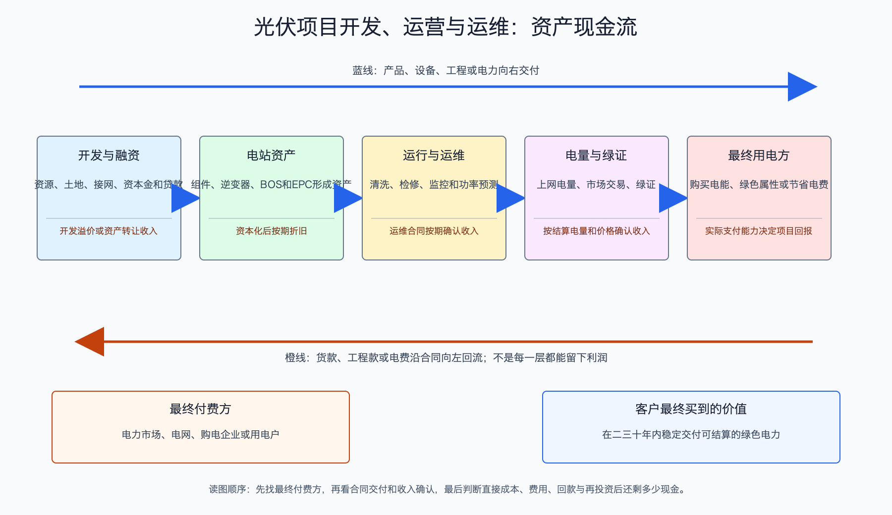

# 光伏项目开发、运营与运维产业链

日期：2026-07-15  
数据日期：行业运行和公司经营数据为 2025 年；政策跟踪至 2026-07-15  
状态：已完成  
用途：投资研究，不构成确定性投资建议。

## 0. 子产业链边界

- 包含：项目获取、土地/屋顶、电网接入、许可、融资、持有期售电、绿证和运维。
- 不包含：设备制造和 EPC 施工收入；开发商兼营 EPC 时要拆分。
- 与相邻子链的接口：开发商形成可建设项目并采购 EPC；并网后电站运营商向电网代理购电主体、售电公司或终端用户售电。
- 主要付费方：电力市场中的购电方、工商业用户、电网结算主体；历史项目还可能收到可再生能源补贴。
- 收入确认位置：电量上网并按合同或市场规则结算；项目转让则在控制权转移时确认。
- 经济模型：前期开发权加重资产长期运营。项目回报取决于每瓦造价、发电量、实现电价、融资成本、税费、运维和回款。

## 1. 产业链路图

这条链把前面所有设备真正变成“电”。开发商先找到土地或屋顶、拿到并网条件和许可，再融资建设；电站并网后，靠二三十年的发电收入回收投资。运维团队负责清洗、巡检、维修和监控。组件便宜只是降低了初始成本，项目最终赚不赚钱，还要看太阳够不够、有没有弃光、电卖多少钱、贷款利率多高以及电费能否及时收回。

## 2. 谁付钱与价值流

项目收入可以简化为：

`售电收入 = 实际上网电量 × 实现电价 + 绿证等其他收益`

其中：

`实际上网电量 = 装机容量 × 可利用小时 × (1 - 弃光和故障损失)`

投资者容易只看装机容量，却忽略装机只是“最大功率”。一座 100MW 电站不会全年按 100MW 发电；夜间不发电，阴天和限电时也少发。实现电价也不是文件中的标杆电价，进入市场交易后会受地区供需和发电时段影响。光伏在中午集中出力，若当地中午电力过剩，价格会被压低，这叫价值率下降。

## 3. 节点规模

| 节点 | 节点边界 | 经营规模 | 金额规模 | 新增/存量 | 关键效率指标 | 增速/周期 | 数据日期/口径/来源 | 证据等级 | 存疑点 |
|---|---|---:|---:|---|---|---|---|---|---|
| 中国光伏电站存量 | 全口径并网光伏 | 2025 年末装机约 1,199.9GW，全年新增 317.3GW | 不用装机直接估值 | 存量与新增 | 2025 年发电量约 1.17 万亿 kWh，利用率 95% | 高增后进入市场化电价阶段 | 2025；国家能源局 | A | 发电量为全国汇总，不能代表各省项目收益 |
| 太阳能公司运营资产 | 公司持有光伏电站 | 运营装机 7.17GW，售电 83.69 亿 kWh | 发电业务收入 42.72 亿元 | 存量运营 | 平均含税电价约 0.583 元/kWh；市场交易电量占 50.78% | 市场电量增加，电价分化 | 2025 年报 | A/C | 平均电价含项目年代、补贴和地区结构，不能套用新项目 |
| 运维服务 | 清洗、巡检、检修、监控 | 缺口: DEV-03，全国独立服务量未统一披露 | 缺口: DEV-03，暂不估算 | 存量 | 每 MW 运维费、可利用率、故障恢复时间 | 随存量装机增长 | 招标与公司披露 | C | 很多运维成本合并在电站运营分部 |

2025 年中国光伏发电利用率约 95%，并不等于每座电站都没有弃光。全国平均会掩盖省份、月份和项目差异。研究具体资产时，应拿到项目所在省份的利用率、市场交易比例、结算电价和接网约束，而不是直接套全国数据。

## 4. 利润分布与单位经济

| 节点 | 变现基数 | 直接经济性 | 直接价值池 | 经营收益 | 资本/风险/再投资占用 | 可分配价值 | 估算公式/口径 | 数据日期 | 来源/证据等级 |
|---|---:|---:|---:|---|---|---|---|---|---|
| 太阳能公司发电业务 | 售电 83.69 亿 kWh | 平均含税电价约 0.583 元/kWh；市场电量平均 0.2345 元/kWh，不含补贴 | 发电收入 42.72 亿元 | 发电业务毛利率 54.08% | 分部成本 19.62 亿元，其中折旧 15.36 亿元，占约 78.28% | 缺口: DEV-04，分部没有独立现金流，不能把高毛利当成股东现金 | 公司年报口径 | 2025 | [太阳能年报](https://static.cninfo.com.cn/finalpage/2026-04-24/1225161470.PDF)；A/C |
| 太阳能公司资产与回款 | 运营 7.17GW | 固定资产约 298.28 亿元，折算约 4.16 元/W，为历史混合口径 | 应收账款 118.56 亿元，其中未结算补贴约 115.34 亿元 | 缺口: DEV-04，经营现金流受补贴回款影响且未按发电分部拆分 | 长期借款 134.89 亿元 | 缺口: DEV-04，补贴应收和偿债会把会计利润与可分配现金拉开 | 固定资产 ÷ 运营装机；仅用于理解重资产程度 | 2025 | 同上；A/C |

电站发电业务毛利率超过 50%，看起来远好于组件制造，但折旧占发电成本约八成，说明这是用巨额前期资本换来的长期毛利。平均电价 0.583 元/kWh 也包含历史项目和补贴，不能作为 2026 年新项目收益假设。该公司未结算补贴约 115.34 亿元，几乎等于应收账款，说明利润已确认并不代表现金已经到账。

新项目应至少做四个敏感性测试：每瓦造价上升 10%、年发电量下降 5%、实现电价下降 10%、融资成本上升 100 个基点。若任何一个轻微变化就令项目回报低于资金成本，所谓“装机成长”并没有创造足够股东价值。

### 4A. 一座 100MW 新电站的三情景模型

下面不是在预测某个真实项目，而是把回报的底层逻辑算给读者看。模型假设运营 25 年、发电量每年衰减 0.4%，贷款等额本息 15 年；忽略增值税、所得税、建设期利息、营运资金、残值、保险和接网超支。因此它只能用来理解敏感性，**不能替代项目可研和尽调**。

| 情景 | 初始造价 | 年利用小时 | 实现电价 | 年运维及其他成本 | 负债比例/利率 | 首年发电量/收入 | 首年 EBITDA | 年债务本息 | 首年 DSCR | 税前全投资 IRR | 税前权益 IRR |
|---|---:|---:|---:|---:|---:|---:|---:|---:|---:|---:|---:|
| 乐观 | 2.45 元/W，即 2.45 亿元 | 1,400 小时 | 0.30 元/kWh | 0.035 元/W + 150 万元 | 70% / 3.2% | 1.40 亿 kWh / 4,200 万元 | 3,700 万元 | 1,457 万元 | 2.54 倍 | 14.15% | 30.08% |
| 基准 | 2.63 元/W，即 2.63 亿元 | 1,300 小时 | 0.26 元/kWh | 0.040 元/W + 150 万元 | 70% / 3.5% | 1.30 亿 kWh / 3,380 万元 | 2,830 万元 | 1,598 万元 | 1.77 倍 | 9.23% | 16.00% |
| 悲观 | 2.90 元/W，即 2.90 亿元 | 1,170 小时 | 0.22 元/kWh | 0.045 元/W + 200 万元 | 65% / 4.5% | 1.17 亿 kWh / 2,574 万元 | 1,924 万元 | 1,755 万元 | 1.10 倍 | 3.83% | 3.31% |

计算关系是：`首年收入 = 100MW × 利用小时 × 实现电价`；`首年 EBITDA = 收入 - 运维及其他现金成本`；`DSCR = EBITDA ÷ 当年债务本息`。DSCR 可以理解为“项目当年赚到的经营现金，是本息的多少倍”。1.10 倍意味着只要发电量、电价或成本稍差一点，偿债缓冲就可能消失。

为什么电价只从 0.30 元降到 0.22 元，权益 IRR 就会从约 30%降到约 3%？因为债务本息不会随着电价自动下降，收入下降首先吃掉股东最后拿到的剩余现金。反过来，杠杆会放大好项目的权益回报，也会放大差项目的损失。这正是研究电站不能只看组件价格或毛利率的原因。

基准造价 2.63 元/W取自中国 2024 年集中式系统造价结构代理，其他参数为研究假设，均需按省份、项目、电价合同和融资条款替换。真正立项前至少还应补税费、建设期、弃光、组件衰减、逆变器更换、保险、绿证和现金分配限制。

## 4.1 受控数据缺口

| 缺口 ID | 指标 | 已检索范围 | 无法估算原因 | 可给上下界 | 替代指标 | 决策影响 | 核验计划 |
|---|---|---|---|---|---|---|---|
| DEV-01 | 2025 年全国光伏售电收入 | 国家统计、运营商年报 | 电价、补贴、绿证、自发自用和市场交易口径差异大 | 否 | 发电量与代表运营商实现电价 | 不能用全国装机直接推收入 | 按省份和项目类型拆分 |
| DEV-02 | 新项目真实权益 IRR | 招标、可研、公司公告 | 土地、接网、税、融资和电价均为项目特定 | 可对单项目做情景，不做全国统一值 | 造价、利用小时、电价、负债成本 | 直接决定可否投资 | 对目标公司前十大项目建模 |
| DEV-03 | 全国独立运维利润池 | 运维招标、运营商分部 | 自营运维和第三方服务混合披露 | 否 | 每 MW 招标价和故障率 | 影响轻资产业务估值 | 收集央企年度运维招标样本 |
| DEV-04 | 运营商发电分部可分配现金 | 太阳能公司年报 | 分部仅披露收入毛利；现金流、债务偿还和资本开支为合并口径，历史补贴回款波动大 | 否 | 合并经营现金流减资本开支、补贴应收变化、偿债额 | 决定高毛利能否分配给股东 | 下一期年报提取现金流桥，并按补贴回款前后对照 |

## 5. 利润迁移、周期与反证

- **利润为何能留下：**土地/屋顶、并网权、融资能力和长期售电合同具有项目稀缺性；电站一旦建成，可长期产生售电毛利。
- **为什么不是无风险债券：**光伏发电集中在中午，渗透率越高，中午电价越容易下行；还存在弃光、设备衰减、融资、补贴回款和极端天气风险。
- **136 号文后的变化：**2025 年出台的新能源上网电价市场化改革推动新增项目更多通过市场交易和机制安排形成价格。底层逻辑是让电价反映实时供需，但结果是项目收益从“看固定电价”变成“看地区、时段、交易和成本控制”。
- **未来 4-8 个季度领先指标：**各省中午现货电价、机制电价竞价、弃光率、利用小时、绿证价格、组件和 EPC 造价、贷款利率、应收补贴回款、项目减值。
- **反证条件：**若电价和利用小时下降快于造价下降，新增装机仍可增长但项目回报会恶化；若企业用高杠杆追求规模而回款延迟，毛利增长也可能损害股东价值。

## 来源

- [国家能源局：2025 年光伏发电建设运行情况](https://www.nea.gov.cn/20260212/742b8c6a078347b0b39de676c05c5d58/c.html)
- [国家发展改革委、国家能源局：新能源上网电价市场化改革通知（发改价格〔2025〕136号）](https://www.ndrc.gov.cn/xxgk/zcfb/tz/202502/t20250209_1396066.html)
- [太阳能公司 2025 年年度报告](https://static.cninfo.com.cn/finalpage/2026-04-24/1225161470.PDF)
- 项目技术和并网友好性详见《光伏产业技术成熟度与发展趋势》。
