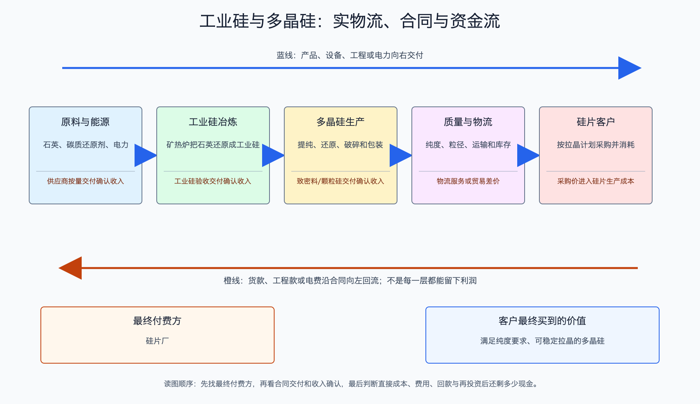

# 工业硅与多晶硅产业链

日期：2026-07-15  
数据日期：价格截至 2026-07-08；行业产能以 2024 年同口径数据为主；公司经营数据为 2025 年  
状态：已完成  
用途：投资研究，不构成确定性投资建议。

## 0. 子产业链边界

- 包含：硅石、工业硅、三氯氢硅等原料，以及太阳能级多晶硅的生产。
- 不包含：单晶拉棒、硅片切割、电池和组件。
- 与相邻子链的接口：多晶硅企业把硅料卖给拉晶、硅片企业；硅片企业是真正付款人。
- 主要付费方：隆基、TCL 中环、晶科、晶澳等一体化或专业硅片企业。
- 收入确认位置：硅料交付并满足合同验收条件后确认销售收入。
- 经济模型：重资产、能源密集型制造。核心变量是硅料售价减去电力、硅粉、氯硅烷循环、人工和折旧形成的单位毛利。

## 1. 产业链路图

用小白话说，硅石先在矿热炉里变成工业硅，再经过化学提纯变成高纯多晶硅。多晶硅看起来像银灰色块料，是下游拉制单晶硅棒的原料。钱从硅片企业流向硅料厂，硅料厂再向工业硅、电力和化工原料供应商付款。由于一座硅料厂投入大、建设时间长，景气时大家同时扩产，产能投出后又很难迅速消失，所以这个环节特别容易出现几年一次的暴涨和暴跌。

## 2. 谁付钱与价值流

一千克硅料大致可支持数百瓦组件，具体取决于硅片厚度、切割损耗和电池效率。硅片企业关心的不是“硅料是不是高科技”，而是**纯度是否合格、供货是否稳定、每千克能做出多少可用硅片**。当合格硅料稀缺时，硅片厂怕停线，会接受高价；当硅料库存充足时，产品差异很小，采购方会反复比价，利润便从硅料厂转移给硅片厂和最终电站。

硅料厂真正的现金成本通常包括工业硅、电力、蒸汽、氢气、氯硅烷补充、人工和维护；完整成本还必须加折旧。只比较售价与“现金成本”可能让亏损看起来较轻，却忽略百亿元级厂房设备正在消耗。

## 3. 节点规模

| 节点 | 节点边界 | 经营规模 | 金额规模 | 新增/存量 | 关键效率指标 | 增速/周期 | 数据日期/口径/来源 | 证据等级 | 存疑点 |
|---|---|---:|---:|---|---|---|---|---|---|
| 工业硅 | 硅石经矿热炉冶炼至工业硅 | 2024 年中国产能约 850 万吨、产量约 472 万吨 | 暂不按现价估值 | 当年产量 | 产能利用率约 55.5% | 过剩、低利用率 | 2024；[中国有色金属报](https://www.cnmn.com.cn/ShowNews1.aspx?id=462987) | B | 工业硅包含铝合金、有机硅和光伏用途，不能全部归入光伏 |
| 太阳能级多晶硅 | 工业硅化学提纯至可用于拉晶的高纯硅料 | 2024 年产能约 308.6 万吨、产量 182.3 万吨；2025 年产量约 134 万吨 | 按 31-33 元/千克重估 2025 年产量，约 415-442 亿元 | 当年产量 | 2024 年利用率约 59.1% | 2025 年主动减产，但供给仍宽松 | 2024-2026；IEA PVPS、InfoLink | B/C | 2025 年缺同源完整产能，不能把 134 万吨直接除以 2024 年产能当正式利用率 |
| 颗粒硅与特殊料型 | 流化床法颗粒硅、N 型致密料等 | 缺口: SI-03，尚无同口径独立产能和销量 | 缺口: SI-03，暂不估算 | 当年产量 | 重点看纯度、碳足迹、单耗和下游掺混比例 | 技术与客户认证并行 | 2025-2026；企业披露 | C | 不同企业对产品分类不同，受控缺口见 4.1 |

这里最重要的数字不是 134 万吨本身，而是前一年只有约六成产能被使用。工厂闲置时，行业仍要承担折旧、利息和维护；只要库存和闲置能力足够多，价格稍有上涨，停产产能就可能复产，压住价格修复空间。

## 4. 利润分布与单位经济

| 节点 | 变现基数 | 直接经济性 | 直接价值池 | 经营收益 | 资本/风险/再投资占用 | 可分配价值 | 估算公式/口径 | 数据日期 | 来源/证据等级 |
|---|---:|---:|---:|---|---|---|---|---|---|
| 多晶硅行业数量级 | 2025 年产量约 134 万吨 | 2026-07-08 致密料 31-33 元/千克 | 约 415-442 亿元现价产值 | 缺口: SI-04，行业利润不能由现价产值推算 | 缺口: SI-04，高折旧、高能耗和停复产支出尚无行业统一值 | 缺口: SI-04，现价产值不能代替行业自由现金流 | 134 万吨 × 1,000 千克/吨 × 31-33 元/千克 | 2025 产量、2026-07 价格 | IEA PVPS、InfoLink；B/C |
| 大全新能源 | 按 10.48 亿美元收入除以 5.25 美元/千克均价，反推销量约 19.96 万吨 | 年均售价 5.25 美元/千克，生产成本 6.61 美元/千克 | 公司收入 10.48 亿美元 | 净亏损 3.52 亿美元 | Q4 现金成本 4.46 美元/千克、完整成本 5.83 美元/千克；新增产能资本强度约 11.6-13.3 美元/千克年产能 | 缺口: SI-04，已确认售价低于生产成本，但不把净亏损直接当自由现金流 | 收入 ÷ 平均售价，为反推销量而非公司原始销量口径 | 2025 | [大全新能源 20-F](https://www.sec.gov/Archives/edgar/data/1477641/000110465926045134/dq-20251231x20f.htm)；A/C |

大全的例子把底层逻辑说明得很清楚：即使企业把现金成本降到 4.46 美元/千克，只要全年平均售价只有 5.25 美元，而完整成本更高，企业仍可能在折旧、减值和期间费用后亏损。**低成本是活过周期的条件，不等于当下拥有定价权。**

## 4.1 受控数据缺口

| 缺口 ID | 指标 | 已检索范围 | 无法估算原因 | 可给上下界 | 替代指标 | 决策影响 | 核验计划 |
|---|---|---|---|---|---|---|---|
| SI-01 | 2025 年工业硅光伏用途产量与平均价格 | 行业年报、协会资料 | 工业硅同时流向铝合金、有机硅和多晶硅，公开数据未统一拆分 | 否 | 多晶硅产量与硅耗 | 不影响硅料过剩判断，影响工业硅独立利润池估算 | 跟踪有色金属协会和期货库存 |
| SI-02 | 2025 年多晶硅有效产能 | 工信部、IEA PVPS、公司年报 | 名义产能、检修产能和可经济运行产能口径不同 | 可用 2024 年 308.6 万吨作参照，不作同比 | 周度产量、库存和复产公告 | 决定价格反弹持续性 | 逐季更新企业检修、复产和库存 |
| SI-03 | 颗粒硅独立利润率 | 企业分部资料 | 多数企业不单独披露成本和售价 | 否 | 单耗、掺混率、客户认证 | 影响技术路线份额判断 | 跟踪保利协鑫等披露 |
| SI-04 | 多晶硅行业和代表企业可分配现金流 | 行业产量价格、大全 20-F | 产值不等于现金流；企业现金流还受库存、应收、停产支出和历史资本开支影响，当前未形成可比行业口径 | 否 | 售价与现金/完整成本差、经营现金流、资本开支、净现金 | 决定低成本企业是“少亏”还是已经产生股东现金 | 下一份年报统一提取经营现金流减资本开支，并与净现金变化交叉核验 |

## 5. 利润迁移、周期与反证

- **利润为什么流失：**2019-2023 年高价吸引大量资本进入，新增产能集中释放；硅料纯度达到下游要求后，同类产品替代性强，卖方失去议价权。
- **利润可能如何回来：**不是仅靠装机增长，而要看到高成本产能永久退出、库存持续下降、复产不再迅速压价。若 N 型高品质料形成稳定溢价，低单耗企业会先于行业均值修复。
- **未来 4-8 个季度领先指标：**硅料周产量和库存、停复产公告、致密料价格与头部企业完整成本之差、工业硅和电价、在建产能进度、企业经营现金流。
- **对投资的含义：**周期底部可以观察成本最低、负债可控的企业，但不能因为价格已经跌很多就直接判断盈利必然反转。
- **反证条件：**若价格反弹后闲置产能快速复产，或新增需求下降而整合退出迟缓，行业会继续以现金成本定价；若企业依靠新增借款维持扩产，股东价值还可能被进一步消耗。

## 来源

- [IEA PVPS：中国光伏市场 2024 年报告](https://www.iea-pvps.org/wp-content/uploads/2025/10/IEA-PVPS-Task-1-NSR-China-2024.pdf)
- [IEA PVPS：中国成员页，含 2025 年制造产量](https://iea-pvps.org/about-iea-pvps/members/china/)
- [InfoLink：2026 年 7 月 8 日光伏现货价格](https://www.infolink-group.com/energy-article/cn/pv-spot-price-20260708)
- [大全新能源 2025 年 20-F](https://www.sec.gov/Archives/edgar/data/1477641/000110465926045134/dq-20251231x20f.htm)
- [中国有色金属报：2024 年工业硅供需](https://www.cnmn.com.cn/ShowNews1.aspx?id=462987)
