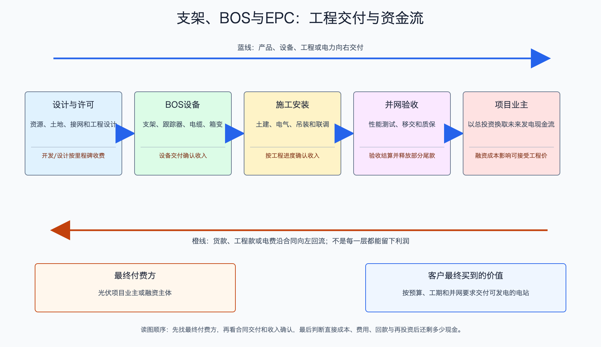

# 支架、BOS 与 EPC 产业链

日期：2026-07-15  
数据日期：系统造价和装机为 2024 年同口径；公司经营数据为 2025 年  
状态：已完成  
用途：投资研究，不构成确定性投资建议。

## 0. 子产业链边界

- 包含：固定/跟踪支架、电缆、汇流、箱变、升压站等 BOS，以及设计、采购、施工和并网 EPC 服务。
- 不包含：组件、逆变器、电站持有期运营；项目开发权在下一条子链讨论。
- 与相邻子链的接口：开发商或电站业主确定项目后，由 EPC 整合设备和施工；支架等供应商向 EPC 或业主交货。
- 主要付费方：电站业主和 EPC 总包商；最终资金来自项目股权、银行贷款和未来售电现金流。
- 收入确认位置：支架按交付确认，EPC 常按履约进度或项目验收确认，具体以合同和会计政策为准。
- 经济模型：支架是工程产品，EPC 是低毛利、强营运资金的项目服务。单位利润取决于材料价、设计、运输、工期、回款和索赔。

## 1. 产业链路图

BOS 是“除了组件之外，让电站真正站起来、连起来、送出电”的全部系统。固定支架把组件保持在一个角度；跟踪支架让组件随太阳转动，希望多发的电超过设备、维护和故障成本。EPC 则像总包工程队，负责设计、买设备、组织施工并把电站按期送到可并网状态。

## 2. 谁付钱与价值流

项目业主向 EPC 或设备商付款。固定支架容易按钢材重量和每瓦价格竞争，产品差异有限；跟踪支架的价值来自增发电量、风工程安全、控制算法和项目记录，客户更在意二三十年的可靠性，因此毛利可以更高。

EPC 的商业本质是“拿有限毛利承担大量交付责任”。如果材料上涨、工期延误或业主迟付，账面收入可能增长，现金却被应收和合同资产占用。研究时必须问：工程已经做了多少、钱收回多少、延期和质保责任由谁承担。

## 3. 节点规模

| 节点 | 节点边界 | 经营规模 | 金额规模 | 新增/存量 | 关键效率指标 | 增速/周期 | 数据日期/口径/来源 | 证据等级 | 存疑点 |
|---|---|---:|---:|---|---|---|---|---|---|
| 中国光伏系统投资 | 组件加 BOS、施工等项目建设投入 | 2024 年新增装机约 277.6GW | IEA PVPS 估计 2024 年中国光伏业务总额约 7,969 亿元；集中式造价约 2.63 元/W、分布式约 2.90 元/W | 新建项目 | 每瓦总投资、工期、利用小时 | 组件降价推动造价下降 | 2024；IEA PVPS 中国报告 | B/C | “业务总额”边界较宽，不能与各节点收入相加 |
| 固定支架结构估算 | 集中式项目固定结构 | 2024 年集中式新增约 159GW | 若固定支架约占集中式造价 8.6%，结构估算约 360 亿元 | 新建项目 | 钢耗、安装效率、抗风雪 | 国内价格竞争 | 2024；IEA PVPS；本报告计算 | B/C | 并非所有项目均采用同一支架方案，误差较大 |
| 中信博支架 | 固定与跟踪支架 | 固定支架出货 10.82GW；跟踪支架 12.22GW | 固定收入 17.58 亿元；跟踪收入 48.39 亿元 | 当年出货 | 固定约 0.163 元/W；跟踪约 0.396 元/W | 海外项目占比和交付节奏影响大 | 2025 年报 | A/C | 价格含项目结构差异，不是统一报价 |

总系统造价不能与组件产值、逆变器收入再相加，因为系统造价本身已经包含这些采购。约 360 亿元的固定支架规模只是用集中式新增装机和成本占比做的结构估算，用于理解数量级，不用于给某家公司做精确估值。

## 4. 利润分布与单位经济

| 节点 | 变现基数 | 直接经济性 | 直接价值池 | 经营收益 | 资本/风险/再投资占用 | 可分配价值 | 估算公式/口径 | 数据日期 | 来源/证据等级 |
|---|---:|---:|---:|---|---|---|---|---|---|
| 中信博固定支架 | 10.82GW 出货 | 约 0.163 元/W，毛利率 6.60% | 收入 17.58 亿元 | 粗算毛利约 1.16 亿元 | 公司合并经营现金流 -11.34 亿元，反映工程回款占用 | 合并现金粗代理 -15.78 亿元，无法按固定支架单独拆分 | 收入 ÷ 出货；收入 × 毛利率；现金为合并口径 | 2025 | [中信博年报](https://static.sse.com.cn/disclosure/listedinfo/announcement/c/new/2026-04-17/688408_20260417_UUI3.pdf)；A/C |
| 中信博跟踪支架 | 12.22GW 出货 | 约 0.396 元/W，毛利率 20.32% | 收入 48.39 亿元 | 粗算毛利约 9.83 亿元 | 公司合并经营现金流 -11.34 亿元，包含备货、物流和回款 | 合并现金粗代理 -15.78 亿元，说明分部正毛利尚未转成公司现金 | 收入 ÷ 出货；收入 × 毛利率；现金为合并口径 | 2025 | 同上；A/C |
| 中信博合并现金占用 | 公司收入 68.85 亿元 | 主营毛利率 17.03% | 公司收入 68.85 亿元 | 归母净利润 -0.10 亿元 | 应收 15.31 亿元、存货 8.10 亿元、合同资产 5.55 亿元；经营现金流 -11.34 亿元 | 经营现金流 -11.34 亿元减资本开支 4.44 亿元，得到 **-15.78 亿元粗代理** | 可分配现金粗代理 = 经营现金流 - 购建长期资产现金 | 2025 | 同上；A |

跟踪支架毛利率约为固定支架的三倍，背后的 why 是客户购买了“预期增发电量和工程可靠性”，而不仅是钢材。但公司整体仍亏损且经营现金流为负，说明利润被项目延期、应收、备货和费用吃掉。对项目型公司，**产品毛利是第一关，回款才是第二关。**

## 4.1 受控数据缺口

| 缺口 ID | 指标 | 已检索范围 | 无法估算原因 | 可给上下界 | 替代指标 | 决策影响 | 核验计划 |
|---|---|---|---|---|---|---|---|
| BOS-01 | 全国跟踪支架渗透率 | 公司年报、行业报告 | 不同机构按出货、开工或并网统计 | 否 | 头部出货与集中式新增装机 | 影响跟踪器市场上限 | 分地区收集招标和并网项目 |
| BOS-02 | EPC 全国收入与利润池 | 央国企年报、招标 | EPC 边界可能包含组件、升压站、储能和融资 | 否 | 单瓦 EPC 报价、项目毛利和现金周期 | 防止重复计算系统投资 | 按项目类型建立可比样本 |
| BOS-03 | 跟踪器真实发电增益 | 项目披露、产品资料 | 辐照、地形、双面率、故障和运维差异大 | 可按具体项目做情景区间，不能全国统一 | 实际 PR、可利用率和故障率 | 决定溢价是否合理 | 使用运营一年以上项目数据 |

## 5. 利润迁移、周期与反证

- **价值为何分化：**固定支架主要卖材料和加工，容易比价；跟踪器用控制、设计和工程经验换取增发电量，客户切换和试错成本更高。
- **EPC 为何常低毛利：**业主把材料、工期和并网责任交给总包商，但招标又压低价格；只要一个环节延期，有限毛利就可能被罚款和垫资吞掉。
- **未来利润可能流向哪里：**海外大型地面电站、复杂地形、双面组件和高电价地区更容易证明跟踪器增益；具备本地交付和回款纪律的企业更可能把毛利变成现金。
- **未来 4-8 个季度领先指标：**全球大型项目开工、跟踪器渗透率、钢价、在手订单、预收款、应收和合同资产、项目延期、经营现金流、实际发电增益。
- **反证条件：**若低电价和高融资成本使增发电量不值钱，跟踪器溢价会收窄；若海外项目收入增长却持续负现金流，增长质量应下调。

## 来源

- [IEA PVPS：中国光伏市场 2024 年报告](https://www.iea-pvps.org/wp-content/uploads/2025/10/IEA-PVPS-Task-1-NSR-China-2024.pdf)
- [中信博 2025 年年度报告](https://static.sse.com.cn/disclosure/listedinfo/announcement/c/new/2026-04-17/688408_20260417_UUI3.pdf)
- 终端装机与项目收益机制详见《光伏产业深度调研 - 国内视角》和《光伏产业深度调研 - 全球视角》。
