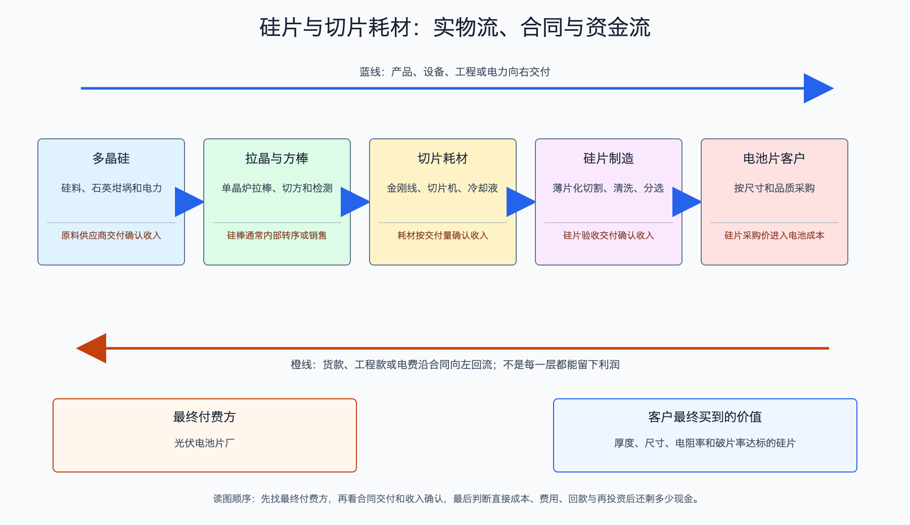

# 硅片与切片耗材产业链

日期：2026-07-15  
数据日期：价格截至 2026-07-08；行业产能以 2024 年同口径数据为主；公司经营数据为 2025 年  
状态：已完成  
用途：投资研究，不构成确定性投资建议。

## 0. 子产业链边界

- 包含：单晶拉棒、方棒加工、金刚线切片、清洗分选，以及石英坩埚、金刚线等关键耗材。
- 不包含：上游多晶硅和下游电池片制造。
- 与相邻子链的接口：硅片厂购买硅料并把合格硅片卖给电池厂；耗材企业向硅片厂收款。
- 主要付费方：专业电池片企业和一体化组件厂；金刚线、坩埚的付款人是硅片厂。
- 收入确认位置：硅片或耗材交付并验收后确认收入。
- 经济模型：硅片是重资产规模制造，耗材是随开工率消耗的制造品。硅片单位利润 = 每片售价 - 硅料、拉晶、切片、折旧和良率损失。

## 1. 产业链路图

硅片厂把多晶硅装进石英坩埚，加热后拉成圆柱形单晶硅棒，再切方、切成很薄的片。金刚线像极细的锯条，切得越细、损耗越小，同一千克硅料能做出的瓦数越多。电池厂最后买到的是硅片，而不是拉晶服务；因此硅片厂承担硅料价格波动、切片良率和库存跌价，耗材厂则更关心硅片厂到底开多少机台。

## 2. 谁付钱与价值流

电池厂按片采购，但最终关心每片能贡献多少瓦、隐裂和厚度是否稳定。尺寸从 182mm 到 210mm、矩形片和薄片化都会改变单片功率，所以**一元一片不等于固定的一元若干瓦**。这也是为什么本报告不把全国片数粗暴乘一个片价当成行业规模。

硅片技术进步主要通过薄片化、细线化、大尺寸和提高拉晶速度来节省硅料、电力与加工时间。问题在于这些改进很快扩散，客户很容易比较价格。企业降本若没有供给约束，往往变成下一轮降价。耗材企业同样面临“降耗悖论”：金刚线越细越有技术价值，但每瓦所需金刚线数量也可能下降，必须靠份额和单公里利润抵消用量下降。

## 3. 节点规模

| 节点 | 节点边界 | 经营规模 | 金额规模 | 新增/存量 | 关键效率指标 | 增速/周期 | 数据日期/口径/来源 | 证据等级 | 存疑点 |
|---|---|---:|---:|---|---|---|---|---|---|
| 单晶硅片 | 拉晶至可交付电池厂的硅片 | 2024 年中国产能 1,348.8GW、产量 775.8GW；2025 年产量约 680GW | 不做全国金额伪估算 | 当年产量 | 2024 年产能利用率约 57.5% | 2025 年产量回落，仍处出清 | IEA PVPS 2024/2025 | B | 2025 年同口径有效产能未完整披露 |
| TCL 中环硅片 | 公司硅片分部 | 2025 年销量 133.55 亿片 | 收入 122.38 亿元 | 当年销量 | 单片收入约 0.916 元 | 量大、价低、亏损 | 2025 年报 | A/C | 尺寸结构未在该简表中拆分，单片均价不能直接对照现货某一规格 |
| 金刚线 | 切片消耗品 | 美畅股份 2025 年销量约 1.012 亿公里 | 收入 17.68 亿元 | 当年销量 | 折算约 17.48 元/公里 | 细线化与价格下降并存 | 2025 年报 | A/C | 产品规格和钨丝占比影响单价 |

硅片 2024 年只有约 57.5% 的名义产能被使用，说明需求不是不存在，而是机器比订单多得多。即便部分旧设备不能经济地生产最新规格，它们仍会在价格反弹时形成潜在供给。因此判断出清时，要看“有效产能”而非只看公告名义产能。

## 4. 利润分布与单位经济

| 节点 | 变现基数 | 直接经济性 | 直接价值池 | 经营收益 | 资本/风险/再投资占用 | 可分配价值 | 估算公式/口径 | 数据日期 | 来源/证据等级 |
|---|---:|---:|---:|---|---|---|---|---|---|
| TCL 中环硅片 | 133.55 亿片销量 | 收入约 0.916 元/片，营业成本约 1.094 元/片 | 122.38 亿元收入 | 硅片毛利率 -19.44% | 公司存货 58.67 亿元、跌价准备 13.21 亿元；仍需承担拉晶炉和切片机折旧 | 公司经营现金流 11.44 亿元减资本开支 53.79 亿元，得到 **-42.35 亿元粗代理**；为合并口径，不能全归硅片 | 收入或成本 ÷ 销量；可分配现金粗代理 = 经营现金流 - 购建长期资产现金 | 2025 | [TCL 中环年报](https://static.cninfo.com.cn/finalpage/2026-03-25/1225029362.PDF)；A/C |
| 美畅股份金刚线 | 约 1.012 亿公里 | 收入约 17.48 元/公里 | 17.68 亿元收入 | 分部毛利率 8.93% | 成本中材料约 58.6%、人工 15.4%、折旧 16.0%；固定资产约 7.42 亿元 | 缺口: WF-04，正毛利不能直接推成可分配现金 | 收入 ÷ 销量；成本结构按年报 | 2025 | [美畅股份年报](https://disc.static.szse.cn/download/disc/disk03/finalpage/2026-04-29/3739c4e0-6439-4aa4-94cf-8617a719cd51.PDF)；A/C |

TCL 中环每卖一片硅片，分部平均营业成本比收入高约 0.178 元。这还只是毛利层面，没有扣除研发、管理和利息。亏损的底层原因是售价被过剩产能压低，而固定资产和库存不能同步缩小。金刚线尚有正毛利，但不足 10%，说明耗材并不会天然避开主链价格战；下游开工率下降会直接减少它的用量。

## 4.1 受控数据缺口

| 缺口 ID | 指标 | 已检索范围 | 无法估算原因 | 可给上下界 | 替代指标 | 决策影响 | 核验计划 |
|---|---|---|---|---|---|---|---|
| WF-01 | 2025 年硅片行业真实销售金额 | 协会、公司年报、现货报价 | 规格、单片瓦数、N/P 型和尺寸结构差异大 | 否 | 头部公司分部收入和各规格价格 | 防止把片价与瓦数混用 | 后续按 183N、210R、210N 分层估算 |
| WF-02 | 有效而非名义产能 | 行业报告、公司公告 | 老旧炉型和切片设备能否经济生产新规格没有统一定义 | 可按头部开工和全行业产量判断方向 | 开工率、库存、停产与减值 | 决定反弹时供给弹性 | 季度跟踪开工率和资产减值 |
| WF-03 | 石英坩埚独立利润池 | 供应商年报 | 半导体和光伏产品常合并披露 | 否 | 坩埚价格、使用寿命和高纯砂价格 | 影响耗材子环节排序 | 收集头部供应商光伏分部数据 |
| WF-04 | 金刚线分部可分配现金 | 美畅股份年报 | 公司现金流和资本开支是合并口径，无法与金刚线分部毛利一一对应 | 否 | 合并经营现金流减资本开支、分部存货和应收 | 决定薄利是否还能形成股东现金 | 后续取得分部资本投入或用同业纯度更高样本交叉验证 |

## 5. 利润迁移、周期与反证

- **利润为什么留不住：**硅片规格标准化，客户切换成本低；薄片化和细线化节省的硅料成本很快被竞争转化为更低片价。
- **什么情况下会修复：**有效产能真正退出、行业开工率持续上升、硅片库存下降，同时每片售价重新高于硅料与加工完整成本。只看某周涨价不足以证明周期反转。
- **耗材的机会在哪里：**能够让客户减少硅耗、提高良率或提高设备开机时间的耗材，才有机会凭性能保留溢价；普通耗材仍跟随下游压价。
- **未来 4-8 个季度领先指标：**三类硅片现货价、硅料与硅片价差、硅片开工率、库存天数、资产减值、N 型和矩形片占比、金刚线线径与每瓦耗量。
- **反证条件：**若价格上涨后旧产能迅速复产，或头部企业继续以扩量抢份额，单位毛利可能再次回落；若薄片化令耗材单位用量下降快于份额提升，耗材收入也会承压。

## 来源

- [IEA PVPS：中国光伏市场 2024 年报告](https://www.iea-pvps.org/wp-content/uploads/2025/10/IEA-PVPS-Task-1-NSR-China-2024.pdf)
- [IEA PVPS：中国成员页，含 2025 年制造产量](https://iea-pvps.org/about-iea-pvps/members/china/)
- [TCL 中环 2025 年年度报告](https://static.cninfo.com.cn/finalpage/2026-03-25/1225029362.PDF)
- [美畅股份 2025 年年度报告](https://disc.static.szse.cn/download/disc/disk03/finalpage/2026-04-29/3739c4e0-6439-4aa4-94cf-8617a719cd51.PDF)
- [InfoLink：2026 年 7 月 8 日光伏现货价格](https://www.infolink-group.com/energy-article/cn/pv-spot-price-20260708)
