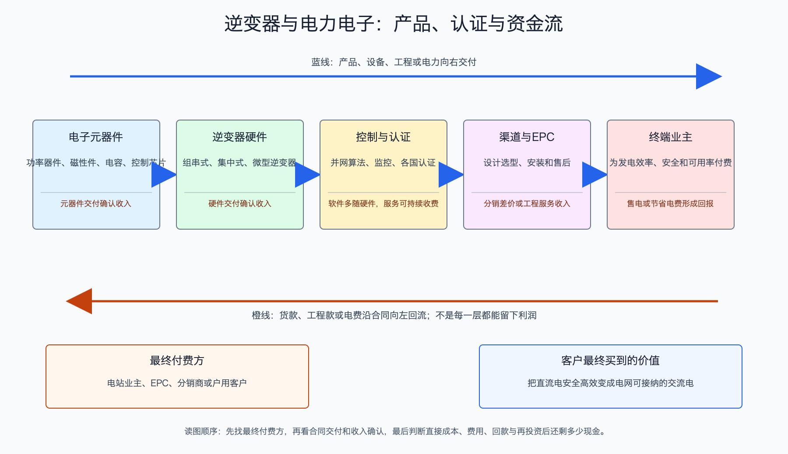

# 逆变器与电力电子产业链

日期：2026-07-15  
数据日期：公司经营数据为 2025 年  
状态：已完成  
用途：投资研究，不构成确定性投资建议。

## 0. 子产业链边界

- 包含：集中式、组串式和微型逆变器，功率模块、磁性器件、控制器，以及监控、并网控制和售后服务。
- 不包含：储能电池本体、组件、支架和电站 EPC；公司若同时经营储能，必须拆分口径。
- 与相邻子链的接口：逆变器位于组件直流输出与电网交流输入之间，同时与电网调度、储能和监控系统通信。
- 主要付费方：电站业主、EPC、户用/工商业安装商和经销商。
- 收入确认位置：设备交付或项目验收；渠道型业务还要关注产品是否真正卖给终端，而非堆在经销商仓库。
- 经济模型：电力电子硬件加软件、认证、渠道和售后服务。单位利润取决于售价、电子器件成本、渠道费用、质保损失和研发投入。

## 1. 产业链路图

组件发出的是直流电，电网和大多数负载使用交流电，逆变器负责把两者连接起来。它还要让组件尽量工作在最佳发电点，遇到电网异常时按规则响应。若逆变器故障，整串甚至整站都可能少发电，所以客户买的不只是一个盒子，而是转换效率、并网合规、可靠性和十年以上的服务能力。

## 2. 谁付钱与价值流

电站业主或安装商向逆变器企业付款。与组件相比，逆变器成本占电站总投资较低，但故障造成的停机损失较大；因此成熟客户不愿为节省很小的初始采购价，承担长期故障和无人维修的风险。这个“不对称风险”提高了品牌、认证和服务网络的价值。

海外市场尤其依赖当地并网认证、渠道、备件和服务。企业把货发到海外仓并不等于终端需求已经实现，若渠道库存过高，后续会出现降价、退货或减少订单。因此研究逆变器必须同时看收入、存货、应收、质保和终端装机。

## 3. 节点规模

| 节点 | 节点边界 | 经营规模 | 金额规模 | 新增/存量 | 关键效率指标 | 增速/周期 | 数据日期/口径/来源 | 证据等级 | 存疑点 |
|---|---|---:|---:|---|---|---|---|---|---|
| 阳光电源逆变器等电力电子 | 含不同功率和场景产品 | 2025 年销量 143GW | 分部收入 311.36 亿元 | 当年销量 | 粗算收入约 0.218 元/W；分部毛利率 34.66% | 全球需求增长、产品结构分化 | 2025 年报 | A/C | 分部含多类电力电子，0.218 元/W不是行业单价 |
| 锦浪科技逆变器 | 以组串式逆变器为主 | 产能 175 万台、产量 80.15 万台 | 逆变器收入 46.28 亿元 | 当年产量 | 按台数名义利用率约 45.8%；分部毛利率 26.88% | 产能富余，仍有正毛利 | 2025 年报 | A/C | 不同功率机型按“台”不可直接相加比较 |
| 全行业 | 新装、替换和储能耦合需求 | 缺口: INV-01，不能用光伏 DC 装机一比一推算 | 缺口: INV-01，暂不估算 | 新增加存量替换 | 看 AC/DC 比、使用寿命、替换率和储能配套 | 需求来源比组件更多元 | 行业口径 | C | 新增装机、逆变器出货和储能 PCS 有交叉 |

逆变器出货不能与光伏装机机械地一一对应。组件按直流功率 GWdc 统计，逆变器常按交流输出 GWac 统计；项目会采用不同容配比，另外还有旧机替换、储能 PCS 和尚未安装的渠道库存。因此公司销量可用于观察经营规模，不能直接当成全球装机份额。

## 4. 利润分布与单位经济

| 节点 | 变现基数 | 直接经济性 | 直接价值池 | 经营收益 | 资本/风险/再投资占用 | 可分配价值 | 估算公式/口径 | 数据日期 | 来源/证据等级 |
|---|---:|---:|---:|---|---|---|---|---|---|
| 阳光电源逆变器等 | 143GW 销量 | 粗算收入 0.218 元/W，毛利率 34.66% | 收入 311.36 亿元，粗算毛利约 107.94 亿元 | 缺口: INV-04，公司净利润不能全归逆变器，储能收入占比更高 | 海外渠道、研发、质保和应收；公司存货 272.55 亿元为合并口径 | 公司经营现金流 169.18 亿元减资本开支 30.08 亿元，得到 **+139.10 亿元粗代理**；合并口径包含储能、开发等 | 收入 ÷ 销量；可分配现金粗代理 = 经营现金流 - 购建长期资产现金 | 2025 | [阳光电源年报](https://static.cninfo.com.cn/finalpage/2026-04-01/1225066678.PDF)；A/C |
| 锦浪科技逆变器 | 逆变器分部收入 46.28 亿元 | 毛利率 26.88% | 收入 46.28 亿元，粗算毛利约 12.44 亿元 | 缺口: INV-04，研发、渠道和质保费用未按分部拆分 | 缺口: INV-04，产能利用率、海外库存和应收的现金影响未独立披露 | 缺口: INV-04，正毛利不能代替分部自由现金流 | 收入 × 分部毛利率 | 2025 | [锦浪科技年报](https://static.cninfo.com.cn/finalpage/2026-04-27/1225187516.PDF)；A/C |

逆变器仍能保持约 27%-35% 的分部毛利率，核心不是铜、芯片和机壳本身稀缺，而是企业把硬件与算法、并网认证、长期可靠性和服务绑定在一起。客户若换成未经验证的低价产品，省下的采购款可能远小于停机和融资受阻的损失。

但阳光电源不是“纯光伏逆变器公司”：2025 年储能收入占比高于逆变器。投资者若把其全部利润都按光伏装机增长估值，会高估光伏纯度，也忽略储能价格和海外政策风险。

## 4.1 受控数据缺口

| 缺口 ID | 指标 | 已检索范围 | 无法估算原因 | 可给上下界 | 替代指标 | 决策影响 | 核验计划 |
|---|---|---|---|---|---|---|---|
| INV-01 | 全球光伏逆变器真实安装规模 | 公司出货、装机统计、第三方排名 | GWdc/GWac、储能 PCS、替换和渠道库存混杂 | 否 | 主要公司销量与终端装机方向 | 影响份额精度 | 分地区核对交流侧装机和渠道库存 |
| INV-02 | 每瓦质保和售后成本 | 年报、质保准备 | 多数公司不按产品和地区拆分 | 否 | 预计负债、售后费用、故障率 | 决定高毛利可持续性 | 每季跟踪预计负债和召回 |
| INV-03 | 海外渠道真实库存 | 公司和渠道披露 | 渠道分散、公司通常不完整披露 | 否 | 收入、存货、应收与地区装机差 | 判断是否提前发货 | 观察连续两个季度去库和回款 |
| INV-04 | 锦浪逆变器分部可分配现金 | 锦浪科技年报 | 现金流与资本开支未按逆变器、储能和电站拆分 | 否 | 合并经营现金流减资本开支、应收和存货 | 决定中腰部正毛利是否有现金质量 | 下一期年报统一提取合并代理并标注业务混合 |

## 5. 利润迁移、周期与反证

- **利润为何留在这一环：**逆变器占项目成本不高，却承担发电转换、并网合规和停机责任；品牌、算法、认证和服务提高切换成本。
- **利润可能向哪里迁移：**从单一硬件向构网控制、储能协同、数字运维和全生命周期服务迁移。前提是这些功能能提高发电收入、减少停机或满足电网强制要求。
- **未来 4-8 个季度领先指标：**海外终端装机、分地区收入和毛利、渠道库存、应收账款、质保预计负债、新增并网规范、替换需求、储能与逆变器收入拆分。
- **对投资的含义：**这一环的盈利质量通常优于标准化主材，但估值也更容易提前反映成长；需要用现金流和业务纯度校验，不应只凭高毛利追价。
- **反证条件：**若本地化壁垒提高、认证失效或渠道库存积压，高毛利可能下修；若故障率和质保支出上升，过去的收入会在未来变成成本。

## 来源

- [阳光电源 2025 年年度报告](https://static.cninfo.com.cn/finalpage/2026-04-01/1225066678.PDF)
- [锦浪科技 2025 年年度报告](https://static.cninfo.com.cn/finalpage/2026-04-27/1225187516.PDF)
- 全球与区域装机口径差异详见《光伏产业深度调研 - 全球视角》。
