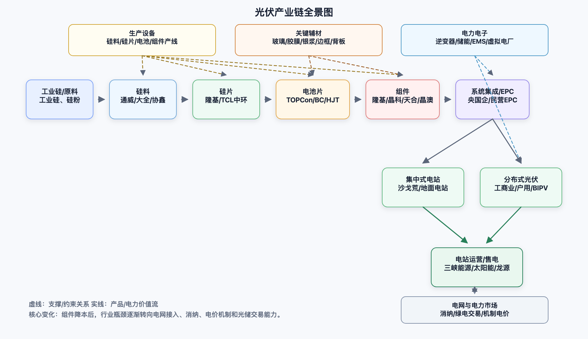
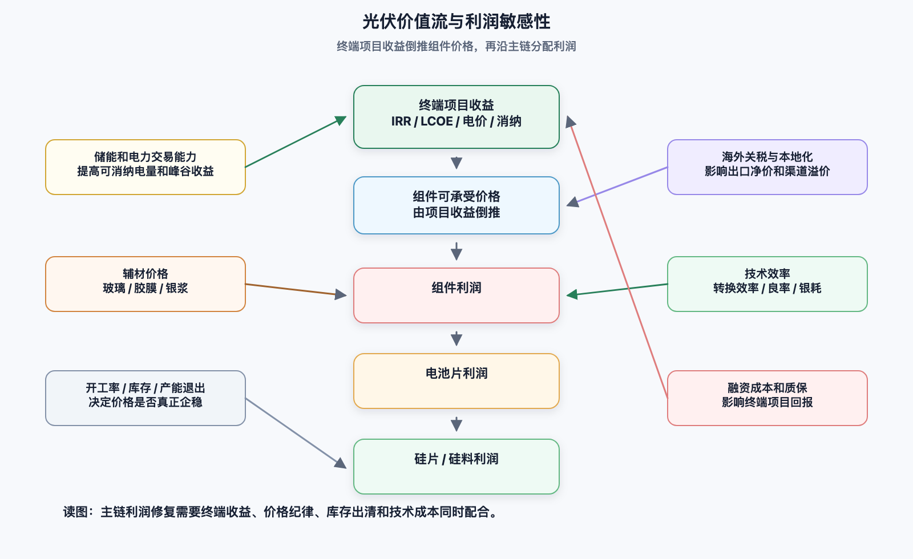
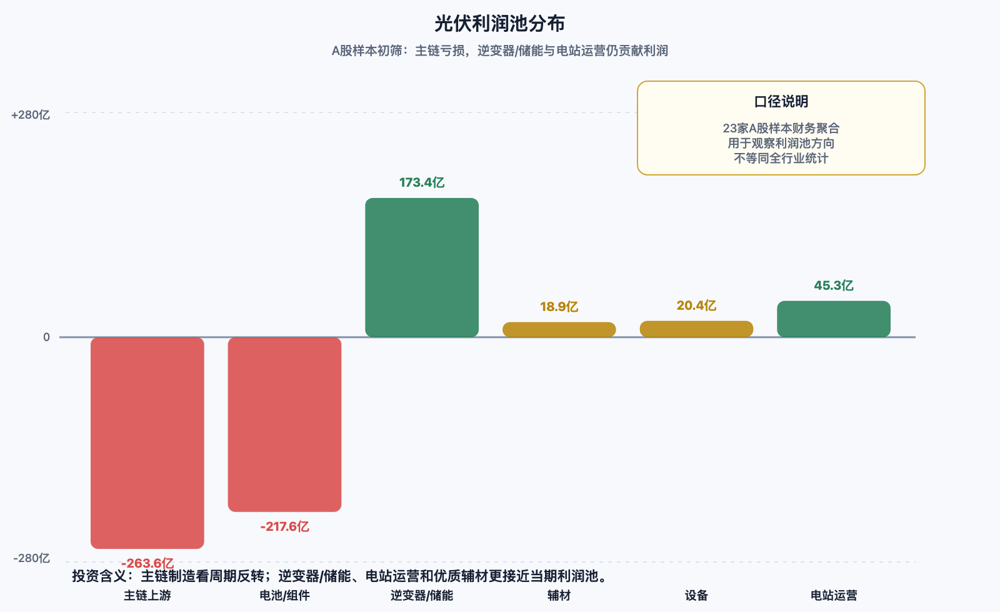

更新记录

| 日期         | 版本   | 内容                                                                       |
| ---------- | ---- | ------------------------------------------------------------------------ |
| 2026-06-19 | v0.6 | 增加逆变器/储能盈利优于主链的原因拆解。                                                     |
| 2026-06-19 | v0.5 | 将 Mermaid 图替换为 PNG 图片版，并保留 SVG 源图。                                       |
| 2026-06-19 | v0.4 | 增加利润池、成本曲线、供给出清、竞争格局量化和估值情景框架。                                           |
| 2026-06-19 | v0.3 | 增加行业调研通用框架、现有结构缺口对照、产业链图和价值流图。                                           |
| 2026-06-19 | v0.2 | 增加独立“行业趋势”章节，补充需求、供给、技术、电力系统、全球化与投资映射。                                   |
| 2026-06-19 | v0.1 | 建立产业链、政策、公司初筛、投资价值与数据核验框架。行业与政策数据已优先回到官方/机构来源；公司财务为初筛表，下一版逐家公司年报/季报公告复核。 |

## 1. 结论先行

本轮光伏分析的核心判断是：行业需求并没有坏，坏的是制造端供给和利润分配。2025 年全球新增光伏装机仍处高位，IEA-PVPS 估算全球新增约 698GW、累计接近 3TW；中国 2025 年新增光伏 3.17 亿千瓦，累计 12 亿千瓦，仍是全球最大市场。但从价格、利润和资产负债表看，硅料、硅片、电池、组件主链仍处深度出清阶段。

短期不要把“反内卷”“价格阶段性回升”直接等同于全行业反转。更可靠的观察信号是：硅料和组件价格是否能持续站上现金成本；头部公司经营现金流是否连续转正；高负债扩产企业是否停止无效资本开支；国内电价市场化后项目 IRR 是否稳定。

投资价值上，当前优先级大致是：逆变器/储能龙头 > 低负债辅材龙头 > 光伏电站运营商 > 设备技术迭代受益者 > 主链制造龙头的周期反转机会 > 纯硅料/硅片高弹性博弈。主链制造不是不能看，而是必须等“价格、现金流、产能退出”三件事同时改善。

## 2. 数据核验规则

| 类型 | 优先来源 | 核验方式 | 可信等级 |
|---|---|---|---|
| 国内装机/发电量 | 国家能源局 | 官方原文优先，二级媒体仅作表格补充 | 高 |
| 全球装机 | IEA-PVPS、IRENA | 对比 DC/AC、并网/新增容量口径差异 | 高/中 |
| 政策 | 发改委、能源局、税务总局、海外政府官网 | 必须回原文 | 高 |
| 产业链价格 | InfoLink、TrendForce/EnergyTrend、Bernreuter | 至少两家报价源交叉 | 中 |
| 公司财务 | 年报、季报、交易所公告 | 财务聚合数据只做初筛，最终回公告 | 高/中 |
| 出货量/产能 | 年报、公司公告、投资者材料 | 避免只引用券商预测 | 高/中 |
| 估值 | 行情源、交易所、Wind/同花顺/东财等 | 必须标注日期 | 中 |

## 3. 行业调研框架对照

一份偏投资视角的行业调研，通常不是按“资料堆叠”写，而是按“行业空间-利润来源-竞争格局-公司胜负-估值风险”展开。标准框架可以分为 12 个模块。

| 模块 | 需要回答的问题 | 当前底稿状态 | 后续补强 |
|---|---|---|---|
| 研究边界 | 研究哪些环节、地区、公司、时间范围 | 部分覆盖 | 增加研究范围和不覆盖项 |
| 产业链和价值链 | 钱从哪里来、流向哪里、谁有议价权 | 已有产业链表 | 增加图和利润池分布 |
| 市场空间 | TAM/SAM、历史增速、未来情景 | 部分覆盖 | 增加全球/中国/海外分区域预测 |
| 需求结构 | 集中式、分布式、工商业、户用、海外需求 | 部分覆盖 | 增加需求拆分和核心驱动 |
| 供给结构 | 产能、库存、开工率、扩产/退出 | 缺口较大 | 增加各环节产能与出清进度 |
| 价格和成本 | 价格周期、现金成本、成本曲线 | 部分覆盖 | 增加硅料、硅片、电池、组件成本曲线 |
| 政策和监管 | 国内电价、消纳、出口退税、贸易壁垒 | 已覆盖 | 增加政策影响的量化测算 |
| 技术演进 | 技术路线、效率、良率、量产成本 | 部分覆盖 | 增加 TOPCon/BC/HJT/钙钛矿对比表 |
| 竞争格局 | 集中度、份额、壁垒、替代威胁 | 定性覆盖 | 增加 CR5、出货排名、五力分析 |
| 公司比较 | 财务、产能、技术、渠道、治理 | 初筛覆盖 | 回公告复核并做公司卡片 |
| 估值和投资 | 估值方法、情景假设、赔率、催化剂 | 偏定性 | 增加估值区间、情景分析、催化剂 |
| 风险和监控 | 关键风险、领先指标、反证条件 | 部分覆盖 | 增加风险矩阵和监控仪表盘 |

当前底稿最大的问题不是方向错，而是“行业判断已经有，投资模型还不够硬”。下一步应优先补四块：供给/产能出清、利润池和成本曲线、竞争格局量化、估值情景。

## 4. 产业链地图

| 环节 | 代表公司 | 当前状态 | 投资含义 |
|---|---|---|---|
| 硅料 | 通威股份、大全能源、协鑫科技 | 供给过剩、库存压力大，价格接近低位 | 弹性大但左侧风险高，现金成本和资产负债表是核心 |
| 硅片 | TCL中环、隆基绿能 | 同质化严重，价格传导弱 | 技术和尺寸切换不能单独形成护城河 |
| 电池片 | 通威、爱旭、钧达、晶科、天合 | TOPCon 主流化，BC/HJT/钙钛矿仍在验证 | 技术路线胜负影响估值重构 |
| 组件 | 隆基、晶科、天合、晶澳、阿特斯 | 品牌/渠道重要，但价格竞争残酷 | 规模龙头有生存优势，利润修复要等供给出清 |
| 逆变器/储能 | 阳光电源、德业、锦浪、固德威、禾迈 | 盈利明显优于主链，储能成为第二增长曲线 | 当前产业链里确定性较好 |
| 胶膜/玻璃/银浆 | 福斯特、福莱特、信义光能、聚和材料、帝科股份 | 辅材分化，玻璃偏周期，银浆受 N 型用量影响 | 看份额、配方、客户和现金流 |
| 设备 | 奥特维、晶盛机电、迈为股份、捷佳伟创 | 扩产周期下行，技术升级仍有需求 | 更适合等订单拐点和新技术验证 |
| 电站运营 | 三峡能源、太阳能、龙源电力 | 收益更稳，但受电价市场化与消纳约束 | 偏防御，弹性弱于制造反转 |

### 4.1 产业链全景图

### 4.2 价值流和利润敏感性

读图重点：主链利润不是从上游天然流向下游，而是由终端项目收益倒推组件价格，再沿产业链分配。当前组件便宜，限制因素逐渐转向消纳、电价、储能和电力交易能力，所以逆变器、储能、电站运营的研究权重需要提高。

## 5. 行业需求和价格

2025 年全球光伏需求继续扩张。IEA-PVPS Snapshot 2026 显示，2025 年全球新增光伏约 698GW，累计容量接近 3TW，中国贡献约 60% 新增装机。

国家能源局数据口径下，2025 年中国光伏新增 3.17 亿千瓦，其中集中式 1.64 亿千瓦、分布式 1.53 亿千瓦；截至 2025 年底累计 12 亿千瓦，全年光伏发电量 1.17 万亿千瓦时，利用率 95%。2026 年抢装后回落明显：截至 2026 年 4 月底，中国太阳能发电累计装机 12.5 亿千瓦，1-4 月新增 5091 万千瓦。

价格层面仍处低位。TrendForce/EnergyTrend 2026-06-17 报价显示，N 型致密料均价约 33 元/kg，M10 N 型硅片约 0.88 元/片，M10L TOPCon 电池约 0.29 元/W，182mm TOPCon 组件约 0.74 元/W，地面电站 TOPCon 组件约 0.72 元/W。Bernreuter 同期显示全球多晶硅现货均价约 4.95 美元/kg。两个来源方向一致：库存和弱需求仍在压制价格。

## 6. 行业趋势

| 趋势 | 方向 | 对产业链的影响 | 受益/承压环节 |
|---|---|---|---|
| 需求从高增速转向高基数稳增长 | 全球仍扩张，中国 2026 年阶段性回调 | 装机不是问题，项目收益率和消纳成为问题 | 逆变器、储能、电站运营优于单纯组件扩张 |
| 制造从规模扩张转向出清和反内卷 | 低效产能退出、低价竞争被监管和行业自律约束 | 盈利修复不是全行业同步，而是先修复有现金和成本优势的公司 | 头部一体化、低负债辅材受益；高负债尾部承压 |
| 价格瓶颈从组件 CAPEX 转向电网、消纳和交易 | 组件便宜后，限制装机的核心变成并网、限电、负电价、交易能力 | 光伏项目越来越像电力资产，而不是单纯设备采购 | 储能、功率预测、虚拟电厂、电力交易能力受益 |
| 技术从 PERC 时代进入 N 型多路线竞争 | TOPCon 成为主流，BC/HJT/钙钛矿叠层形成差异化期权 | 单纯产能扩张价值下降，效率、可靠性、低银化、场景适配更重要 | 隆基/爱旭看 BC，迈为看 HJT/叠层设备，银浆企业看低银化压力 |
| 全球化从出口贸易转向本地制造和合规供应链 | 美国、印度、欧盟都加强本地化和贸易规则 | 东南亚绕道模式风险上升，海外产能、认证、渠道成为护城河 | 全球渠道龙头、海外建厂能力强的公司受益 |
| 分布式从户用高增转向工商业光储和聚合运营 | 居民侧收益下降，工商业自发自用和光储互动更重要 | 分布式不再只拼获客和安装，开始拼用电画像、储能配置和交易 | 工商业逆变器、储能、能源管理系统受益 |

### 6.1 需求趋势：全球仍在扩张，中国短期回调

IEA-PVPS Snapshot 2026 显示，2025 年全球新增光伏约 698GW，累计接近 3TW，增速从 2023 年的极高水平降到 2025 年约 16%。这说明光伏仍是全球电力新增装机主力，但行业已经从“高增长早期”进入“高基数成熟增长”阶段。

中国市场的趋势更关键：CPIA 路线图预计 2026 年中国新增光伏 180GW-240GW，较 2025 年 317GW 阶段性回落，2027 年后再回升。“抢装后回调”会压制组件和逆变器的短期出货节奏，但不改变中长期需求，因为“十五五”期间中国年均新增仍有较大规模。

### 6.2 供给趋势：反内卷不是简单限产，而是结构性出清

2025 年主产业链价格跌破成本、公司普遍亏损，行业进入从“产能竞赛”到“质量、效率、现金流竞争”的切换期。工信部和行业协会对治理内卷的表述，重点不是保护落后产能，而是通过标准、质量、价格执法、知识产权和产能调控推动动态平衡。

投资上要避免把“反内卷”理解成所有公司一起涨价。更现实的路径是：低效产能先退出，头部公司先修复现金流，技术/渠道/资产负债表差的公司继续承压。行业集中度可能提高，但过程会伴随减值、债务压力和订单分化。

### 6.3 技术趋势：TOPCon 主流化，BC/HJT/钙钛矿是差异化变量

CPIA 2024-2025 路线图显示，2024 年 TOPCon 已成为占比最高的电池技术路线，PERC 份额明显下降。往后看，TOPCon 会继续承担主流性价比角色；BC 更偏高效率和高端场景；HJT 的看点在低温工艺、薄片化和叠层潜力；钙钛矿叠层仍偏中长期期权。

公司映射上，不能只看“有无某技术路线”，要看量产效率、良率、设备折旧、银耗、组件可靠性和客户接受度。技术路线真正变成投资价值，需要同时体现在成本曲线和订单溢价里。

### 6.4 电力系统趋势：光伏从设备逻辑进入电力资产逻辑

IEA Renewables 2025 指出，2025-2030 年全球可再生电力新增约 4600GW，太阳能是最主要增量之一；同时，随着风光渗透率提高，弃电、负电价、并网拥堵和灵活性不足会更常见。国家能源局 2026 年新闻发布会也强调“新能源+储能+电网+市场”的集成融合，并提出支撑年均新增 2 亿千瓦以上新能源合理消纳需求。

这意味着光伏投资逻辑正在变化：过去核心是组件降本，现在核心是项目在何时发电、能否消纳、是否配置储能、能不能参与市场交易。受益环节不只在组件，而会扩展到储能、逆变器、EMS、虚拟电厂、功率预测和电站运营。

### 6.5 全球化趋势：本地化和贸易规则重塑竞争壁垒

美国 AD/CVD、印度 ALMM、欧盟 Net-Zero Industry Act 共同指向一个趋势：低价出口仍重要，但合规供应链、海外本地制造、认证和渠道变得更重要。过去依靠东南亚加工规避贸易壁垒的模式，确定性下降。

这对企业分化很直接：有海外制造、销售网络、融资能力和品牌认证的龙头，能把政策壁垒变成护城河；单纯依赖国内产能低价出口的企业，利润会被关税、退税取消、物流和渠道压缩。

### 6.6 投资映射：趋势对应公司筛选

| 趋势判断 | 应该优先筛选什么公司 | 代表方向 |
|---|---|---|
| 需求仍在，但增速放缓 | 现金流好、订单质量高、海外渠道强 | 阳光电源、德业股份、部分组件龙头 |
| 供给出清还没结束 | 低负债、低现金成本、能停扩产保现金的公司 | 福斯特、大全能源、晶盛机电等需分环节看 |
| 技术进入多路线竞争 | 技术能带来真实溢价，而非只讲故事 | 隆基 BC、爱旭 BC、迈为 HJT/叠层设备 |
| 消纳和电价成为核心 | 能提供储能、逆变、能源管理、电站运营能力 | 阳光电源、德业股份、三峡能源 |
| 全球本地化加强 | 海外产能和合规供应链强 | 晶科、天合、晶澳、阿特斯、阳光电源 |
| 分布式进入光储融合 | 工商业储能和能源管理能力强 | 德业、锦浪、固德威、禾迈、阳光电源 |

## 7. 利润池、成本曲线和估值框架

这一章是把行业研究从“看懂行业”推进到“判断投资价值”的核心。光伏现在不是需求消失，而是利润池重新分配：主链制造亏损，逆变器/储能、电站运营和部分辅材仍有利润，未来反转也会先从现金流和成本曲线左侧的公司开始。

### 7.1 A股样本利润池初筛

说明：下表使用前文 23 家 A 股样本的 2025 年和 2026Q1 财务聚合数据，目的是观察利润池方向，不等同于全行业统计。下一步要回到公司公告复核，并增加 H 股、美股和非上市公司。

| 分组 | 样本数 | 2025营收合计 | 2025归母净利合计 | 2025净利率 | 2026Q1归母净利合计 | 初步含义 |
|---|---:|---:|---:|---:|---:|---|
| 硅料/硅片/主链上游 | 4 | 1883.7亿 | -263.6亿 | -14.0% | -68.1亿 | 周期压力最大，价格反弹弹性也最大 |
| 电池/组件一体化 | 5 | 2048.3亿 | -217.6亿 | -10.6% | -31.3亿 | 规模龙头仍亏损，需看现金流和海外溢价 |
| 逆变器/储能 | 5 | 1191.7亿 | 173.4亿 | 14.6% | 35.8亿 | 产业链利润池最清晰，竞争也更全球化 |
| 辅材 | 4 | 637.0亿 | 18.9亿 | 3.0% | 6.5亿 | 龙头仍有韧性，但受下游压价和原材料影响 |
| 设备 | 3 | 259.1亿 | 20.4亿 | 7.9% | 3.1亿 | 订单受扩产周期压制，技术迭代提供期权 |
| 电站运营 | 2 | 333.6亿 | 45.3亿 | 13.6% | 12.2亿 | 稳定性较好，但受电价市场化和消纳影响 |

读图重点：当前利润池不在“最热闹的出货环节”，而在逆变器/储能、电站运营和部分辅材。主链制造的投资价值主要来自周期反转，不来自当期盈利质量。

### 7.2 成本曲线怎么看

光伏主链的成本曲线不能只看“单位成本谁低”，还要看现金成本、折旧压力、库存减值、海外合规成本和融资成本。公开资料通常拿不到完整公司成本曲线，因此更可靠的做法是用可验证指标做代理。

| 环节 | 主要成本项 | 左侧成本曲线公司通常具备 | 需要核验的数据 |
|---|---|---|---|
| 硅料 | 电耗、硅粉、蒸汽、折旧、检修、库存 | 低电价基地、长周期稳定开工、现金成本低、负债低 | 电耗、现金成本、库存、开工率、检修计划 |
| 硅片 | 硅料、拉晶电耗、切片损耗、金刚线、折旧 | 薄片化、低硅耗、高良率、尺寸切换效率高 | 单片硅耗、切片良率、硅片厚度、稼动率 |
| 电池片 | 硅片、银浆、设备折旧、良率、电耗 | N型量产稳定、银耗低、良率高、非硅成本低 | 转换效率、银耗、良率、TOPCon/BC/HJT占比 |
| 组件 | 电池片、玻璃、胶膜、边框、人工、渠道 | 品牌溢价、海外渠道、低辅材耗用、质保能力强 | 组件毛利率、海外占比、退货/质保、库存 |
| 逆变器 | IGBT/功率器件、电容、芯片、软件、服务 | 产品可靠性、全球认证、售后网络、研发效率 | 毛利率、质保计提、R&D占比、海外收入 |
| 电站运营 | CAPEX、融资成本、发电小时、限电、电价 | 资源区位好、融资成本低、消纳好、交易能力强 | 利用小时、弃光率、机制电价、电力交易收益 |

当前可核验的成本事实包括：CPIA 路线图披露 2024 年我国地面光伏系统初始全投资约 2.90 元/W，组件占比约 29.3%；工商业分布式系统初始投资约 2.70 元/W；地面电站在 1800/1500/1200/1000 小时下 LCOE 分别约 0.130/0.157/0.205/0.246 元/kWh。这说明组件降价后，非技术成本、电网接入、消纳、电价和融资成本对项目收益的影响越来越大。

### 7.3 供给出清仪表盘

行业是否见底，不能只看单周价格上涨。更好的做法是跟踪一组领先指标。

| 指标 | 出清改善信号 | 当前观察 | 可信等级 |
|---|---|---|---|
| 硅料库存 | 库存连续下降，价格不再靠减产支撑 | InfoLink 称 2026 年初硅料库存约 57-60 万吨，约合 300-316GW | 中 |
| 开工率 | 开工率回到可盈利区间，而非被动低开工 | InfoLink 称 2025 年硅料、硅片、组件全年开工率约 44%、54%、47% | 中 |
| 组件价格 | 组件价格站上现金成本，低价订单减少 | 2026-06 组件价格仍低，反弹需要需求配合 | 中 |
| 主链现金流 | 经营现金流连续改善 | 样本公司分化，仍需逐季公告复核 | 中 |
| 资本开支 | 新扩产明显放缓，落后产能退出 | 行业已从扩张转向控产，但执行力度仍需验证 | 中 |
| 库存/减值 | 存货周转改善，资产减值压力下降 | 2025 年主链公司普遍有减值和亏损压力 | 中 |
| 政策执行 | 低价竞争约束、质量标准和价格执法落地 | 方向明确，但效果需看订单价格和招标结果 | 中 |

### 7.4 竞争格局量化

组件和逆变器是两个最值得量化竞争格局的环节。组件看规模、技术和渠道；逆变器看品牌、认证、售后、质量和全球化供应链。

| 环节 | 可核验数据 | 初步结论 |
|---|---|---|
| 组件 | InfoLink 统计 2025 年上榜组件企业总出货约 536GW；晶科、隆基约 80-90GW；天合、晶澳约 60-70GW；前四约占上榜出货 58% | 头部集中度高，但盈利仍差，说明规模不是充分条件 |
| 组件第二梯队 | 通威、正泰新能约 30-50GW；协鑫、横店东磁、阿特斯、TCL、英利、一道等在 20-30GW | 30GW 以下竞争拥挤，排名容易变化 |
| 逆变器 | Wood Mackenzie H1 2025 排名中，华为和阳光电源居前；前十约占全球 71% 份额 | 逆变器集中度高于多数制造环节，竞争壁垒更偏认证、服务和可靠性 |
| 逆变器壁垒 | Wood Mackenzie 指标包括 ESG/CSR、售后、研发、供应链稳定、产能利用率、认证、财务、制造经验 | 不是单纯拼价格，优质公司更接近“电力电子+全球服务”逻辑 |

### 7.5 估值情景框架

当前不宜直接给单一估值结论，应该用情景法。光伏主链利润波动太大，PE 在亏损期失效；逆变器/储能、电站运营可以更多参考盈利和现金流；设备商要看订单和技术路线资本开支。

| 类型 | 适合估值方法 | 乐观情景 | 中性情景 | 压力情景 |
|---|---|---|---|---|
| 硅料/硅片 | PB、EV/产能、周期正常化利润 | 价格回到现金成本以上，库存快速下降 | 低位震荡，头部减亏 | 价格再跌，资产减值扩大 |
| 电池/组件 | PS、PB、正常化净利、海外溢价 | 反内卷有效，海外高价订单恢复 | 龙头减亏但利润率低 | 需求回落叠加贸易壁垒 |
| 逆变器/储能 | PE、PEG、FCF、海外业务估值 | 储能订单高增，毛利率稳定 | 增速放缓但盈利保持 | 海外库存/价格战压缩利润 |
| 辅材 | PE、PB、吨/W利润修复 | 下游价格稳定，份额提升 | 毛利温和修复 | 被下游继续压价 |
| 设备 | PE、订单/收入转化、技术期权 | HJT/BC/钙钛矿资本开支启动 | 订单低位稳定 | 扩产周期继续下行 |
| 电站运营 | DCF、PB、股息率、经营现金流 | 电价机制稳定，消纳改善 | 收益率缓慢下行 | 市场化电价和限电压低回报 |

关键催化剂包括：硅料库存拐点、组件中标价回升、主链经营现金流转正、行业并购或破产出清、美国/印度/EU 本地化政策落地、储能订单高增、BC/HJT/叠层技术量产突破。

## 8. 政策影响

国内最重要的是 136 号文。发改委、国家能源局 2025 年发布《关于深化新能源上网电价市场化改革 促进新能源高质量发展的通知》，推动风电、太阳能发电等新能源上网电量原则上全部进入电力市场，同时通过“机制电价”建立可持续发展价格结算机制。影响是项目收益从“装上就赚”转向“发电时段、电力交易能力、消纳和储能配置”共同决定。

分布式光伏进入更规范阶段。国家能源局 2025 年发布《分布式光伏发电开发建设管理办法》，替代 2013 年暂行办法，强化备案、建设、并网、运行管理。工商业分布式不再只看屋顶资源，还要看电力市场参与能力和用电负荷匹配。

出口端税收支持明显收缩。财政部、税务总局公告显示，自 2026 年 4 月 1 日起取消光伏等产品增值税出口退税；电池产品 2026 年 4 月 1 日至 12 月 31 日退税率由 9% 下调至 6%，2027 年 1 月 1 日起取消。这会压缩依赖低价出口和退税维持利润的企业，利好海外本地产能、品牌溢价和渠道议价强的公司。

海外贸易壁垒强化。美国商务部 2025 年对来自柬埔寨、马来西亚、泰国、越南的晶硅光伏电池及组件作出 AD/CVD 终裁，东南亚“绕道出口美国”的模式风险大幅上升。欧洲方向，欧盟通过 Net-Zero Industry Act 和欧洲太阳能产业政策，希望到 2030 年本土制造能力接近或达到年度部署需求 40%，但短期仍高度依赖进口。印度 MNRE ALMM List-II 已进入执行期，2026 年 6 月 1 日后对电池来源提出更强本地化要求。

## 9. 公司初筛

财务数据说明：下表为 2026-06-19 从东方财富财报字段抓取的初筛数据，口径为 2025 年年报与 2026 年一季报。该表用于快速识别风险和分层，下一版需要逐家公司回到交易所公告、年报 PDF、季报 PDF 复核。

| 公司 | 环节 | 2025 营收/归母净利 | 2026Q1 归母净利 | Q1资产负债率 | 初步判断 |
|---|---|---:|---:|---:|---|
| 隆基绿能 | 硅片/组件/BC | 703.5亿 / -64.2亿 | -19.2亿 | 66.1% | 技术和品牌仍强，BC 是核心看点；但利润和现金流尚未修复 |
| 晶科能源 | 一体化组件/TOPCon | 654.9亿 / -68.8亿 | -13.5亿 | 76.5% | 出货和全球渠道领先，资产负债表压力较高 |
| 天合光能 | 一体化组件/储能 | 669.7亿 / -70.3亿 | -2.8亿 | 78.0% | Q1亏损收窄且现金流较好，但杠杆偏高 |
| 晶澳科技 | 一体化组件 | 491.3亿 / -46.1亿 | -10.7亿 | 79.1% | 组件龙头之一，周期弹性大，财务压力需要跟踪 |
| 通威股份 | 硅料/电池/组件 | 841.3亿 / -95.5亿 | -24.4亿 | 74.2% | 上游成本与规模强，但硅料周期暴露最大 |
| 大全能源 | 硅料 | 48.4亿 / -11.3亿 | -8.0亿 | 7.4% | 负债低是优势，但纯硅料价格弹性和亏损压力大 |
| TCL中环 | 硅片 | 290.5亿 / -92.6亿 | -16.5亿 | 68.2% | 硅片环节同质化最强，需等行业产能退出 |
| 爱旭股份 | 电池/组件/BC | 156.1亿 / -18.2亿 | -4.4亿 | 78.9% | 技术标签强，但财务韧性需验证 |
| 钧达股份 | 电池 | 76.3亿 / -14.2亿 | 0.1亿 | 75.0% | Q1略转正，仍属高弹性高风险 |
| 阳光电源 | 逆变器/储能 | 891.8亿 / 134.6亿 | 22.9亿 | 57.5% | 当前确定性最强之一，储能和海外渠道是核心 |
| 德业股份 | 逆变器/储能 | 122.2亿 / 31.7亿 | 11.9亿 | 47.1% | 高盈利、高现金流，需看海外需求和估值 |
| 锦浪科技 | 逆变器 | 69.5亿 / 7.4亿 | 0.6亿 | 51.9% | 分布式周期影响较大，弹性不低 |
| 固德威 | 逆变器/储能 | 88.9亿 / 1.3亿 | 1.0亿 | 71.3% | 业绩修复中，但杠杆高于同类优质公司 |
| 禾迈股份 | 微逆 | 19.3亿 / -1.6亿 | -0.6亿 | 36.1% | 资产负债表轻，欧美微逆需求仍需观察 |
| 福斯特 | 胶膜 | 154.9亿 / 7.7亿 | 3.1亿 | 20.0% | 辅材龙头，负债低，利润受胶膜价格影响 |
| 福莱特 | 光伏玻璃 | 155.7亿 / 9.8亿 | 0.4亿 | 46.9% | 玻璃偏重资产和周期，价格修复是关键 |
| 聚和材料 | 银浆 | 145.9亿 / 4.2亿 | 2.9亿 | 60.4% | 受益 N 型银浆需求，但营运资金压力大 |
| 帝科股份 | 银浆 | 180.5亿 / -2.8亿 | 0.1亿 | 83.3% | 技术与客户重要，负债率和现金流需重点核验 |
| 奥特维 | 组件/电池设备 | 64.0亿 / 4.4亿 | 0.9亿 | 72.9% | 设备订单受扩产下行影响，长期看自动化和新技术 |
| 晶盛机电 | 硅片设备/材料 | 113.6亿 / 8.8亿 | 1.0亿 | 31.9% | 财务稳健，但光伏设备周期承压 |
| 迈为股份 | HJT/电池设备 | 81.5亿 / 7.2亿 | 1.2亿 | 65.4% | 技术设备弹性强，取决于 HJT/BC/叠层资本开支 |
| 三峡能源 | 电站运营 | 284.0亿 / 37.1亿 | 10.4亿 | 72.0% | 稳定性好，电价市场化和消纳影响收益 |
| 太阳能 | 电站运营 | 49.6亿 / 8.2亿 | 1.8亿 | 56.3% | 偏防御，成长弹性弱于制造修复 |

## 10. 竞争优劣势

主链制造的优势排序不再是“谁产能大谁强”，而是“谁在低价周期里现金流活得久、谁有差异化技术、谁有海外合规产能和渠道”。隆基的看点在 BC 技术和品牌，晶科/天合/晶澳的看点在全球渠道和 TOPCon 规模，通威的看点在硅料和电池成本。它们的共同问题是 2025 年亏损严重、杠杆偏高、价格修复尚未证明。

逆变器和储能公司明显更优。阳光电源是光伏逆变器和储能系统的全球龙头，营收和净利仍保持高位；德业盈利能力和现金流突出；锦浪、固德威、禾迈更受分布式和欧美库存周期影响，弹性有但波动也大。

辅材龙头有“活下来并吃份额”的价值。福斯特资产负债率低，胶膜龙头地位稳定，但盈利取决于胶膜价格和 POE/EPE 结构；福莱特、信义光能的关键是玻璃供需和燃料成本；聚和、帝科受益 N 型银浆需求，但银价和应收/存货会放大利润波动。

设备商的逻辑从“扩产大周期”转向“技术迭代小周期”。奥特维、晶盛机电、迈为股份都要看 TOPCon 后续升级、BC、HJT、钙钛矿叠层量产节奏。行业不扩产时，设备公司短期估值很难拔高。

## 11. 为什么逆变器/储能盈利优于主链

核心原因是：主链制造更接近大宗制造，逆变器/储能更接近电力电子和系统解决方案。主链在产能过剩时主要拼价格和现金成本；逆变器/储能虽然也会价格竞争，但客户更重视可靠性、并网安全、认证、软件能力和售后服务。

| 对比维度 | 主链制造 | 逆变器/储能 |
|---|---|---|
| 产品属性 | 硅料、硅片、电池、组件标准化程度较高 | 电力电子设备和系统方案，差异化更强 |
| 竞争方式 | 容易进入低价竞标，价格跟随供需快速下行 | 除价格外，还看认证、可靠性、软件、售后和品牌 |
| 资产属性 | 重资产，折旧、库存和减值压力大 | 相对轻资产，研发、渠道和服务能力占比更高 |
| 客户决策 | 组件价格敏感，招标中低价权重高 | 逆变器和储能影响安全、发电效率、并网和运维，客户不敢只买最低价 |
| 周期暴露 | 扩产过快后容易全链条亏损 | 受分布式、工商业、大储、海外库存影响，但韧性通常强于主链 |
| 需求驱动 | 光伏装机规模 | 光伏渗透率提升后的消纳、峰谷价差、负电价、并网和电力交易需求 |

主链当前的问题在于产能扩张过快、产品同质化、价格跌到现金成本附近，叠加库存减值和高折旧，利润被快速压缩。即使龙头有规模和成本优势，也很难在全行业低价竞争中独善其身。

逆变器/储能的优势在于占电站总投资比例不一定最高，但对发电效率、系统安全、并网稳定、运维和交易收益影响很大。海外市场还存在认证、渠道、售后、本地化和品牌壁垒，这让头部企业更容易保住毛利率。

不过，逆变器/储能并非没有风险。主要风险包括：海外库存周期、价格战、储能系统毛利率下滑、质保和安全事故、政策和并网规则变化。投资上不能只看行业方向好，还要看订单质量、毛利率、现金流、应收账款和质保计提。

## 12. 投资价值分层

| 类型 | 公司/环节 | 价值来源 | 主要风险 |
|---|---|---|---|
| 高确定性成长 | 阳光电源、德业股份 | 储能和逆变器盈利优于主链，全球渠道强 | 估值、海外政策、储能价格竞争 |
| 稳健修复 | 福斯特、部分电站运营商 | 资产负债表相对好，现金流韧性更强 | 下游压价、电价市场化 |
| 周期反转 | 隆基、晶科、天合、晶澳、通威 | 行业出清后利润弹性大 | 出清慢、债务高、贸易壁垒 |
| 高弹性博弈 | 大全、TCL中环、爱旭、钧达 | 价格反弹或技术路线兑现 | 亏损扩大、资产减值、现金流 |
| 技术期权 | 迈为、奥特维、晶盛机电、HJT/BC/钙钛矿链 | 新技术放量带来订单 | 扩产周期低迷，技术商业化慢 |

当前更适合的策略不是“一把买光伏”，而是分层：先看逆变器/储能和低负债辅材；主链只选最能熬周期且有技术差异化的龙头；纯硅料/硅片需要更高安全边际。

## 13. 关键监控指标

| 指标 | 为什么重要 | 当前状态 |
|---|---|---|
| 硅料库存和价格 | 决定上游是否真正出清 | 2026-06 仍有库存压力 |
| TOPCon 组件价格 | 决定组件利润能否修复 | 仍在低位 |
| 主链经营现金流 | 比利润更早反映生存状态 | 公司分化明显 |
| 资产负债率和短债 | 判断谁会被迫收缩 | 多家主链公司超过 70% |
| 国内机制电价竞价 | 决定新项目 IRR | 136 号文后各省逐步落地 |
| 美国/印度/EU 本地化 | 决定出口和海外建厂价值 | 趋势明确加强 |
| 储能订单和毛利率 | 决定逆变器龙头估值 | 仍是产业链较优方向 |

## 14. 来源索引

- 国家能源局：《2025年可再生能源并网运行情况》https://www.nea.gov.cn/20260212/742b8c6a078347b0b39de676c05c5d58/c.html
- 国家能源局：《2026年1-4月份全国电力统计数据》https://www.nea.gov.cn/20260525/c509435a0f09497cb3d2ca361fa262de/c.html
- 国家能源局：2026年新闻发布会，新能源消纳与新型电力系统 https://www.nea.gov.cn/20260427/09f3dbc015664a74b9cbe2444c4891bf/c.html
- 国家发展改革委、国家能源局：发改价格〔2025〕136号 https://www.ndrc.gov.cn/xxgk/zcfb/tz/202502/t20250209_1396066.html
- 国家发展改革委、国家能源局：发改能源〔2025〕1360号，新能源消纳和调控 https://www.ndrc.gov.cn/xxgk/zcfb/tz/202511/t20251110_1401469.html
- 国家能源局：《分布式光伏发电开发建设管理办法》https://www.nea.gov.cn/20250123/112c5b199c5f45dd8e7ac93c9f5e4eaf/c.html
- 国家税务总局政策法规库：取消光伏等产品出口退税公告 https://fgk.chinatax.gov.cn/zcfgk/c102416/c5246745/content.html
- IEA-PVPS Snapshot 2026 https://iea-pvps.org/snapshot-reports/snapshot-2026/
- IEA-PVPS China member page https://iea-pvps.org/about-iea-pvps/members/china/
- IEA Renewables 2025：Renewable electricity https://www.iea.org/reports/renewables-2025/renewable-electricity
- IRENA Renewable Capacity Statistics 2026 https://www.irena.org/-/media/Files/IRENA/Agency/Publication/2026/Mar/IRENA_DAT_RE_capacity_statistics_2026.pdf
- 新华网：《光伏产业发展路线图出炉 新增装机或阶段性回调》https://app.xinhuanet.com/news/article.html?articleId=8c7d4839f1be87e02885c947f516cf9a
- 新华网：《光伏“反内卷”：应以创新破局，以精准施策护航》https://www.news.cn/energy/20260115/a9f19c16b4254fb8aa7979ef478e896a/c.html
- CPIA：《中国光伏产业发展路线图（2024-2025年）》https://pdf.dfcfw.com/pdf/H3_AP202503131644327919_1.pdf?1741875481000.pdf=
- RMI：《中国分布式光伏韧性发展路径：2026与2027年展望报告》https://rmi.org.cn/wp-content/uploads/2025/12/final-1217-%E4%B8%AD%E5%9B%BD%E5%88%86%E5%B8%83%E5%BC%8F%E5%85%89%E4%BC%8F%E9%9F%A7%E6%80%A7%E5%8F%91%E5%B1%95%E8%B7%AF%E5%BE%84%EF%BC%9A2026%E4%B8%8E2027%E5%B9%B4%E5%B1%95%E6%9C%9B%E6%8A%A5%E5%91%8A-1.pdf
- InfoLink PV spot price https://www.infolink-group.com/spot-price/
- InfoLink：2025全球组件出货排名 https://www.infolink-group.com/energy-article/solar-topic-infolink-2025-global-module-shipment-ranking-combined-shipments-reach-536-gw
- InfoLink：光伏供应链 2026 展望 https://www.infolink-group.com/energy-article/cn/solar-topic-solar-pv-supply-chain-marks-industry-trough-the-beginning-restructuring
- Wood Mackenzie：H1 2025全球逆变器排名 https://www.woodmac.com/press-releases/solar-inverter-ranking-h1-2025/
- TrendForce/EnergyTrend Solar price trend https://www.energytrend.com/solar-price.html
- Bernreuter polysilicon price trend https://www.bernreuter.com/polysilicon/price-trend/
- U.S. Department of Commerce AD/CVD final determinations https://www.trade.gov/final-affirmative-determinations-antidumping-and-countervailing-duty-investigations-crystalline
- European Commission solar energy page https://energy.ec.europa.eu/topics/renewable-energy/solar-energy_en
- MNRE India ALMM page https://mnre.gov.in/en/approved-list-of-models-and-manufacturers-almm/
- 晶科能源投资者关系 https://www.jinkosolar.com/site/investment1?point=a1
- 通威股份信息披露 https://www.tongwei.cn/information.html
- 隆基绿能 2025 年报公告页 https://www.cnfin.com/announ/detail/index.html?announ=lc&code=601012&dannoun=lcdetail&id=830746493776
