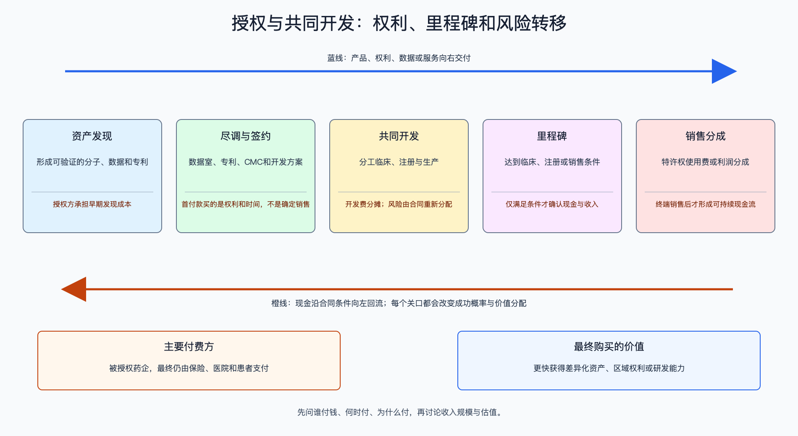

# 创新药授权与共同开发

数据日期：2026-08-10

## 0. 子产业链边界

本链覆盖License-out、共同开发、区域权利、销售版税与利润分成。上游是可验证的专利、分子和临床/CMC数据，下游是被授权方的全球临床、注册、生产和商业网络。被授权药企是合同直接付款者，终端仍由保险、医院和患者支付。不把尚未触发的里程碑当确定收入，也不把单纯产品经销纳入BD。

适用经济模型：**研发/IP权利转让与风险共担模型**。首付款按可交割现金计入，里程碑按触发概率和时间折现，版税按终端净销售和专利期估值；双方保留的开发、生产和区域销售义务作为成本。总包上限只表示乐观边界，不是收入池。

## 1. 产业链路图

授权交易本质是风险重新分配。授权方用部分未来上行换取首付款、合作能力和风险转移；被授权方用现金购买时间、区域权利和资产选择权。合同标题中的“总金额”通常包含低概率、远期销售里程碑。

## 2. 谁付钱与价值流

直接现金流通常依次为首付款、研发/注册里程碑、销售里程碑、版税或利润分成。经济模型应写成：`交易rNPV = 首付款 + Σ（里程碑金额 × 触发概率 × 折现因子）+ 版税现金流现值 − 授权方保留成本`。首付/总包比例越高、里程碑越靠前、对手方执行能力越强，合同价值越接近标题数字。

需要特别区分现金、会计收入和潜在价值。交易签署可能要等反垄断或其他交割条件；首付款的会计确认也可能随履约义务递延；总包只有在项目和销售连续成功时才兑现。

## 3. 节点规模

| 节点 | 2025—2026规模/锚点 | 口径与投资含义 |
|---|---|---|
| 中国对外授权 | 2025年超过150笔，潜在总额超过1,300亿美元 | 总包上限，不是当期现金；较2024年94笔、519亿美元显著扩张 |
| 2026年上半年 | 81笔，潜在总额约1,100亿美元 | 半年总包约为2025年的80%，显示BD需求仍强 |
| 恒瑞—GSK | 5亿美元首付，最多约120亿美元里程碑，另有版税 | 首付约为总里程碑上限的4.2%；2025年确认金额约1亿美元级别 |
| 恒瑞—BMS | 6亿美元首付，另有两笔1.75亿美元条件付款，潜在总额152亿美元 | 截至公告计划2026年三季度交割，不能把全部总包计入当期价值 |
| 三生制药—Pfizer | 12.5亿美元首付、最多48亿美元里程碑、1亿美元股权投资 | 首付占“首付+里程碑”约20.7%，现金质量显著高于低首付交易 |

## 4. 利润分布与单位经济

| 节点 | 变现基数 | 直接经济性 | 直接价值池 | 经营收益 | 资本/风险/再投资占用 | 可分配价值 | 估算公式/口径 | 数据日期 | 来源/证据等级 |
|---|---|---|---|---|---|---|---|---|---|
| 恒瑞—GSK签约 | 首付款5亿美元，潜在里程碑约120亿美元 | 首付/里程碑上限约4.2% | 签约确定现金5亿美元；远期上限120亿美元需概率调整 | 2025年确认授权收入约1亿美元级别 | 授权方此前研发投入已沉没，后续12个项目仍有开发义务 | 当期可确认现金不超过5亿美元首付，远期按触发条件分期 | 5÷120=4.2%；不把未触发里程碑计为收入 | 2025年 | 恒瑞/GSK公告A级 |
| 三生—Pfizer签约 | 许可首付12.5亿美元、里程碑48亿美元；另有股权融资1亿美元 | 首付占首付加里程碑约20.7% | 许可首付款12.5亿美元；1亿美元股权融资换取新发行股份，不属于许可收入 | 许可经营收益上限12.5亿美元减税费、履约成本及会计递延影响 | Pfizer承担全球开发；股权融资带来1亿美元现金，同时发行新股并产生稀释 | 许可近端现金12.5亿美元；股权融资1亿美元单列，不能视为合同价值或可分配利润 | 12.5÷(12.5+48)=20.7%；1亿美元股权融资不计经营收益 | 2025年 | Pfizer双方公告A2级 |
| 恒瑞年度许可收入 | 2025年许可收入33.92亿元 | 约占公司收入10.7% | 许可收入直接价值池33.92亿元，成本取决于履约义务 | 全公司净利润约77.18亿元，无法全归因授权 | 公司全年研发87.20亿元，为未来资产持续再投资 | 许可收入33.92亿元不是永续自由现金流 | 33.92÷316.29=10.7%；与产品收入分开估值 | 2025年 | 恒瑞年报A级 |

授权模式的直接毛利常很高，因为早期研发成本已经在过去费用化；但经济利润不能忽略历史失败项目与未来共同开发义务。最危险的估值方法是用一次性首付或里程碑乘以成熟药企PE。

怎么看这张表：先比较首付/总包和近端现金，再看里程碑条件与合作方义务。三生—Pfizer的近端比例明显高于恒瑞—GSK，但资产阶段、权利范围和中国保留权益不同，不能只按比例判优。对投资最有用的是区分“已转移风险”和“仍留在授权方报表里的风险”。

## 5. 利润迁移、周期与反证

当跨国药企面临专利悬崖、内部管线不足且中国资产数据质量提升时，竞标会把更多价值前移到首付款。反之，资本紧张或同靶点资产过多时，买方会把金额放进远期里程碑并保留终止权。利润因此从“有一个资产”迁向能持续输出资产、完成全球CMC和控制临床质量的平台。

正面证据：多方竞标、首付比例提高、里程碑靠前、合作方将项目列入核心管线、全球III期启动。反证：交割失败、合作方资产优先级下降、开发延误、同机制安全问题、合同终止。估值应把未触发里程碑按阶段概率和时间折现，并对合作方终止权单独折价。

## 来源

- [国家医保局：2025年创新药对外授权](https://www.nhsa.gov.cn/art/2026/1/18/art_14_19392.html)
- [国家医保局：2026年上半年对外授权](https://www.nhsa.gov.cn/art/2026/7/14/art_14_21423.html)
- [恒瑞：与GSK达成多项目合作](https://www.hengrui.com/en/media/detail-819.html)
- [恒瑞：与BMS达成13项目合作](https://www.hengrui.com/en/media/detail-951.html)
- [Pfizer：与三生制药达成SSGJ-707授权](https://www.pfizer.com/news/press-release/press-release-detail/pfizer-enters-exclusive-licensing-agreement-3sbio)
- [恒瑞医药2025年年报](https://www.hkexnews.hk/listedco/listconews/sehk/2026/0326/2026032600021.pdf)
