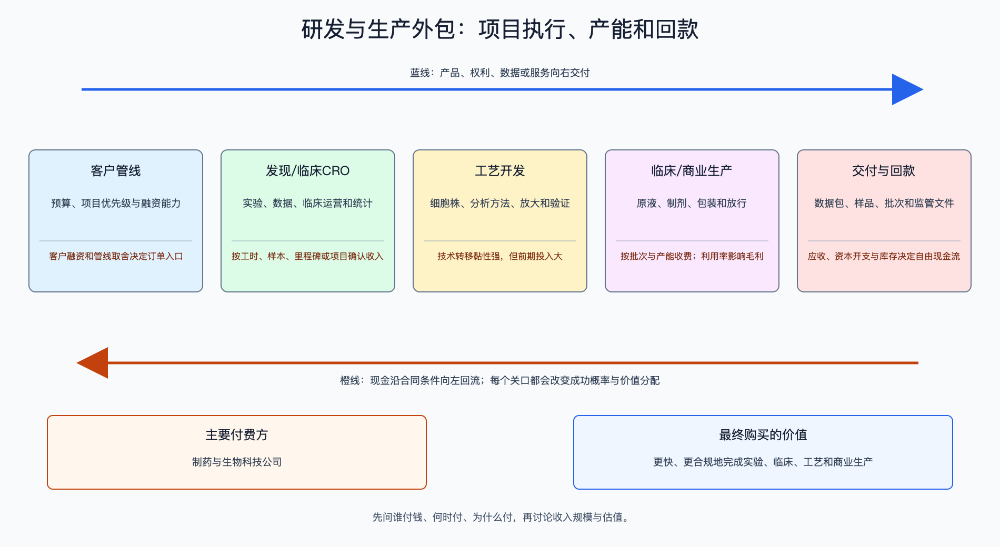

# 创新药研发与生产外包

数据日期：2026-08-10（公司财务以2025年年报为主）

## 0. 子产业链边界

本链覆盖药物发现CRO、临床CRO、工艺开发、临床样品和商业化CDMO。直接付费方是制药与生物科技公司；上游是专业人才、实验设备、耗材和合规体系，下游是客户的临床申报、获批与商业生产。不含只出售通用试剂设备、纯原料药和没有创新药项目敞口的普通制造。

适用经济模型：**专业服务 + 产能运营模型**。CRO看人效、项目量、单价和回款；CDMO看项目转换、批次数、产能利用率、毛利与资本开支。药物临床成功的上行主要归客户，服务商价值来自按合同交付和组合复购，因此不能把公司FCF分摊给某个当年新增项目。

## 1. 产业链路图

服务商通常不承担药物最终临床成败，却承担客户融资、项目取消、产能利用率、质量与回款风险。订单越远期越不确定，包含销售里程碑的“总未完成订单”不能与三年可见订单等同。

## 2. 谁付钱与价值流

客户为缩短时间、获得专业能力、降低自建固定成本和满足监管要求付费。CRO收入可按工时、样本、受试者或里程碑确认；CDMO按工艺开发、技术转移、临床/商业批次收费。利润模型是：`收入 = 活跃项目或批次 × 单价 × 完成率`；`经营利润 = 收入 × 贡献毛利率 − 人员与产能固定成本`；`自由现金流 = 经营现金流 − 扩产资本开支`。

从发现到商业生产的“跟随分子”模式具有黏性，但并非锁定：客户可能因融资、数据失败、并购或战略调整砍掉项目。服务商的护城河是交付质量、法规记录、速度、跨环节转化率和全球客户信任。

## 3. 节点规模

| 节点 | 2025规模/锚点 | 口径与投资含义 |
|---|---|---|
| 药明生物收入 | 218亿元，同比增长16.7% | 生物药CRDMO代表性收入，不等于整个外包市场 |
| 药明生物项目 | 新增综合项目209个，总项目945个 | 项目数领先收入，可观察客户融资和漏斗转化 |
| 药明生物三年订单 | 45亿美元 | 比237亿美元总未完成订单更接近近期可见性 |
| 药明生物总订单 | 237亿美元，其中122亿美元为潜在里程碑 | 约51.5%带条件，不能全部当确定收入 |
| 药明康德持续经营订单 | 2025年末约580亿元，同比增长28.8% | 覆盖多类服务；需结合收入转换、区域政策和自由现金流 |

## 4. 利润分布与单位经济

| 节点 | 变现基数 | 直接经济性 | 直接价值池 | 经营收益 | 资本/风险/再投资占用 | 可分配价值 | 估算公式/口径 | 数据日期 | 来源/证据等级 |
|---|---|---|---|---|---|---|---|---|---|
| 药明生物综合服务 | 收入218亿元 | IFRS毛利率46.0% | 直接毛利约100.28亿元 | 毛利约100.28亿元，经营收益还需扣研发、销售和管理费 | 三年订单45亿美元；总订单中122亿美元为条件里程碑 | 自由现金流23亿元，FCF率约10.6% | 218×46.0%=100.28；23÷218=10.6% | 2025年 | 药明生物年报新闻稿A级 |
| 项目漏斗 | 总项目945个，新增209个 | 新增项目/总项目约22.1% | 156个IND与28个PPQ构成后续批次机会 | 单项目经营收益不适用：23亿元公司FCF来自存量项目和全公司资产 | 项目失败与取消风险贯穿945个项目 | 单项目可分配价值不适用：不能把23亿元公司FCF归因给209个新增项目 | 209÷945=22.1%；项目数只作领先指标，经济性看组合毛利与FCF | 2025年 | 药明生物公司披露A2级；分析口径B级 |
| 近期订单可见性 | 三年订单45亿美元 | 三年订单约占总订单19.0% | 近三年收入池上限45亿美元，仍受执行进度影响 | 按46.0%毛利率粗算毛利上限20.7亿美元 | 总订单237亿美元中122亿美元为潜在里程碑，占51.5% | 按10.6% FCF率粗算三年FCF上限4.77亿美元 | 45÷237=19.0%；45×46%=20.7；45×10.6%=4.77亿美元 | 2025年 | 药明生物披露A级；敏感性估算B级 |

总订单是营销与长期潜力指标，三年订单才更接近近期收入可见性；即使如此，也要扣除项目终止、排产变化和价格。2025年药明生物自由现金流23亿元说明产能投资高峰后的现金转换改善，但不能据此假定永久低资本开支。

怎么看这张表：项目数回答“漏斗有没有变宽”，三年订单回答“近端收入有没有可见性”，利用率和FCF才回答“订单有没有变成股东现金”。三个指标必须按时间顺序连接，不能将新增项目均摊成单项目收入或利润。

## 5. 利润迁移、周期与反证

外包利润通常在客户融资改善后先表现为新增询盘和项目，再进入订单，最后随人员/产能利用率转成毛利和现金。工艺开发到商业生产的转换黏性高，利润会向复杂生物药能力、良好监管记录和全球交付网络集中。低壁垒发现服务更容易受价格与人员成本竞争。

上行证据：新增项目和三年订单同步增长、商业批次占比提升、利用率回升、资本开支下降且FCF改善。反证：订单仅由远期里程碑增长、客户取消率上升、应收快于收入、关键基地监管缺陷、地缘政策限制客户转移。若客户融资环境恶化，订单传导通常有时滞，不能看到当期收入增长就排除后续下行。

## 来源

- [药明生物：2025年业绩](https://www.wuxibiologics.com/press-release/wuxi-biologics-reports-record-2025-annual-results/)
- [药明康德：2025年财务报告页面](https://www.wuxiapptec.com/investors/announcement/financial-reports/6138)
- [IQVIA：Global Use of Medicines 2024](https://www.iqvia.com/newsroom/2024/01/global-medicine-spending)
- [FDA：Drug Development Process](https://www.fda.gov/patients/learn-about-drug-and-device-approvals/drug-development-process)
