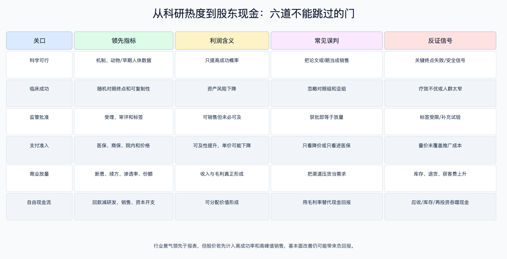

# 创新药行业周期、供需与投资节奏

数据日期：2026-08-10

## 周期框架：四个时钟不会同时走

创新药没有一个统一库存周期，而有四个相互传导的时钟：资本市场决定Biotech能否融资；临床数据决定资产成功概率；跨国药企BD决定资产能否提前变现；医保和商业化决定终端现金流。融资通常领先临床活动，临床数据领先BD或股价，审批领先销售，销售又领先自由现金流。只看一个指标容易把“科研景气”误判成“股东回报景气”。

## 需求、供给与当前周期判断

终端需求仍由老龄化、未满足临床需求和新机制治疗推动。IQVIA预计全球药品目录价支出2024—2028年复合增长5%—8%，肿瘤药支出由2024年2,520亿美元增至2029年4,410亿美元。供给侧扩张更快：中国2025年新药临床试验登记2,997项，同比增长18%，1类创新药占新药试验72.4%；这既提高优质资产出现概率，也会加剧同靶点拥挤。

当前判断是“BD和高质量资产景气，商业盈利与外包需求分化”。2025年中国对外授权超过150笔，潜在总额超过1,300亿美元；2026年上半年81笔约1,100亿美元。合同总包高速增长验证跨国药企补管线需求，但供给过多会把竞争从“有没有分子”推向头对头疗效、全球注册能力和制造质量。

## 单位经济如何随周期变化

| 模式 | 上行期改善路径 | 下行期恶化路径 | 最关键的量价关系 |
|---|---|---|---|
| 自研自销 | 数据成功提高成功概率；准入后销量摊薄固定销售与研发费用 | 试验失败、延迟、降价或竞争导致峰值销售下修 | 患者数 × 渗透率 × 净价 × 治疗时长 |
| 授权/共同开发 | 更高首付、更多竞标者和更优版税提高风险转移价值 | 低首付大总包、项目撤回或对手降优先级 | 首付款 + 概率加权里程碑 + 版税现值 |
| CRO/CDMO | 客户融资改善带来新增项目，产能利用率提升放大利润 | 客户砍管线、延后批次，固定成本和应收吞噬现金 | 项目/批次数 × 单价 × 利用率 − 固定成本 |

单位经济的核心反直觉是：创新药销售毛利率常超过80%，但研发和销售费用、失败项目、延期与再投资会让自由现金流长期为负；CDMO毛利率低于药品，但若订单可见、利用率高、资本开支下降，现金回报反而可能更稳定。

## 未来4—8个季度情景

| 情景 | 概率判断 | 触发条件 | 基本面路径 | 估值含义 |
|---|---|---|---|---|
| 乐观 | 25%研究权重 | 多个全球同类最佳数据；高首付BD延续；医保/商保加快准入；美元利率下行 | 核心产品收入相对基准高10%—20%，外包新增项目高10%—15%，现金跑道延长6—12个月 | 可以支撑盈利型龙头估值扩张，但早期资产仍需折现 |
| 基准 | 50%研究权重 | BD数量保持但条款分化；国内支付稳步改善；临床成败并存 | 产品收入按现有指引附近增长，费用率缓慢下降，外包三年订单保持正增长 | 以现金跑道、首付款质量和销售兑现选股，不追总包标题 |
| 悲观 | 25%研究权重 | 核心资产安全事件；Medicare/医保价格压力超预期；融资窗口关闭 | 受影响产品峰值销售下修20%—40%，早期项目削减20%—30%，外包新增项目低10%—20% | 高久期Biotech估值压缩，现金流型服务商也受订单传导影响 |

概率是决策树研究权重而非统计预测。每季按三类事件重置：关键随机对照成功且首付前移，向乐观移动5—10个百分点；核心资产失败或严重安全信号，向悲观移动10—20个百分点；只有BD总包新闻而无首付/数据，不调整。三种权重之和保持100%，财务冲击区间用于压力测试而非公司指引。

## 估值隐含的市场预期

截至2026-08-07，中证创新药产业指数静态PE约31.97倍、香港创新药指数约33.63倍。若成熟公司长期增长仅8%、股权资本成本10%，简单永续模型对应的高估值需要较高资本回报和现金转换；而亏损Biotech的PE没有意义，股价往往已经隐含核心资产成功概率、峰值销售和上市时间。

用于反推的最小模型：`企业价值 = 现金 + Σ（成功概率 × 峰值销售 × 稳态经营利润率 × 商业年限折现）− 剩余研发投入`。若市场市值只有在“成功概率60%、峰值销售100亿元、无延期”时才能解释，而历史基准率明显更低，安全边际就弱。反过来，现金接近企业价值且核心资产已有随机对照数据，才值得进一步做资产级rNPV。

历史基准按阶段与疾病分层：BIO 2011—2020样本中，肿瘤/非肿瘤从I期到批准分别为5.3%/9.3%，从II期到批准10.8%/17.2%，从III期到批准43.9%/55.3%。模型可以因随机对照、靶点验证和生物标志物上调，但必须记录上调理由；不能把全行业7.9%机械套给已到III期或只有前临床的资产。

## 反证与领先指标

- 科学反证：关键终点未达、严重安全信号、对照疗法更新使临床增益失去意义。
- 交易反证：总包扩大但首付款比例下降、里程碑条件后移、被授权方撤回或终止。
- 支付反证：医保后销量不能覆盖净价下降与推广成本，或美国谈判显著缩短高价现金流窗口。
- 供给反证：同靶点后发产品在疗效、安全、给药频率上没有差异，临床入组持续放缓。
- 外包反证：新增项目下降、三年订单下滑、利用率和自由现金流同时转弱。
- 资本反证：现金跑道少于12个月且融资价格显著低于前轮，意味着股权稀释而非单纯波动。

## 行动节奏

研究上先等数据，不等新闻热度：临床读出前建立终点、对照和成功条件；BD公告拆首付、总包、版税与权利；医保后跟踪至少两个季度的量价和销售费用；外包公司同时看新增项目与自由现金流。只有“证据改善速度大于股价计入速度”时，预期差才可能为正。

## 来源

- [IQVIA：Global Use of Medicines 2024](https://www.iqvia.com/newsroom/2024/01/global-medicine-spending)
- [IQVIA：Global Oncology Trends 2025](https://www.iqvia.com/insights/the-iqvia-institute/reports-and-publications/reports/global-oncology-trends-2025)
- [国家医保局：2025年创新药批准与授权](https://www.nhsa.gov.cn/art/2026/1/18/art_14_19392.html)
- [国家医保局：2026年上半年对外授权](https://www.nhsa.gov.cn/art/2026/7/14/art_14_21423.html)
- [CDE 2025临床试验登记报告页面](https://www.cde.org.cn/main/news/viewInfoCommon/3c3e3f37c4b56cdd4896ef6256f5efcb)
- [CMS：Medicare药价谈判](https://www.cms.gov/initiatives/medicare-prescription-drug-affordability/overview/medicare-drug-price-negotiation-program/selected-drugs-negotiated-prices)
