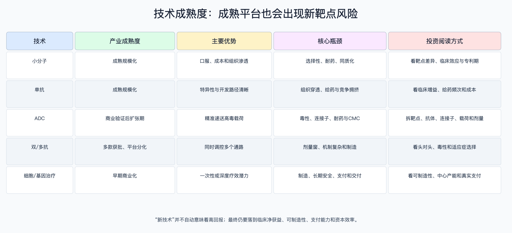

# 创新药行业技术成熟度与发展趋势

数据日期：2026-08-10

## 先说人话：平台成熟不等于项目成功

技术平台像“造车方式”，具体靶点和分子才是“某一款车”。小分子和单抗已经生产成熟，但遇到新靶点仍可能临床失败；ADC和双抗已有多款商业产品，却仍要解决毒性、剂量和同质化；细胞与基因治疗能给少数患者带来深度缓解，但制造与支付限制规模。投资时不能把平台热度直接乘成市场空间。

## 技术与能力成熟度地图

| 技术路线 | 发现/临床成熟度 | 制造成熟度 | 商业成熟度 | 关键可比指标 |
|---|---|---|---|---|
| 小分子 | 高，但新靶点风险仍高 | 高 | 高 | 选择性、口服暴露、耐药、专利期 |
| 单抗 | 高 | 高 | 高 | 头对头疗效、给药频率、免疫原性 |
| ADC | 中高，靶点和载荷分化 | 中高 | 中高 | 治疗窗、DAR、旁观者效应、肺毒性 |
| 双/多抗 | 中，机制组合多 | 中 | 中 | 剂量、细胞因子毒性、对照疗效 |
| 细胞/基因治疗 | 中低到中 | 中低 | 早期 | 持久疗效、批次成功率、交付中心、总成本 |

## 各路线的成熟度与瓶颈

小分子和单抗最容易形成标准化开发与全球供应，但拥挤靶点的边际价值下降。ADC的价值不是“抗体加毒素”这么简单：抗体选择、连接子稳定性、载荷机制、药物抗体比和剂量共同决定疗效与毒性。双抗同时触达两个靶点，可以提高免疫激活或阻断多通路，也可能让毒性和剂量优化更复杂。细胞/基因治疗的瓶颈从科学可行转向制造一致性、长期随访和一次性高价的支付安排。

FDA的Project Optimus推动肿瘤药在获批前更充分地优化剂量，而非默认采用最大耐受剂量。这会增加早期试验设计成本，却能降低上市后因毒性和剂量问题损害商业价值的风险。中国2025年细胞和基因治疗临床试验登记149项，同比增长29.6%，说明供给活跃；活跃度不能替代获批、产能和支付验证。

成熟度判定不是按“新旧”主观打分，而按四道门：是否有多款跨公司获批产品；是否有可复制的随机对照与监管路径；商业生产是否标准化；支付与交付是否规模化。四项均通过为“高”，两到三项通过为“中”，只有概念或少量产品验证为“中低/早期”。按此标准，小分子和单抗四项基本通过；ADC与双抗已有商业和监管验证但剂量、制造及同质化仍分化；细胞/基因治疗在部分适应症通过疗效门，制造和支付仍未普遍通过。

| 路线 | 未来1—3年观察指标 | 成熟度上调条件 | 成熟度下调反证 |
|---|---|---|---|
| 小分子 | 头对头疗效、耐药时间、口服暴露与专利期 | 新靶点在随机对照中显示明确临床净获益 | 多个项目因靶点无效或脱靶毒性终止 |
| 单抗 | 给药频率、免疫原性、皮下制剂和净价 | 更便利给药同时保持疗效并降低总成本 | 同靶点价格竞争使销售费用和净价恶化 |
| ADC | III期主要终点、间质性肺病、停药率、批次一致性 | 不同靶点复制疗效且治疗窗改善 | 相同载荷毒性跨资产重复、剂量不足 |
| 双/多抗 | 头对头数据、细胞因子毒性、推荐II期剂量 | 多适应症验证且制造成本进入可支付区间 | 机制复杂却无优于单药/联合方案的净获益 |
| 细胞/基因治疗 | 持久缓解、批次成功率、交付周期和实际赔付 | 149项活跃试验中出现可复制获批、制造和支付路径 | 长期安全问题、中心利用率低或一次性价格无法赔付 |

量化限制：本轮没有取得各技术路线全球商业产品数和商业批次成功率的统一数据库，因此不伪造精确排名。149项CGT试验只证明研发活跃，不能直接提高商业成熟度；每次更新应优先补获批产品、III期成功与真实世界支付，而非只补临床数量。

## 能力瓶颈比技术名词更重要

1. 转化能力：动物模型和早期生物标志物能否预测真实患者获益。
2. 临床设计：对照组、终点、人群富集和剂量能否回答监管与支付问题。
3. CMC：工艺、分析方法、杂质和批次一致性能否从临床样品放大到商业供应。
4. 全球注册：多区域试验、数据质量和法规沟通能否支持美国、欧洲和中国标签。
5. 商业支付：临床增益能否转成医保、商保和医院愿意接受的净价。

## 未来3—5年的发展方向

- 从“同靶点首个”转向“同类最佳”：更看重头对头数据、治疗窗和给药便利性。
- 从单资产交易转向平台与组合合作：跨国药企会购买多项目选择权，但会把大量金额放在有条件里程碑中。
- 从获批导向转向全周期价值：真实世界疗效、生产成本、准入速度和销售效率决定商业上限。
- 从中国成本优势转向全球质量与速度：30日审评试点、更多国际多中心试验有利于缩短时间，但数据标准不能降低。
- AI与自动化更可能先提高筛选、试验设计和运营效率，短期不应假定其能消除生物学失败率。

## 技术趋势的反证清单

当某平台出现以下信号，应下调而不是继续按行业热度外推：相同毒性在多个资产重复；随机对照未显示临床净获益；商业生产良率长期低且成本无法下降；真实世界使用受限；支付方只接受远低于模型的净价；同机制项目集中终止。相反，跨适应症可复制的数据、稳定批次、全球监管一致意见和明确支付路径，才支持平台溢价。

## 来源

- [FDA：Project Optimus](https://www.fda.gov/about-fda/oncology-center-excellence/project-optimus)
- [FDA：2025 Novel Drug Approvals](https://www.fda.gov/drugs/novel-drug-approvals-fda/novel-drug-approvals-2025)
- [NMPA：符合条件的1类创新药30日审评试点](https://english.nmpa.gov.cn/2025-10/14/c_1132769.htm)
- [CDE：2025年中国新药临床试验登记报告](https://www.cde.org.cn/main/news/viewInfoCommon/3c3e3f37c4b56cdd4896ef6256f5efcb)
- [WHO：Health products in the pipeline](https://www.who.int/observatories/global-observatory-on-health-research-and-development/monitoring/health-products-in-the-pipeline-from-discovery-to-market-launch-for-all-diseases)
