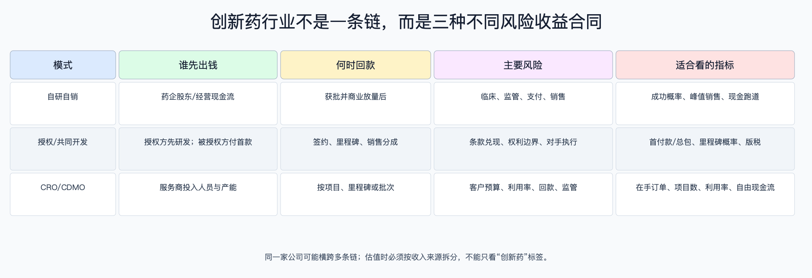

# 创新药行业深度调研：从科学成功到股东现金

数据日期：2026-08-10（动态ETF行情截至14:04；完整日线截至2026-08-07；公司财务以2025年年报为主）

结论性质：行业研究与条件化判断，不构成确定性投资建议。

## 研究边界

本报告研究全球创新药需求与中国供给侧崛起，覆盖A股、港股和美股可投资标的。核心不是按“小分子、ADC、双抗”罗列名词，而是按三种经济合同拆分：[自研自销](自研自销创新药.md)、[授权与共同开发](创新药授权与共同开发.md)、[研发与生产外包](创新药研发与生产外包.md)。技术路线放在能力层，详见[技术成熟度](创新药行业技术成熟度与发展趋势.md)。

不纳入仿制药、中药、纯原料药和只提供通用设备耗材的公司；综合药企只计算创新药相关敞口。预测只给未来4—8个季度的条件情景，不给确定点位或单一路径目标价。

## 数据口径与证据等级

- A1级：FDA、NMPA/CDE、国家医保局、CMS等监管或支付方原始披露。
- A2级：审计年报、交易所公告与合同双方公告；它们是一手披露，但仍有利益相关，不等于独立验证。
- B级：IQVIA、OECD、BIO、指数公司等可追溯数据库、统计模型或本报告重算。
- C级：媒体对数据库的转述，仅用于交叉验证，不单独支撑核心结论。
- “交易总额”指合同全部里程碑上限，不能等同首付款、会计收入或可回收现金；“管线数量”受数据库纳入边界影响，也不能直接当市场份额。
- ETF动态行情和持仓来自AkShare上游东方财富接口；中证指数估值截至2026-08-07，与2026-08-10盘中行情相差一个完整交易日。

## 为什么这个行业存在：底层逻辑

药品不是普通消费品。患者需要疗效，医生和监管者决定能否使用，保险与政府决定大部分支付能力，药企则必须先投入多年研发并承担高失败率。BIO对2011—2020年临床项目的统计显示，从I期进入最终批准的总体成功率只是个位数，平均开发时间约10.5年；JAMA 2024年的样本估算显示，计入失败风险和资本成本后，每个获批药的研发成本中位数约7.08亿美元、均值约13.1亿美元。因此高毛利并不等于高资本回报：单个成功药必须覆盖大量失败项目、长期研发、销售准入和再投资。

## 市场空间：大而增长，但不是一个可直接相加的池子

IQVIA预计全球药品按目录价支出将由2023年约1.6万亿美元升至2028年约2.3万亿美元，2024—2028年复合增速5%—8%；其中生物技术药到2028年超过8,920亿美元，占全球药品支出约39%。肿瘤是最大的创新药价值池之一：2024年全球肿瘤药支出约2,520亿美元，预计2029年约4,410亿美元。

中国的供给能力提升快于本土支付扩张。国家医保局转引信息显示，2025年中国批准76个1类创新药，对外授权超过150笔、合同潜在总额超过1,300亿美元；2026年上半年又有81笔、潜在总额约1,100亿美元。这里最重要的不是总包数字，而是全球药企愿意为中国资产支付更高首付款并承担后续开发，这验证了部分资产的全球竞争力；但未触发里程碑仍可能永远不兑现。

“供给快于支付”目前是方向性判断，不是同口径统计结论：供给端有试验数、批准数和授权数，支付端只有医保准入速度和目录数量，缺少全国创新药净销售与医保实际赔付的连续序列。因此报告不据此推导固定供需缺口，只把同靶点拥挤、入组速度和医保后量价作为后续验证变量。

## 子产业链与价值流

| 模式 | 核心资产 | 收入确认 | 谁承担主要尾部风险 | 最值得跟踪的变量 |
|---|---|---|---|---|
| 自研自销 | 专利、临床数据、生产与商业渠道 | 药品交付或销售形成收入 | 原研药企及股东 | 成功概率、标签、峰值销售、现金跑道 |
| 授权与共同开发 | 区域/全球权利与合同里程碑 | 首付款、里程碑、版税或利润分成 | 由合同在双方间重新分配 | 首付占总包、控制权、开发义务、版税 |
| CRO/CDMO | 人才、合规体系、客户项目与产能 | 工时、项目里程碑或商业批次 | 客户承担药物成败，服务商承担利用率和回款 | 新增项目、三年订单、利用率、自由现金流 |

三个模式会在同一家公司叠加。例如恒瑞2025年既有163.42亿元创新药销售，也确认33.92亿元许可收入；药明生物则主要把客户研发活动转成服务收入。比较估值前必须先拆收入纯度，不能把一次性授权收入资本化成永续利润，也不能把CDMO全部订单当成无风险收入。

## 行业周期：当前是“科学与BD景气、支付和盈利分化”

行业存在四个并不同步的周期：资本市场融资、临床数据、药企BD、商业支付。2025年中国新药临床试验登记2,997项，同比增长18%；对外授权总包显著扩张，说明资产发现和跨国药企补管线仍强。与此同时，医保谈判压价、美国Medicare药价谈判、产品销售费用和后续试验仍限制利润。

因此当前更像结构性扩张，不是全行业无差别上行。只有当全球差异化数据进一步转成高质量首付、产品净销售或自由现金流，且当前估值未提前计入满额成功时，相应公司才具有正预期差；缺乏头对头优势、只靠同靶点跟随或用大总包掩盖低首付款的资产更容易下修。

## 技术与能力演进

技术判断要经过四个问题：疗效是否显著优于标准治疗；安全窗是否允许足量给药；工艺能否稳定放大；支付方是否愿意为增益买单。小分子和单抗的平台成熟，但新靶点仍有高失败率；ADC和双抗已经商业验证，却在毒性、剂量与同质化上分化；细胞和基因治疗可提供深度疗效，但制造、交付中心和一次性高价支付仍是瓶颈。

FDA在2025年批准46个新分子实体/新生物制品，低于2024年的50个；单年数量波动不代表创新衰退。更有信息量的是标签质量、首次同类、临床净获益和后续销售，而不是审批数量本身。

## ROIC、资本成本与估值

创新药价值可以写成：`风险调整价值 = 各阶段成功概率 × 获批后现金流现值 − 剩余研发与商业化投入现值`。盈利型龙头可辅以正常化PE和自由现金流收益率；亏损Biotech应使用现金跑道、风险调整净现值（rNPV）和EV/峰值销售；CRO/CDMO更适合看正常化利润、自由现金流和投入资本回报。

当前中证创新药产业指数和香港创新药指数截至2026-08-07的静态口径PE约31.97倍和33.63倍，但指数中亏损公司、一次性授权收入和综合药企权重会扭曲PE。这个水平隐含的不只是行业增长，还隐含较高临床成功率、海外兑现和利润率改善。若资本成本上升2个百分点、峰值销售下修20%或批准延后2年，早期资产rNPV可能出现大幅压缩；所以“有好资产”与“股价有安全边际”必须分开。

## 当前投资结论与动作档位

基准判断：未来4—8个季度，行业基本面仍由高质量临床数据、跨境BD和医保/商保准入共同驱动，但收益更可能从“主题贝塔”转向“现金兑现和数据阿尔法”。

| 档位 | 需要同时看到的证据 | 适合的研究动作 | 反证/退出观察 |
|---|---|---|---|
| A：提高优先级 | 关键终点达到；首付款有意义；现金跑道超过24个月；估值未计入满额总包 | 深挖资产rNPV与公司收入纯度，分批验证 | 安全性、标签或竞争数据破坏峰值销售假设 |
| B：保持观察 | 科学逻辑合理但只有早期数据；或BD总包大而首付低 | 等随机对照、里程碑到账或销售放量 | 融资前移、研发延迟、同靶点更优数据出现 |
| C：降低暴露 | 现金跑道不足12个月；核心资产失败；商业费用持续快于收入 | 先控制风险，再判断残余管线价值 | 只有在融资确定、成本重构和新证据出现后重评 |

ETF不是自动分散风险：A股159992含CRO和综合药企，港股513120前十大约70%，美股159502更接近等权小型生物科技。具体估值、流动性和触发条件见[ETF专题](创新药行业相关基金与ETF估值入场.md)。

## 需要持续核验的领先指标

1. 临床：随机对照终点、停试、安全性、入组速度与监管沟通。
2. BD：首付款/总包比例、权利范围、里程碑条件、对手方资本和研发优先级。
3. 商业：新患、续方、院内准入、医保后量价、销售费用率和真实回款。
4. 服务外包：新增项目、三年订单、取消率、产能利用率、应收与自由现金流。
5. 资本：IPO/增发窗口、现金跑道、无风险利率与股权风险溢价。

## 来源

- [FDA：Novel Drug Approvals for 2025](https://www.fda.gov/drugs/novel-drug-approvals-fda/novel-drug-approvals-2025)
- [国家医保局：2025年中国批准76个1类创新药、对外授权总额](https://www.nhsa.gov.cn/art/2026/1/18/art_14_19392.html)
- [国家医保局：2026年上半年创新药对外授权](https://www.nhsa.gov.cn/art/2026/7/14/art_14_21423.html)
- [IQVIA：Global Use of Medicines 2024](https://www.iqvia.com/newsroom/2024/01/global-medicine-spending)
- [IQVIA：Global Oncology Trends 2025](https://www.iqvia.com/insights/the-iqvia-institute/reports-and-publications/reports/global-oncology-trends-2025)
- [BIO：Clinical Development Success Rates 2011—2020](https://www.bio.org/clinical-development-success-rates-and-contributing-factors-2011-2020)
- [JAMA Network Open：Cost of Drug Development](https://jamanetwork.com/journals/jamanetworkopen/fullarticle/2828689/)
- [CMS：Medicare Drug Price Negotiation Program](https://www.cms.gov/initiatives/medicare-prescription-drug-affordability/overview/medicare-drug-price-negotiation-program/selected-drugs-negotiated-prices)

## 研究导航

- [覆盖矩阵](创新药行业子产业链覆盖矩阵.md)
- [国内视角](创新药行业深度调研%20-%20国内视角.md) · [全球视角](创新药行业深度调研%20-%20全球视角.md)
- [公司比较](创新药行业公司财务与业务对比表.md) · [节点利润池](创新药行业产业链节点规模与利润池.md)
- [术语表](创新药行业术语表.md)
