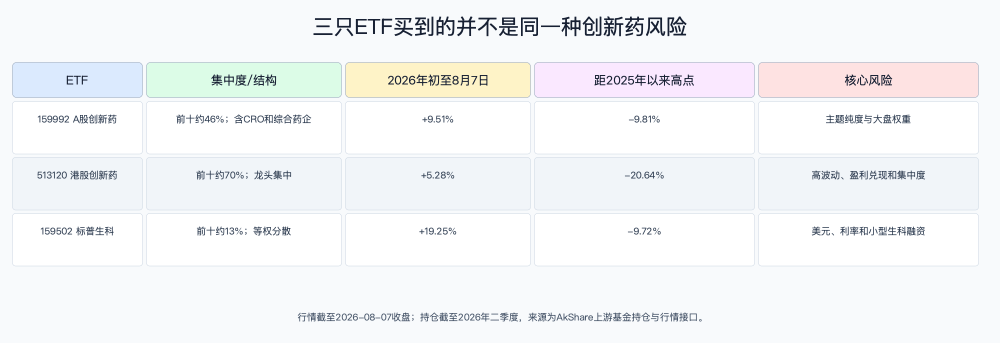

# 创新药行业相关基金与ETF：估值、暴露与入场条件

数据日期：2026-08-10（场内行情截至14:04；收益与回撤截至2026-08-07收盘；持仓截至2026年二季度）

## 基金/ETF快速比较

| 代码 | 跟踪方向 | 2026-08-10场内价 | 当日成交额 | 2026Q2净资产 | 2026年初至8月7日 | 距2025年以来高点 | 费率（管理+托管） |
|---|---|---|---|---|---|---|---|
| 159992 | 中证创新药产业，A股 | 0.912元 | 17.10亿元 | 159.65亿元 | +9.51% | -9.81% | 0.50%+0.05%/年 |
| 513120 | 中证香港创新药，港股QDII | 1.273元 | 85.31亿元 | 240.39亿元 | +5.28% | -20.64% | 0.50%+0.10%/年 |
| 159502 | 标普生物科技精选行业，美股QDII | 1.592元 | 2.37亿元 | 17.76亿元 | +19.25% | -9.72% | 0.50%+0.10%/年 |

数据来自AkShare `fund_etf_spot_em`、`fund_etf_hist_em` 与基金基本资料页。2026-08-10是盘中快照，不与完整日线收益混用；收益未计交易费用。成交额显示513120流动性最好，但高成交不等于低波动。

## 持仓暴露与主题纯度

| ETF | 2026Q2前十大权重 | 暴露判断 |
|---|---|---|
| 159992 | 药明康德11.32%、恒瑞9.89%、科伦4.42%、凯莱英3.32%、康龙化成3.09%等，前十约46.2% | 创新药、综合药企与CRO/CDMO混合，适合A股产业链而非纯Biotech |
| 513120 | 信达10.15%、百济9.76%、药明康德8.60%、药明生物8.51%、康方7.34%等，前十约69.6% | 中国创新药纯度更高，但龙头和港股风险集中 |
| 159502 | 前十大约13.3%，单一最大约1.5% | 改良等权、约百余家美国Biotech，单股分散但小型公司融资和临床风险高 |

159992买到的并不只是药品权益；513120更像中国创新药龙头篮子；159502更接近分散的临床和并购期权。三者不能用同一估值阈值。

## 估值怎么看

截至2026-08-07，中证创新药产业指数静态PE约31.97倍、香港创新药指数约33.63倍；标普生物科技精选行业指数2026-04-30资料显示PE约68.4倍、P/S约9.0倍。亏损公司通常不进入PE分母，盈利突然转正或一次性授权收入又会让PE失真。

建议同时看三层：盈利公司正常化PE/FCF；亏损公司的企业价值/现金与资产rNPV；指数价格相对自身历史区间。当前港股ETF虽距2025年以来高点约20.6%，但回撤不自动等于便宜，仍要看核心成分的销售、临床和BD是否兑现。

## 交易、流动性、跟踪误差与折溢价

基金合同目标：159992正常市场下日均跟踪偏离绝对值不超过0.2%、年跟踪误差不超过2%；513120与159502作为QDII，合同目标通常为日均偏离不超过0.35%、年跟踪误差不超过4%。实际误差还会受跨境节假日、汇率、税费和申赎影响。

2026-08-10 14:04上游行情的“折价率”字段分别为-0.27%、+0.42%、-0.86%。由于不同数据商字段符号可能表示价格相对IOPV的不同方向，本报告只比较绝对偏离0.27%、0.42%、0.86%，交易前应以券商实时IOPV复核。159502规模和成交额较小，跨境休市时折溢价风险更高。

## 拥挤度判断

拥挤不只看成交额。513120前十大近70%，若信达、百济、药明系和康方同时回撤，分散效果有限；159502等权分散但2026年初以来上涨19.25%，且一年前回报约70.6%，对利率和并购预期更敏感；159992集中度较低，却可能受A股CRO与综合药企风格拖累。

## 入场节奏与触发条件

| 条件档位 | 基本面证据 | 估值/交易证据 | 动作含义 |
|---|---|---|---|
| 提高研究优先级 | 高质量临床读出、首付质量提高、销售和FCF同步改善 | 指数回撤后估值未隐含全额里程碑；折溢价接近0% | 分批而非一次押注，先选择暴露匹配的市场 |
| 保持观察 | BD总包增长但首付/临床兑现分化 | PE不低、近期涨幅已快于盈利修正 | 等财报、临床或支付数据确认，不因主题热度追价 |
| 降低风险 | 核心资产失败、现金跑道恶化、外包订单和FCF同时转弱 | 高溢价、集中度风险放大、价格破位伴随基本面下修 | 优先控制主题仓位，重估而非机械补仓 |

## 反证与风险

- 指数方法变更、成分调整会改变“创新药纯度”。
- QDII有汇率、境内外交易时差与额度风险；场内价格可偏离IOPV。
- 主题ETF不能规避临床失败，只能降低单一公司冲击。
- 历史回撤和指数PE都不是买入信号；若盈利预期继续下修，估值分母会恶化。
- 本报告没有统一口径的三只ETF实际滚动跟踪误差，使用合同上限并要求交易前复核基金定期报告。

### 受控数据缺口

| 指标 | 已检索范围 | 缺失原因 | 替代指标 | 对决策的限制 |
|---|---|---|---|---|
| 三只ETF最近1年实际跟踪误差 | 基金合同、基本资料、行情与净值接口 | 跨境指数净收益、汇率和节假日日历未取得统一可复算序列 | 合同上限2%/4%、每日折溢价与基金定期报告 | 未复核实际误差前，不因费率低就判断跟踪质量 |
| 3—5年估值分位 | 中证接口仅返回近20个交易日；S&P公开资料为时点估值 | 亏损成分变化使长序列PE可比性弱 | 当前PE/P/S、回撤、成分盈利结构 | 不使用“历史低分位”作为入场理由 |
| 阶段资金净流入 | 已有份额规模与净资产时点，缺一致日频申赎 | 跨市场份额与净值数据日期错位 | 成交额、季度份额和折溢价 | 成交拥挤不能等同净申购，动作档位维持观察 |

## 来源

- [159992基金基本资料](https://fundf10.eastmoney.com/jbgk_159992.html)
- [513120基金基本资料](https://fundf10.eastmoney.com/jbgk_513120.html)
- [159502基金基本资料](https://fundf10.eastmoney.com/jbgk_159502.html)
- [中证香港创新药指数方法](https://oss-ch.csindex.com.cn/static/html/csindex/public/uploads/indices/detail/files/zh_CN/931787_Index_Methodology_cn.pdf)
- [S&P Biotechnology Select Industry Index](https://www.spglobal.com/spdji/en/indices/equity/sp-biotechnology-select-industry-index/)
- AkShare 1.18.83，上游东方财富行情、历史净值与基金持仓接口，抓取时间2026-08-10 14:03—14:04。
