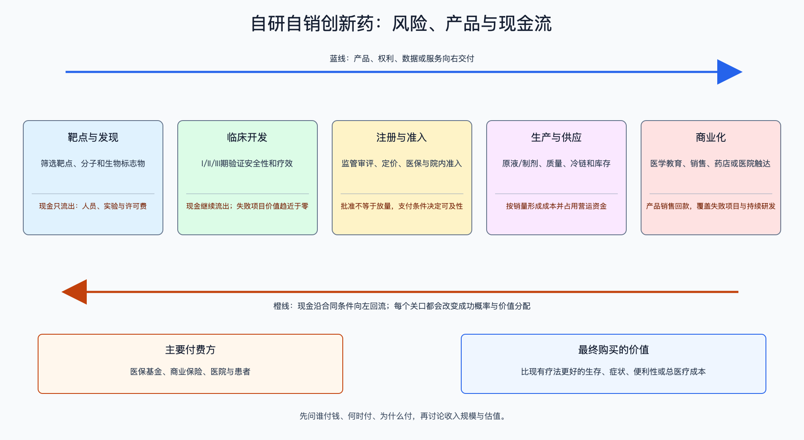

# 自研自销创新药

数据日期：2026-08-10（财务数据以2025年年报为主）

## 0. 子产业链边界

本链覆盖靶点发现、临床开发、注册审批、生产供应、医保/商保与院内准入、商业推广。主要付费方是医保基金、商业保险、医院与患者。上游接科研人才、临床中心和生产资源，下游接医院、药店和支付方。不含仿制药、中药、纯原料药，也不把单纯授权给他人的区域销售纳入自销收入。

适用经济模型：**研发/IP + 自有商业化的混合模型**。研发阶段用阶段成功率、剩余投入和时间折现；获批后用患者数、渗透率、净价、治疗时长、经营利润率和再投资率估算现金流。两段通过rNPV相连，不能用获批后高毛利倒推研发阶段必然有价值。

## 1. 产业链路图

获批只是从“研发资产”变成“可销售产品”。真正的现金回收还要经过标签、医保/商保、医院准入、医生采用、患者持续用药和回款。任何一环都可能让峰值销售低于模型。

## 2. 谁付钱与价值流

患者获得疗效，但通常不是唯一付款者。医保和商业保险用临床净获益、预算影响与替代疗法决定净价；医院决定能否进药，医生决定处方。公司先承担多年研发现金流出，获批后以产品净销售回收资金，再支付生产、销售、税费与下一代研发。

价值模型：`净销售 = 可治疗患者 × 渗透率 × 净价 × 治疗时长`；`风险调整价值 = 各阶段成功概率 × 税后商业现金流现值 − 剩余研发与销售投入现值`。目录价不是净价，患者人数也不能直接等同可及市场。

## 3. 节点规模

| 节点 | 2025规模/锚点 | 口径与投资含义 |
|---|---|---|
| 全球药品终端 | 2028年目录价支出预计2.3万亿美元，2024—2028年CAGR 5%—8% | IQVIA预测；含全部药品，用于需求天花板而非创新药收入简单相加 |
| 全球生物技术药 | 2028年预计超过8,920亿美元，占药品支出约39% | 体现生物药价值池扩张，不代表单个技术平台都能盈利 |
| 全球肿瘤药 | 2024年2,520亿美元，2029年预计4,410亿美元 | 最大创新药池之一，但临床试验也占全部试验约41%，竞争拥挤 |
| 中国批准端 | 2025年批准76个1类创新药 | 供给活跃；批准数量不能替代销售、医保和自由现金流 |
| 恒瑞创新药销售 | 2025年163.42亿元，占药品销售58.3% | 已商业化产品组合的国内锚点 |
| 信达产品收入 | 2025年118.96亿元，同比增长44.6% | 产品组合进入规模化阶段，但销售费用仍达57.13亿元 |

## 4. 利润分布与单位经济

| 节点 | 变现基数 | 直接经济性 | 直接价值池 | 经营收益 | 资本/风险/再投资占用 | 可分配价值 | 估算公式/口径 | 数据日期 | 来源/证据等级 |
|---|---|---|---|---|---|---|---|---|---|
| 临床开发 | 恒瑞2025年研发投入87.20亿元 | 研发投入占收入27.58%，属于负向经济性 | 获批前毛利池0元，研发现金投入87.20亿元 | 项目期经营收益约-87.20亿元，未计资本化差异 | I期至批准总体成功率约7.9%，平均约10.5年 | 获批前产品可分配现金0元 | 研发投入作为风险资本；历史成功率用于基准率而非项目预测 | 2025年/2011—2020样本 | 恒瑞年报A级；BIO统计B级 |
| 恒瑞商业组合 | 创新药销售163.42亿元 | 公司综合毛利率86.2%，仅作组合锚点 | 以综合毛利率估算直接毛利约140.86亿元，不是创新药分部精确毛利 | 全公司净利率24.4%，对应净利润约77.18亿元 | 全年研发投入87.20亿元，持续再投资率27.58% | 全公司净利润约77.18亿元，不能归因到创新药分部或单药 | 163.42亿元×86.2%=140.86亿元；316.294亿元×24.4%=77.18亿元 | 2025年 | 恒瑞审计年报A2级；分部估算B级 |
| 信达商业组合 | 产品收入118.96亿元 | 公司综合毛利率86.5%，包含产品与许可 | 公司直接毛利约112.86亿元，其中许可收入影响较小 | IFRS利润8.14亿元，利润率约6.2% | 研发26.24亿元、销售57.13亿元，合计占收入63.9% | IFRS利润8.14亿元；非IFRS利润17.23亿元 | 130.415亿元×86.5%=112.86亿元；费用率按总收入计算 | 2025年 | 信达审计年报A2级；口径重算B级 |

高毛利到净利润之间的落差就是行业本质：需要覆盖失败研发、医学事务、销售准入和后续管线。恒瑞的综合净利率比毛利率低约61.8个百分点；信达即使产品收入快速增长，研发和销售费用合计仍超过83亿元。

怎么看这张表：横向比较应看“毛利到可分配价值掉了多少”，不要把恒瑞综合毛利率当创新药分部披露，也不要把信达公司利润分配给某一个产品。它的用途是展示费用和再投资的数量级，不是给单药估值；单药仍需患者—净价—成功率模型。

## 5. 利润迁移、周期与反证

利润会从“同质化但早上市”迁向有头对头优势、全球标签、低生产成本和强准入能力的产品。国内医保可将审批到准入从约5年压缩到约1年，扩大可及患者；但净价下降后只有销量、疗程和销售效率足够高，经营利润才改善。美国Medicare谈判则会压缩部分成熟重磅药的高价期限。

上行证据包括：随机对照主要终点达到、标签宽、医保后新患和续方增长、销售费用率下降、经营现金流转正。反证包括：关键安全信号、对照标准升级、同靶点疗效更优、医保后量不足以补价、现金跑道低于12个月。任何峰值销售模型都应至少做“患者数-20%、净价-20%、上市延后2年”的压力测试。

历史基准不能一刀切。BIO样本中，肿瘤项目从I期到批准为5.3%、非肿瘤为9.3%；从II期起分别为10.8%和17.2%，从III期起分别为43.9%和55.3%。具体资产还要按靶点、技术、终点和已有数据调整，7.9%只用于全样本起点。

## 来源

- [IQVIA：Global Use of Medicines 2024](https://www.iqvia.com/newsroom/2024/01/global-medicine-spending)
- [IQVIA：Global Oncology Trends 2025](https://www.iqvia.com/insights/the-iqvia-institute/reports-and-publications/reports/global-oncology-trends-2025)
- [国家医保局：2025年批准76个1类创新药](https://www.nhsa.gov.cn/art/2026/1/18/art_14_19392.html)
- [恒瑞医药2025年年报](https://www.hkexnews.hk/listedco/listconews/sehk/2026/0326/2026032600021.pdf)
- [信达生物2025年年报](https://www.hkexnews.hk/listedco/listconews/sehk/2026/0428/2026042805171.pdf)
- [BIO：Clinical Development Success Rates](https://www.bio.org/clinical-development-success-rates-and-contributing-factors-2011-2020)
- [国家医保局：创新药支付支持措施](https://www.nhsa.gov.cn/art/2025/7/1/art_104_17058.html)
- [CMS：Medicare药价谈判](https://www.cms.gov/initiatives/medicare-prescription-drug-affordability/overview/medicare-drug-price-negotiation-program/selected-drugs-negotiated-prices)
